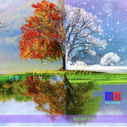

四季-唯美钢琴音乐Four Seasons
============================

|  |  |
| :--: | :-- |
| [ 四季-唯美钢琴音乐Four Seasons](https://emumo.xiami.com/album/2104650346) | **艺人**: [刘鸿](../index.md) **语种**: 纯音乐 **唱片公司**:  **发行时间**: 2019年03月04日 **专辑类别**: 录音室专辑 **专辑风格**: 轻音乐 Easy Listening **播放数**: 34889 **收藏数**: 17 **评论数**: 4  |

## 简介

四季-唯美钢琴音乐  
Four Seasons  
春夏秋冬  
There are four seasons in a year.The first season is spring. In spring, almost everything comes back to life. The snow begins to melt, the trees sprout and the grass turns green.Spring is warm so that it's a good time to go hiking outdoors. After spring, itis summer. Summer is my favorite season,because I can swim quite often. The third one is autumn. In autumn, the weather is cool and comfortable. Farmers may be the busiest people, because autumn is a time of harvest.Winter is the last season of the year. In winter, the weather is very cold. In the north, it usually snows. Children can play games or make snowmen after snow. It seems very funny. What's your favorite season?  
Every season has its own lovely charm, I love them all.

## 曲目

## 评论

|  |  |  |  |
| :-- | :-- | :-- | :-- |
|  [虾米用户](https://emumo.xiami.com/u/421723378) 心存善意，定能途遇天使。 2019-03-25 10:14 赞(1) 踩(0) | 
如此唯美，撞击灵魂
 |
|  [虾米用户](https://emumo.xiami.com/u/292793015) 乐海飘飘 2019-03-22 21:09 赞(1) 踩(0) | 
《四季-唯美钢琴音乐》这部专辑很喜欢，乐曲清恬安逸中透着激情、兴奋、快乐和沉思。
 |
|  [虾米用户](https://emumo.xiami.com/u/402499396) 要么读书，要么旅行，身体... 2019-03-05 19:43 赞(2) 踩(0) | 
唯美动听，颇有音乐大师风范。
 |
|  [虾米用户](https://emumo.xiami.com/u/402499396) 要么读书，要么旅行，身体... 2019-03-04 16:28 赞(1) 踩(0) | 
感谢你刘鸿，我在上班时间，舍不得欣赏你的“四季”怕我心不静而遗漏音乐的细节，回家再慢慢仔细品味。
 |
