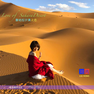

撒哈拉沙漠之恋-唯美钢琴音乐Love of SaharaDesert
============================

|  |  |
| :--: | :-- |
| [ 撒哈拉沙漠之恋-唯美钢琴音乐Love of SaharaDesert](https://emumo.xiami.com/album/2104705102) | **艺人**: [刘鸿](../index.md) **语种**: 国语 **唱片公司**:  **发行时间**: 2019年03月23日 **专辑类别**: 录音室专辑 **专辑风格**: 轻音乐 Easy Listening, 新世纪音乐 New Age **播放数**: 1929 **收藏数**: 8 **评论数**: 2  |

## 简介

撒哈拉沙漠之恋-唯美钢琴音乐  
Love of SaharaDesert  
Love is everything. Love is the most brilliant thing in the world. Because of love, our world turns out to be a sunny place.   
爱是一切。爱是世界上最闪耀的东西。因为爱，我们的世界变成了一个阳光灿烂的地方。 

## 曲目

## 评论

|  |  |  |
| :-- | :-- | :-- |
|  [虾米用户](https://emumo.xiami.com/u/348750095)  2019-03-23 16:09 赞(2) 踩(0) | 
 
 |
