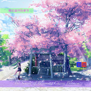

樱花盛开的季节-唯美轻音乐The season of blooming cherry blossom
============================

|  |  |
| :--: | :-- |
| [ 樱花盛开的季节-唯美轻音乐The season of blooming cherry blossom](https://emumo.xiami.com/album/2104737478) | **艺人**: [刘鸿](../index.md) **语种**: 国语 **唱片公司**:  **发行时间**: 2019年04月02日 **专辑类别**: 录音室专辑 **专辑风格**: 轻音乐 Easy Listening, 新世纪音乐 New Age **播放数**: 3319 **收藏数**: 9 **评论数**: 4  |

## 简介

樱花盛开的季节-唯美轻音乐  
The season of blooming cherry blossom

## 曲目

## 评论

|  |  |  |
| :-- | :-- | :-- |
|  [虾米用户](https://emumo.xiami.com/u/6591114) 音乐是人类最美的语言 2019-04-27 16:30 赞(1) 踩(0) | 
你是人间的四月天，美妙音符轻灵在春的光艳中交舞着变化...
 |
|  [虾米用户](https://emumo.xiami.com/u/56379935) 音乐如酒 2019-04-03 14:05 赞(1) 踩(0) | 
温暖优美！
 |
|  [虾米用户](https://emumo.xiami.com/u/25944718) You Raise Me... 2019-04-03 08:37 赞(4) 踩(0) | 
制作精良的电子乐-- 开始钢琴的大气引领，而后风笛的音色突出了整曲浪漫梦幻的色彩，古筝的弹拨如抒情诗般锦上添花！
 |
|  [虾米用户](https://emumo.xiami.com/u/348750095)  2019-04-02 23:19 赞(2) 踩(0) | 
樂楽樂  
 |
