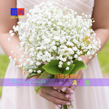

同桌最爱的满天星-唯美钢琴轻音乐
============================

|  |  |
| :--: | :-- |
| [ 同桌最爱的满天星-唯美钢琴轻音乐](https://emumo.xiami.com/album/2104889520) | **艺人**: [刘鸿](../index.md) **语种**: 纯音乐 **唱片公司**:  **发行时间**: 2019年05月22日 **专辑类别**: EP, 单曲 **专辑风格**: 轻音乐 Easy Listening, 新世纪音乐 New Age **播放数**: 1242 **收藏数**: 5 **评论数**: 4  |

## 简介

同桌最爱的满天星-唯美钢琴轻音乐  
曾传在希腊，有两个姐妹关系很好，她们每天都生活的快乐幸福，从未与对方发生过任何争吵，直到有一天，一个少年的出现从此打破了这份和谐。少年因重伤昏迷在路边，被妹妹相救，少年在昏迷中不曾看到她的模样，只知道她有一双极其温柔的眼睛，随后妹妹请姐姐帮忙照顾少年，自己则去找医生，在她走后没多久少年就醒了，误以为姐姐救了他，二人相爱，妹妹只得独自隐藏自己爱意。  
  
直到有一天有人来村内想要杀掉少年，姐姐让少年快跑，当少年刚答应，妹妹就迷晕了他，自己则扮成少年模样被坏人杀死，顿时鲜血将整个村子都染红了，此后妹妹灵魂一直悬挂夜空中，用最后一丝力气抹去少年记忆，并求姐姐与少年幸福下去。花神得知此事，便将少女灵魂融入到少年晕倒的草地上，从此这片草地便开出了很多白色的花瓣，也就是满天星。  
  
满天星一直备受人们的喜欢，它给人的感觉极其清纯和浪漫。无数朵的满天星聚集在一起，就像夜空中的众多繁星，给人一种温柔动人之美。

## 曲目

## 评论

|  |  |  |
| :-- | :-- | :-- |
|  [虾米用户](https://emumo.xiami.com/u/410336298)  2019-05-24 18:13 赞(1) 踩(0) | 
致敬青春，献给美丽伶俐的同桌。青春无价，岁月无情，妳在远方还好吗？
 |
|  [虾米用户](https://emumo.xiami.com/u/6591114) 音乐是人类最美的语言 2019-05-23 01:33 赞(2) 踩(0) | 
曲子很唯美，感谢作曲者 
 |
|  [虾米用户](https://emumo.xiami.com/u/348750095)  2019-05-23 00:38 赞(2) 踩(0) | 
真好听，感谢      
 |
