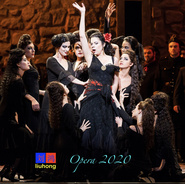

歌剧2020（EDM）
============================

|  |  |
| :--: | :-- |
| [ 歌剧2020（EDM）](https://emumo.xiami.com/album/2105741315) | **艺人**: [刘鸿](../index.md) **语种**: 纯音乐 **唱片公司**: 独立发行 **发行时间**: 2020年01月16日 **专辑类别**: EP, 单曲 **专辑风格**: 电子 Electronic, 电子舞曲 EDM / Electronic Dance Music, 合成器流行 Synthpop **播放数**: 788 **收藏数**: 3 **评论数**: 1  |

## 简介

歌剧2020（EDM）  
歌剧意大利语：opera，歌剧以歌唱和音乐的形式来表达剧情， 17世纪约1600年出现在意大利的佛罗伦萨，它源自古希腊戏剧的剧场音乐。其中歌剧里的合唱最早起源于西方中世纪基督教教会唱诗班，经过圣咏、清唱剧等形式的不断演变，最终发展为普遍的世俗音乐。 

## 曲目

## 评论

|  |  |  |  |
| :-- | :-- | :-- | :-- |
|  [虾米用户](https://emumo.xiami.com/u/348750095)  2020-01-16 20:42 赞(1) 踩(0) | 
舒服享受在旋律与節奏的漩渦裏♪
 |
