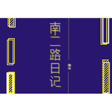

裸泳不穿
============================

|  |  |
| :--: | :-- |
| [ 裸泳不穿](https://i.xiami.com/lybc) | **播放数**: 2219919 **粉丝数**: 69 **评论数**: 8 **地区**: China 中国大陆 **风格**: 民谣 Folk  |

## 档案

重庆人 微博：裸泳不穿   网易云：裸泳不穿 
qq：574392930

## 专辑

| 名称 | 语种 | 唱片公司 | 发行时间 | 专辑类别 | 专辑风格 |
| :--: | :-- | :-- | :-- | :-- | :-- |
| [ 困在双子星的失踪人口](./albums/2103905845.md) | 国语 | 乐饭音乐 | 2018年08月09日 | 录音室专辑 | 民谣 Folk |
| [ 我的小船](./albums/2103680110.md) | 国语 | 独立发行 | 2018年04月07日 | EP, 单曲 | 民谣 Folk |
| [ 望夫石](./albums/2102979727.md) | 国语 | 独立发行 | 2017年12月17日 | EP, 单曲 | 民谣 Folk |
| [ 少男心事](./albums/2102979723.md) | 国语 | 独立发行 | 2017年11月29日 | 录音室专辑 | 民谣 Folk |
| [ 南二路日记](./albums/2102979725.md) | 国语 | 独立发行 | 2017年10月31日 | EP, 单曲 | 民谣 Folk, 流行 Pop |
| [ 不再](./albums/2103484940.md) | 国语 | 独立发行 | 2017年01月30日 | 录音室专辑 | 流行 Pop, 民谣 Folk |

## 评论

|  |  |  |  |
| :-- | :-- | :-- | :-- |
|  [虾米用户](https://emumo.xiami.com/u/430545795) 一只单身的哈士奇。 2021-01-30 21:19 赞(0) 踩(0) | 
虾米要离开了，在YouTube找了很久，终于找到你了，原来名字叫 罗永川，跟这里名字不一样 还以为以后再也听不到你的歌了呢。
 |
|  [虾米用户](https://emumo.xiami.com/u/357059473)  2020-04-01 10:54 赞(1) 踩(0) | 
今年40的我已经很少一首歌听了一整天。一边听记忆一边不断浮现。谢谢你，让我有这么美好的一天。如果这首歌收费我第一个购买   
 |
|  [虾米用户](https://emumo.xiami.com/u/200116235) 我还没想好要写什么... 2020-02-28 10:36 赞(0) 踩(0) | 
好喜欢，很棒，加油！
 |
|  [虾米用户](https://emumo.xiami.com/u/349905898) 音乐开心时入耳，伤心时入... 2020-02-17 10:08 赞(0) 踩(0) | 
加油，继续做自己喜欢音乐    
 |
|  [虾米用户](https://emumo.xiami.com/u/425373648) 心傷了哭过了绝望了 2020-02-15 20:34 赞(0) 踩(0) | 
很好听。听了也哭了。來自澳洲的祝福。加油。
 |
|  [虾米用户](https://emumo.xiami.com/u/377163099) 不想写 2019-09-05 23:13 赞(0) 踩(0) | 
骚名字
 |
|  [虾米用户](https://emumo.xiami.com/u/278694692) 小众民谣爱好者 2019-07-02 14:40 赞(0) 踩(0) | 
加油呀 
 |
|  [虾米用户](https://emumo.xiami.com/u/401105578)  2019-04-25 02:24 赞(0) 踩(0) | 
哇，一楼！不再超好听，歌词也走心！！继续加油哟，支持！！
 |
