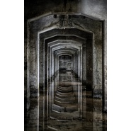

重金属摇滚纯音乐之末日逃亡
============================

|  |  |
| :--: | :-- |
| [ 重金属摇滚纯音乐之末日逃亡](https://emumo.xiami.com/album/2103517196) | **艺人**: [王德兵](../index.md) **语种**: 国语 **唱片公司**: 独立发行 **发行时间**: 2018年02月06日 **专辑类别**: 录音室专辑 **专辑风格**: 摇滚 Rock & Roll, 独立摇滚 Indie Rock, 另类摇滚 Alternative Rock **播放数**: 10315 **收藏数**: 8 **评论数**: 0  |

## 简介

原创音乐人王德兵，擅长模特时装秀走秀T台秀音乐、演出音乐、背景音乐、氛围音乐、影视配乐、恐怖惊悚诡异阴暗黑暗电影音乐制作、游戏音乐、民谣、电子、电音等……  
&nbsp;

## 曲目

## 评论

