王德兵
============================

|  |  |
| :--: | :-- |
| [ 王德兵](https://i.xiami.com/wdb) | **播放数**: 2690169 **粉丝数**: 339 **评论数**: 10 **地区**: China 中国大陆 **风格**: 流行 Pop, 轻音乐 Easy Listening, 电子 Electronic, 古风 GuFeng Music, 中国民乐 Chinese Folk Music  |

## 档案

## 专辑

| 名称 | 语种 | 唱片公司 | 发行时间 | 专辑类别 | 专辑风格 |
| :--: | :-- | :-- | :-- | :-- | :-- |
| [ 铃声](./albums/5021333999.md) | 纯音乐 | 独立发行 | 2020年08月23日 | 录音室专辑 | 流行 Pop, 乡村 Country, 乡村流行 Country Pop |
| [ 模特时装秀T台走秀背景音乐氛围音乐集二十](./albums/5020918163.md) | 纯音乐 | 独立发行 | 2020年06月19日 | 录音室专辑 | 电子舞曲 EDM / Electronic Dance Music, 演出金曲 Show Tunes |
| [ 模特时装秀T台走秀背景音乐氛围音乐集十八时装秀](./albums/5020702098.md) | 国语 | 独立发行 | 2020年05月25日 | 录音室专辑 | 独立电子乐 Indietronica, 演出金曲 Show Tunes |
| [ 模特时装秀T台走秀背景音乐氛围音乐集十七](./albums/2108371062.md) | 国语 | 独立发行 | 2020年04月22日 | 录音室专辑 | 世界音乐 World Music, 新世纪音乐 New Age |
| [ 打击乐鼓](./albums/2108269345.md) | 国语 | 独立发行 | 2020年03月29日 | 录音室专辑 | 电子 Electronic, 独立电子乐 Indietronica, 独立流行 Indie Pop |
| [ 奥利给](./albums/2108243483.md) | 国语 | 独立发行 | 2020年03月24日 | 录音室专辑 | 电子 Electronic, 独立电子乐 Indietronica |
| [ 鼓](./albums/2108192861.md) | 国语 | 独立发行 | 2020年03月21日 | 录音室专辑 | 电音流行 Electropop, 独立电子乐 Indietronica |
| [ 电子鼓](./albums/2108195034.md) | 国语 | 独立发行 | 2020年03月16日 | 录音室专辑 | 电子 Electronic, 独立电子乐 Indietronica |
| [ 时装秀时装秀T台秀](./albums/2105757701.md) | 国语 | 独立发行 | 2020年01月20日 | 录音室专辑 | 电子 Electronic, 独立电子乐 Indietronica |
| [ 模特时装秀T台走秀背景音乐氛围音乐集十六](./albums/2105722947.md) | 国语 | 独立发行 | 2020年01月13日 | 录音室专辑 | 电子 Electronic, 独立电子乐 Indietronica |
| [ 抖腿](./albums/2105704970.md) | 国语 | 独立发行 | 2020年01月08日 | 录音室专辑 | 电子 Electronic, 独立电子乐 Indietronica |
| [ 琵琶琵琶曲](./albums/2105538724.md) | 国语 | 独立发行 | 2019年12月05日 | 录音室专辑 | 中国风 China-Wave, 古风 GuFeng Music, 中国民乐 Chinese Folk Music |
| [ BGM背景音乐](./albums/2105538013.md) | 国语 | 独立发行 | 2019年12月03日 | 录音室专辑 | 轻音乐 Easy Listening, 器乐流行 Instrumental Pop |
| [ 二胡怀旧古朴二胡曲](./albums/2105537341.md) | 国语 | 独立发行 | 2019年12月02日 | 录音室专辑 | 中国风 China-Wave, 古风 GuFeng Music, 中国民乐 Chinese Folk Music |
| [ 恐怖惊悚诡异鬼故事背景音乐氛围音乐集 18](./albums/2105450507.md) | 国语 | 独立发行 | 2019年11月18日 | 录音室专辑 | 独立电子乐 Indietronica, 游戏配乐 Video Game Music, 原声 Soundtrack |
| [ 背景音乐BGM氛围音乐十四BGM](./albums/2105442525.md) | 国语 | 独立发行 | 2019年11月15日 | 录音室专辑 | 原声 Soundtrack |
| [ 恐怖惊悚诡异鬼故事背景音乐氛围音乐集 17](./albums/2105436893.md) | 国语 | 独立发行 | 2019年11月13日 | 录音室专辑 | 合成器流行 Synthpop, 游戏配乐 Video Game Music, 原声 Soundtrack |
| [ 恐怖惊悚诡异鬼故事背景音乐氛围音乐集 16](./albums/2105431427.md) | 国语 | 独立发行 | 2019年11月11日 | 录音室专辑 | 独立电子乐 Indietronica, 游戏配乐 Video Game Music, 原声 Soundtrack |
| [ 模特模特时装秀](./albums/2105428610.md) | 国语 | 独立发行 | 2019年11月10日 | 录音室专辑 | 电子 Electronic, 独立电子乐 Indietronica |
| [ 手机铃声](./albums/2105408040.md) | 国语 | 独立发行 | 2019年11月04日 | 录音室专辑 | 电子 Electronic, 独立电子乐 Indietronica |
| [ 恐怖惊悚诡异鬼故事背景音乐氛围音乐集 15万圣节](./albums/2105396017.md) | 国语 | 独立发行 | 2019年10月31日 | 录音室专辑 | 独立电子乐 Indietronica, 游戏配乐 Video Game Music |
| [ 恐怖惊悚诡异鬼故事背景音乐氛围音乐集 14万圣节](./albums/2105389216.md) | 国语 | 独立发行 | 2019年10月29日 | 录音室专辑 | 独立电子乐 Indietronica, 原声 Soundtrack, 电子 Electronic |
| [ 万圣节Halloween](./albums/2105384150.md) | 国语 | 独立发行 | 2019年10月27日 | 录音室专辑 | 独立电子乐 Indietronica, 电子 Electronic, 原声 Soundtrack |
| [ 恐怖惊悚诡异鬼故事背景音乐氛围音乐集 12恐怖鬼故事音乐](./albums/2105375712.md) | 国语 | 独立发行 | 2019年10月25日 | 录音室专辑 | 独立电子乐 Indietronica, 电子 Electronic, 原声 Soundtrack |
| [ 恐怖惊悚诡异鬼故事背景音乐氛围音乐集 11恐怖鬼故事音乐](./albums/2105366020.md) | 国语 | 独立发行 | 2019年10月22日 | 录音室专辑 | 游戏配乐 Video Game Music, 独立电子乐 Indietronica, 原声 Soundtrack |
| [ 恐怖惊悚诡异鬼故事背景音乐氛围音乐集 10](./albums/2105364471.md) | 国语 | 独立发行 | 2019年10月21日 | 录音室专辑 | 游戏配乐 Video Game Music, 独立电子乐 Indietronica, 电子 Electronic |
| [ 恐怖惊悚诡异鬼故事背景音乐氛围音乐集 8恐怖音乐](./albums/2105313184.md) | 国语 | 独立发行 | 2019年10月05日 | 录音室专辑 | 游戏配乐 Video Game Music, 独立电子乐 Indietronica, 电子 Electronic |
| [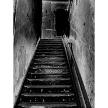 灵异恐怖惊悚音乐](./albums/2105289451.md) | 国语 | 独立发行 | 2019年09月27日 | 录音室专辑 | 游戏配乐 Video Game Music, 独立电子乐 Indietronica, 电子 Electronic |
| [ 惊悚恐怖音乐](./albums/2105271214.md) | 国语 | 独立发行 | 2019年09月23日 | 录音室专辑 | 游戏配乐 Video Game Music, 独立电子乐 Indietronica, 原声 Soundtrack |
| [ 恐怖诡异惊悚](./albums/2105258911.md) | 国语 | 独立发行 | 2019年09月20日 | 录音室专辑 | 游戏配乐 Video Game Music, 原声 Soundtrack, 电子 Electronic |
| [ 鬼故事恐怖音乐](./albums/2105258884.md) | 国语 | 独立发行 | 2019年09月19日 | 录音室专辑 | 游戏配乐 Video Game Music, 电子 Electronic, 原声 Soundtrack |
| [ 鬼恐怖音乐](./albums/2105250745.md) | 国语 | 独立发行 | 2019年09月16日 | 录音室专辑 | 游戏配乐 Video Game Music, 独立电子乐 Indietronica, 电子 Electronic |
| [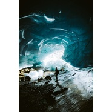 吉他](./albums/2105210084.md) | 国语 | 独立发行 | 2019年09月03日 | 录音室专辑 | 器乐独奏 Solo Instrumental, 器乐流行 Instrumental Pop, 轻音乐 Easy Listening |
| [ 巴乌](./albums/2105155148.md) | 国语 | 独立发行 | 2019年08月13日 | 录音室专辑 | 古风 GuFeng Music, 中国民乐 Chinese Folk Music, 中国风 China-Wave |
| [ 古筝二](./albums/2104964397.md) | 国语 | 独立发行 | 2019年06月26日 | 录音室专辑 | 古风 GuFeng Music, 中国民乐 Chinese Folk Music, 中国风 China-Wave |
| [ 古筝曲](./albums/2104945830.md) | 国语 | 独立发行 | 2019年06月15日 | 录音室专辑 | 古风 GuFeng Music, 中国民乐 Chinese Folk Music, 中国风 China-Wave |
| [ 古筝古风唯美古风古筝曲](./albums/2104928862.md) | 国语 | 独立发行 | 2019年06月05日 | 录音室专辑 | 古风 GuFeng Music, 中国民乐 Chinese Folk Music, 中国风 China-Wave |
| [ 笙笙歌](./albums/2104928429.md) | 国语 | 独立发行 | 2019年06月05日 | 录音室专辑 | 古风 GuFeng Music, 中国民乐 Chinese Folk Music, 中国风 China-Wave |
| [ 古筝古筝曲](./albums/2104921671.md) | 国语 | 独立发行 | 2019年06月04日 | 录音室专辑 | 古风 GuFeng Music, 中国民乐 Chinese Folk Music, 中国风 China-Wave |
| [ 模特时装秀T台走秀背景音乐氛围音乐集十五](./albums/2104917670.md) | 国语 | 独立发行 | 2019年05月31日 | 录音室专辑 | 演出金曲 Show Tunes, 电子 Electronic |
| [ 模特时装秀音乐精选集二](./albums/2104908634.md) | 国语 | 独立发行 | 2019年05月29日 | 录音室专辑 | 独立电子乐 Indietronica, 演出金曲 Show Tunes |
| [ 模特时装秀音乐精选集一](./albums/2104908597.md) | 国语 |  | 2019年05月29日 | 录音室专辑 | 独立电子乐 Indietronica, 演出金曲 Show Tunes |
| [ 模特时装秀T台走秀背景音乐氛围音乐集十四](./albums/2104889677.md) | 国语 | 独立发行 | 2019年05月23日 | 录音室专辑 | 演出金曲 Show Tunes, 电子 Electronic |
| [ 模特时装秀T台走秀背景音乐氛围音乐集十三](./albums/2104881963.md) | 国语 | 独立发行 | 2019年05月20日 | 录音室专辑 | 演出金曲 Show Tunes, 电子 Electronic |
| [ 模特时装秀T台走秀背景音乐氛围音乐集十二](./albums/2104854750.md) | 国语 | 独立发行 | 2019年05月11日 | 录音室专辑 | 独立电子乐 Indietronica, 演出金曲 Show Tunes |
| [ 模特时装秀T台走秀背景音乐氛围音乐集十一](./albums/2104831580.md) | 国语 | 独立发行 | 2019年05月01日 | 录音室专辑 | 独立电子乐 Indietronica, 电子 Electronic |
| [ 模特时装秀T台走秀背景音乐氛围音乐集十](./albums/2104829385.md) | 国语 | 独立发行 | 2019年04月30日 | 录音室专辑 | 独立电子乐 Indietronica, 电音流行 Electropop |
| [ 恐怖惊悚鬼故事背景音乐诡异氛围音乐集 6](./albums/2104821657.md) | 国语 | 独立发行 | 2019年04月27日 | 录音室专辑 | 游戏配乐 Video Game Music, 独立电子乐 Indietronica, 电子 Electronic |
| [ 恐怖惊悚诡异鬼故事背景音乐氛围音乐集 5](./albums/2104744074.md) | 国语 | 独立发行 | 2019年04月05日 | 录音室专辑 | 游戏配乐 Video Game Music, 独立电子乐 Indietronica, 氛围音乐 Ambient |
| [ 背景音乐BGM氛围音乐吉他曲集二](./albums/2104722078.md) | 国语 | 独立发行 | 2019年03月28日 | 录音室专辑 | 器乐独奏 Solo Instrumental, 器乐流行 Instrumental Pop, 轻音乐 Easy Listening |
| [ 背景音乐BGM氛围音乐吉他曲集一](./albums/2104721262.md) | 国语 | 独立发行 | 2019年03月27日 | 录音室专辑 | 器乐独奏 Solo Instrumental, 器乐流行 Instrumental Pop, 轻音乐 Easy Listening |
| [ 背景音乐BGM氛围音乐十三](./albums/2104717173.md) | 国语 | 独立发行 | 2019年03月26日 | 录音室专辑 | 爵士 Jazz, 器乐流行 Instrumental Pop, 轻音乐 Easy Listening |
| [ 游戏影视音乐电影电视配乐背景音乐氛围音乐集一](./albums/2104689849.md) | 国语 | 独立发行 | 2019年03月21日 | 录音室专辑 | 爵士 Jazz, 轻音乐 Easy Listening, 新世纪音乐 New Age |
| [ 模特时装秀T台走秀音乐集九](./albums/2104669060.md) | 国语 | 独立发行 | 2019年03月14日 | 录音室专辑 | 流行 Pop, 氛围流行 Ambient Pop, 梦幻流行 Dream Pop |
| [ 背景音乐BGM氛围音乐十二](./albums/2104669066.md) | 国语 | 独立发行 | 2019年03月14日 | 录音室专辑 | 电子 Electronic, 轻音乐 Easy Listening |
| [ 钢琴四](./albums/2104660778.md) | 国语 | 独立发行 | 2019年03月09日 | 录音室专辑 | 器乐流行 Instrumental Pop, 轻音乐 Easy Listening |
| [ 钢琴三](./albums/2104655968.md) | 国语 | 独立发行 | 2019年03月08日 | 录音室专辑 | 器乐独奏 Solo Instrumental, 轻音乐 Easy Listening |
| [ 模特时装秀T台走秀背景音乐氛围音乐集八](./albums/2104652184.md) | 国语 | 独立发行 | 2019年03月05日 | 录音室专辑 | 电子舞曲 EDM / Electronic Dance Music, 电子 Electronic |
| [ 拼搏青春器乐版](./albums/2104639781.md) | 国语 | 独立发行 | 2019年02月28日 | 录音室专辑 | 电音流行 Electropop, 电子 Electronic |
| [ 拼搏青春](./albums/2104638206.md) | 国语 | 独立发行 | 2019年02月27日 | 录音室专辑 | 流行 Pop, 电音流行 Electropop, 国语流行 Mandarin Pop |
| [ 钢琴二piano 2](./albums/2104620989.md) | 国语 | 独立发行 | 2019年02月23日 | 录音室专辑 | 器乐流行 Instrumental Pop, 轻音乐 Easy Listening |
| [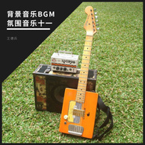 背景音乐BGM氛围音乐十一](./albums/2104613590.md) | 国语 | 独立发行 | 2019年02月22日 | 录音室专辑 | 摇滚 Rock & Roll, 独立摇滚 Indie Rock, 器乐流行 Instrumental Pop |
| [ 恐怖惊悚诡异鬼故事背景音乐氛围音乐集 4](./albums/2104617679.md) | 国语 | 独立发行 | 2019年02月22日 | 录音室专辑 | 黑暗氛围 Dark Ambient, 游戏配乐 Video Game Music, 独立电子乐 Indietronica |
| [ 背景音乐BGM氛围音乐十](./albums/2104604482.md) | 国语 | 独立发行 | 2019年02月19日 | 录音室专辑 | 电子 Electronic, 轻音乐 Easy Listening |
| [ 模特时装秀T台走秀背景音乐氛围音乐集三](./albums/2104546186.md) | 国语 | 独立发行 | 2019年01月27日 | 录音室专辑 | 独立电子乐 Indietronica, 电子 Electronic |
| [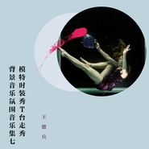 模特时装秀T台走秀背景音乐氛围音乐集七](./albums/2104540501.md) | 国语 | 独立发行 | 2019年01月26日 | 录音室专辑 | 演出金曲 Show Tunes, 电子 Electronic |
| [ 模特时装秀T台走秀背景音乐氛围音乐集六](./albums/2104536291.md) | 国语 | 独立发行 | 2019年01月25日 | 录音室专辑 | 演出金曲 Show Tunes, 电子 Electronic |
| [ 模特时装秀T台走秀背景音乐氛围音乐集五](./albums/2104524540.md) | 国语 | 独立发行 | 2019年01月23日 | 录音室专辑 | 演出金曲 Show Tunes, 电子 Electronic |
| [ 模特时装秀T台走秀背景音乐氛围音乐集四](./albums/2104509042.md) | 国语 | 独立发行 | 2019年01月20日 | 录音室专辑 | 演出金曲 Show Tunes, 电子 Electronic |
| [ 模特时装秀T台走秀背景音乐氛围音乐集二](./albums/2104429478.md) | 国语 | 独立发行 | 2018年12月30日 | 录音室专辑 | 电音流行 Electropop, 电子 Electronic |
| [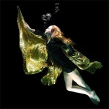 模特时装秀T台走秀背景音乐氛围音乐集一](./albums/2104426288.md) | 国语 | 独立发行 | 2018年12月29日 | 录音室专辑 | 演出金曲 Show Tunes, 电子 Electronic |
| [ 恐怖惊悚诡异鬼故事背景音乐氛围音乐集3](./albums/2104397493.md) | 国语 | 独立发行 | 2018年12月21日 | 录音室专辑 | 游戏配乐 Video Game Music, 独立电子乐 Indietronica, 氛围音乐 Ambient |
| [ 民谣吉他弹唱 理想之花](./albums/2104381144.md) | 国语 | 独立发行 | 2018年12月15日 | EP, 单曲 | 民谣 Folk, 当代民谣 Contemporary Folk, 民谣流行 Folk Pop |
| [ 背景音乐BGM氛围音乐9](./albums/2104364435.md) | 国语 | 独立发行 | 2018年12月11日 | 录音室专辑 | 摇滚 Rock & Roll, 独立电子乐 Indietronica, 器乐摇滚 Instrumental Rock |
| [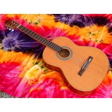 轻音乐吉他曲 5](./albums/2104346370.md) | 国语 | 独立发行 | 2018年12月07日 | EP, 单曲 | 器乐独奏 Solo Instrumental, 轻音乐 Easy Listening, 轻音乐流行 Light Pop |
| [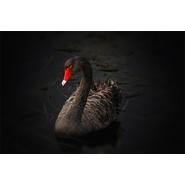 背景音乐BGM氛围音乐8](./albums/2104327597.md) | 国语 | 独立发行 | 2018年12月06日 | 录音室专辑 | 摇滚 Rock & Roll, 独立摇滚 Indie Rock |
| [ 背景音乐BGM氛围音乐7](./albums/2104327477.md) | 国语 | 独立发行 | 2018年12月06日 | 录音室专辑 | 摇滚 Rock & Roll, 轻音乐 Easy Listening |
| [ 背景音乐BGM氛围音乐5](./albums/2104324131.md) | 国语 | 独立发行 | 2018年12月04日 | 录音室专辑 | 器乐流行 Instrumental Pop, 轻音乐 Easy Listening |
| [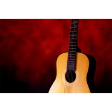 背景音乐BGM氛围音乐6](./albums/2104324564.md) | 国语 | 独立发行 | 2018年12月04日 | 录音室专辑 | 器乐流行 Instrumental Pop, 轻音乐 Easy Listening |
| [ 手机铃声原创音乐辑 27吉他铃声](./albums/2104288627.md) | 国语 | 独立发行 | 2018年11月27日 | 录音室专辑 | 民谣 Folk, 轻音乐 Easy Listening |
| [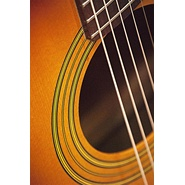 手机铃声原创音乐辑 26吉他铃声](./albums/2104288626.md) | 国语 | 独立发行 | 2018年11月27日 | 录音室专辑 | 器乐独奏 Solo Instrumental, 轻音乐 Easy Listening |
| [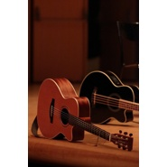 手机铃声原创音乐辑 34](./albums/2104290963.md) | 国语 | 独立发行 | 2018年11月27日 | 录音室专辑 | 器乐独奏 Solo Instrumental, 轻音乐 Easy Listening |
| [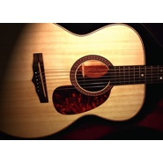 手机铃声原创音乐辑 25吉他铃声](./albums/2104288625.md) | 国语 | 独立发行 | 2018年11月27日 | 录音室专辑 | 器乐独奏 Solo Instrumental, 轻音乐 Easy Listening |
| [ 手机铃声原创音乐辑 35](./albums/2104290988.md) | 国语 | 独立发行 | 2018年11月27日 | 录音室专辑 | 器乐流行 Instrumental Pop, 轻音乐 Easy Listening |
| [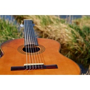 手机铃声原创音乐辑 31](./albums/2104290745.md) | 国语 | 独立发行 | 2018年11月27日 | 录音室专辑 | 器乐独奏 Solo Instrumental, 轻音乐 Easy Listening |
| [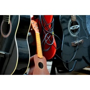 手机铃声原创音乐辑 33](./albums/2104290749.md) | 国语 | 独立发行 | 2018年11月27日 | 录音室专辑 | 器乐独奏 Solo Instrumental, 轻音乐 Easy Listening |
| [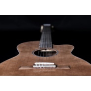 手机铃声原创音乐辑 28](./albums/2104290711.md) | 国语 | 独立发行 | 2018年11月27日 | 录音室专辑 | 器乐独奏 Solo Instrumental, 轻音乐 Easy Listening |
| [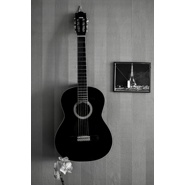 手机铃声原创音乐辑 32](./albums/2104290747.md) | 国语 | 独立发行 | 2018年11月27日 | 录音室专辑 | 器乐独奏 Solo Instrumental, 轻音乐 Easy Listening |
| [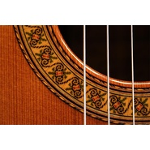 手机铃声原创音乐辑 29](./albums/2104290716.md) | 国语 | 独立发行 | 2018年11月27日 | 录音室专辑 | 器乐独奏 Solo Instrumental, 轻音乐 Easy Listening |
| [ 手机铃声原创音乐辑 30](./albums/2104290731.md) | 国语 | 独立发行 | 2018年11月27日 | 录音室专辑 | 器乐独奏 Solo Instrumental, 轻音乐 Easy Listening |
| [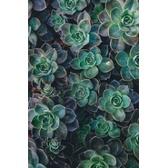 手机铃声原创音乐辑 22](./albums/2104286258.md) | 国语 | 独立发行 | 2018年11月26日 | 录音室专辑 | 独立电子乐 Indietronica, 电子 Electronic |
| [ 手机铃声原创音乐辑 24](./albums/2104286270.md) | 国语 | 独立发行 | 2018年11月26日 | 录音室专辑 | 器乐独奏 Solo Instrumental, 轻音乐 Easy Listening |
| [ 手机铃声原创音乐辑 23](./albums/2104286264.md) | 国语 | 独立发行 | 2018年11月26日 | 录音室专辑 | 独立电子乐 Indietronica, 电子 Electronic |
| [ 手机铃声原创音乐辑 21](./albums/2104286219.md) | 国语 | 独立发行 | 2018年11月26日 | 录音室专辑 | 独立电子乐 Indietronica, 电子 Electronic |
| [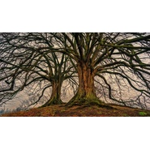 手机铃声原创音乐辑 20](./albums/2104286214.md) | 国语 | 独立发行 | 2018年11月26日 | 录音室专辑 | 独立电子乐 Indietronica, 电子 Electronic |
| [ 手机铃声原创音乐辑 17](./albums/2104274891.md) | 国语 | 独立发行 | 2018年11月25日 | 录音室专辑 | 独立电子乐 Indietronica, 电子 Electronic |
| [ 手机铃声原创音乐辑 16](./albums/2104274890.md) | 国语 | 独立发行 | 2018年11月25日 | 录音室专辑 | 合成器流行 Synthpop, 独立电子乐 Indietronica, 电子 Electronic |
| [ 手机铃声原创音乐辑 18](./albums/2104274892.md) | 国语 | 独立发行 | 2018年11月25日 | 录音室专辑 | 独立电子乐 Indietronica, 电子 Electronic |
| [ 手机铃声原创音乐辑 15](./albums/2104274889.md) | 国语 | 独立发行 | 2018年11月25日 | 录音室专辑 | 合成器流行 Synthpop, 电子 Electronic |
| [ 手机铃声原创音乐辑 19](./albums/2104274893.md) | 国语 | 独立发行 | 2018年11月25日 | 录音室专辑 | 独立电子乐 Indietronica, 电子 Electronic |
| [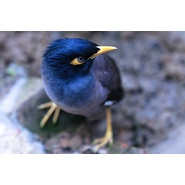 手机铃声原创音乐辑 14](./albums/2104270590.md) | 国语 | 独立发行 | 2018年11月24日 | 录音室专辑 | 合成器流行 Synthpop, 电子 Electronic |
| [ 手机铃声原创音乐辑 12](./albums/2104270588.md) | 国语 | 独立发行 | 2018年11月24日 | 录音室专辑 | 合成器流行 Synthpop, 电子 Electronic |
| [ 手机铃声原创音乐辑 13](./albums/2104270589.md) | 国语 | 独立发行 | 2018年11月24日 | 录音室专辑 | 合成器流行 Synthpop, 电子 Electronic |
| [ 手机铃声原创音乐辑 10](./albums/2104264869.md) | 国语 | 独立发行 | 2018年11月23日 | 录音室专辑 | 合成器流行 Synthpop, 电子 Electronic |
| [ 手机铃声原创音乐辑 11](./albums/2104265272.md) | 国语 | 独立发行 | 2018年11月23日 | 录音室专辑 | 合成器流行 Synthpop, 电子 Electronic |
| [ 圣诞节 春节 七夕情人节 吉他轻音乐](./albums/2104255486.md) | 国语 | 独立发行 | 2018年11月21日 | 录音室专辑 | 器乐独奏 Solo Instrumental, 轻音乐 Easy Listening |
| [ 惊悚诡异背景音乐 1](./albums/2104245620.md) | 国语 | 独立发行 | 2018年11月20日 | 录音室专辑 | 游戏配乐 Video Game Music, 独立电子乐 Indietronica |
| [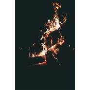 惊悚诡异背景音乐 7](./albums/2104246964.md) | 国语 | 独立发行 | 2018年11月20日 | 录音室专辑 | 游戏配乐 Video Game Music, 独立电子乐 Indietronica |
| [ 惊悚诡异背景音乐 6](./albums/2104246927.md) | 国语 | 独立发行 | 2018年11月20日 | 录音室专辑 | 游戏配乐 Video Game Music, 独立电子乐 Indietronica |
| [ 惊悚诡异背景音乐 4](./albums/2104245660.md) | 国语 | 独立发行 | 2018年11月20日 | 录音室专辑 | 游戏配乐 Video Game Music, 独立电子乐 Indietronica |
| [ 惊悚诡异背景音乐 2](./albums/2104245630.md) | 国语 | 独立发行 | 2018年11月20日 | 录音室专辑 | 游戏配乐 Video Game Music, 独立电子乐 Indietronica |
| [ 惊悚诡异背景音乐 5](./albums/2104247071.md) | 国语 | 独立发行 | 2018年11月20日 | 录音室专辑 | 游戏配乐 Video Game Music, 独立电子乐 Indietronica |
| [ 惊悚诡异背景音乐 3](./albums/2104245643.md) | 国语 | 独立发行 | 2018年11月20日 | 录音室专辑 | 游戏配乐 Video Game Music, 独立电子乐 Indietronica |
| [ 背景氛围音乐 2](./albums/2104241062.md) | 国语 | 独立发行 | 2018年11月19日 | 录音室专辑 | 器乐独奏 Solo Instrumental, 电子 Electronic, 轻音乐 Easy Listening |
| [ 背景氛围音乐 1](./albums/2104206651.md) | 国语 | 独立发行 | 2018年11月13日 | 录音室专辑 | 独立电子乐 Indietronica, 器乐流行 Instrumental Pop, 轻音乐 Easy Listening |
| [ 音乐实验室 2](./albums/2104194946.md) | 国语 | 独立发行 | 2018年11月09日 | 录音室专辑 | 独立电子乐 Indietronica, 实验音乐 Experimental, 氛围音乐 Ambient |
| [ 音乐实验室 1](./albums/2104191505.md) | 国语 | 独立发行 | 2018年11月08日 | 录音室专辑 | 独立电子乐 Indietronica, 实验电子 Experimental Electronic, 实验音乐 Experimental |
| [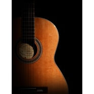 轻音乐吉他曲 4](./albums/2104171312.md) | 国语 | 独立发行 | 2018年11月01日 | 录音室专辑 | 器乐独奏 Solo Instrumental, 器乐流行 Instrumental Pop, 轻音乐 Easy Listening |
| [ 轻音乐吉他曲 3](./albums/2104158612.md) | 国语 | 独立发行 | 2018年10月29日 | 录音室专辑 | 器乐独奏 Solo Instrumental, 器乐流行 Instrumental Pop, 轻音乐 Easy Listening |
| [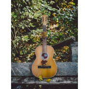 轻音乐吉他曲 2](./albums/2104154922.md) | 国语 | 独立发行 | 2018年10月27日 | 录音室专辑 | 器乐流行 Instrumental Pop, 轻音乐 Easy Listening, 轻音乐流行 Light Pop |
| [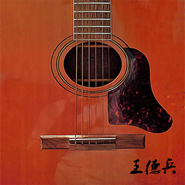 轻音乐吉他曲 1](./albums/2104092947.md) | 国语 | 独立发行 | 2018年10月10日 | 录音室专辑 | 器乐独奏 Solo Instrumental, 器乐流行 Instrumental Pop, 轻音乐流行 Light Pop |
| [ 吉他纯音乐 2](./albums/2103987970.md) | 国语 | 独立发行 | 2018年09月06日 | 录音室专辑 | 器乐流行 Instrumental Pop, 轻音乐 Easy Listening, 轻音乐流行 Light Pop |
| [ 手机铃声原创音乐辑 9](./albums/2103947008.md) | 国语 | 独立发行 | 2018年08月24日 | 录音室专辑 | 器乐流行 Instrumental Pop, 轻音乐 Easy Listening |
| [ 手机铃声原创音乐辑 5](./albums/2103946754.md) | 国语 | 独立发行 | 2018年08月24日 | 录音室专辑 | 轻音乐 Easy Listening, 梦幻流行 Dream Pop |
| [ 手机铃声原创音乐辑 6](./albums/2103946947.md) | 国语 | 独立发行 | 2018年08月24日 | 录音室专辑 | 器乐流行 Instrumental Pop, 轻音乐 Easy Listening |
| [ 手机铃声原创音乐辑 7](./albums/2103946985.md) | 国语 | 独立发行 | 2018年08月24日 | 录音室专辑 | 器乐流行 Instrumental Pop, 轻音乐 Easy Listening |
| [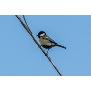 手机铃声原创音乐辑 8](./albums/2103946992.md) | 国语 | 独立发行 | 2018年08月24日 | 录音室专辑 | 器乐流行 Instrumental Pop, 轻音乐 Easy Listening |
| [ 吉他纯音乐 1](./albums/2103830972.md) | 国语 | 独立发行 | 2018年07月21日 | 录音室专辑 | 民谣 Folk, 轻音乐 Easy Listening |
| [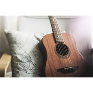 民谣 2](./albums/2103751341.md) | 国语 | 独立发行 | 2018年06月15日 | 录音室专辑 | 民谣 Folk, 当代民谣 Contemporary Folk, 独立民谣 Indie Folk |
| [ 钢琴 1](./albums/2103748321.md) | 纯音乐 | 独立发行 | 2018年06月13日 | 录音室专辑 | 轻音乐 Easy Listening, 器乐流行 Instrumental Pop |
| [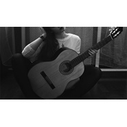 民谣 1](./albums/2103742936.md) | 国语 | 独立发行 | 2018年06月09日 | 录音室专辑 | 民谣 Folk, 民谣流行 Folk Pop, 当代民谣 Contemporary Folk |
| [ 纯音乐4](./albums/2103725108.md) | 纯音乐 | 独立发行 | 2018年05月31日 | 录音室专辑 | 电子 Electronic, 摇滚 Rock & Roll |
| [ 纯音乐集3](./albums/2103717941.md) | 纯音乐 | 独立发行 | 2018年05月24日 | 录音室专辑 | 电子 Electronic, 新世纪音乐 New Age |
| [ 纯音乐集2](./albums/2103715896.md) | 纯音乐 | 独立发行 | 2018年05月22日 | 录音室专辑 | 轻音乐 Easy Listening, 电子 Electronic |
| [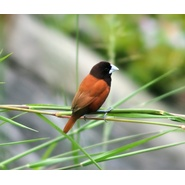 纯音乐集1](./albums/2103711453.md) | 纯音乐 | 独立发行 | 2018年05月17日 | 录音室专辑 | 轻音乐 Easy Listening, 新世纪音乐 New Age, 电子 Electronic |
| [ 闪恋时代](./albums/2103706319.md) | 国语 | 独立发行 | 2018年05月11日 | 录音室专辑 | 国语流行 Mandarin Pop, 实验音乐 Experimental |
| [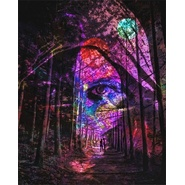 重金属之夜](./albums/2103705044.md) | 国语 | 独立发行 | 2018年05月10日 | 录音室专辑 | 摇滚 Rock & Roll, 金属  Metal, 重金属 Heavy Metal |
| [ 疯金属（纯音乐版）](./albums/2103704477.md) | 纯音乐 | 独立发行 | 2018年05月09日 | 录音室专辑 | 摇滚 Rock & Roll, 金属  Metal, 重金属 Heavy Metal |
| [ 重金属之夜（纯音乐版）](./albums/2103703025.md) | 国语 | 独立发行 | 2018年05月07日 | 录音室专辑 | 摇滚 Rock & Roll, 金属  Metal, 重金属 Heavy Metal |
| [ 手机铃声原创音乐辑 4](./albums/2103698334.md) | 纯音乐 | 独立发行 | 2018年04月28日 | 录音室专辑 | 电子 Electronic, 电子舞曲 EDM / Electronic Dance Music |
| [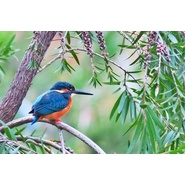 手机铃声原创音乐辑 3](./albums/2103697890.md) | 纯音乐 | 独立发行 | 2018年04月27日 | 录音室专辑 | 电子 Electronic, 合成器流行 Synthpop |
| [ 手机铃声原创音乐辑 2](./albums/2103694501.md) | 纯音乐 | 独立发行 | 2018年04月25日 | 录音室专辑 | 电子 Electronic, 电音流行 Electropop |
| [ 手机铃声原创音乐辑 1](./albums/2103693669.md) | 纯音乐 | 独立发行 | 2018年04月23日 | 录音室专辑 | 电子 Electronic, 实验音乐 Experimental |
| [ 动物农场](./albums/2103689513.md) | 其他 | 独立发行 | 2018年04月19日 | 录音室专辑 | 实验音乐 Experimental, 实验电子 Experimental Electronic |
| [ ​ 纯音乐之可爱轻音乐](./albums/2103665761.md) | 国语 | 独立发行 | 2018年04月04日 | 录音室专辑 | 轻音乐 Easy Listening, 器乐流行 Instrumental Pop, 轻音乐流行 Light Pop |
| [ 笑着跳舞](./albums/2103651023.md) | 国语 | 独立发行 | 2018年03月29日 | 录音室专辑 | 流行 Pop, 国语流行 Mandarin Pop, 电音流行 Electropop |
| [ 不听话就打屁股](./albums/2103644334.md) | 国语 | 独立发行 | 2018年03月26日 | 录音室专辑 | 流行 Pop, 国语流行 Mandarin Pop, 电音流行 Electropop |
| [ 将进酒](./albums/2103638934.md) | 国语 | 独立发行 | 2018年03月25日 | 录音室专辑 | 流行 Pop, 国语流行 Mandarin Pop, 电音流行 Electropop |
| [ 另类音乐辑 I](./albums/2103605712.md) | 国语 | 独立发行 | 2018年03月14日 | 录音室专辑 | 民谣 Folk, 电子 Electronic |
| [ 我爱你](./albums/2103605503.md) | 国语 | 独立发行 | 2018年03月14日 | 录音室专辑 | 流行 Pop, 国语流行 Mandarin Pop, 电音流行 Electropop |
| [ 另类音乐集 II](./albums/2103605711.md) | 国语 | 独立发行 | 2018年03月14日 | 录音室专辑 | 电子 Electronic, 民谣 Folk |
| [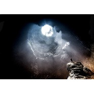 降落伞](./albums/2103605494.md) | 国语 | 独立发行 | 2018年03月13日 | 录音室专辑 | 摇滚 Rock & Roll, 民谣 Folk |
| [ 两个方向](./albums/2103605497.md) | 国语 | 独立发行 | 2018年03月13日 | 录音室专辑 | 流行 Pop, 国语流行 Mandarin Pop, 电音流行 Electropop |
| [ 羊和狼](./albums/2103603637.md) | 国语 | 独立发行 | 2018年03月12日 | 录音室专辑 | 流行 Pop, 国语流行 Mandarin Pop, 独立流行 Indie Pop |
| [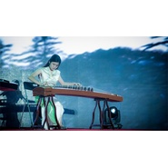 古筝的别样风味](./albums/2103588498.md) | 国语 | 独立发行 | 2018年03月06日 | 录音室专辑 | 民谣 Folk, 中国民乐 Chinese Folk Music, 古风 GuFeng Music |
| [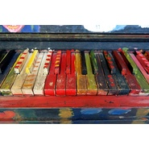 钢琴与Piano - 英雄](./albums/2103519599.md) | 国语 | 独立发行 | 2018年02月07日 | 录音室专辑 | 轻音乐 Easy Listening, 器乐流行 Instrumental Pop, 器乐独奏 Solo Instrumental |
| [ 重金属摇滚纯音乐之末日逃亡](./albums/2103517196.md) | 国语 | 独立发行 | 2018年02月06日 | 录音室专辑 | 摇滚 Rock & Roll, 独立摇滚 Indie Rock, 另类摇滚 Alternative Rock |
| [ 摇滚纯音乐之暗黑力量](./albums/2103511886.md) | 国语 | 独立发行 | 2018年02月01日 | 录音室专辑 | 摇滚 Rock & Roll, 独立摇滚 Indie Rock, 哥特摇滚 Gothic Rock |
| [ 夜幕降临](./albums/2103508148.md) | 国语 | 独立发行 | 2018年01月30日 | EP, 单曲 | 摇滚 Rock & Roll, 独立摇滚 Indie Rock, 另类摇滚 Alternative Rock |
| [ 邦邦女郎](./albums/2103499103.md) | 国语 | 独立发行 | 2018年01月24日 | 录音室专辑 | 流行 Pop, 民谣 Folk, 独立流行 Indie Pop |
| [ 灵雀之舞](./albums/2103493610.md) | 国语 | 独立发行 | 2018年01月18日 | 录音室专辑 | 电子 Electronic, 独立电子乐 Indietronica, 迪斯科 Disco |
| [ 电音摇滚电子音乐与摇滚结合，电吉他](./albums/2103466055.md) | 国语 | 独立发行 | 2018年01月02日 | 录音室专辑 | 独立电子乐 Indietronica, 电子 Electronic, 迷幻摇滚 Psychedelic Rock |
| [ 节奏](./albums/2108295108.md) | 国语 | 独立发行 | 不详 | 录音室专辑 | 电子 Electronic, 独立电子乐 Indietronica, 鼓打贝斯 Drum & Bass |
| [ 笛子](./albums/2105150425.md) | 国语 | 独立发行 | 不详 | 录音室专辑 | 古风 GuFeng Music, 中国民乐 Chinese Folk Music, 世界音乐 World Music |
| [ 恐怖惊悚诡异鬼故事背景音乐氛围音乐集 9](./albums/2105362316.md) | 国语 | 独立发行 | 不详 | 录音室专辑 | 游戏配乐 Video Game Music, 独立电子乐 Indietronica, 电子 Electronic |
| [ 模特时装秀T台走秀背景音乐氛围音乐集十九](./albums/5020789056.md) | 国语 | 独立发行 | 不详 | 录音室专辑 | 爵士 Jazz, 世界音乐 World Music |
| [ 模特时装秀T台走秀背景音乐氛围音乐集二十四](./albums/5021762823.md) | 纯音乐 | 独立发行 | 不详 | 录音室专辑 | 流行 Pop, 演出金曲 Show Tunes, 摇滚 Rock & Roll |
| [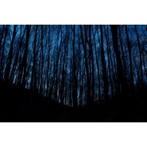 惊悚诡异背景音乐 8](./albums/2104246998.md) | 国语 | 独立发行 | 不详 | 录音室专辑 | 游戏配乐 Video Game Music, 独立电子乐 Indietronica |
| [ 王德兵的专辑](./albums/5022634082.md) | 其他 |  | 不详 |  |  |

## 评论

|  |  |  |  |
| :-- | :-- | :-- | :-- |
|  [虾米用户](https://emumo.xiami.com/u/37213889)   2019-10-18 15:36 赞(0) 踩(0) | 
亲买走秀音乐
 |
|  [虾米用户](https://emumo.xiami.com/u/276944698) 不要自我设限..... 2019-09-15 20:06 赞(0) 踩(0) | 
☠️☠️
 |
|  [虾米用户](https://emumo.xiami.com/u/264444933) 我喜欢我。我还是我。 2019-08-22 23:54 赞(0) 踩(0) | 
hey
 |
|  [虾米用户](https://emumo.xiami.com/u/328657369) 风格随心而变、 2019-08-13 02:01 赞(0) 踩(0) | 
哦哟(´-ω-`)
 |
|  [虾米用户](https://emumo.xiami.com/u/353670299) Love  Health... 2018-11-27 22:06 赞(1) 踩(0) | 
很好听！节奏慢而且抒情的轻音樂最喜歡！ 
 |
|  [虾米用户](https://emumo.xiami.com/u/346653458) 随意听 2018-08-28 01:49 赞(2) 踩(0) | 
半夜提神有奇效！真的！背脊发寒不是盖的！已加入搞作业豪华套餐！感谢！！！     
 |
|  [虾米用户](https://emumo.xiami.com/u/201766747)  2018-07-27 23:17 赞(2) 踩(0) | 
有才
 |
|  [虾米用户](https://emumo.xiami.com/u/354919101) 不可靠近，选择远离。 2018-07-06 04:02 赞(1) 踩(0) | 
诠释各种灵异&amp;hellip;&amp;hellip;[笑哭]
 |
|  [虾米用户](https://emumo.xiami.com/u/292553801)  2018-04-22 20:01 赞(0) 踩(0) | 
oh shit
 |
|  [虾米用户](https://emumo.xiami.com/u/283207192)  2018-04-14 18:19 赞(4) 踩(0) | 
哥们，音乐不错
 |
