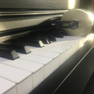
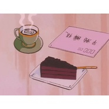
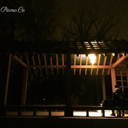
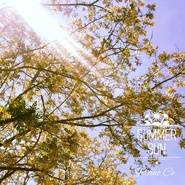

Piano.Ce
============================

|  |  |
| :--: | :-- |
| [ Piano.Ce](https://i.xiami.com/pianoce) | **播放数**: 884085 **粉丝数**: 139 **评论数**: 12 **地区**: China 中国大陆 **风格**: 器乐独奏 Solo Instrumental, 器乐流行 Instrumental Pop, 轻音乐流行 Light Pop, 轻音乐 Easy Listening  |

## 档案

## 专辑

| 名称 | 语种 | 唱片公司 | 发行时间 | 专辑类别 | 专辑风格 |
| :--: | :-- | :-- | :-- | :-- | :-- |
| [ endless](./albums/5021147155.md) | 纯音乐 | 独立发行 | 2020年07月23日 | 录音室专辑 | 流行 Pop |
| [ stay at home](./albums/2108314022.md) | 纯音乐 | 独立发行 | 2020年04月12日 | 录音室专辑 | 流行 Pop |
| [ Await](./albums/2104867346.md) | 纯音乐 |  | 2019年05月16日 | 录音室专辑 | 轻音乐 Easy Listening |
| [ Lovin' U](./albums/2104080246.md) | 国语 | 独立发行 | 2018年10月04日 | 录音室专辑 | 轻音乐流行 Light Pop |
| [ Believe me](./albums/2104077152.md) | 纯音乐 | 独立发行 | 2018年10月04日 | 录音室专辑 | 流行 Pop |
| [ Forever](./albums/2103901591.md) | 纯音乐 | 独立发行 | 2018年08月06日 | EP, 单曲 | 流行 Pop |
| [ Farewell.](./albums/2103794051.md) | 纯音乐 | 独立发行 | 2018年07月10日 | 录音室专辑 | 轻音乐 Easy Listening, 器乐流行 Instrumental Pop, 器乐独奏 Solo Instrumental |
| [ Hello, April](./albums/2103658359.md) | 纯音乐 | 独立发行 | 2018年04月01日 | 录音室专辑 | 器乐流行 Instrumental Pop, 轻音乐流行 Light Pop |
| [ Happy Birthday to Me](./albums/2103579921.md) | 纯音乐 | 独立发行 | 2018年03月03日 | 录音室专辑 | 轻音乐 Easy Listening, 轻音乐流行 Light Pop, 器乐独奏 Solo Instrumental |
| [ SUMMER SUN](./albums/2103499647.md) | 其他 | 独立发行 | 2018年01月24日 | 录音室专辑 | 轻音乐流行 Light Pop, 器乐独奏 Solo Instrumental |

## 评论

|  |  |  |  |
| :-- | :-- | :-- | :-- |
|  [虾米用户](https://emumo.xiami.com/u/376647980)  2020-10-18 20:56 赞(0) 踩(0) | 
因为 好&amp;middot;听～
 |
|  [虾米用户](https://emumo.xiami.com/u/32461398) 曾在云上浮想联翩如今也终... 2020-05-31 00:26 赞(1) 踩(0) | 
加油啊~初次见面~
 |
| ⇒ |  [虾米用户](https://emumo.xiami.com/u/104380556) (≧∇≦) 2020-07-24 01:29 赞(0) 踩(0) | 
嘿嘿 谢谢你~ 加油！
 |
|  [虾米用户](https://emumo.xiami.com/u/372533949) 子非鱼，安知鱼心之所伤？ 2020-05-18 07:23 赞(0) 踩(0) | 
发现宝藏～
 |
| ⇒ |  [虾米用户](https://emumo.xiami.com/u/104380556) (≧∇≦) 2020-07-24 01:30 赞(0) 踩(0) | 
哈哈 谢谢~
 |
|  [虾米用户](https://emumo.xiami.com/u/347485363) 我还没想好要写什么... 2020-03-19 17:24 赞(1) 踩(0) | 
很棒
 |
| ⇒ |  [虾米用户](https://emumo.xiami.com/u/104380556) (≧∇≦) 2020-07-24 01:30 赞(0) 踩(0) | 
谢谢~
 |
|  [虾米用户](https://emumo.xiami.com/u/346165752)  2019-04-01 12:20 赞(0) 踩(0) | 

 |
|  [虾米用户](https://emumo.xiami.com/u/337699618) 滴 2019-01-03 08:28 赞(0) 踩(0) | 

 |
|  [虾米用户](https://emumo.xiami.com/u/409441357) 你必将如闪电般归来 2018-12-30 18:57 赞(0) 踩(0) | 
打call（￣▽￣）
 |
|  [虾米用户](https://emumo.xiami.com/u/191469939) It is crysta... 2018-02-24 21:24 赞(1) 踩(0) | 
打call!
 |
| ⇒ |  [虾米用户](https://emumo.xiami.com/u/104380556) (≧∇≦) 2018-02-25 12:37 赞(0) 踩(0) | 

 |
