Speakeasy Radio
============================

|  |  |
| :--: | :-- |
| [ Speakeasy Radio](https://i.xiami.com/speakeasyradio) | **播放数**: 1644699 **粉丝数**: 8410 **评论数**: 422 **地区**: China 中国大陆 **风格**: 有声书 Audio Book, 爵士 Jazz, 后摇 Post-Rock, 古典音乐 Classical, 流行 Pop  |

## 档案

听一个来路不明的电台，就是大冒险。 
你会喜欢我们吗？

## 专辑

| 名称 | 语种 | 唱片公司 | 发行时间 | 专辑类别 | 专辑风格 |
| :--: | :-- | :-- | :-- | :-- | :-- |
| [ Vol 150. 【Vintage Night】喝一杯临别一语](./albums/5022588861.md) | 国语 | 独立发行 | 2021年01月25日 | 播客 | 有声书 Audio Book |
| [ Vol 149.相约2021年维也纳新年音乐会](./albums/5022315095.md) | 国语 | 独立发行 | 2021年01月01日 | 播客 | 古典音乐 Classical |
| [ Vol 148.【Siren Night】2020年 后摇聆听记录_](./albums/5022308946.md) | 国语 | 独立发行 | 2020年12月30日 | 播客 | 有声书 Audio Book |
| [ Vol 147.贝多芬第8号钢琴奏鸣曲《悲怆》](./albums/5022268736.md) | 国语 | 独立发行 | 2020年12月16日 | 播客 | 古典音乐 Classical |
| [ Vol 146.很古怪,也可以从贝多芬‘大公’三重奏，到海边的卡夫卡，以及珍稀龟类](./albums/5021540558.md) | 国语 | 独立发行 | 2020年09月27日 | 播客 | 古典音乐 Classical |
| [ Vol 145.酒馆的乡愁](./albums/5021467976.md) | 英语 | 独立发行 | 2020年09月18日 | 播客 | 城市民谣 Urban Folk |
| [ Vol 144.是格伦·古尔德呀Glenn Gould](./albums/5021369916.md) | 国语 | 独立发行 | 2020年08月28日 | 播客 | 古典音乐 Classical |
| [ Vol 143.洋娃娃与小熊跳舞大提琴与钢琴](./albums/5021153882.md) | 国语 | 独立发行 | 2020年07月24日 | 播客 | 古典音乐 Classical |
| [ Vol 142【Siren Night】后摇地图（韩国篇）](./albums/5021104078.md) | 国语 | 独立发行 | 2020年07月15日 | 播客 | 广播剧 Radio Drama |
| [ Vol 141.荒草丛生的小径On an Overgrown Path](./albums/5021030974.md) | 国语 | 独立发行 | 2020年07月04日 | 播客 | 古典音乐 Classical |
| [ Vol 140.爵士钢琴老先生](./albums/5020713023.md) | 国语 | 独立发行 | 2020年05月24日 | 播客 | 爵士 Jazz |
| [ Vol 139.存在主义咖啡馆爱哲学系列6-萨特·存在先于本质](./albums/2108404017.md) | 国语 | 独立发行 | 2020年05月01日 | 播客 | 爵士 Jazz |
| [ Vol 138.读信2-你是这样的莫扎特](./albums/2108285555.md) | 国语 | 独立发行 | 2020年04月01日 | 播客 | 古典音乐 Classical |
| [ Vol 137.读信-我是你的莫扎特](./albums/2108261868.md) | 国语 | 独立发行 | 2020年03月28日 | 播客 | 古典音乐 Classical |
| [ Vol 136.【Special】男朋友求生存指南机智BOY的TIPS](./albums/2106042148.md) | 国语 | 独立发行 | 2020年02月14日 | 播客 | 爵士 Jazz |
| [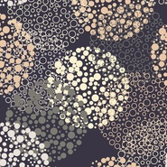 Vol 135.【Vintage】波点与月光元宵节快乐](./albums/2105834062.md) | 国语 | 独立发行 | 2020年02月08日 | 播客 | 爵士 Jazz |
| [ Vol 134.疫情焦虑抑制剂](./albums/2105814148.md) | 国语 | 独立发行 | 2020年02月04日 | 播客 | 有声书 Audio Book |
| [ Vol 133.贝九之4-胜利与欢呼贝多芬第九交响曲 第四乐章](./albums/2105810720.md) | 国语 | 独立发行 | 2020年02月03日 | 播客 | 古典音乐 Classical |
| [ Vol 132.贝九之3-至美与沉思贝多芬第九交响曲 第三乐章](./albums/2105808192.md) | 国语 | 独立发行 | 2020年02月02日 | 播客 | 古典音乐 Classical |
| [ Vol 131.贝九之2-前进与勇气贝多芬第九交响曲 第二乐章](./albums/2105806562.md) | 国语 | 独立发行 | 2020年02月01日 | 播客 | 古典音乐 Classical |
| [ Vol 130.贝九之1-跌宕与未知贝多芬第九交响曲 第一乐章](./albums/2105803888.md) | 国语 | 独立发行 | 2020年01月31日 | 播客 | 古典音乐 Classical |
| [ Vol 129【Vintage】爵士开年Jazz Up 2020](./albums/2105774606.md) | 国语 | 独立发行 | 2020年01月24日 | 播客 | 爵士 Jazz |
| [ Vol 128.【Vintage】Mercy,mercy,mercy给倒霉蛋来点爵士乐](./albums/2105763381.md) | 国语 | 独立发行 | 2020年01月21日 | 播客 | 爵士 Jazz |
| [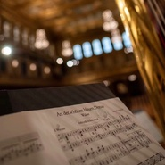 Vol 127.相约2020年维也纳新年音乐会Vienna New Year's Concert 2020](./albums/2105658370.md) | 国语 | 独立发行 | 2019年12月31日 | 播客 | 古典音乐 Classical |
| [ Vol 126.冬·贝多芬第30号钢琴奏鸣曲](./albums/2105628576.md) | 国语 | 独立发行 | 2019年12月25日 | 播客 | 古典音乐 Classical |
| [ Vol 125. 1900:声光伴我飞](./albums/2105452478.md) | 国语 |  | 2019年11月19日 | 播客 | 爵士 Jazz |
| [ Vol 124【Siren Night】Inspirative的秋夜梦](./albums/2105437141.md) | 国语 |  | 2019年11月06日 | 播客 |  |
| [ Vol 123.肖邦的音乐人生肖邦逝世170周年纪念（上）](./albums/2105347195.md) | 国语 |  | 2019年10月17日 | 播客 | 古典音乐 Classical |
| [ Vol 122.肖邦的钢琴密码肖邦逝世170周年纪念（下）](./albums/2105322030.md) | 国语 |  | 2019年10月09日 | 播客 | 古典音乐 Classical |
| [ Vol 121.【Special】中秋谁与共孤光](./albums/2105238021.md) | 国语 |  | 2019年09月12日 | 播客 | 有声书 Audio Book |
| [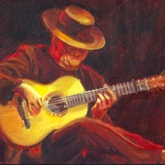 Vol 120.【Vintage】弦琴巴赫](./albums/2105234151.md) | 国语 |  | 2019年09月10日 | 播客 | 古典音乐 Classical |
| [ Vol 119.抑郁如你](./albums/2105156053.md) | 国语 | 独立发行 | 2019年08月14日 | 播客 | 英伦摇滚 Britpop |
| [ Vol 118.【Friday Night】The Song Remembers When](./albums/2105060052.md) | 国语 |  | 2019年08月09日 | 播客 | 有声书 Audio Book |
| [ Vol 117.【Vintage】书包嘴,唱支歌儿吧Satchmo:Louis Armstrong](./albums/2105053489.md) | 国语 |  | 2019年08月02日 | 播客 | 爵士 Jazz |
| [ Vol 116 【Siren Night】橙子歌单里的夏](./albums/2104972141.md) | 国语 |  | 2019年07月03日 | 播客 | 有声书 Audio Book |
| [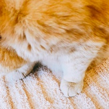 Vol 115.【Vintage】小提琴里有只喵给主子播放一曲小提琴是奴才的本分](./albums/2104963610.md) | 国语 |  | 2019年06月25日 | 播客 | 古典音乐 Classical |
| [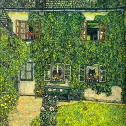 Vol 114.【Friday】阿口米歌单里的夏~夏至！](./albums/2104956376.md) | 国语 |  | 2019年06月21日 | 播客 | 古典音乐 Classical, 爵士 Jazz, 欧美流行 Western Pop |
| [ Vol 113. 【Siren Night】听氛围睡了](./albums/2104952445.md) | 国语 |  | 2019年06月19日 | 播客 | 有声书 Audio Book |
| [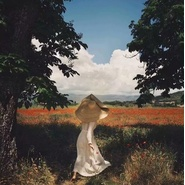 Vol 112.【Vintage Night】舒伯特的云卷云舒](./albums/2104939448.md) | 国语 |  | 2019年06月11日 | 播客 | 古典音乐 Classical |
| [ Vol 111.【Friday Night】失恋爵士Love fades.](./albums/2104872569.md) | 国语 |  | 2019年05月17日 | 播客 | 爵士 Jazz |
| [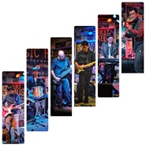 Vol 110. 【Siren Night】细声遇见In Lights](./albums/2104846626.md) | 国语 |  | 2019年05月08日 | 播客 | 广播剧 Radio Drama, 后摇 Post-Rock |
| [ Vol 109.【Special】星光与默示爱哲学系列5-加缪《西西弗斯的神话》](./albums/2104837891.md) | 国语 |  | 2019年05月03日 | 播客 | 古典音乐 Classical |
| [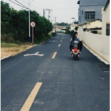 Vol.108【Vintage Night】这些愚蠢的事情](./albums/2104777944.md) | 国语 |  | 2019年04月14日 | 播客 | 爵士 Jazz |
| [ Vol 107【Special】爱哲学系列4-尼采与贝七爱哲学系列4-尼采、贝多芬与酒神精神](./albums/2104649283.md) | 国语 |  | 2019年03月03日 | 播客 | 古典音乐 Classical |
| [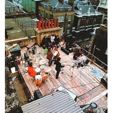 Vol 106【Special】The Beatles天台演唱会](./albums/2104640960.md) | 国语 |  | 2019年02月27日 | 播客 | 有声书 Audio Book |
| [ Vol 105【Vintage Night】来大扫除吧❤（不要）](./albums/2104557595.md) | 国语 |  | 2019年01月30日 | 播客 | 古典音乐 Classical |
| [ Vol 104.【Vintage Night】听爵士睡了](./albums/2104521452.md) | 国语 |  | 2019年01月21日 | 播客 | 爵士 Jazz |
| [ Vol 103. 【Siren Night】后摇中的四季更迭](./albums/2104526754.md) | 国语 |  | 2019年01月16日 | 播客 | 有声书 Audio Book |
| [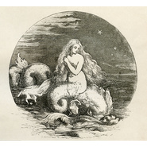 Vol 102. 【Siren Night】这是塞壬之夜](./albums/2104479011.md) | 国语 |  | 2019年01月09日 | 播客 | 有声书 Audio Book |
| [ Vol 101.【Vintage Night】有个胖子叫沃勒Fats Waller](./albums/2104454843.md) | 国语 |  | 2019年01月07日 | 有声书 | 爵士 Jazz |
| [ Vol 100. 【Special】你陪伴我们的第100天](./albums/2104436004.md) | 国语 |  | 2018年12月31日 | 播客 | 广播剧 Radio Drama |
| [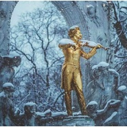 Vol 99.【Vintage Night】相约2019年维也纳新年音乐会VIENNA PHILHARMONIC ORCHESTRA NEW YEAR’S CONCERT 2019](./albums/2104414445.md) | 国语 |  | 2018年12月24日 | 播客 | 古典音乐 Classical |
| [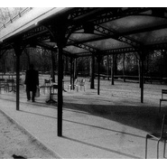 Vol 98. 【Siren Night】2018年后摇聆听记录](./albums/2104418102.md) | 国语 |  | 2018年12月19日 | 播客 | 有声书 Audio Book, 后摇 Post-Rock |
| [ Vol 97.【Friday Night】纸短情长](./albums/2104460877.md) | 国语 |  | 2018年12月03日 | 播客 | 广播剧 Radio Drama |
| [ Vol 96.【Siren Night】后摇跨过界](./albums/2104247086.md) | 国语 |  | 2018年11月21日 | 播客 | 有声书 Audio Book |
| [ Vol 95.【Friday Night】是破晓, 如晨光虾米10周年](./albums/2104226791.md) | 国语 |  | 2018年11月16日 | 播客 | 古典音乐 Classical |
| [ Vol 94. 【Vintage Night】艾灵顿公爵:Love You Madly艾灵顿公爵访谈](./albums/2104174309.md) | 国语 |  | 2018年11月05日 | 播客 | 爵士 Jazz |
| [ Vol 93.【Vintage Night】我的大河,奔腾不息](./albums/2104158618.md) | 国语 |  | 2018年10月29日 | 播客 | 古典音乐 Classical |
| [ Vol 92. 【Siren Night】后摇地图（澳大利亚篇）](./albums/2104157863.md) | 国语 |  | 2018年10月24日 | 播客 | 广播剧 Radio Drama, 后摇 Post-Rock |
| [ Vol 91.【Vintage Night】又是凉的秋愁无尽的秋](./albums/2104110672.md) | 国语 | 独立发行 | 2018年10月15日 | 播客 | 古典音乐 Classical, 爵士 Jazz |
| [ Vol 90. 【Friday Night】爱你在心口难开](./albums/2104123230.md) | 国语 | 独立发行 | 2018年10月12日 | 播客 | 有声书 Audio Book |
| [ Vol 89.【Friday Night】爵士之蓝,深藏BLUE](./albums/2104082358.md) | 国语 | 独立发行 | 2018年10月05日 | 播客 | 爵士 Jazz |
| [ Vol 88.【Vintage Night】和艾灵顿公爵在一起的假日午后](./albums/2104075524.md) | 国语 | 独立发行 | 2018年10月01日 | 播客 | 爵士 Jazz |
| [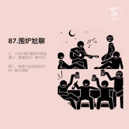 Vol 87.【Friday Night】围炉尬聊](./albums/2104068399.md) | 国语 | 独立发行 | 2018年09月28日 | 播客 | 有声书 Audio Book |
| [ Vol 86. 【Siren Night】后摇遇上中国传统乐器](./albums/2104051743.md) | 国语 | 独立发行 | 2018年09月19日 | 播客 | 有声书 Audio Book, 后摇 Post-Rock |
| [ Vol 85.【Vintage Night】风雨欲来贝多芬里的暴风雨](./albums/2104034477.md) | 国语 | 独立发行 | 2018年09月17日 | 播客 | 古典音乐 Classical |
| [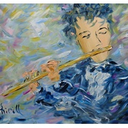 Vol 84.【Friday Night】清澈长笛](./albums/2104024904.md) | 国语 | 独立发行 | 2018年09月14日 | 播客 | 古典音乐 Classical |
| [ Vol 83.【Special】百年伯恩斯坦HAPPY 100TH BIRTHDAY,LEONARD BERNSTEIN!](./albums/2104055751.md) | 国语 | 独立发行 | 2018年08月25日 | 播客 | 古典音乐 Classical |
| [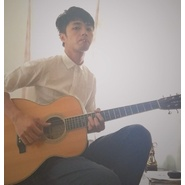 Vol 82. 【Special】校园弹唱指南](./albums/2103941239.md) | 国语 | 独立发行 | 2018年08月22日 | 播客 | 广播剧 Radio Drama |
| [ Vol 81.【Friday Night】爱哲学系列3-What is the thing called love?](./albums/2103929604.md) | 国语 | 独立发行 | 2018年08月17日 | 播客 | 爵士 Jazz |
| [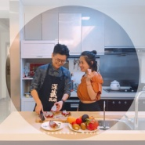 Vol 80.【Friday Night】等你吃饭](./albums/2103910956.md) | 国语 | 独立发行 | 2018年08月10日 | 播客 | 流行 Pop |
| [ Vol 79.【Special】什么是爵士-听伯恩斯坦聊爵士（下）-即兴创作](./albums/2103890858.md) | 国语 | 独立发行 | 2018年08月03日 | 播客 | 爵士 Jazz |
| [ Vol 78.【Special】什么是爵士-听伯恩斯坦聊爵士（上）-基本元素](./albums/2103887364.md) | 国语 | 独立发行 | 2018年08月01日 | 播客 | 爵士 Jazz |
| [ Vol 77.【Vintage Night】生活在别处-在意大利,在威尼斯夏日船歌](./albums/2103831417.md) | 国语 | 独立发行 | 2018年07月21日 | 播客 | 西方古典 Western Classical Music |
| [ Vol 76. 【Siren Night】一片日系数摇胶囊，拯救工作不开心](./albums/2103833073.md) | 粤语 | 独立发行 | 2018年07月18日 | 播客 | 有声书 Audio Book |
| [ Vol 75.【Friday Night】就你戏多！](./albums/2103807688.md) | 国语 | 独立发行 | 2018年07月13日 | 播客 | 爵士 Jazz |
| [ Vol 74.【Friday Night】爱哲学系列2-你的家中常备药哲学的慰藉](./albums/2103781327.md) | 国语 | 独立发行 | 2018年07月06日 | 播客 | 古典音乐 Classical, 有声书 Audio Book |
| [ Vol 73. 【Siren Night】后摇地图（世界杯特辑日本篇）](./albums/2103786465.md) | 国语 | 独立发行 | 2018年07月04日 | 播客 | 有声书 Audio Book, 后摇 Post-Rock |
| [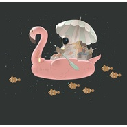 Vol 72. 【Vintage Night】经典不完美](./albums/2103764178.md) | 国语 | 独立发行 | 2018年06月25日 | 播客 | 有声书 Audio Book, 摇滚 Rock & Roll |
| [ Vol 71.【毕业季特刊】再见,青青校树再见我的银杏梧桐木棉海棠凤凰与樱花](./albums/2103754370.md) | 国语 | 独立发行 | 2018年06月23日 | 播客 | 民谣 Folk, 独立民谣 Indie Folk, 校园民谣 Campus Folk |
| [ Vol 70. 【Siren Night】Caspian编年史](./albums/2103754239.md) | 国语 | 独立发行 | 2018年06月20日 | 播客 | 后摇 Post-Rock, 有声书 Audio Book |
| [ Vol 69.【Special】音乐里的老爸属性（蠢萌、傲娇、英雄）父亲节特刊](./albums/2103751618.md) | 国语 | 独立发行 | 2018年06月17日 | 播客 | 流行 Pop, 民谣 Folk |
| [ Vol 68.  【Siren Night】梦泡到底是个啥](./albums/2103749002.md) | 国语 | 独立发行 | 2018年06月13日 | 播客 | 有声书 Audio Book, 梦幻流行 Dream Pop |
| [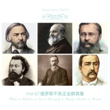 Vol 67.【Vintage Night】俄罗斯不务正业群英像从格林卡到强力五人团](./albums/2103745960.md) | 国语 | 独立发行 | 2018年06月11日 | 播客 | 古典音乐 Classical |
| [ Vol 66. 【Friday Night】俄罗斯三角脆-巴拉莱卡（毛子❤️）风味萌萌的三角琴Balalaika](./albums/2103742818.md) | 国语 | 独立发行 | 2018年06月08日 | 播客 | 有声书 Audio Book |
| [ Vol 65. 【Siren Night】后摇地图（俄罗斯篇）](./albums/2103738623.md) | 国语 | 独立发行 | 2018年06月06日 | 播客 | 后摇 Post-Rock, 有声书 Audio Book |
| [ Vol 64.【Vintage Night】俄罗斯忧郁-拉赫玛尼诺夫的汹涌暗潮难以抗拒的内敛、深邃和克制](./albums/2103729900.md) | 国语 | 独立发行 | 2018年06月04日 | 播客 | 古典音乐 Classical |
| [ Vol 63.【Friday Night】奇妙古典玩具店我的玩具会跳舞](./albums/2103725722.md) | 国语 | 独立发行 | 2018年06月01日 | 播客 | 古典音乐 Classical, 西方古典 Western Classical Music, 芭蕾 Ballet |
| [ Vol 62.【Special】痛饮植物学家金酒记不敢回听的羞耻醉话](./albums/2103726791.md) | 国语 | 独立发行 | 2018年05月30日 | 播客 | 广播剧 Radio Drama |
| [ Vol 61.【Vintage Night】跳一支优雅的小步舞曲](./albums/2103722193.md) | 国语 | 独立发行 | 2018年05月28日 | 播客 | 古典音乐 Classical |
| [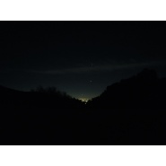 Vol 60. 【Friday Night】周末就是要驰放！](./albums/2103725719.md) | 国语 | 独立发行 | 2018年05月25日 | 播客 | 电子 Electronic, 广播剧 Radio Drama |
| [ Vol 59. 【Siren Night】童稚后摇（后摇中的童声采样）](./albums/2103725718.md) | 国语 | 独立发行 | 2018年05月23日 | 播客 | 后摇 Post-Rock, 广播剧 Radio Drama |
| [ Vol 58.【Vintage Night】爵士起源之蓝调:琴弦上的痛与爱Blues/布鲁斯：空虚寂寞穷困冷](./albums/2103716241.md) | 国语 | 独立发行 | 2018年05月21日 | 播客 | 布鲁斯 Blues, 三角洲布鲁斯 Delta Blues, 爵士布鲁斯 Jazz Blues |
| [ Vol 57.【Siren Night】后摇地图（西班牙篇）](./albums/2103712981.md) | 国语 | 独立发行 | 2018年05月16日 | 播客 | 后摇 Post-Rock, 广播剧 Radio Drama |
| [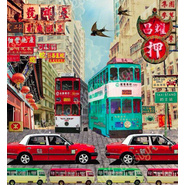 Vol 56.【Vintage Night】巷子口的磁带店港台女声](./albums/2103708405.md) | 国语 | 独立发行 | 2018年05月14日 | 播客 | 粤语流行 Cantopop, 国语流行 Mandarin Pop, 台湾民歌运动 Taiwan Folk Scene |
| [ Vol 55.【Friday Night】给你玫瑰](./albums/2103706714.md) | 国语 | 独立发行 | 2018年05月11日 | 有声书 | 爵士 Jazz, 摇滚 Rock & Roll, 有声书 Audio Book |
| [ Vol 54. 【Siren Night】后摇地图（中东篇——枪炮中的玫瑰）](./albums/2103704990.md) | 国语 | 独立发行 | 2018年05月09日 | 播客 | 后摇 Post-Rock, 广播剧 Radio Drama |
| [ Vol 53.【Vintage Night】爵士起源之散拍乐:琴键上的起舞指尖Ragtime/拉格泰:把节奏切吧切吧剁啦~](./albums/2103703869.md) | 国语 | 独立发行 | 2018年05月07日 | 有声书 | 爵士 Jazz, 有声书 Audio Book |
| [ Vol 52.【Friday Night】许我道别离](./albums/2103702243.md) | 国语 | 独立发行 | 2018年05月04日 | 有声书 | 乡村 Country, 古典音乐 Classical |
| [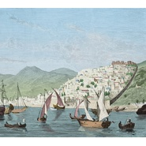 Vol 51. 【Siren Night】后摇地图（希腊篇）](./albums/2103701799.md) | 国语 | 独立发行 | 2018年05月03日 | 播客 | 后摇 Post-Rock, 有声书 Audio Book |
| [ Vol 50.【Special】透明电台现形记（一个来路不明电台的自我修养）](./albums/2103697097.md) | 国语 | 独立发行 | 2018年04月26日 | 有声书 | 欧美流行 Western Pop |
| [ Vol 49.【Vintage Night】头号彩蛋玩家](./albums/2103694925.md) | 国语 | 独立发行 | 2018年04月23日 | 播客 | 有声书 Audio Book |
| [ Vol 48.有意思的巴赫](./albums/2103686684.md) | 国语 | 独立发行 | 2018年04月16日 | 播客 | 西方古典 Western Classical Music, 古典音乐 Classical |
| [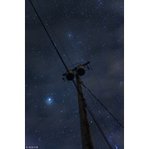 【Bonus】纯享特辑（晚安曲）](./albums/2103684296.md) | 国语 | 独立发行 | 2018年04月13日 | 播客 | 有声书 Audio Book |
| [ Vol 47. 【Siren Night】后摇翻唱流行乐](./albums/2103678150.md) | 国语 | 独立发行 | 2018年04月11日 | 播客 | 后摇 Post-Rock, 有声书 Audio Book |
| [ Vol 46.【Vintage Night】摇摆浮生录(Django Reinhardt)吉普赛吉他](./albums/2103675245.md) | 国语 | 独立发行 | 2018年04月09日 | 播客 | 爵士 Jazz |
| [ Vol 45.【Guest】抱歉,我们不是情歌不一(清)样(新)的男女对唱](./albums/2103672600.md) | 国语 | 独立发行 | 2018年04月07日 | 播客 | 摇滚 Rock & Roll |
| [ Vol 44.【Friday Night】送达天堂的音乐故事](./albums/2103667673.md) | 国语 | 独立发行 | 2018年04月06日 | 播客 | 摇滚 Rock & Roll, 有声书 Audio Book |
| [ Vol 43. 【Siren Night】浅聊蒙特利尔新音乐运动（下）](./albums/2103665702.md) | 国语 | 独立发行 | 2018年04月04日 | 播客 | 有声书 Audio Book, 后摇 Post-Rock |
| [ Vol 42. 【Vintage Night】Double Play（经典老歌的采样及原曲）](./albums/2103664217.md) | 国语 | 独立发行 | 2018年04月02日 | 播客 | 有声书 Audio Book |
| [ Vol 41.【Special】我记得Leslie. 你呢？](./albums/2103657942.md) | 国语 | 独立发行 | 2018年04月01日 | 播客 | 爵士 Jazz |
| [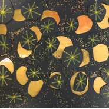 Vol 40.【Friday Night】缱绻入梦思你所念](./albums/2103655547.md) | 国语 | 独立发行 | 2018年03月30日 | 播客 | 爵士 Jazz, 布鲁斯 Blues |
| [ Vol 39. 【Siren Night】浅聊蒙特利尔新音乐运动（上）](./albums/2103650869.md) | 国语 | 独立发行 | 2018年03月28日 | 播客 | 有声书 Audio Book |
| [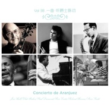 Vol 38.【Vintage Night】一曲~听爵士脉动宝藏级爵士演奏](./albums/2103644342.md) | 国语 | 独立发行 | 2018年03月26日 | 播客 | 爵士 Jazz |
| [ Vol 37. 【Friday Night】指弹间的东方美人](./albums/2103634389.md) | 国语 | 独立发行 | 2018年03月23日 | 播客 | 有声书 Audio Book |
| [ Vol 36.【Siren Night】后摇里的小号光谱](./albums/2103628257.md) | 国语 | 独立发行 | 2018年03月21日 | 播客 | 后摇 Post-Rock |
| [ Vol 35. 【Vintage Night】下雨的街道](./albums/2103622995.md) | 国语 | 独立发行 | 2018年03月19日 | 播客 | 有声书 Audio Book |
| [ Vol 34.【Friday Night】她的名字](./albums/2103613225.md) | 国语 | 独立发行 | 2018年03月16日 | 播客 | 摇滚 Rock & Roll |
| [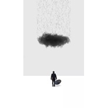 Vol 33.【Siren Night】藏在电影里的后摇私货（欧美篇）](./albums/2103608321.md) | 国语 | 独立发行 | 2018年03月14日 | 播客 | 有声书 Audio Book |
| [ Vol 32.【Vintage Night】老古董...和更老的古董](./albums/2103604084.md) | 国语 | 独立发行 | 2018年03月12日 | 播客 | 摇滚 Rock & Roll, 爵士 Jazz |
| [ Vol 31.【Guest】与你神游（Trip-Hop小指南）](./albums/2103599293.md) | 国语 | 独立发行 | 2018年03月10日 | 播客 | 有声书 Audio Book |
| [ Vol30.【Friday Night】听音乐爱哲学系列1-漫谈西方哲学简史](./albums/2103595123.md) | 国语 | 独立发行 | 2018年03月09日 | 播客 | 摇滚 Rock & Roll |
| [ Vol 29.【Siren Night】藏在电影里的后摇私货（亚洲篇）](./albums/2103592107.md) | 国语 | 独立发行 | 2018年03月07日 | 播客 | 有声书 Audio Book, 后摇 Post-Rock |
| [ Vol 28. 【Vintage Night】摩城音乐](./albums/2103588459.md) | 国语 | 独立发行 | 2018年03月05日 | 播客 | 有声书 Audio Book |
| [ Vol 27. 【Friday Night】银月辉耀（与月光相关的经典名作）](./albums/2103577316.md) | 国语 | 独立发行 | 2018年03月02日 | 播客 | 古典音乐 Classical, 歌剧 Opera, 奏鸣曲 Sonata |
| [ Vol 26. 【Siren Night】泰国的后摇之声](./albums/2103572208.md) | 国语 | 独立发行 | 2018年02月28日 | 播客 | 后摇 Post-Rock |
| [ Vol 25.【Vintage Night】烽火硝烟中的慰藉之声(2018-02-26)](./albums/2103561815.md) | 国语 | 独立发行 | 2018年02月26日 | 播客 | 爵士 Jazz |
| [ Vol 24.【Special Night】Deadline还没到，急什么！（拖延症患者之歌）](./albums/2103560818.md) | 国语 | 独立发行 | 2018年02月24日 | 播客 | 有声书 Audio Book |
| [ Vol 23.【Special】See U...on Mars!(火星,等我!)(2018-02-14)](./albums/2103527942.md) | 国语 | 独立发行 | 2018年02月14日 | 有声书 | 有声书 Audio Book |
| [ Vol 22.【Friday Night】讲一个西区故事百年伯恩斯坦系列1](./albums/2103524317.md) | 国语 | 独立发行 | 2018年02月09日 | 有声书 | 有声书 Audio Book |
| [ Vol 21.【Story Night】旧上海滩歌仙陈歌辛(2018-02-08)](./albums/2103522071.md) | 国语 | 独立发行 | 2018年02月08日 | 播客 | 有声书 Audio Book |
| [ Vol 20. 【Vintage Night】那些差点被扔进废纸篓的经典之作(2018-02-07)](./albums/2103520504.md) | 国语 | 独立发行 | 2018年02月07日 | 有声书 | 有声书 Audio Book |
| [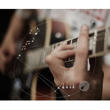 Vol 19.【Siren Night】木吉他——后摇里的塞壬之声(2018-02-06)](./albums/2103517814.md) | 国语 | 独立发行 | 2018年02月06日 | 有声书 | 有声书 Audio Book |
| [ Vol 18.【Whys Night】为什么音乐给我们安全感(2018-02-05)](./albums/2103515104.md) | 国语 | 独立发行 | 2018年02月05日 | 有声书 | 有声书 Audio Book |
| [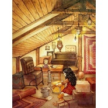 Vol 17.【Friday Night】Dancing in the kitchen 来大扫除吧❤(2018-02-02)](./albums/2103513258.md) | 国语 | 独立发行 | 2018年02月02日 | 有声书 | 有声书 Audio Book |
| [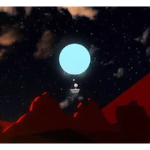 Vol 16.【Story Night】可否枕着未说出口的“我爱你”入眠（2018-02-01）](./albums/2103512735.md) | 国语 | 独立发行 | 2018年02月01日 | 有声书 | 有声书 Audio Book |
| [ Vol 15.【Vintage Night】人人都说我爱你❤](./albums/2103511717.md) | 国语 | 独立发行 | 2018年01月31日 | 播客 | 有声书 Audio Book |
| [ Vol 14. 【Siren Night】"It's cold.""I know."（2018-01-30）](./albums/2103509186.md) | 国语 | 独立发行 | 2018年01月30日 | 播客 | 有声书 Audio Book |
| [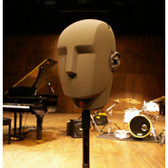 Vol 13.【Whys Night】为什么喇叭和耳机听起来不同？（ASMR/请用耳机收听）Binaural Recording&ASMR](./albums/2103511864.md) | 国语 | 独立发行 | 2018年01月28日 | 有声书 | 有声书 Audio Book |

## 评论

|  |  |  |  |
| :-- | :-- | :-- | :-- |
|  [虾米用户](https://emumo.xiami.com/u/9616118)  2021-01-26 09:58 赞(0) 踩(0) | 
网易云可以找到他们 所以大家转战平台还是可以订阅他们的 拿走不谢
 |
|  [虾米用户](https://emumo.xiami.com/u/312837296) 呼吸～ 2021-01-25 11:09 赞(0) 踩(0) | 
电台不错哦  
 |
|  [虾米用户](https://emumo.xiami.com/u/954507) 音符小不懂 2021-01-23 01:20 赞(0) 踩(0) | 
为什么我现在才发现你们 
 |
|  [虾米用户](https://emumo.xiami.com/u/7270055)  2021-01-20 19:59 赞(0) 踩(0) | 
虾米将不复存在，哪里还有speakeasy radio?
 |
| ⇒ |  [虾米用户](https://emumo.xiami.com/u/9616118)  2021-01-26 09:57 赞(0) 踩(0) | 
网易云可以找到他们
 |
|  [虾米用户](https://emumo.xiami.com/u/82191690) 来自银河系外的奇葩is ... 2021-01-16 18:32 赞(0) 踩(0) | 
怎么可以找回你？
 |
| ⇒ |  [虾米用户](https://emumo.xiami.com/u/9616118)  2021-01-26 12:21 赞(0) 踩(0) | 
网易云可以找到他们
 |
|  [虾米用户](https://emumo.xiami.com/u/85622736) 我还没想好要写什么... 2021-01-15 00:09 赞(2) 踩(0) | 
能不能考虑把节目上传到一些播客app上呢，像小宇宙,苹果的podcasts这些
 |
|  [虾米用户](https://emumo.xiami.com/u/12116039)  2021-01-13 12:58 赞(0) 踩(0) | 
我认真找了，&amp;ldquo;赞赏&amp;rdquo;功能真的是没有找到 
 |
|  [虾米用户](https://emumo.xiami.com/u/12116039)  2021-01-12 12:41 赞(0) 踩(0) | 
怎么找不到你说的&amp;ldquo;赞赏&amp;rdquo;功能了呀？
 |
|  [虾米用户](https://emumo.xiami.com/u/10690832) sunny 2021-01-10 23:42 赞(0) 踩(0) | 
换平台了？
 |
|  [虾米用户](https://emumo.xiami.com/u/47448978) 今晚月色真美 2021-01-09 18:15 赞(0) 踩(0) | 
请问你们要转移到哪个平台了，怎么关注你们啊，我的老朋友？
 |
|  [虾米用户](https://emumo.xiami.com/u/9527965) ——我要笑遍世界. 2021-01-09 12:45 赞(1) 踩(0) | 
你将会去到哪里呢？
 |
|  [虾米用户](https://emumo.xiami.com/u/45478704) 雨后初晴 2021-01-09 11:35 赞(0) 踩(0) | 
极高品质
 |
|  [虾米用户](https://emumo.xiami.com/u/105613414)  2021-01-07 21:53 赞(2) 踩(0) | 
昨天无意中发现这个电台，如获至宝昨天虾米也公布要关闭了，心情失落这些好东西去哪里找？
 |
|  [虾米用户](https://emumo.xiami.com/u/8346602)  2021-01-07 08:45 赞(0) 踩(0) | 
鲸落
 |
|  [虾米用户](https://emumo.xiami.com/u/88873116)  2021-01-06 20:29 赞(2) 踩(0) | 
再见啊口米，再见虾米
 |
|  [虾米用户](https://emumo.xiami.com/u/9801297)  2021-01-06 18:21 赞(0) 踩(0) | 
虾米要没了。怎么找到你
 |
|  [虾米用户](https://emumo.xiami.com/u/87169304) 这个人有点奇怪，什么都没... 2021-01-06 13:34 赞(2) 踩(0) | 
在虾米和网易云都关注了，还关注了微博，虽然但是，还是一直用听
 |
| ⇒ |  [虾米用户](https://emumo.xiami.com/u/47448978) 今晚月色真美 2021-01-09 18:15 赞(0) 踩(0) | 
请问网易云的电台名字是叫什么呀
 |
|  [虾米用户](https://emumo.xiami.com/u/268493143) 我还没想好要写什么... 2021-01-06 12:28 赞(1) 踩(0) | 
感谢陪伴
 |
|  [虾米用户](https://emumo.xiami.com/u/405190126)  2021-01-06 08:38 赞(0) 踩(0) | 
舍不得你们，失去了才知道珍惜
 |
|  [虾米用户](https://emumo.xiami.com/u/184494595)  2021-01-06 08:35 赞(0) 踩(0) | 
不想断连啊，好难过呀。一想到听不到细声电台
 |
|  [虾米用户](https://emumo.xiami.com/u/6227786)  2021-01-05 21:55 赞(0) 踩(0) | 
在哪里找你们呀？
 |
|  [虾米用户](https://emumo.xiami.com/u/19833186) 我还没想好要写什么... 2021-01-05 19:08 赞(0) 踩(0) | 
请务必  给个联系方式。
 |
|  [虾米用户](https://emumo.xiami.com/u/48252943)   2021-01-05 17:10 赞(1) 踩(0) | 
舍不得两位。
 |
|  [虾米用户](https://emumo.xiami.com/u/332342237) 我还没想好要写什么... 2021-01-05 13:36 赞(2) 踩(0) | 
虾米马上没了 你们会去哪里？？？？
 |
|  [虾米用户](https://emumo.xiami.com/u/349756805)  2021-01-05 12:40 赞(4) 踩(0) | 
虾米要关了，这是我最不舍得的一个良心电台，请留下联系方式吧，以后大家还要再相见   
 |
|  [虾米用户](https://emumo.xiami.com/u/14227080)  2021-01-05 12:31 赞(1) 踩(0) | 
你们会去音螺吗？
 |
|  [虾米用户](https://emumo.xiami.com/u/14227080)  2021-01-05 12:14 赞(1) 踩(0) | 
阿口米和橙子，以后还可以去哪找你们？刚刚得知虾米要停了 
 |
|  [虾米用户](https://emumo.xiami.com/u/12053363) Let's keep g... 2021-01-05 11:07 赞(1) 踩(0) | 
虾米要关了，去哪里还能找到你们呢？
 |
|  [虾米用户](https://emumo.xiami.com/u/350555374)  2020-12-29 20:34 赞(1) 踩(0) | 
发现两首很好听的曲子，Brian Crain的《Balletof the Little Cafe》《Canon In D》与David Hicken的《Alberich》，超级喜欢那个调调
 |
|  [虾米用户](https://emumo.xiami.com/u/12053363) Let's keep g... 2020-12-29 14:50 赞(2) 踩(0) | 
我的年度艺人no.12021愿你们越来越好
 |
|  [虾米用户](https://emumo.xiami.com/u/35819103)  2020-12-21 20:17 赞(0) 踩(0) | 
新年音乐会会更新吧
 |
|  [虾米用户](https://emumo.xiami.com/u/445639933)  2020-12-21 20:17 赞(0) 踩(0) | 
都下载了
 |
|  [虾米用户](https://emumo.xiami.com/u/9111923) 不稳定的人 2020-12-15 23:39 赞(2) 踩(0) | 
请问虾米没了的话，要去哪里听主播的节目呀？ 
 |
|  [虾米用户](https://emumo.xiami.com/u/340759725)  2020-12-15 22:22 赞(0) 踩(0) | 
很久没有见到你分享新的音乐了！
 |
|  [虾米用户](https://emumo.xiami.com/u/201035119) 有匪君子，如切如磋，如琢... 2020-12-12 00:00 赞(0) 踩(0) | 
快来吧，快来吧，简短更一小期也好呢
 |
|  [虾米用户](https://emumo.xiami.com/u/70271654)  2020-12-11 15:44 赞(0) 踩(0) | 
每天晚上看书的时候听  
 |
|  [虾米用户](https://emumo.xiami.com/u/127864432) 任何心情，都有歌听 2020-12-09 23:16 赞(0) 踩(0) | 
真的好棒，今年四五月份第一次听了存在主义咖啡馆，然后开始正序听，真的是非常喜欢，不过虾米音乐快要下线了，之后要去哪儿追随你们？
 |
|  [虾米用户](https://emumo.xiami.com/u/402001484) 前尘终为尘 2020-12-06 23:51 赞(0) 踩(0) | 
慌了，到底是不是谣言(눈_눈)期待更新(๑˙ー˙๑)
 |
|  [虾米用户](https://emumo.xiami.com/u/81473258) 高老庄的世界，真实的自己 2020-12-05 05:59 赞(0) 踩(0) | 
不催促主播更新，任其自然。节目真的很治愈，又能了解到关于音乐和音乐家们有趣的故事。 
 |
|  [虾米用户](https://emumo.xiami.com/u/563180) 彩虹山下尽彩虹，寒心寺里... 2020-12-04 22:20 赞(2) 踩(0) | 
Akmi听说虾米要关 我吓的睡不好 精神食粮没有了怎么办
 |
|  [虾米用户](https://emumo.xiami.com/u/47494497) 李志、陈升，“虾米也没有... 2020-12-02 00:04 赞(28) 踩(0) | 
我们将去向何方呀，我们要怎么建立新的联系
 |
|  [虾米用户](https://emumo.xiami.com/u/403877155)  2020-12-01 23:48 赞(0) 踩(0) | 
非常喜欢，感觉找到了那个空间。
 |
|  [虾米用户](https://emumo.xiami.com/u/3763560)  2020-12-01 09:27 赞(1) 踩(0) | 
阿口米，电台会搬去哪里啊啊啊啊啊
 |
|  [虾米用户](https://emumo.xiami.com/u/5814637) 好好生活 2020-11-30 23:44 赞(0) 踩(0) | 
好像很久没有更新了，什么时候出下期啊，马上圣诞季了 
 |
|  [虾米用户](https://emumo.xiami.com/u/257794746) 我还没想好要写什么... 2020-11-30 10:42 赞(0) 踩(0) | 
怎么办？细声电台以后还会一直在么～？   
 |
|  [虾米用户](https://emumo.xiami.com/u/294006788)  2020-11-24 12:05 赞(0) 踩(0) | 
有没有纯音乐没有旁白的版本呀，亲
 |
|  [虾米用户](https://emumo.xiami.com/u/147870548) 拉小提听古典爱生活的机械... 2020-11-10 12:42 赞(1) 踩(0) | 
好久没更新啦！阿口米
 |
|  [虾米用户](https://emumo.xiami.com/u/201035119) 有匪君子，如切如磋，如琢... 2020-11-08 13:01 赞(1) 踩(0) | 
高冷的阿口米，快更新呀~
 |
|  [虾米用户](https://emumo.xiami.com/u/358070890) 我常常坐着时间飞船去旅行 2020-11-07 18:41 赞(1) 踩(0) | 
：你要一直在这里啊
 |
|  [虾米用户](https://emumo.xiami.com/u/203375831)  2020-11-03 10:40 赞(0) 踩(0) | 
可以介绍一下new age嘛？冬天的时候好喜欢听神圣而庄严的音乐，温暖有力量。好期待今年继续和阿口米一起听维也纳新年音乐会，爱你喔 
 |
|  [虾米用户](https://emumo.xiami.com/u/7278009)  2020-10-31 09:57 赞(0) 踩(0) | 
静等更新~~~
 |
|  [虾米用户](https://emumo.xiami.com/u/42895677)  2020-10-28 00:04 赞(1) 踩(0) | 
这个不飘准的口音怎么有点可爱
 |
|  [虾米用户](https://emumo.xiami.com/u/201035119) 有匪君子，如切如磋，如琢... 2020-10-20 13:26 赞(0) 踩(0) | 
爱你
 |
|  [虾米用户](https://emumo.xiami.com/u/400831010)  2020-10-18 16:43 赞(0) 踩(0) | 
主播为什么一口外语腔？虽然还挺好听
 |
| ⇒ |  [虾米用户](https://emumo.xiami.com/u/345710021) 细声电台,细说音乐故事. 2020-10-19 12:00 赞(0) 踩(0) | 
其实，只是纯粹的普通话说得不飘～准... 
 |
|  [虾米用户](https://emumo.xiami.com/u/248267745) 你走出千万人群独行…… 2020-10-17 03:18 赞(0) 踩(0) | 
亲爱的阿口米、橙子，您们好，能做一期关于安溥（张悬）的节目吗？安溥的音乐真的很有意境哲思，是那种初闻不知曲中意，再听已是曲中人的感受，令人深思，人生路上，步履不停，悲欢离合岁月荣枯犹如天边莫测的闪电，无势无常的云，而在安溥的曲子《如何》里仿佛都能看到关于自己关于缘分关于世界的答案。与过去和解，于当下相拥，每个行走的人，每个当下或开心或失落，停下脚步思考打量的自己，缘分的交织命运的使然让一切变为可能。一切的一切都不再冰冷。
 |
|  [虾米用户](https://emumo.xiami.com/u/271225490)  2020-10-13 22:24 赞(0) 踩(0) | 
不喜欢开推送，也不喜欢用app听歌，但每晚来盯更新，许愿明晚！
 |
|  [虾米用户](https://emumo.xiami.com/u/208802857) 没有个性 2020-09-28 17:33 赞(0) 踩(0) | 
非常喜欢！发现宝藏了呜呜
 |
|  [虾米用户](https://emumo.xiami.com/u/297353662)  2020-09-28 11:06 赞(0) 踩(0) | 
无意中发现这个电台，太棒了！
 |
|  [虾米用户](https://emumo.xiami.com/u/7548598)  2020-09-10 23:16 赞(0) 踩(0) | 
如何打赏
 |
|  [虾米用户](https://emumo.xiami.com/u/180523386) 赫然在此 2020-09-10 08:17 赞(0) 踩(0) | 
会不会做教师节的主题，音乐中的师徒情谊。
 |
|  [虾米用户](https://emumo.xiami.com/u/444167682)  2020-08-21 15:42 赞(2) 踩(0) | 
真的超爱这个电台诶 一直都很用心呢
 |
|  [虾米用户](https://emumo.xiami.com/u/73740960)  2020-07-25 00:06 赞(1) 踩(0) | 

 |
|  [虾米用户](https://emumo.xiami.com/u/47186606) 我还没想好要写什么... 2020-07-07 12:48 赞(2) 踩(0) | 
很喜欢speakeasy radio 丰富了生活的色彩 感谢speakeasy radio 希忘经久不衰  
 |
|  [虾米用户](https://emumo.xiami.com/u/345710021) 细声电台,细说音乐故事. 2020-07-06 21:50 赞(49) 踩(0) | 
（路过点赞置顶～ps打赏在歌单界面哦）全部-倒序（老朋友）：<a href="https://www.xiami.com/collect/365249856" target="_blank" rel="nofollow noreferrer noopener">https://www.xiami.com/collect/365249856</a>全部-正序（新朋友）：<a href="https://www.xiami.com/collect/1212597034" target="_blank" rel="nofollow noreferrer noopener">https://www.xiami.com/collect/1212597034</a>古典：<a href="https://www.xiami.com/collect/414855424" target="_blank" rel="nofollow noreferrer noopener">https://www.xiami.com/collect/414855424</a>后摇：<a href="https://www.xiami.com/collect/414936165" target="_blank" rel="nofollow noreferrer noopener">https://www.xiami.com/collect/414936165</a>爵士：<a href="https://www.xiami.com/collect/414906993" target="_blank" rel="nofollow noreferrer noopener">https://www.xiami.com/collect/414906993</a>哲学：<a href="https://www.xiami.com/collect/414422544" target="_blank" rel="nofollow noreferrer noopener">https://www.xiami.com/collect/414422544</a>
 |
| ⇒ |  [虾米用户](https://emumo.xiami.com/u/201035119) 有匪君子，如切如磋，如琢... 2020-10-20 13:27 赞(0) 踩(0) | 
爱你~如何加入你们呀，嘿嘿嘿
 |
| ⇒ |  [虾米用户](https://emumo.xiami.com/u/376327190) 灵魂出窍 真实亦在 净土... 2021-01-08 12:10 赞(0) 踩(0) | 
你好这部分整理的以后可以在哪里能欣赏
 |
|  [虾米用户](https://emumo.xiami.com/u/10904821) 小郭侦探社美男助理 2020-06-28 00:27 赞(0) 踩(0) | 
昨天给你打了一块钱，这个夏天应该能喝上威士忌了
 |
|  [虾米用户](https://emumo.xiami.com/u/1357396) 我还没想好要写什么... 2020-06-20 16:56 赞(0) 踩(0) | 
小时候去的第一个地下演出室的名字，就叫Speakeasy
 |
|  [虾米用户](https://emumo.xiami.com/u/309124823)  2020-05-28 21:16 赞(0) 踩(0) | 
太喜欢你了！
 |
|  [虾米用户](https://emumo.xiami.com/u/3088250) 我还没想好要写什么... 2020-05-28 16:45 赞(0) 踩(0) | 
很用心地在分享音乐，赞赏啦 
 |
|  [虾米用户](https://emumo.xiami.com/u/353712664) 写不出煽情的文字，只有真... 2020-05-28 12:26 赞(2) 踩(0) | 
在虾米这么久，挖到了爵士大宝藏，总有人为了热爱，默默做出了超棒的歌单，点赞
 |
|  [虾米用户](https://emumo.xiami.com/u/40464500)  2020-05-28 12:02 赞(0) 踩(0) | 
太棒了吧！我挖到的到底是什么宝藏！我要推荐给雅君！让更多爱爵士的人们看到你~
 |
|  [虾米用户](https://emumo.xiami.com/u/40335054)  2020-05-11 22:09 赞(1) 踩(0) | 
求指教打赏界面在哪？找不到啊
 |
| ⇒ |  [虾米用户](https://emumo.xiami.com/u/242747277) 世俗 识趣 祝你也祝我 2020-06-17 09:12 赞(0) 踩(0) | 
刚刚有看到 现在想找突然找不到了
 |
|  [虾米用户](https://emumo.xiami.com/u/8741301) still walkin... 2020-05-09 11:29 赞(0) 踩(0) | 
天吶原來蝦米有電台的！偶然聽到好驚喜，這個太閤我口味了！我要仔細研究一下！
 |
|  [虾米用户](https://emumo.xiami.com/u/73740960)  2020-05-02 00:55 赞(0) 踩(0) | 

 |
|  [虾米用户](https://emumo.xiami.com/u/18001001) 音乐超脱于灵魂之外，让心... 2020-04-28 08:37 赞(2) 踩(0) | 
宝藏+1
 |
|  [虾米用户](https://emumo.xiami.com/u/9632894) 没什么大不了，我有我奥妙 2020-04-26 21:09 赞(0) 踩(0) | 
爱你哦 加油
 |
|  [虾米用户](https://emumo.xiami.com/u/299226398)  2020-04-06 21:44 赞(1) 踩(0) | 
宝藏电台
 |
|  [虾米用户](https://emumo.xiami.com/u/309124823)  2020-04-02 21:56 赞(0) 踩(0) | 
太爱你了，知音，温暖，希望
 |
|  [虾米用户](https://emumo.xiami.com/u/245988667) 你若安好，便是晴天 2020-03-27 20:36 赞(1) 踩(0) | 
再不更新，砸玻璃啦  
 |
| ⇒ |  [虾米用户](https://emumo.xiami.com/u/345710021) 细声电台,细说音乐故事. 2020-03-29 22:45 赞(0) 踩(0) | 
唔...悄悄更新一期然后抱头就跑  
 |
| ⇒ |  [虾米用户](https://emumo.xiami.com/u/245988667) 你若安好，便是晴天 2020-03-30 17:44 赞(0) 踩(0) | 
<q><b>Speakeasy Radio说：</b></q>
 |
| ⇒ |  [虾米用户](https://emumo.xiami.com/u/9288637) 谢谢你 虾米！ 2021-01-08 20:51 赞(0) 踩(0) | 
<q><b>Speakeasy Radio说：</b></q>
 |
|  [虾米用户](https://emumo.xiami.com/u/1493253) 我还没想好要写什么... 2020-03-22 15:53 赞(1) 踩(0) | 
阿口米？最近还好吗？
 |
|  [虾米用户](https://emumo.xiami.com/u/180523386) 赫然在此 2020-03-14 16:16 赞(0) 踩(0) | 
好久都没有更新了呢
 |
|  [虾米用户](https://emumo.xiami.com/u/47238811) 想不好要写什么... 2020-03-06 12:08 赞(0) 踩(0) | 
好久不见……安好？祝……健康、顺利！ 
 |
|  [虾米用户](https://emumo.xiami.com/u/17206388) 虾米我也爱你 2020-03-05 14:59 赞(2) 踩(0) | 
电台大大 你们的酒吧开在哪里 酒虫上脑了我要一份最浓的长岛冰茶最酷的爵士后摇and最好的解说     
 |
|  [虾米用户](https://emumo.xiami.com/u/400715332) 留白 2020-03-01 22:27 赞(0) 踩(0) | 
——
 |
|  [虾米用户](https://emumo.xiami.com/u/355242394)  2020-02-23 23:32 赞(1) 踩(0) | 
从Vol 64开始，发现了这个宝藏电台。现在我只听这个电台。
 |
|  [虾米用户](https://emumo.xiami.com/u/278292760)  2020-02-20 15:23 赞(0) 踩(0) | 
几块钱聊表心意，❤️你们！
 |
|  [虾米用户](https://emumo.xiami.com/u/355579704)  2020-02-13 18:37 赞(1) 踩(0) | 
加油！感谢为我枯燥每一天的灵魂注入怡情的源泉！谢谢！
 |
|  [虾米用户](https://emumo.xiami.com/u/376336657) 我还没想好要写什么... 2020-02-08 12:31 赞(0) 踩(0) | 
上元灯节有专辑没 
 |
|  [虾米用户](https://emumo.xiami.com/u/403253571) 人在做天在看 2020-02-03 07:54 赞(0) 踩(0) | 
你的2020是冰山无情和一个唱吧的朋友唱的，冰山无情唱了200多首，你有几首
 |
|  [虾米用户](https://emumo.xiami.com/u/47494497) 李志、陈升，“虾米也没有... 2020-02-02 15:08 赞(0) 踩(0) | 
宝藏电台交响和后摇  [文字up]
 |
|  [虾米用户](https://emumo.xiami.com/u/14626273) 暂无签名~ 2020-01-28 14:38 赞(0) 踩(0) | 
我也喜欢后摇耶，你们要是缺主持人，我还蛮想做一期。嘻嘻。
 |
|  [虾米用户](https://emumo.xiami.com/u/14626273) 暂无签名~ 2020-01-28 14:37 赞(1) 踩(0) | 
小帅哥！你的声音好听，选的歌单也很棒，至少是很对我胃口的。但是口条含糊不清。下次录制的时候希望能&amp;hellip;&amp;hellip;好啦，就是一点小建议，会继续听，支持你哦！
 |
|  [虾米用户](https://emumo.xiami.com/u/305479261) oh nonono  2020-01-25 00:23 赞(0) 踩(0) | 
新年快乐 祝福橙子和阿口米 
 |
|  [虾米用户](https://emumo.xiami.com/u/432311941)  2020-01-12 19:50 赞(1) 踩(0) | 
无意中搜新年音乐会听到这个电台，从129期倒着听到了119期。非常喜欢阿口米的声音。我要一直听到第一期去 
 |
| ⇒ |  [虾米用户](https://emumo.xiami.com/u/210060001) 我本善良 2020-01-13 12:57 赞(0) 踩(0) | 
怎么能按顺序听嘞？我点到节目单里，排序都是随机的 
 |
| ⇒ |  [虾米用户](https://emumo.xiami.com/u/345710021) 细声电台,细说音乐故事. 2020-01-13 13:55 赞(0) 踩(0) | 
<q><b>Shellsmall说：</b></q>
 |
|  [虾米用户](https://emumo.xiami.com/u/59650970) 保持你现在 2019-12-30 22:32 赞(0) 踩(0) | 
马上要2020了！不知道12.31或者1.1会不会有更新嘞！今年也要一起听新年音乐会嘛！！
 |
| ⇒ |  [虾米用户](https://emumo.xiami.com/u/345710021) 细声电台,细说音乐故事. 2019-12-31 23:12 赞(0) 踩(0) | 
呀！ 小姑娘（？） 恭喜你达成了2019年“心想事成”啦！
 |
| ⇒ |  [虾米用户](https://emumo.xiami.com/u/59650970) 保持你现在 2020-01-01 00:17 赞(0) 踩(0) | 
<q><b>Speakeasy Radio说：</b></q>
 |
|  [虾米用户](https://emumo.xiami.com/u/305479261) oh nonono  2019-12-24 19:07 赞(0) 踩(0) | 
 Merry christmas 阿口米 橙子
 |
| ⇒ |  [虾米用户](https://emumo.xiami.com/u/345710021) 细声电台,细说音乐故事. 2019-12-25 18:02 赞(0) 踩(0) | 
你也要开开心心呀 
 |
|  [虾米用户](https://emumo.xiami.com/u/402001484) 前尘终为尘 2019-12-23 23:39 赞(0) 踩(0) | 
(ง •̀_•́)ง
 |
|  [虾米用户](https://emumo.xiami.com/u/9451094)   2019-12-16 11:53 赞(0) 踩(0) | 
非常惊奇地偶然发现了细声电台，在欣赏了音乐的同时也被普及了音乐知识，对音乐家的音乐和生平、经历有了相对系统的了解，这是何等的享受呀！也很好奇地在虾米里搜索，试图找到更多类似的电台却收获了了，因此，细声电台的粉们真的要珍惜和呵护它。也希望电台能与粉丝加强互动，共同把电台做得更好，做成虾米的一个标志性的知名品牌。加油，细声！一直在你身后支持你！
 |
|  [虾米用户](https://emumo.xiami.com/u/89108374) 空洞无物的内心世界 2019-12-14 12:40 赞(0) 踩(0) | 
我爱阿口米
 |
|  [虾米用户](https://emumo.xiami.com/u/1125942) 给您拜早年了。₍₍ (ง... 2019-12-08 23:01 赞(0) 踩(0) | 
我还能说什么，爱就完了
 |
| ⇒ |  [虾米用户](https://emumo.xiami.com/u/345710021) 细声电台,细说音乐故事. 2019-12-12 16:33 赞(0) 踩(0) | 
嚯嚯嚯！你就是这个透明电台等了一个月终于等到了的第300条首页留言 
 |
| ⇒ |  [虾米用户](https://emumo.xiami.com/u/1125942) 给您拜早年了。₍₍ (ง... 2019-12-12 18:39 赞(0) 踩(0) | 
<q><b>Speakeasy Radio说：</b></q>
 |
|  [虾米用户](https://emumo.xiami.com/u/7408463) 暂无签名~ 2019-11-24 17:03 赞(1) 踩(0) | 
听了虾米这么多年，一直在寻找像Speakeasy Radio这种风格的电台。喜欢，这些天连续听了好些天。感谢主持人！
 |
|  [虾米用户](https://emumo.xiami.com/u/6227786)  2019-11-23 00:08 赞(0) 踩(0) | 
喜欢喜欢 被1900圈粉 会持续关注你 加油哦
 |
|  [虾米用户](https://emumo.xiami.com/u/345710021) 细声电台,细说音乐故事. 2019-11-21 21:01 赞(123) 踩(0) | 
（请大家走过路过，为这条评论点个赞，置顶~）其实我们每一期节目都有完整的歌单，可以收听曲目。一般附在那一期节目的评论区。 这里说3个方法。方法1：在每一曲评论区耐心爬楼，一定会找到传送门的。方法2：进专区-点击进入后，找到往期歌单。（注意点击 ”最新“标签（而不是“推荐”），就会出来所有歌单；） <a href="https://xiami.com/zone/subpage/id/5076?spm=0.0.0.0.bjC8fH" target="_blank" rel="nofollow noreferrer noopener">https://xiami.com/zone/subpage/id/5076?spm=0.0.0.0.bjC8fH</a>方法3：点头像-进个人主页-音乐：<a href="https://xiami.com/space/collect/u/345710021?spm=a1z1s.6928797.1561" target="_blank" rel="nofollow noreferrer noopener">https://xiami.com/space/collect/u/345710021?spm=a1z1s.6928797.1561</a>
 |
| ⇒ |  [虾米用户](https://emumo.xiami.com/u/260802776)  2020-04-21 03:56 赞(0) 踩(0) | 
又来听了一遍，感谢阿口米带了有点不同的巴赫。给我感觉是要爱上她了，在她身边一起听巴赫的家伙真有福气啊！
 |
|  [虾米用户](https://emumo.xiami.com/u/2626647) 爱音乐，爱生活！ 2019-11-21 16:29 赞(0) 踩(0) | 
才发现虾米还有这样的电台，好的节目必须支持！
 |
|  [虾米用户](https://emumo.xiami.com/u/10790156) 人在胖，天在看 2019-11-21 13:52 赞(0) 踩(0) | 
怎么打赏啊
 |
|  [虾米用户](https://emumo.xiami.com/u/203375831)  2019-11-20 10:16 赞(0) 踩(0) | 
可以讲讲海顿的音乐嘛
 |
|  [虾米用户](https://emumo.xiami.com/u/377436318) 我不好想要写什么... 2019-11-11 17:37 赞(1) 踩(0) | 
曾听电台的siren night讲过中国风后摇，回味无穷，至今多次翻听，不觉困倦。那么既然有中国风后摇，是否有中国风爵士呢？直到近日接触了秦四风，孔宏伟等人的爵士乐，才惊觉:是了，中国古典乐器遇上爵士乐，确是别有一番风味。那么不知能否期待电台未来能有一期siren night，介绍中国风与爵士乐之遇呢？若是有，那可真是不胜惊喜!
 |
|  [虾米用户](https://emumo.xiami.com/u/426623318)  2019-11-07 18:36 赞(0) 踩(0) | 
这才叫电台，这些才是音乐。
 |
|  [虾米用户](https://emumo.xiami.com/u/431766494) Grow up 2019-11-07 07:05 赞(0) 踩(0) | 
我也在海外 读管理的研究生 喜欢你的声音 感谢你分享的故事 在这一个赶作业的雨天 心却无比平和 期待更好的故事和更好的人 谢谢你
 |
|  [虾米用户](https://emumo.xiami.com/u/10448663) 匆匆能几见   忽忽两相... 2019-10-25 22:11 赞(0) 踩(0) | 
请问多久更新一次
 |
|  [虾米用户](https://emumo.xiami.com/u/242741094)  2019-10-20 10:05 赞(0) 踩(0) | 
这里真是宝藏，打赏啦
 |
|  [虾米用户](https://emumo.xiami.com/u/426759668)  2019-10-18 16:11 赞(0) 踩(0) | 
Vol 112.【Vintage Night】舒伯特的云卷云舒就是听到这，然后找您了！
 |
|  [虾米用户](https://emumo.xiami.com/u/41869457)  2019-10-17 17:10 赞(0) 踩(0) | 
Hello,speakeasy radio, 女主播的声音很舒服啊。能不能做一期梁祝小提琴协奏曲呢？ 讲讲作曲故事，乐器等等，谢谢
 |
|  [虾米用户](https://emumo.xiami.com/u/163900) 我在网易云音乐 2019-10-17 07:01 赞(0) 踩(0) | 
这里真好
 |
|  [虾米用户](https://emumo.xiami.com/u/101847144) 不是零零后 2019-10-17 00:16 赞(1) 踩(0) | 
不小心地，关注到这个电台节目，就像发现了宝贝一样。
 |
|  [虾米用户](https://emumo.xiami.com/u/92150462)  2019-10-15 15:37 赞(0) 踩(0) | 
偶然听到这个电台，真心是好。
 |
|  [虾米用户](https://emumo.xiami.com/u/323982579) 若文明消失,惟有音乐值得... 2019-10-13 09:16 赞(0) 踩(0) | 
心灵好台，人间慰藉。
 |
|  [虾米用户](https://emumo.xiami.com/u/405884245) 我还没想好要写什么... 2019-10-11 19:10 赞(1) 踩(0) | 
喜欢这个电台的感觉。感觉在上音乐课。教我去欣赏音乐。最最主要的是，挑的音乐都对我口味。好好听！适合上自习学不进去的时候听着静心的
 |
|  [虾米用户](https://emumo.xiami.com/u/345710021) 细声电台,细说音乐故事. 2019-10-08 07:34 赞(4) 踩(0) | 
总算可以评论了，是不是也差不多该更新电台了？ 
 |
| ⇒ |  [虾米用户](https://emumo.xiami.com/u/305479261) oh nonono  2019-10-08 20:21 赞(0) 踩(0) | 
催更催更！[带墨镜笑]
 |
|  [虾米用户](https://emumo.xiami.com/u/11361609)   2019-09-22 16:33 赞(0) 踩(0) | 
喜欢干净空灵的声音 
 |
|  [虾米用户](https://emumo.xiami.com/u/426842751)  2019-09-22 13:07 赞(2) 踩(0) | 
******
 |
|  [虾米用户](https://emumo.xiami.com/u/228843687) 懒惰统治人间 2019-09-15 10:27 赞(0) 踩(0) | 

 |
|  [虾米用户](https://emumo.xiami.com/u/324879742)   2019-09-11 00:34 赞(0) 踩(0) | 
，
 |
|  [虾米用户](https://emumo.xiami.com/u/36723228) 暂无签名~ 2019-09-10 10:24 赞(0) 踩(0) | 
召唤阿口米，嘻嘻我也是来催更的～ 
 |
| ⇒ |  [虾米用户](https://emumo.xiami.com/u/345710021) 细声电台,细说音乐故事. 2019-09-11 00:05 赞(0) 踩(0) | 
好的，听你的！ 
 |
| ⇒ |  [虾米用户](https://emumo.xiami.com/u/36723228) 暂无签名~ 2019-12-27 19:16 赞(0) 踩(0) | 
<q><b>Speakeasy Radio说：</b></q>
 |
| ⇒ |  [虾米用户](https://emumo.xiami.com/u/345710021) 细声电台,细说音乐故事. 2019-12-27 20:15 赞(0) 踩(0) | 
<q><b>等等说：</b></q>
 |
| ⇒ |  [虾米用户](https://emumo.xiami.com/u/36723228) 暂无签名~ 2019-12-27 20:47 赞(0) 踩(0) | 
<q><b>Speakeasy Radio说：</b></q>
 |
|  [虾米用户](https://emumo.xiami.com/u/34979680) 生活在别处 2019-08-28 17:39 赞(0) 踩(0) | 
我是来催更的[带墨镜笑]
 |
|  [虾米用户](https://emumo.xiami.com/u/317095726)  2019-08-16 11:28 赞(0) 踩(0) | 
竟然还有这样的电台，古典音乐爱好者的福音 
 |
|  [虾米用户](https://emumo.xiami.com/u/402001484) 前尘终为尘 2019-08-16 01:19 赞(0) 踩(0) | 
ヾ(Ő∀Ő๑)ﾉ
 |
|  [虾米用户](https://emumo.xiami.com/u/404987322)  2019-07-26 21:47 赞(1) 踩(0) | 
喜欢音乐但又不懂，这样听音乐就像回到学生时代，喜欢！
 |
|  [虾米用户](https://emumo.xiami.com/u/345710021) 细声电台,细说音乐故事. 2019-07-20 17:15 赞(40) 踩(0) | 
2019年7月20日， 量5000的纪念日，嘿嘿 
 |
| ⇒ |  [虾米用户](https://emumo.xiami.com/u/316261284) 到最后…… 2019-07-23 19:30 赞(0) 踩(0) | 
捉住主播。
 |
| ⇒ |  [虾米用户](https://emumo.xiami.com/u/316261284) 到最后…… 2019-07-23 19:31 赞(0) 踩(0) | 
我建了一个歌单，收了你们好多节目。太优秀了！
 |
| ⇒ |  [虾米用户](https://emumo.xiami.com/u/345710021) 细声电台,细说音乐故事. 2019-08-15 08:40 赞(0) 踩(0) | 
<q><b>星屿说：</b></q>
 |
| ⇒ |  [虾米用户](https://emumo.xiami.com/u/11672820)  2019-11-21 15:24 赞(0) 踩(0) | 
祝贺，伴着塔兰泰拉舞曲。
 |
|  [虾米用户](https://emumo.xiami.com/u/7313236)  2019-07-15 17:58 赞(2) 踩(0) | 
太幸福了，有这么多期可以听，感觉自己的灵魂被喂的饱饱的，我会把这么美的电台推荐给和我喜欢相同的朋友，因为我朋友不多，所以请不要着急好吗，至少我一直都在。
 |
|  [虾米用户](https://emumo.xiami.com/u/1502522)  2019-07-14 08:12 赞(1) 踩(0) | 
虽然不是每天听后摇，但一一听到这种音乐内心就有无数的波涛起伏，最后又全归于平静，很难自拔啊
 |
|  [虾米用户](https://emumo.xiami.com/u/7313236)  2019-07-12 17:34 赞(1) 踩(0) | 
活了这么多多年的第一次打赏给咱们电台了，不为别的，爱!虽然我口袋空空，但是细声电台，阿口米和橙子的温暖声音和充实的解读，让我的灵魂丰满到富可敌国，谢谢你们，伴我同行!
 |
|  [虾米用户](https://emumo.xiami.com/u/406596624) 露の世は、露の世ながら、... 2019-07-11 21:53 赞(3) 踩(0) | 
啊，我一定会在博士论文后记里感谢这个电台的！（你倒是先写出论文啊啊啊啊啊
 |
| ⇒ |  [虾米用户](https://emumo.xiami.com/u/345710021) 细声电台,细说音乐故事. 2019-07-11 22:37 赞(0) 踩(0) | 
哇嗷嗷嗷嗷那我们要用第260条留言来对你的鸣谢表示鸣谢！（？所以请你快点写出论文 ）
 |
| ⇒ |  [虾米用户](https://emumo.xiami.com/u/406596624) 露の世は、露の世ながら、... 2020-09-22 02:18 赞(0) 踩(0) | 
<q><b>Speakeasy Radio说：</b></q>
 |
|  [虾米用户](https://emumo.xiami.com/u/355481421)  2019-07-09 22:39 赞(1) 踩(0) | 
咱都是水瓶  
 |
|  [虾米用户](https://emumo.xiami.com/u/7313236)  2019-07-09 09:00 赞(0) 踩(0) | 
要坚持下去哦，我会一直都在
 |
|  [虾米用户](https://emumo.xiami.com/u/11672820)  2019-07-08 14:22 赞(1) 踩(0) | 
细说音乐故事，相伴时光美好。
 |
|  [虾米用户](https://emumo.xiami.com/u/102065340) 能走到最后的，其实一开始... 2019-07-01 22:03 赞(1) 踩(0) | 
好喜欢主持人的声音  哈哈哈    不过音乐也很喜欢，能够听到不同类型的音乐，谢谢啦
 |
|  [虾米用户](https://emumo.xiami.com/u/412631385)  2019-06-29 12:16 赞(0) 踩(0) | 
很赞
 |
|  [虾米用户](https://emumo.xiami.com/u/47041455) 覺今是而昨非。。。 2019-06-27 03:52 赞(0) 踩(0) | 

 |
|  [虾米用户](https://emumo.xiami.com/u/10834754) 宅心・人厚 2019-06-19 20:26 赞(0) 踩(0) | 
我点了两次右下角，顺便帮阿扣米点一杯娃哈哈
 |
|  [虾米用户](https://emumo.xiami.com/u/44537192) 探索 发现 成长 活着 2019-06-16 00:35 赞(0) 踩(0) | 
非常棒！
 |
|  [虾米用户](https://emumo.xiami.com/u/87169304) 这个人有点奇怪，什么都没... 2019-06-09 20:20 赞(0) 踩(0) | 
想念阿扣米的声音，于是来留个言
 |
|  [虾米用户](https://emumo.xiami.com/u/345710021) 细声电台,细说音乐故事. 2019-06-09 14:53 赞(54) 踩(0) | 
本台其实并不高冷，只是懒而已。留言什么的，一天来看三次呢（羞） 。承蒙诸位厚爱！ 只是懒而已（说2次）...
 |
| ⇒ |  [虾米用户](https://emumo.xiami.com/u/260802776)  2020-05-05 06:03 赞(0) 踩(0) | 
不懒了，出了这么多期这么好的。我猜想其实你并不会在意有多少人喜欢，而是你自己喜欢做节目。
 |
| ⇒ |  [虾米用户](https://emumo.xiami.com/u/434824549)  2020-06-16 14:07 赞(0) 踩(0) | 
喜欢你温柔慵懒的声音 
 |
| ⇒ |  [虾米用户](https://emumo.xiami.com/u/312738384)  2020-11-29 22:39 赞(0) 踩(0) | 
最近肯定来的少了
 |
|  [虾米用户](https://emumo.xiami.com/u/950144) 上山捉泥鳅，下海捞冰棍。 2019-06-04 05:34 赞(1) 踩(0) | 
普通话有口音啊 可爱死了 我猜家乡是鲁西南的 啊哈哈哈哈哈
 |
| ⇒ |  [虾米用户](https://emumo.xiami.com/u/345710021) 细声电台,细说音乐故事. 2019-06-04 18:43 赞(0) 踩(0) | 
不漂～准的普通话 就是最大萌点啊哈哈哈哈（不要脸）
 |
|  [虾米用户](https://emumo.xiami.com/u/10132527) 这家伙很害羞什么也没留下... 2019-05-27 15:35 赞(0) 踩(0) | 
做梦去吧！
 |
|  [虾米用户](https://emumo.xiami.com/u/50067515) losing mind 2019-05-24 19:57 赞(2) 踩(0) | 
多年前我曾迷恋在iTunes上收听播客，每周都会追好多更新。后来，我喜欢的播客大多停更了，我也好久没再听过播客了。没想到这么多年以后，在虾米上听到这样一个好节目，让我仿佛回到当年听播客的时代。
 |
|  [虾米用户](https://emumo.xiami.com/u/212356465) 庸人罢了 2019-05-20 20:58 赞(1) 踩(0) | 
穷学生，赞赏个5.20吧。520快乐
 |
|  [虾米用户](https://emumo.xiami.com/u/247225124)  2019-05-17 22:28 赞(0) 踩(0) | 
第一次在虾米关注，实在是太棒了
 |
|  [虾米用户](https://emumo.xiami.com/u/359456205)  2019-05-16 15:21 赞(0) 踩(0) | 
从后摇那一期过来的，很不错的电台，加油。
 |
|  [虾米用户](https://emumo.xiami.com/u/8743155) 我还没想好要写什么... 2019-05-09 20:41 赞(0) 踩(0) | 
缘分啊！搜“古典”出来的
 |
|  [虾米用户](https://emumo.xiami.com/u/166302128) 冷冷清清的风风火火. 2019-05-08 21:45 赞(0) 踩(0) | 
发现宝藏呐！
 |
|  [虾米用户](https://emumo.xiami.com/u/126353356) 梦想在芬兰 2019-05-08 08:27 赞(1) 踩(0) | 
每天儿，五点多醒来闭上眼睛享受音乐，天还没有亮呐哈哈，再起床冲个热水澡，再做一份爱吃的早餐，再拿起毛笔画山水，再泡一壶荥阳毛尖，与师友们品茶论画！整天被轻松，愉悦的心情环绕，我一直在追求把单身过更加淋漓尽致（最后这句瞎说的，哈哈！）
 |
|  [虾米用户](https://emumo.xiami.com/u/5097225)  2019-05-07 20:08 赞(1) 踩(0) | 
感谢你，忽然让我明白自己的无病呻吟……
 |
|  [虾米用户](https://emumo.xiami.com/u/95269814) 植物在生长，小鸟在飞翔，... 2019-05-07 18:46 赞(1) 踩(0) | 
听这个电台是惊喜！！
 |
|  [虾米用户](https://emumo.xiami.com/u/19690733) 挚爱 2019-05-02 00:34 赞(1) 踩(0) | 
哇塞，我听古典发现宝藏了呢 你好，很高兴认识你 
 |
|  [虾米用户](https://emumo.xiami.com/u/11672820)  2019-04-20 07:22 赞(1) 踩(0) | 
今天突然想到，两位主持人真容未见  加油
 |
|  [虾米用户](https://emumo.xiami.com/u/40145211) 我爱小可 2019-04-12 22:51 赞(4) 踩(0) | 
想念细声的阿Q妹了 你们记得回来呀
 |
|  [虾米用户](https://emumo.xiami.com/u/335656732)  2019-04-11 21:21 赞(1) 踩(0) | 
橙子阿口米是去结婚了吗好久不更新
 |
|  [虾米用户](https://emumo.xiami.com/u/324567423)  2019-04-10 10:30 赞(1) 踩(0) | 
每日节目能给个目录吗，美女
 |
|  [虾米用户](https://emumo.xiami.com/u/329475597)  2019-04-04 19:39 赞(0) 踩(0) | 
emmmmmm...
 |
|  [虾米用户](https://emumo.xiami.com/u/281907221)  2019-04-02 19:19 赞(2) 踩(0) | 
什么时候更新呐，我脖子都变长了！
 |
|  [虾米用户](https://emumo.xiami.com/u/12878826) 谢谢陪伴 再见哦！ 2019-03-29 11:29 赞(0) 踩(0) | 
求更新呐
 |
|  [虾米用户](https://emumo.xiami.com/u/248607173) 凭你莺啼百转，我只应你叽... 2019-03-24 22:18 赞(0) 踩(0) | 
重听了些往期的节目感觉仍很好毕竟有些曲目本原就很喜欢，尤其沃尔塔瓦河，就是它让我走近了古典。可这更新的频率有点......
 |
|  [虾米用户](https://emumo.xiami.com/u/17876247)  2019-03-20 08:08 赞(2) 踩(0) | 
听两位主持人的声音就觉得很舒服，有没有？！
 |
|  [虾米用户](https://emumo.xiami.com/u/1300538) 知你会来 所以我等 2019-03-11 23:47 赞(1) 踩(0) | 
瞧我发现了什么
 |
|  [虾米用户](https://emumo.xiami.com/u/14652349) 壹贰叁 肆伍陆 柒捌玖 2019-03-06 09:28 赞(0) 踩(0) | 
細聲&amp;大氣電台我們在     一起哈!陪伴在同一頻道 3月6日 
 |
|  [虾米用户](https://emumo.xiami.com/u/254650321)  2019-02-25 19:48 赞(1) 踩(0) | 
为什么不更新了呢
 |
|  [虾米用户](https://emumo.xiami.com/u/335165596) PLAY A SONG ... 2019-02-25 00:35 赞(1) 踩(0) | 
不知道当初什么契机关注了电台 感谢你们的分享，希望能一直继续下去❤️
 |
|  [虾米用户](https://emumo.xiami.com/u/253100822) 要做哥哥们的御用舞者 E... 2019-02-23 00:31 赞(0) 踩(0) | 
宝藏
 |
|  [虾米用户](https://emumo.xiami.com/u/3652413)  2019-02-21 23:21 赞(0) 踩(0) | 
听了一会陈歌辛，待明日细细聆听
 |
|  [虾米用户](https://emumo.xiami.com/u/363432320)  2019-02-07 23:29 赞(0) 踩(0) | 
哦
 |
|  [虾米用户](https://emumo.xiami.com/u/13674178) 嗯 2019-01-30 21:07 赞(0) 踩(0) | 
发现宝藏！mark！
 |
|  [虾米用户](https://emumo.xiami.com/u/312988608) 这家伙很聪明什么也没留下... 2019-01-30 14:26 赞(0) 踩(0) | 
许我道别离
 |
|  [虾米用户](https://emumo.xiami.com/u/35737036) 相信你有天会找到我～带我... 2019-01-25 00:04 赞(3) 踩(0) | 
真的不想让太多人知道～又怕没人知道，你们就不会认真做电台了～～～唉～这点儿小心思希望不要被知道 一如既往的爱你们  
 |
|  [虾米用户](https://emumo.xiami.com/u/416623)  2019-01-22 23:06 赞(1) 踩(0) | 
真的好棒 想认识你们！！
 |
|  [虾米用户](https://emumo.xiami.com/u/416623)  2019-01-22 22:20 赞(0) 踩(0) | 
喜欢你们！！最爱的音乐电台！！
 |
|  [虾米用户](https://emumo.xiami.com/u/8566739) 今晚打边炉啊 2019-01-22 14:11 赞(32) 踩(0) | 
完全想不明白，一个这么好听的电台这么少人听哦。哈哈哈哈。(现在想明白了，其他人懂个毛)
 |
| ⇒ |  [虾米用户](https://emumo.xiami.com/u/10448663) 匆匆能几见   忽忽两相... 2019-10-25 21:59 赞(0) 踩(0) | 
<q><b>说：</b></q>
 |
|  [虾米用户](https://emumo.xiami.com/u/49365982) 当断则断 2019-01-22 02:31 赞(1) 踩(0) | 
宝藏电台
 |
|  [虾米用户](https://emumo.xiami.com/u/253100822) 要做哥哥们的御用舞者 E... 2019-01-11 19:35 赞(4) 踩(0) | 
被虾米送到主页热门啦，要火啦要火啦
 |
|  [虾米用户](https://emumo.xiami.com/u/121138150) 我还没想好要写什么... 2019-01-11 12:59 赞(1) 踩(0) | 
许我道离别过来的 真的很赞
 |
|  [虾米用户](https://emumo.xiami.com/u/203375831)  2019-01-02 15:08 赞(0) 踩(0) | 
因为年前搜索维也纳新年音乐会往期曲单，遇到这这个特别的电台。赞喔，爱你
 |
| ⇒ |  [虾米用户](https://emumo.xiami.com/u/68486946) 未妒忌，别妒忌 2019-01-05 09:30 赞(0) 踩(0) | 
我也是新年约会过来的
 |
| ⇒ |  [虾米用户](https://emumo.xiami.com/u/203375831)  2019-01-05 17:47 赞(0) 踩(0) | 
<q><b>任俊磊说：</b></q>
 |
| ⇒ |  [虾米用户](https://emumo.xiami.com/u/345710021) 细声电台,细说音乐故事. 2019-01-06 11:37 赞(0) 踩(0) | 
谢谢你的到来、驻留与善意 
 |
|  [虾米用户](https://emumo.xiami.com/u/401709216)  2018-12-31 12:38 赞(0) 踩(0) | 
橙子是不是广西人？
 |
|  [虾米用户](https://emumo.xiami.com/u/401709216)  2018-12-31 11:22 赞(0) 踩(0) | 
我就想问问，1~12集去哪了？
 |
| ⇒ |  [虾米用户](https://emumo.xiami.com/u/345710021) 细声电台,细说音乐故事. 2019-01-01 11:32 赞(0) 踩(0) | 
能来到这里也算有趣的缘分，欢迎你~我们在最新一期节目里有解释第一第二期的失踪之谜哦，第三至十二期我们是以demo的形式上传的，所以你在专辑这块地方是找不到的哦
 |
|  [虾米用户](https://emumo.xiami.com/u/401709216)  2018-12-31 02:26 赞(0) 踩(0) | 
昨天因为选择爵士乐，无意的听到了这个电台。然后无法自拔的爱上了。现在正在从头到尾补课中。其中有几期还要反复听。这是值得推荐的一个电台
 |
|  [虾米用户](https://emumo.xiami.com/u/14478145) 喜欢miku殿 oc a... 2018-12-29 22:50 赞(0) 踩(0) | 
好喜欢，边做课设边听
 |
|  [虾米用户](https://emumo.xiami.com/u/6083203)  2018-12-27 19:40 赞(0) 踩(0) | 
非常棒的节目！公爵的音乐很暖很慵懒，让人沉醉，主持人MM声音也很好听，很久没有听到这么好的节目了，加油！
 |
|  [虾米用户](https://emumo.xiami.com/u/45574941) 听歌弹琴 2018-12-27 11:39 赞(0) 踩(0) | 
可不可以问问siren night是什么含义，有点惊悚
 |
| ⇒ |  [虾米用户](https://emumo.xiami.com/u/68486946) 未妒忌，别妒忌 2019-01-05 09:32 赞(0) 踩(0) | 
死人夜？
 |
| ⇒ |  [虾米用户](https://emumo.xiami.com/u/345710021) 细声电台,细说音乐故事. 2019-01-05 14:16 赞(0) 踩(0) | 
Siren(塞壬)是古希腊传说中半人半鸟的女海妖，惯以美妙的歌声引诱水手，使他们的船只或触礁或驶入危险水域。Siren Night的节目系列，大概就是这样的音乐：音乐很魅惑，难以言述却摄人心神，难以抗拒又让人沉溺，无法自拔。所以会是后摇，或者氛围类音乐，或者是特别美好的人声。所以呢，真要说惊悚，也许是有点惊悚呢，毕竟是海妖呀~ 但是，她却是那种，让你即使是祸是罪也都心甘情愿陷入其中的那种哦，以此也许能获得瞬间救赎吧。不如称为“美人鱼”吧~是不是没那么可怕了呢，哈哈。谢谢你的询问。
 |
| ⇒ |  [虾米用户](https://emumo.xiami.com/u/345710021) 细声电台,细说音乐故事. 2019-01-05 14:17 赞(0) 踩(0) | 
<q><b>任俊磊说：</b></q>
 |
|  [虾米用户](https://emumo.xiami.com/u/9479269)  2018-12-25 10:19 赞(0) 踩(0) | 
能听介绍 太棒了
 |
|  [虾米用户](https://emumo.xiami.com/u/12878826) 谢谢陪伴 再见哦！ 2018-12-19 15:03 赞(1) 踩(0) | 
碰到这么棒的电台是我的幸运 
 |
|  [虾米用户](https://emumo.xiami.com/u/410347047)  2018-12-18 23:38 赞(1) 踩(0) | 
回家路上车机自动给推荐的一期《清晨》，然后就把以前的节目都扫了一遍，太棒了，还特地注册了虾米
 |
| ⇒ |  [虾米用户](https://emumo.xiami.com/u/345710021) 细声电台,细说音乐故事. 2018-12-19 01:49 赞(0) 踩(0) | 
很高兴你第一反应不是切歌；更高兴你顺藤摸瓜来到这里找到我们；谢谢你有心留言告知，非常开心！
 |
|  [虾米用户](https://emumo.xiami.com/u/402304000) 我还没想好要写什么 2018-12-15 00:39 赞(1) 踩(0) | 
好
 |
|  [虾米用户](https://emumo.xiami.com/u/247995430)  2018-12-11 16:37 赞(0) 踩(0) | 
好喜欢后摇的电台 我喜欢
 |
|  [虾米用户](https://emumo.xiami.com/u/24210201)  2018-12-06 12:19 赞(0) 踩(0) | 
请一定要更新多点呀！
 |
|  [虾米用户](https://emumo.xiami.com/u/320643647)  2018-12-06 00:04 赞(0) 踩(0) | 
太好了，跟着学习入门
 |
|  [虾米用户](https://emumo.xiami.com/u/37430001)  2018-12-04 07:49 赞(0) 踩(0) | 
很不错的啊，怎么会说没人听呢？哦哦哦，谦虚来着吧哈哈
 |
|  [虾米用户](https://emumo.xiami.com/u/50093825) 。 2018-12-04 00:22 赞(0) 踩(0) | 
: )
 |
|  [虾米用户](https://emumo.xiami.com/u/2733898)  2018-12-03 23:40 赞(0) 踩(0) | 
宝藏
 |
|  [虾米用户](https://emumo.xiami.com/u/323982579) 若文明消失,惟有音乐值得... 2018-12-02 22:50 赞(0) 踩(0) | 
非常感谢！非常棒       
 |
|  [虾米用户](https://emumo.xiami.com/u/376336657) 我还没想好要写什么... 2018-11-30 19:27 赞(1) 踩(0) | 
偶然听了一期，就喜欢上了，看前面有好多期，慢慢听 
 |
|  [虾米用户](https://emumo.xiami.com/u/193440177) 人生艳丽 2018-11-28 15:58 赞(1) 踩(0) | 
这电台也太棒了8
 |
|  [虾米用户](https://emumo.xiami.com/u/401986738) 我还没想好要写什么... 2018-11-28 13:28 赞(1) 踩(0) | 
好喜欢，有一股满满的“旧旧”感，没有体验过，好想了解爸爸的那个时代。
 |
|  [虾米用户](https://emumo.xiami.com/u/207464079) 铸鹰 2018-11-20 19:19 赞(0) 踩(0) | 
在微博关注你啦
 |
|  [虾米用户](https://emumo.xiami.com/u/5087958) 唯音樂不可辜負。 2018-11-20 01:28 赞(1) 踩(0) | 
很棒很棒很棒！含金量很高！欣赏你們的用心！
 |
|  [虾米用户](https://emumo.xiami.com/u/59650970) 保持你现在 2018-11-08 16:56 赞(1) 踩(0) | 
从巴赫那张歌单找到你们，来的有些晚了，但是找到你们感觉心中暗喜。昨晚有些焦躁难以入眠，听着意大利船歌高高兴兴地睡去。谢谢你们 
 |
|  [虾米用户](https://emumo.xiami.com/u/25178145) 随心所欲 2018-10-30 18:55 赞(0) 踩(0) | 
聽到這個電台莫名覺得好像找到小夥伴一樣開心。
 |
|  [虾米用户](https://emumo.xiami.com/u/7320541)  2018-10-29 21:25 赞(0) 踩(0) | 
谢谢你的用心，爱乐者们都感受得到。加油。另外，第一期在哪里呢？
 |
|  [虾米用户](https://emumo.xiami.com/u/9169511)   2018-10-25 16:29 赞(1) 踩(0) | 
前段时间无意间发现的这个野生电台，好喜欢~尤其喜欢阿古米。现在在一期期的补课ING，疑惑13期之前的在哪捏？
 |
|  [虾米用户](https://emumo.xiami.com/u/758523)  2018-10-24 13:39 赞(0) 踩(0) | 
爱古典爱无脸男……终于被我发现啦 
 |
|  [虾米用户](https://emumo.xiami.com/u/215206724) 生活不止眼前的苟且，还有... 2018-10-21 21:53 赞(2) 踩(0) | 
加油，很喜欢你们的节目。赏心悦..耳
 |
|  [虾米用户](https://emumo.xiami.com/u/313679457)  2018-10-21 21:43 赞(1) 踩(0) | 
很不错的节目，评论支持一下
 |
|  [虾米用户](https://emumo.xiami.com/u/363432320)  2018-10-20 12:30 赞(0) 踩(0) | 
加油吧
 |
|  [虾米用户](https://emumo.xiami.com/u/21250954) 我还没想好要写什么... 2018-10-20 00:46 赞(0) 踩(0) | 
偶然发现了一座宝藏！！！
 |
|  [虾米用户](https://emumo.xiami.com/u/29285843) 潜鱼水底传心诀，栖鸟枝头... 2018-10-16 00:38 赞(3) 踩(0) | 
有讲解，有音乐，有虾米作为阵地，建议还可以开通公众号作为分享平台噢。可以增粉，然后微博、虾米、公众号、朋友圈分享，再抓一些音乐圈的热点，做点东西，相信会赢得更多听众。毕竟，好东西要更多人分享会更好！！
 |
| ⇒ |  [虾米用户](https://emumo.xiami.com/u/345710021) 细声电台,细说音乐故事. 2018-10-28 10:02 赞(0) 踩(0) | 
特别谢谢你的心意！其实不厚脸皮的时候，知道电台有很多不足，所以，可不敢到处出去吓人！ hhh~就这样偷偷地做好，欢迎着歪打误撞来到这里、不期而遇的朋友们。不嫌弃的话，希望你常来哦！！！
 |
|  [虾米用户](https://emumo.xiami.com/u/29285843) 潜鱼水底传心诀，栖鸟枝头... 2018-10-16 00:14 赞(0) 踩(0) | 
加油哦！
 |
|  [虾米用户](https://emumo.xiami.com/u/45420325) 我到50岁也要听音乐 2018-10-07 11:29 赞(3) 踩(0) | 
哇哦，感觉自己发现了一件不得了的珍品，保存，每天听听
 |
|  [虾米用户](https://emumo.xiami.com/u/321233484)  2018-10-06 18:16 赞(1) 踩(0) | 
棒
 |
|  [虾米用户](https://emumo.xiami.com/u/2905768) それは僕の世界だ！ 2018-10-04 01:49 赞(0) 踩(0) | 
感谢，听着好舒服
 |
|  [虾米用户](https://emumo.xiami.com/u/145996112) 喜欢养狗不爱洗头 2018-10-03 21:13 赞(0) 踩(0) | 
世界温柔你如世界
 |
|  [虾米用户](https://emumo.xiami.com/u/39239067) 划船不用桨，全靠浪。 2018-09-30 00:03 赞(0) 踩(0) | 
用的是什么声卡 麦克，请教下小姐姐声音真好听
 |
|  [虾米用户](https://emumo.xiami.com/u/43286423) 不要温柔的踏入梦想 2018-09-24 18:44 赞(0) 踩(0) | 
当知道这首一开始就提到了山竹台风就放心了，你还在播，我也在听，可是怎么第1和2期的节目怎么找不见，83期也被你跳过去了
 |
| ⇒ |  [虾米用户](https://emumo.xiami.com/u/345710021) 细声电台,细说音乐故事. 2018-09-27 18:54 赞(0) 踩(0) | 
好暖的留言  83期要留给特别的人 已经填坑了 
 |
|  [虾米用户](https://emumo.xiami.com/u/11672820)  2018-09-22 09:39 赞(1) 踩(0) | 
怎么不更新了
 |
| ⇒ |  [虾米用户](https://emumo.xiami.com/u/345710021) 细声电台,细说音乐故事. 2018-09-27 18:57 赞(0) 踩(0) | 
擅长拖延爱跳票 
 |
|  [虾米用户](https://emumo.xiami.com/u/379546932) 谁不是人间惆怅客 2018-09-21 17:48 赞(0) 踩(0) | 
在虾米上挖了一块宝
 |
| ⇒ |  [虾米用户](https://emumo.xiami.com/u/345710021) 细声电台,细说音乐故事. 2018-09-27 18:57 赞(0) 踩(0) | 
快点揣兜里收好[带墨镜笑]
 |
|  [虾米用户](https://emumo.xiami.com/u/308331541) 我还没想好要写什么... 2018-09-19 21:05 赞(0) 踩(0) | 
非常棒的节目，加油！
 |
| ⇒ |  [虾米用户](https://emumo.xiami.com/u/345710021) 细声电台,细说音乐故事. 2018-09-27 18:59 赞(0) 踩(0) | 
油门踩到底[带墨镜笑][带墨镜笑]
 |
|  [虾米用户](https://emumo.xiami.com/u/33263942)  2018-09-17 00:27 赞(0) 踩(0) | 
喜欢你们的音乐解说，以后会制作中国民乐的或其他国家，民族的节目吗？还是只专注西方古典？
 |
| ⇒ |  [虾米用户](https://emumo.xiami.com/u/345710021) 细声电台,细说音乐故事. 2018-09-27 19:02 赞(0) 踩(0) | 
初衷是围绕：后摇 爵士 古典； 后来，不时会有朋友留言和提议，有时候会做一些特别节目，发现和大家一起听各种音乐，有许多新的乐趣 
 |
|  [虾米用户](https://emumo.xiami.com/u/379163430) 我还没想好要写什么... 2018-09-07 23:00 赞(0) 踩(0) | 
喜欢巴赫的介绍，有点拗口的普通话也很可爱
 |
| ⇒ |  [虾米用户](https://emumo.xiami.com/u/345710021) 细声电台,细说音乐故事. 2018-09-27 18:58 赞(0) 踩(0) | 
好喜欢这个描述 [带墨镜笑]
 |
|  [虾米用户](https://emumo.xiami.com/u/39883468) ~！！~     ！！ ... 2018-09-06 13:11 赞(0) 踩(0) | 
很舒服~~
 |
|  [虾米用户](https://emumo.xiami.com/u/344792049)  2018-09-03 13:34 赞(0) 踩(0) | 
谢谢你们的节目，想听时点开，就好像有个朋友在你耳边说话。真的很温柔啊。
 |
| ⇒ |  [虾米用户](https://emumo.xiami.com/u/345710021) 细声电台,细说音乐故事. 2018-09-27 19:05 赞(0) 踩(0) | 
&amp;ldquo;想要听到活人声音，但是其实又不想特别联系谁&amp;rdquo;  希望电台偶尔能成为这样恬静的存在[带墨镜笑]
 |
|  [虾米用户](https://emumo.xiami.com/u/4394005)  2018-09-01 00:23 赞(0) 踩(0) | 
好内容，大家会喜欢的，我的品味总是准呢，都是吃的多了惹得
 |
|  [虾米用户](https://emumo.xiami.com/u/374388691) 三分之酒 2018-08-28 03:05 赞(1) 踩(0) | 
您太可爱了
 |
| ⇒ |  [虾米用户](https://emumo.xiami.com/u/345710021) 细声电台,细说音乐故事. 2018-09-27 19:08 赞(0) 踩(0) | 
毕竟总是自得其乐 所以 说不定也是蛮可爱的呢 （厚脸皮） 
 |
|  [虾米用户](https://emumo.xiami.com/u/400106975) 我不知道该说什么啊…… 2018-08-26 19:08 赞(1) 踩(0) | 
啦啦啦啦啦啦啦啦啦啦啦啦啦啦啦啦啦啦啦     
 |
|  [虾米用户](https://emumo.xiami.com/u/339053201)  2018-08-25 11:23 赞(0) 踩(0) | 
喜欢你们！请教个问题：<a href="https://www.xiami.com/song/1772023225" target="_blank" rel="nofollow noreferrer noopener">https://www.xiami.com/song/1772023225</a> 我们的祖国象花园<a href="https://www.xiami.com/song/393217" target="_blank" rel="nofollow noreferrer noopener">https://www.xiami.com/song/393217</a> 黑眼睛的姑娘 （很多新疆人都以为这是新疆本土或中亚的民歌）<a href="https://www.xiami.com/song/1769815647" target="_blank" rel="nofollow noreferrer noopener">https://www.xiami.com/song/1769815647</a> 货郎 （上首歌的俄国原版)<a href="https://www.xiami.com/song/1770613972" target="_blank" rel="nofollow noreferrer noopener">https://www.xiami.com/song/1770613972</a> Csardas (wiki上说货郎的创作是受了Csardas的影响）想问问，从&amp;ldquo;Csardas&amp;rdquo;到&amp;ldquo;我们的祖国像花园&amp;rdquo;是存在旋律上的联系吗？好奇，自己不识谱。。。
 |
| ⇒ |  [虾米用户](https://emumo.xiami.com/u/345710021) 细声电台,细说音乐故事. 2018-08-25 15:42 赞(0) 踩(0) | 
你好~ 你听曲子很有心呢。 我也不太理解；大概说说主观想法；2-3是有直接联系的，算是同一支旋律的不同版本，算为1组；还有更多版本，虾米有一张歌单：<a href="https://www.xiami.com/collect/25671625?spm=a1z1s.3065917.6862697.11.CFL80t" target="_blank" rel="nofollow noreferrer noopener">https://www.xiami.com/collect/25671625?spm=a1z1s.3065917.6862697.11.CFL80t</a>1也是新疆民歌；广泛来说属于维吾尔族民歌，  4查尔达什（Cs&amp;aacute;rd&amp;aacute;s）除了具体是维托里奥&amp;middot;蒙蒂的这首曲子，本身也指一种匈牙利传统民间舞曲。 从地理来说，中国新疆与俄罗斯有许多地理和民族性共通性；而当年苏联和匈牙利是接壤的； 总的来说， 相近地区的民歌，会在调式和和声上有一些相似性。1，2-3，4，三者说来听到相似，大概是因为歌曲血液里的民歌基因。
 |
| ⇒ |  [虾米用户](https://emumo.xiami.com/u/339053201)  2018-08-25 21:20 赞(0) 踩(0) | 
<q><b>Speakeasy Radio说：</b></q>
 |
|  [虾米用户](https://emumo.xiami.com/u/298958502) 咱们的口号是 AQA芭蕾... 2018-08-22 17:24 赞(0) 踩(0) | 
13期以前的呢？
 |
| ⇒ |  [虾米用户](https://emumo.xiami.com/u/345710021) 细声电台,细说音乐故事. 2018-08-22 17:52 赞(0) 踩(0) | 
<a href="https://www.xiami.com/collect/365249856?spm=a1z1s.6929273.1561534893.55.IbGuZK" target="_blank" rel="nofollow noreferrer noopener">https://www.xiami.com/collect/365249856?spm=a1z1s.6929273.1561534893.55.IbGuZK</a>：)
 |
| ⇒ |  [虾米用户](https://emumo.xiami.com/u/298958502) 咱们的口号是 AQA芭蕾... 2018-08-22 17:53 赞(0) 踩(0) | 
<q><b>Speakeasy Radio说：</b></q>
 |
| ⇒ |  [虾米用户](https://emumo.xiami.com/u/298958502) 咱们的口号是 AQA芭蕾... 2018-08-22 17:53 赞(0) 踩(0) | 
<q><b>Speakeasy Radio说：</b></q>
 |
|  [虾米用户](https://emumo.xiami.com/u/4759307) 感谢永远有歌，把心境道破 2018-08-21 16:18 赞(1) 踩(0) | 
今日最大驚喜是發現了你們：）
 |
|  [虾米用户](https://emumo.xiami.com/u/290051558)  2018-08-13 21:05 赞(1) 踩(0) | 
由拉赫玛尼诺夫寻到这里，喜欢听古典，却苦于一直泛泛而听，偶然间发现的radio，娓娓道来的讲解，直击心灵，谢谢主持 
 |
|  [虾米用户](https://emumo.xiami.com/u/719425) ； 2018-08-13 19:56 赞(0) 踩(0) | 
嘻嘻 才发现这个 不错
 |
|  [虾米用户](https://emumo.xiami.com/u/24338929)  2018-08-10 09:54 赞(1) 踩(0) | 
很喜欢哦，我要认真听所有期，真是宝贵的财富啊
 |
|  [虾米用户](https://emumo.xiami.com/u/8566739) 今晚打边炉啊 2018-08-05 03:26 赞(0) 踩(0) | 
粤语来一期。哈哈
 |
|  [虾米用户](https://emumo.xiami.com/u/298276970)  2018-08-04 17:27 赞(1) 踩(0) | 
给这份认真点赞
 |
|  [虾米用户](https://emumo.xiami.com/u/207464079) 铸鹰 2018-08-02 01:27 赞(1) 踩(0) | 
阿口米有没有兴趣做一期肖斯塔科维奇专题节目啊
 |
| ⇒ |  [虾米用户](https://emumo.xiami.com/u/207464079) 铸鹰 2018-08-02 01:29 赞(0) 踩(0) | 
话说我一直听不懂老肖的交响曲
 |
| ⇒ |  [虾米用户](https://emumo.xiami.com/u/345710021) 细声电台,细说音乐故事. 2018-08-02 01:39 赞(0) 踩(0) | 
我愿意~❤️~  （ 瞎说个什么呀hhhh）一定会有的机会的~
 |
| ⇒ |  [虾米用户](https://emumo.xiami.com/u/207464079) 铸鹰 2018-08-02 01:40 赞(0) 踩(0) | 
<q><b>Speakeasy Radio说：</b></q>
 |
|  [虾米用户](https://emumo.xiami.com/u/280732562)  2018-07-26 13:52 赞(2) 踩(0) | 
很棒的主持。我以前从不听古典音乐，因为我觉得听不懂。听了一期阿口米的解说以后，觉得她讲的通俗易懂，而且加上了一些生动的生活故事，突然觉得，古典音乐也是有生活气息的。我打算让我儿子也跟着一块听。谢谢阿口米。
 |
| ⇒ |  [虾米用户](https://emumo.xiami.com/u/345710021) 细声电台,细说音乐故事. 2018-08-02 01:40 赞(0) 踩(0) | 
特别 特别 特别 感谢你的留言！！
 |
|  [虾米用户](https://emumo.xiami.com/u/6669743)   2018-07-20 16:54 赞(0) 踩(0) | 
通过web访问电台主页点击&amp;rdquo;播放音乐人电台&amp;ldquo;，会跳转到新页面并提示&amp;rdquo;没有找到这个电台！请重试！&amp;ldquo;，但是在虾米app上点击&amp;rdquo;艺人电台&amp;ldquo;是可以播放的。 是不是漏掉了什么配置，因为有时想用web随便听听
 |
|  [虾米用户](https://emumo.xiami.com/u/46973033) …… 2018-07-19 21:39 赞(0) 踩(0) | 
在喜马拉雅和网易有电台么？
 |
|  [虾米用户](https://emumo.xiami.com/u/249971889) 自己最大的缺点就是：白日... 2018-07-17 14:48 赞(0) 踩(0) | 
加油
 |
|  [虾米用户](https://emumo.xiami.com/u/366708891)  2018-07-12 02:06 赞(0) 踩(0) | 
可以做一期闽南语的哦
 |
| ⇒ |  [虾米用户](https://emumo.xiami.com/u/345710021) 细声电台,细说音乐故事. 2018-07-12 19:12 赞(0) 踩(0) | 
真的是个很好的主意呢！！！ 毕竟在上世纪70年代 送到太空的金唱片，里面来自地球五十多种语言的问候里，就有闽南语喔！！ 谢谢你的建议，我们会纳入我们的&amp;ldquo;灵感大清单&amp;rdquo;喔！ 
 |
|  [虾米用户](https://emumo.xiami.com/u/63139876) keep real 2018-07-07 11:28 赞(1) 踩(0) | 
很棒！坚持做哦～会常来 在听巴赫翻评论的时候看到你 才知道虾米有电台哦 古典音乐真的很经典 希望能让大家更了解他 顺便想求一下巴赫康塔塔的钢琴谱感觉好听死了啊啊啊啊
 |
| ⇒ |  [虾米用户](https://emumo.xiami.com/u/207464079) 铸鹰 2018-08-18 23:54 赞(0) 踩(0) | 
imslp.org 一个神奇的网站
 |
| ⇒ |  [虾米用户](https://emumo.xiami.com/u/63139876) keep real 2018-08-19 10:57 赞(0) 踩(0) | 
<q><b>烛影说：</b></q>
 |
|  [虾米用户](https://emumo.xiami.com/u/337625928)  2018-07-03 08:20 赞(0) 踩(0) | 
喜欢！
 |
| ⇒ |  [虾米用户](https://emumo.xiami.com/u/345710021) 细声电台,细说音乐故事. 2018-07-04 14:59 赞(0) 踩(0) | 
我也喜欢！（不要脸  （hhhh开玩笑啦 谢谢你 
 |
|  [虾米用户](https://emumo.xiami.com/u/370398420) 虾米音乐 2018-06-30 19:41 赞(0) 踩(0) | 
好
 |
|  [虾米用户](https://emumo.xiami.com/u/6669743)   2018-06-27 16:48 赞(2) 踩(0) | 
偶然听到&amp;ldquo;vol53 ragtime&amp;rdquo;，沉醉其中，加油！！
 |
| ⇒ |  [虾米用户](https://emumo.xiami.com/u/345710021) 细声电台,细说音乐故事. 2018-06-27 17:15 赞(0) 踩(0) | 
hhh～就靠着好听的Ragtime实现对我们的移情吧～（阴谋得逞）[带墨镜笑]
 |
| ⇒ |  [虾米用户](https://emumo.xiami.com/u/240572546) 人生若只如初见 2018-07-02 19:09 赞(0) 踩(0) | 
是的，超级棒!
 |
| ⇒ |  [虾米用户](https://emumo.xiami.com/u/10006846) Et In Arcadi... 2018-07-16 13:34 赞(0) 踩(0) | 
我也是这期过来的
 |
|  [虾米用户](https://emumo.xiami.com/u/10526872) 海未干涸，艺术未尽，她已... 2018-06-27 14:56 赞(0) 踩(0) | 
虾米猜推荐的vol53....感觉很对胃口，给波关注~~
 |
| ⇒ |  [虾米用户](https://emumo.xiami.com/u/345710021) 细声电台,细说音乐故事. 2018-06-27 17:14 赞(0) 踩(0) | 
hhh~~ 是不是害得你受到了惊吓~  先谢谢第一反应不是立刻切歌 ~再谢谢关注了我们~ 再谢谢特地来留言~ （感动）
 |
| ⇒ |  [虾米用户](https://emumo.xiami.com/u/10526872) 海未干涸，艺术未尽，她已... 2018-06-27 17:52 赞(0) 踩(0) | 
<q><b>Speakeasy Radio说：</b></q>
 |
|  [虾米用户](https://emumo.xiami.com/u/201391232) 最快的方法是先抱抱 2018-06-27 00:30 赞(0) 踩(0) | 
彡
 |
| ⇒ |  [虾米用户](https://emumo.xiami.com/u/345710021) 细声电台,细说音乐故事. 2018-06-27 02:55 赞(0) 踩(0) | 
你是第100条留言～谢谢你～欢迎你～
 |
| ⇒ |  [虾米用户](https://emumo.xiami.com/u/345710021) 细声电台,细说音乐故事. 2018-06-27 19:57 赞(0) 踩(0) | 
彡这个算不算一个猫爪子抓痕呢~？  表示来过了然后挠一下~~很可爱的样子~~哈哈哈
 |
| ⇒ |  [虾米用户](https://emumo.xiami.com/u/201391232) 最快的方法是先抱抱 2018-06-28 23:21 赞(0) 踩(0) | 
<q><b>Speakeasy Radio说：</b></q>
 |
|  [虾米用户](https://emumo.xiami.com/u/53006422) 不是个好人 2018-06-26 19:05 赞(0) 踩(0) | 
棒棒哒～～
 |
| ⇒ |  [虾米用户](https://emumo.xiami.com/u/345710021) 细声电台,细说音乐故事. 2018-06-27 02:57 赞(0) 踩(0) | 
谢谢有心留言～还是两次～从随便看看到特地再来善意鼓励～  
 |
|  [虾米用户](https://emumo.xiami.com/u/53006422) 不是个好人 2018-06-26 17:58 赞(0) 踩(0) | 
留言一下
 |
|  [虾米用户](https://emumo.xiami.com/u/88051676)  2018-06-20 08:24 赞(0) 踩(0) | 
很对我口味啊，妹子旁白一开始还挺不习惯的
 |
| ⇒ |  [虾米用户](https://emumo.xiami.com/u/345710021) 细声电台,细说音乐故事. 2018-06-22 22:44 赞(0) 踩(0) | 
克服困难，努力习惯一下！ 哈哈哈哈哈哈~~~~~
 |
|  [虾米用户](https://emumo.xiami.com/u/329397946) 奇怪的杂食向物种 2018-06-13 16:55 赞(0) 踩(0) | 
很温柔的电台，祝好，因为拉氏进来，那种广袤的悲哀感，浅薄长久的厚度只有北国大地才将养的出来吧
 |
| ⇒ |  [虾米用户](https://emumo.xiami.com/u/345710021) 细声电台,细说音乐故事. 2018-06-14 17:47 赞(0) 踩(0) | 
能彼此分享这种感受，真的是太棒了，很开心（笑~）
 |
|  [虾米用户](https://emumo.xiami.com/u/24838376) ++++++++++++ 2018-06-12 17:20 赞(0) 踩(0) | 
好喜欢你的 后摇 介绍！！！！啊啊啊啊！喜欢！
 |
| ⇒ |  [虾米用户](https://emumo.xiami.com/u/345710021) 细声电台,细说音乐故事. 2018-06-14 01:49 赞(0) 踩(0) | 
哈哈哈收到鼓舞真是一件很开心的事情！！！谢谢你的支持，我们会争取做得更好的！！
 |
|  [虾米用户](https://emumo.xiami.com/u/6770107)  2018-06-09 23:46 赞(0) 踩(0) | 
咦 有人在找我的酒馆吗循环播放哦
 |
| ⇒ |  [虾米用户](https://emumo.xiami.com/u/345710021) 细声电台,细说音乐故事. 2018-06-14 17:49 赞(0) 踩(0) | 
Of all the gin joints in all the towns in all the world, she walks into mine. （是这样就好了，笑）
 |
|  [虾米用户](https://emumo.xiami.com/u/12221090) 逍遥于天地而心意自得 2018-06-08 00:01 赞(1) 踩(0) | 
赞
 |
| ⇒ |  [虾米用户](https://emumo.xiami.com/u/345710021) 细声电台,细说音乐故事. 2018-06-14 17:50 赞(0) 踩(0) | 
谢谢你特地过来留言和鼓励❤️
 |
|  [虾米用户](https://emumo.xiami.com/u/31213633) I DON'T UNDE... 2018-06-07 21:03 赞(0) 踩(0) | 
非常非常非常喜欢ragtime那一期
 |
| ⇒ |  [虾米用户](https://emumo.xiami.com/u/345710021) 细声电台,细说音乐故事. 2018-06-07 21:40 赞(0) 踩(0) | 
太好了！ 那一期花了非常非常非常多的心思！ 听着听着就入了迷  呼啦一下就到了凌晨2点才完成的一期&amp;middot;&amp;middot;&amp;middot;&amp;middot;击掌~！
 |
|  [虾米用户](https://emumo.xiami.com/u/44606346)   2018-06-07 13:41 赞(0) 踩(0) | 
听了巴赫那期，掉进了古典坑，也掉进了阿口米的坑里啦~~~还在补往期的vintage night~~晚上在房间里安安静静的当背景音乐来磨磨唧唧~~~
 |
| ⇒ |  [虾米用户](https://emumo.xiami.com/u/345710021) 细声电台,细说音乐故事. 2018-06-07 19:41 赞(0) 踩(0) | 
！~~ 快来人呀~ 扯住阿口米~！ 她嘚瑟得要飞上天了~ ~！（开玩笑啦~ 谢谢你~ ）
 |
|  [虾米用户](https://emumo.xiami.com/u/352630967) 乖，睡觉 2018-06-07 12:07 赞(0) 踩(0) | 

 |
| ⇒ |  [虾米用户](https://emumo.xiami.com/u/345710021) 细声电台,细说音乐故事. 2018-06-14 17:51 赞(0) 踩(0) | 
 要偶尔来听这个冷门电台喔
 |
|  [虾米用户](https://emumo.xiami.com/u/78600046)   2018-06-05 15:36 赞(1) 踩(0) | 
一听动心，毫不犹豫的点赞跟进，希望能一直做下去
 |
| ⇒ |  [虾米用户](https://emumo.xiami.com/u/345710021) 细声电台,细说音乐故事. 2018-06-05 19:16 赞(0) 踩(0) | 
常来~暖暖这个冷门电台~
 |
| ⇒ |  [虾米用户](https://emumo.xiami.com/u/78600046)   2018-06-05 23:39 赞(0) 踩(0) | 
<q><b>Speakeasy Radio说：</b></q>
 |
| ⇒ |  [虾米用户](https://emumo.xiami.com/u/345710021) 细声电台,细说音乐故事. 2018-06-06 21:49 赞(0) 踩(0) | 
昨天那一期节目收听量突然暴增&amp;middot;&amp;middot;&amp;middot;所以能不能问问你，你是在哪儿听到我们的节目的？~
 |
| ⇒ |  [虾米用户](https://emumo.xiami.com/u/78600046)   2018-06-06 21:53 赞(0) 踩(0) | 
<q><b>Speakeasy Radio说：</b></q>
 |
|  [虾米用户](https://emumo.xiami.com/u/50120763) shoegazingmy... 2018-06-02 14:01 赞(0) 踩(0) | 
可以讲一期盯鞋吗哈哈
 |
| ⇒ |  [虾米用户](https://emumo.xiami.com/u/345710021) 细声电台,细说音乐故事. 2018-06-02 15:53 赞(0) 踩(0) | 
这个提议真好！其实我也一直有这个打算的，等找到一个有意思的盯鞋话题之后就上一期好啦hhh~总之非常感谢你的提议！
 |
| ⇒ |  [虾米用户](https://emumo.xiami.com/u/50120763) shoegazingmy... 2018-06-02 18:32 赞(0) 踩(0) | 
<q><b>Speakeasy Radio说：</b></q>
 |
|  [虾米用户](https://emumo.xiami.com/u/299442135) 氣人廢話師。 2018-06-01 22:33 赞(0) 踩(0) | 
翻一翻就马上关注的电台！！post-rock的整理简直赞////希望小天使多出一些科普&amp;bull; ･*･:&amp;equiv;(　&amp;epsilon;:)
 |
| ⇒ |  [虾米用户](https://emumo.xiami.com/u/345710021) 细声电台,细说音乐故事. 2018-06-03 10:07 赞(0) 踩(0) | 
很高兴又有一个朋友关注了这个冷门电台hhhhh~
 |
| ⇒ |  [虾米用户](https://emumo.xiami.com/u/299442135) 氣人廢話師。 2018-06-03 18:02 赞(0) 踩(0) | 
<q><b>Speakeasy Radio说：</b></q>
 |
| ⇒ |  [虾米用户](https://emumo.xiami.com/u/240572546) 人生若只如初见 2018-07-02 19:06 赞(0) 踩(0) | 
<q><b>Speakeasy Radio说：</b></q>
 |
|  [虾米用户](https://emumo.xiami.com/u/31213633) I DON'T UNDE... 2018-06-01 22:07 赞(0) 踩(0) | 
siren night听到了潮汕的味道
 |
| ⇒ |  [虾米用户](https://emumo.xiami.com/u/345710021) 细声电台,细说音乐故事. 2018-06-02 20:41 赞(0) 踩(0) | 
hhhh~~~卤水味~~
 |
|  [虾米用户](https://emumo.xiami.com/u/52415194) ♬♩♫♪♡ 2018-06-01 21:59 赞(0) 踩(0) | 

 |
|  [虾米用户](https://emumo.xiami.com/u/330538643) 不要回头，回头是土 2018-05-23 08:50 赞(0) 踩(0) | 
你好，我想问一下，惘闻的Welcome to Utopia，中的号是小号还是富鲁格号呢
 |
| ⇒ |  [虾米用户](https://emumo.xiami.com/u/345710021) 细声电台,细说音乐故事. 2018-05-23 10:27 赞(0) 踩(0) | 
是小号；这里有张照片：<a href="http://www.eardrummusic.com/exclusives/wangwen-eight-horses/" target="_blank" rel="nofollow noreferrer noopener">http://www.eardrummusic.com/exclusives/wangwen-eight-horses/</a>惘闻乐队是有固定的小号班底的，乐手是黄凯；有时也负责一些其他的吹奏乐器的样子；  他们是国内乐队，所以能看到他们现场的机会还是蛮多的，可以多关注一下哦；
 |
| ⇒ |  [虾米用户](https://emumo.xiami.com/u/330538643) 不要回头，回头是土 2018-05-23 10:30 赞(0) 踩(0) | 
<q><b>Speakeasy Radio说：</b></q>
 |
| ⇒ |  [虾米用户](https://emumo.xiami.com/u/330538643) 不要回头，回头是土 2018-05-23 10:32 赞(0) 踩(0) | 
<q><b>Speakeasy Radio说：</b></q>
 |
| ⇒ |  [虾米用户](https://emumo.xiami.com/u/345710021) 细声电台,细说音乐故事. 2018-05-23 10:41 赞(0) 踩(0) | 
<q><b>三三说：</b></q>
 |
| ⇒ |  [虾米用户](https://emumo.xiami.com/u/345710021) 细声电台,细说音乐故事. 2018-05-23 21:39 赞(0) 踩(0) | 
<q><b>三三说：</b></q>
 |
| ⇒ |  [虾米用户](https://emumo.xiami.com/u/330538643) 不要回头，回头是土 2018-05-24 06:45 赞(0) 踩(0) | 
<q><b>Speakeasy Radio说：</b></q>
 |
|  [虾米用户](https://emumo.xiami.com/u/340336212) 菩提本无树 2018-05-11 16:19 赞(0) 踩(0) | 
谢谢你的音乐积累和分享 ，找到了一个和自己喜好相似的的分类方式。特别是古典跨界流行的知识 很是享受哦！
 |
| ⇒ |  [虾米用户](https://emumo.xiami.com/u/345710021) 细声电台,细说音乐故事. 2018-05-12 09:53 赞(0) 踩(0) | 
确实是个有点冷门的分类方式；所以很高兴你能喜欢~歌单我会持续更新的哦；<a href="https://www.xiami.com/collect/370839331" target="_blank" rel="nofollow noreferrer noopener">https://www.xiami.com/collect/370839331</a>
 |
| ⇒ |  [虾米用户](https://emumo.xiami.com/u/340336212) 菩提本无树 2018-05-12 16:08 赞(0) 踩(0) | 
<q><b>Speakeasy Radio说：</b></q>
 |
|  [虾米用户](https://emumo.xiami.com/u/33783928) 是阿玺哥哥的早鸟儿 2018-05-08 21:58 赞(0) 踩(0) | 
喜欢！非常完美的写作业BGM！（噗是夸奖的意思！ 昂感谢分享~
 |
| ⇒ |  [虾米用户](https://emumo.xiami.com/u/345710021) 细声电台,细说音乐故事. 2018-05-09 12:38 赞(0) 踩(0) | 
那可不是嘛！喜欢就对了，恰到好处的陪伴  要拿满分哦～
 |
|  [虾米用户](https://emumo.xiami.com/u/2691763)  2018-05-07 14:38 赞(0) 踩(0) | 
偏后摇，如果是ambient就更好了
 |
| ⇒ |  [虾米用户](https://emumo.xiami.com/u/345710021) 细声电台,细说音乐故事. 2018-05-08 01:44 赞(0) 踩(0) | 
谢谢到来~ 我们有三个主要系列，希望会有你心仪的音乐~星期1：【Vintage】 （爵士/老摇滚/古典为主）星期3：【Siren】（后摇）星期5：【Friday】 （自由之夜，各种音乐类型都会涉及，看心情&amp;middot;&amp;middot;&amp;middot;）
 |
|  [虾米用户](https://emumo.xiami.com/u/294698156) my new start 2018-05-06 12:49 赞(0) 踩(0) | 
好喜欢啊 radio的存在让我觉得虾米音乐不仅是一个音乐APP beacuse you like  my new friend!
 |
| ⇒ |  [虾米用户](https://emumo.xiami.com/u/345710021) 细声电台,细说音乐故事. 2018-05-08 01:46 赞(0) 踩(0) | 
欢迎你~   自己听音乐本来就是很享受的事情~但如果偶尔想听人说话的时候，就过来吧~
 |
|  [虾米用户](https://emumo.xiami.com/u/118129640) 一个废物 2018-05-05 12:25 赞(0) 踩(0) | 
喜歡電臺
 |
| ⇒ |  [虾米用户](https://emumo.xiami.com/u/345710021) 细声电台,细说音乐故事. 2018-05-06 09:42 赞(0) 踩(0) | 
欢迎你来到这里，谢谢你的留言~希望这个透明电台能够偶尔给你带来一点点小惊喜~
 |
|  [虾米用户](https://emumo.xiami.com/u/307277)  2018-05-04 10:37 赞(0) 踩(0) | 
表白喜欢之情，么么哒，希望一直做下去哦~
 |
| ⇒ |  [虾米用户](https://emumo.xiami.com/u/345710021) 细声电台,细说音乐故事. 2018-05-04 11:48 赞(0) 踩(0) | 
虽然有不够高冷的嫌疑；但是&amp;hellip;&amp;hellip;真的好开心啊哈哈哈哈哈~~转圈圈~ （耿直）谢谢你给予的善意！！
 |
|  [虾米用户](https://emumo.xiami.com/u/351216321)  2018-05-02 00:19 赞(0) 踩(0) | 
 
 |
| ⇒ |  [虾米用户](https://emumo.xiami.com/u/345710021) 细声电台,细说音乐故事. 2018-05-02 09:02 赞(0) 踩(0) | 
接受表白~~
 |
|  [虾米用户](https://emumo.xiami.com/u/9024439) 每天在主页推荐一张专辑 2018-04-27 10:19 赞(0) 踩(0) | 
嗨我是虾米官方工作人员，想和你合作篇专题放虾米首页，我微信yuusuge，盼回复哦~
 |
| ⇒ |  [虾米用户](https://emumo.xiami.com/u/345710021) 细声电台,细说音乐故事. 2018-05-05 16:27 赞(0) 踩(0) | 
非常感谢你和虾米的团队，在虾米营造了一个如此温馨的音乐交流平台！
 |
|  [虾米用户](https://emumo.xiami.com/u/5619544)  2018-04-26 23:30 赞(0) 踩(0) | 
趣味相投的人会相逢。很棒 感谢分享！
 |
| ⇒ |  [虾米用户](https://emumo.xiami.com/u/345710021) 细声电台,细说音乐故事. 2018-04-29 08:49 赞(0) 踩(0) | 
收到一个听歌大户的鼓励，特别开心~~谢谢你的到来！
 |
|  [虾米用户](https://emumo.xiami.com/u/228206884) 音乐是艺术，而艺术便是生... 2018-04-26 09:51 赞(0) 踩(0) | 
加油 永远支持你们
 |
| ⇒ |  [虾米用户](https://emumo.xiami.com/u/345710021) 细声电台,细说音乐故事. 2018-04-29 08:58 赞(0) 踩(0) | 
欢迎君常来~ （笑
 |
|  [虾米用户](https://emumo.xiami.com/u/45830411) 我还没想好要写什么... 2018-04-23 11:19 赞(0) 踩(0) | 
加油
 |
| ⇒ |  [虾米用户](https://emumo.xiami.com/u/345710021) 细声电台,细说音乐故事. 2018-04-24 11:26 赞(0) 踩(0) | 
谢谢你对这个还有很多很多很多不足的透明电台，给予了足够的耐心、宽容和鼓励。
 |
|  [虾米用户](https://emumo.xiami.com/u/5003511) 吸音乐的沙拉猫 2018-04-21 21:02 赞(0) 踩(0) | 
很棒哦，能够感受到用心的选曲
 |
| ⇒ |  [虾米用户](https://emumo.xiami.com/u/345710021) 细声电台,细说音乐故事. 2018-04-24 11:23 赞(0) 踩(0) | 
谢谢你给予的肯定~确实蕴藏了不少心意，如果能被发现，会觉得非常开心~更谢谢你有心过来留言给予鼓励！
 |
|  [虾米用户](https://emumo.xiami.com/u/15477519) 爱  是生命的和弦，而不... 2018-04-20 17:39 赞(1) 踩(0) | 
谢谢分享&amp;hellip;
 |
| ⇒ |  [虾米用户](https://emumo.xiami.com/u/345710021) 细声电台,细说音乐故事. 2018-04-24 11:16 赞(0) 踩(0) | 
谢谢鼓励~
 |
| ⇒ |  [虾米用户](https://emumo.xiami.com/u/15477519) 爱  是生命的和弦，而不... 2018-04-24 11:22 赞(0) 踩(0) | 
<q><b>Speakeasy Radio说：</b></q>
 |
|  [虾米用户](https://emumo.xiami.com/u/535129)  2018-04-18 16:16 赞(0) 踩(0) | 
街角偶遇 ，心静如水  喜欢JAZZ
 |
| ⇒ |  [虾米用户](https://emumo.xiami.com/u/345710021) 细声电台,细说音乐故事. 2018-04-18 16:45 赞(0) 踩(0) | 
给偶遇的你两个Bonus纯爵士的歌单小手信，也许你会和我一样喜欢：1、吉普赛爵士：<a href="http://www.xiami.com/collect/386694967" target="_blank" rel="nofollow noreferrer noopener">http://www.xiami.com/collect/386694967</a>2、爵士乐与爱情哲学：<a href="http://www.xiami.com/collect/364091677" target="_blank" rel="nofollow noreferrer noopener">http://www.xiami.com/collect/364091677</a>两期都是作者本人的心头所爱；歌单中第一曲是电台节目，有兴趣的话非常欢迎听一听~
 |
| ⇒ |  [虾米用户](https://emumo.xiami.com/u/535129)  2018-04-23 16:33 赞(0) 踩(0) | 
<q><b>Speakeasy Radio说：</b></q>
 |
|  [虾米用户](https://emumo.xiami.com/u/12865563) “万物如诗” 2018-04-16 09:35 赞(3) 踩(0) | 
在这个来路不明的电台下，我就是那位来路不明的听众了。
 |
| ⇒ |  [虾米用户](https://emumo.xiami.com/u/345710021) 细声电台,细说音乐故事. 2018-04-16 09:56 赞(0) 踩(0) | 
那么，我们就默默地把彼此放入我们不为人知的多味巧克力盒里藏起来吧~
 |
|  [虾米用户](https://emumo.xiami.com/u/345710021) 细声电台,细说音乐故事. 2018-04-15 15:24 赞(1) 踩(0) | 
谢谢大家留言和问候，大家真的很友善、很宽容，透明电台表示很开心~另外有朋友问往期节目，这里放个往期汇总的传送门：<a href="http://www.xiami.com/collect/365249856" target="_blank" rel="nofollow noreferrer noopener">http://www.xiami.com/collect/365249856</a>
 |
|  [虾米用户](https://emumo.xiami.com/u/3384851)  2018-04-11 11:05 赞(1) 踩(0) | 
啊。。发现一个好地方
 |
| ⇒ |  [虾米用户](https://emumo.xiami.com/u/345710021) 细声电台,细说音乐故事. 2018-04-11 11:28 赞(0) 踩(0) | 
hhh~&amp;ldquo;世界边缘与冷酷仙境&amp;rdquo;~ 这么冷门的疙瘩地儿都被你发现了~真棒啊~
 |
|  [虾米用户](https://emumo.xiami.com/u/203590599)  2018-04-10 23:34 赞(0) 踩(0) | 
有机会去你的酒馆，虽然我不会喝酒哈哈
 |
|  [虾米用户](https://emumo.xiami.com/u/311319390) 虾米顶 2018-04-10 22:18 赞(0) 踩(0) | 
真高产，质量不错的哦
 |
| ⇒ |  [虾米用户](https://emumo.xiami.com/u/345710021) 细声电台,细说音乐故事. 2018-04-11 18:30 赞(0) 踩(0) | 
hhh星期1老古董/星期3后摇/星期5自由话题， 欢迎挑有兴趣的部分光顾哦！
 |
| ⇒ |  [虾米用户](https://emumo.xiami.com/u/311319390) 虾米顶 2018-04-11 21:37 赞(0) 踩(0) | 
<q><b>Speakeasy Radio说：</b></q>
 |
|  [虾米用户](https://emumo.xiami.com/u/330538643) 不要回头，回头是土 2018-04-09 21:14 赞(1) 踩(0) | 
爱你
 |
| ⇒ |  [虾米用户](https://emumo.xiami.com/u/345710021) 细声电台,细说音乐故事. 2018-04-10 14:21 赞(0) 踩(0) | 
欢迎表白！
 |
|  [虾米用户](https://emumo.xiami.com/u/773393) GALAXY 2018-04-09 14:20 赞(3) 踩(0) | 
看得出来你们认真在做这个电台~在如今浮躁的生活里能够恪守着自己喜欢的东西并且坚持着真的不容易呀，希望电台能够为更多人所知哈
 |
| ⇒ |  [虾米用户](https://emumo.xiami.com/u/345710021) 细声电台,细说音乐故事. 2018-04-10 14:23 赞(0) 踩(0) | 
在如今浮躁的生活里能够写一条超过50字的评论真的不容易呀！ （笑）
 |
| ⇒ |  [虾米用户](https://emumo.xiami.com/u/773393) GALAXY 2018-04-10 18:29 赞(0) 踩(0) | 
<q><b>Speakeasy Radio说：</b></q>
 |
|  [虾米用户](https://emumo.xiami.com/u/233095555)  2018-04-07 16:01 赞(1) 踩(0) | 
支持  很好的节目哦
 |
| ⇒ |  [虾米用户](https://emumo.xiami.com/u/345710021) 细声电台,细说音乐故事. 2018-04-07 21:12 赞(0) 踩(0) | 
谢谢（特地来留言的）支持~在这倒春寒里感到一点点暖！~
 |
|  [虾米用户](https://emumo.xiami.com/u/352867671)  2018-04-07 08:53 赞(0) 踩(0) | 
支持！
 |
| ⇒ |  [虾米用户](https://emumo.xiami.com/u/345710021) 细声电台,细说音乐故事. 2018-04-07 18:22 赞(0) 踩(0) | 
谢谢支持！
 |
|  [虾米用户](https://emumo.xiami.com/u/356544048) 初来乍到 多多关照 2018-04-03 23:12 赞(0) 踩(0) | 
加油努力不放弃！ 
 |
| ⇒ |  [虾米用户](https://emumo.xiami.com/u/345710021) 细声电台,细说音乐故事. 2018-04-03 23:49 赞(0) 踩(0) | 
谢谢你~真是个善良的人啊~~虽然是一个自说自话存在感薄弱到几乎透明的电台，但是一直很认真！hhhh
 |
| ⇒ |  [虾米用户](https://emumo.xiami.com/u/356544048) 初来乍到 多多关照 2018-04-04 00:59 赞(0) 踩(0) | 
<q><b>Speakeasy Radio说：</b></q>
 |
| ⇒ |  [虾米用户](https://emumo.xiami.com/u/356544048) 初来乍到 多多关照 2018-04-04 01:00 赞(0) 踩(0) | 
<q><b>Speakeasy Radio说：</b></q>
 |
|  [虾米用户](https://emumo.xiami.com/u/20177386) 感谢一切美好的遇见❤️ 2018-04-03 22:47 赞(0) 踩(0) | 

 |
| ⇒ |  [虾米用户](https://emumo.xiami.com/u/345710021) 细声电台,细说音乐故事. 2018-04-03 23:52 赞(0) 踩(0) | 
hhh   偶尔来一起听音乐吧~
 |
|  [虾米用户](https://emumo.xiami.com/u/336194965) 我还没想好要写什么... 2018-03-24 21:23 赞(1) 踩(0) | 
感谢分享！
 |
| ⇒ |  [虾米用户](https://emumo.xiami.com/u/345710021) 细声电台,细说音乐故事. 2018-04-07 22:23 赞(0) 踩(0) | 
感谢来访~  （有押韵有没有~！）
 |
|  [虾米用户](https://emumo.xiami.com/u/9293678) 我还没想好要写什么... 2018-03-05 01:15 赞(0) 踩(0) | 
你们在哪个城市 我要去
 |
|  [虾米用户](https://emumo.xiami.com/u/3314502) 音乐真美好 2018-02-19 19:08 赞(0) 踩(0) | 
新春快乐！
 |
| ⇒ |  [虾米用户](https://emumo.xiami.com/u/345710021) 细声电台,细说音乐故事. 2018-02-19 22:51 赞(0) 踩(0) | 
你也是，笑
 |
