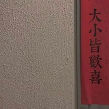

丑小鸡
============================

|  |  |
| :--: | :-- |
| [ 丑小鸡](https://i.xiami.com/kensty) | **地区**: China 中国大陆 **风格**: 流行 Pop, 国语流行 Mandarin Pop **播放数**: 627026 **粉丝数**: 128 **评论数**: 14  |

## 档案

1995  摩羯女 地理老师  爱唱歌 喜欢五月天

## 专辑

| 名称 | 语种 | 唱片公司 | 发行时间 | 专辑类别 | 专辑风格 |
| :--: | :-- | :-- | :-- | :-- | :-- |
| [ 丑小鸡の翻唱想唱歌](./albums/2103528852.md) | 国语 | 独立发行 | 2018年08月20日 | 合集, 杂锦 | 国语流行 Mandarin Pop, 流行 Pop |
| [ 一二三四五数到五月天天使在疯狂世界勇闯出头天 倔强的盛夏光年转眼已如烟](./albums/2103538101.md) | 国语 | 独立发行 | 2018年02月18日 | EP, 单曲 | 流行 Pop, 国语流行 Mandarin Pop |
| [ 丑小鸡の歌](./albums/2103528850.md) | 国语 | 独立发行 | 2018年02月10日 | 录音室专辑 | 流行 Pop, 国语流行 Mandarin Pop |

## 评论

|  |  |  |
| :-- | :-- | :-- |
|  [虾米用户](https://emumo.xiami.com/u/415415186)  2020-08-18 09:10 赞(0) 踩(0) | 
你，你好，你说很高兴认识你
 |
|  [虾米用户](https://emumo.xiami.com/u/306924686)  2020-05-10 10:14 赞(0) 踩(0) | 
好棒的wmls，唱歌太好听了叭
 |
|  [虾米用户](https://emumo.xiami.com/u/360448277)  2020-01-11 20:05 赞(1) 踩(0) | 
我记得我关注了个小鸭啊，怎么变成只小鸡了呢   
 |
|  [虾米用户](https://emumo.xiami.com/u/284626116)  2019-04-26 08:32 赞(2) 踩(0) | 
五迷好棒！！！还是地理老师！！！
 |
|  [虾米用户](https://emumo.xiami.com/u/419524990)  2019-04-11 00:11 赞(0) 踩(0) | 
好棒 
 |
|  [虾米用户](https://emumo.xiami.com/u/419524990)  2019-04-11 00:11 赞(0) 踩(0) | 
好棒 
 |
|  [虾米用户](https://emumo.xiami.com/u/419524990)  2019-04-11 00:11 赞(0) 踩(0) | 
好棒 
 |
|  [虾米用户](https://emumo.xiami.com/u/403339484)  2019-03-16 16:17 赞(1) 踩(0) | 
突然听到你的歌，真是优质粉丝，加油！
 |
| ⇒ |  [虾米用户](https://emumo.xiami.com/u/345891822) 不爱音乐的地理老师不是好... 2019-03-17 22:26 赞(0) 踩(0) | 
谢谢你呀~加油ᒡ̱
 |
|  [虾米用户](https://emumo.xiami.com/u/404228706)  2018-09-16 12:52 赞(0) 踩(0) | 
老师好！ 
 |
|  [虾米用户](https://emumo.xiami.com/u/110557616) 我终将青春还给了她 2018-03-11 00:33 赞(0) 踩(0) | 
你唱的好听，音色好好。
 |
| ⇒ |  [虾米用户](https://emumo.xiami.com/u/345891822) 不爱音乐的地理老师不是好... 2018-03-20 16:32 赞(0) 踩(0) | 
谢谢呀
 |
|  [虾米用户](https://emumo.xiami.com/u/294432766)  2018-02-24 02:07 赞(0) 踩(0) | 
可以认识你吗
 |
| ⇒ |  [虾米用户](https://emumo.xiami.com/u/345891822) 不爱音乐的地理老师不是好... 2018-02-24 08:09 赞(0) 踩(0) | 
哈哈，可以呀，你好
 |
