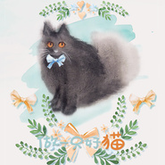

流芒菌
============================

|  |  |
| :--: | :-- |
| [ 流芒菌](https://i.xiami.com/liumangjun) | **地区**: China 中国大陆 **风格**: 流行 Pop, 日本动漫游戏 Japanese ACG, 同人音乐 DouJin, 中国风 China-Wave **播放数**: 400021 **粉丝数**: 132 **评论数**: 7  |

## 档案

## 专辑

| 名称 | 语种 | 唱片公司 | 发行时间 | 专辑类别 | 专辑风格 |
| :--: | :-- | :-- | :-- | :-- | :-- |
| [ 逆风女孩2019杨超越生日应援](./albums/2105043947.md) | 国语 |  | 2019年07月31日 | 录音室专辑 | 流行摇滚 Pop Rock |
| [ 夕颜辞镜](./albums/2103708300.md) | 国语 | 独立发行 | 2018年05月15日 | 录音室专辑 | 古风 GuFeng Music |
| [ 做一只好猫喵喵猫](./albums/2103608334.md) | 国语 | 独立发行 | 2018年01月02日 | 录音室专辑 | 国语流行 Mandarin Pop |

## 评论

|  |  |  |
| :-- | :-- | :-- |
|  [虾米用户](https://emumo.xiami.com/u/270533012)  2019-04-29 17:51 赞(2) 踩(0) | 
红昭愿追来的
 |
|  [虾米用户](https://emumo.xiami.com/u/108705548)  2018-06-11 23:20 赞(0) 踩(0) | 
喜欢你好久了。 未来还久，一起加油！
 |
|  [虾米用户](https://emumo.xiami.com/u/372758356)  2018-05-26 23:54 赞(0) 踩(0) | 
声音很好听！只有歌手才能赋予歌曲灵魂！坚持自己歌手的原则没有错！你的决定时间会证明是多么的正确的。   
 |
|  [虾米用户](https://emumo.xiami.com/u/358283848)  2018-04-15 09:04 赞(1) 踩(0) | 
很期待听到一首属于流芒菌自己的歌！
 |
|  [虾米用户](https://emumo.xiami.com/u/319878201)  2018-03-14 23:28 赞(2) 踩(0) | 
我天哪，大大你来了
 |
|  [虾米用户](https://emumo.xiami.com/u/335892344) 别进鄙视链里去 2018-02-27 16:08 赞(0) 踩(0) | 
&amp;hellip;(๑❛ᴗ❛๑)
 |
|  [虾米用户](https://emumo.xiami.com/u/324690166)  2018-02-25 03:17 赞(0) 踩(0) | 
沙发
 |
