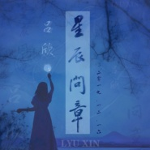

吕欣
============================

|  |  |
| :--: | :-- |
| [ 吕欣](https://i.xiami.com/heartlv) | **播放数**: 1315926 **粉丝数**: 286 **评论数**: 30 **地区**: China 中国大陆 **风格**: 流行 Pop  |

## 档案

吕欣，   业余音乐人。   哲学博士。中山大学、东京大学联合培养博士。现为北京大学“博雅博士后”。年少时多次获省市级以上歌唱比赛奖项。   2007年参与《同一首歌》走进东北亚特别节目，与齐秦同台献唱。

## 专辑

| 名称 | 语种 | 唱片公司 | 发行时间 | 专辑类别 | 专辑风格 |
| :--: | :-- | :-- | :-- | :-- | :-- |
| [ 如故如是集](./albums/5020970098.md) | 国语 | 独立发行 | 2020年06月26日 | 录音室专辑 | 流行 Pop |
| [ 冬至未至](./albums/2105613773.md) | 国语 | 独立发行 | 2019年12月21日 | 录音室专辑 | 流行 Pop |
| [ 星辰问章](./albums/2105587810.md) | 国语 |  | 2019年12月16日 | 录音室专辑 | 流行灵魂乐 Pop Soul, 流行 Pop |
| [ 载沉载浮集](./albums/2103521027.md) | 国语 | 独立发行 | 2016年12月16日 | 录音室专辑 | 流行 Pop |

## 评论

|  |  |  |  |
| :-- | :-- | :-- | :-- |
|  [虾米用户](https://emumo.xiami.com/u/431208250)  2021-01-25 17:52 赞(0) 踩(0) | 
好像我一个朋友
 |
|  [虾米用户](https://emumo.xiami.com/u/415289913)  2021-01-11 21:57 赞(1) 踩(0) | 
永不失联的爱 好听啊 继续期待你的好作品   
 |
| ⇒ |  [虾米用户](https://emumo.xiami.com/u/348378474) 哲学女博士，随性音乐人 2021-01-13 01:35 赞(0) 踩(0) | 
谢谢您的支持。只是虾米这块徜徉地要消散了，带着无奈和不舍，我也只好移步qq音乐，您可搜索q音音乐人吕欣继续关注我的歌曲。愿我的歌声与听友朋友永不失联  
 |
|  [虾米用户](https://emumo.xiami.com/u/276786607) -|- 2021-01-07 11:19 赞(0) 踩(0) | 
-|-★
 |
|  [虾米用户](https://emumo.xiami.com/u/96374066) 这个人很甜 2020-12-22 15:54 赞(1) 踩(0) | 
向学霸姐姐看齐，好厉害
 |
| ⇒ |  [虾米用户](https://emumo.xiami.com/u/348378474) 哲学女博士，随性音乐人 2021-01-08 06:04 赞(0) 踩(0) | 
谢谢听友妹妹支持。带着无奈和不舍，我也只好移步qq音乐，您可搜索q音音乐人吕欣继续关注我的歌曲。愿在虾米相遇的记忆不会随岁月消散  
 |
|  [虾米用户](https://emumo.xiami.com/u/39371950) 暂无签名~ 2020-12-09 00:40 赞(2) 踩(0) | 
吕欣老师最棒～～
 |
|  [虾米用户](https://emumo.xiami.com/u/348645158)  2020-09-06 12:55 赞(4) 踩(0) | 
赞不能停
 |
|  [虾米用户](https://emumo.xiami.com/u/443014705)  2020-05-17 23:02 赞(1) 踩(0) | 
名副其实的博雅！
 |
|  [虾米用户](https://emumo.xiami.com/u/15637075)  2020-03-18 23:04 赞(2) 踩(0) | 
因为虾米没有王菲那英版本的《岁月》，抱着将就的心态来听翻唱。吕欣的这个版本是虾米上最好听的一个版本了。只是作为菲迷，一直带着一点小偏见。听了很多次之后，I can say it's as good as the original one.
 |
| ⇒ |  [虾米用户](https://emumo.xiami.com/u/348378474) 哲学女博士，随性音乐人 2020-03-23 14:41 赞(0) 踩(0) | 
谢谢这位听友的肯定☺️
 |
| ⇒ |  [虾米用户](https://emumo.xiami.com/u/443014705)  2020-05-17 23:03 赞(0) 踩(0) | 
优秀，坦诚！
 |
| ⇒ |  [虾米用户](https://emumo.xiami.com/u/348378474) 哲学女博士，随性音乐人 2021-01-08 06:05 赞(0) 踩(0) | 
谢谢您的支持。带着无奈和不舍，也只好转入qq音乐，您可搜索q音音乐人吕欣继续关注我的歌，收听《岁月》。愿在虾米相遇的记忆不会随岁月消散 
 |
|  [虾米用户](https://emumo.xiami.com/u/440610501)  2020-02-18 19:02 赞(2) 踩(0) | 
我很喜欢这首歌              
 |
| ⇒ |  [虾米用户](https://emumo.xiami.com/u/348378474) 哲学女博士，随性音乐人 2021-01-08 06:06 赞(0) 踩(0) | 
谢谢您的支持。带着无奈和不舍，我也只好移步qq音乐，您可搜索q音音乐人吕欣继续关注我的歌曲。愿在虾米相遇的记忆不会随岁月消散  
 |
|  [虾米用户](https://emumo.xiami.com/u/348539268)  2019-09-23 21:17 赞(2) 踩(0) | 
女神
 |
|  [虾米用户](https://emumo.xiami.com/u/403113322) 我还没想好要写什么... 2019-01-19 10:28 赞(5) 踩(0) | 
才女好
 |
|  [虾米用户](https://emumo.xiami.com/u/409217147)  2018-11-23 00:27 赞(1) 踩(0) | 
很好听
 |
|  [虾米用户](https://emumo.xiami.com/u/348635652)   2018-06-10 23:34 赞(2) 踩(0) | 
想听岁月 
 |
|  [虾米用户](https://emumo.xiami.com/u/16935528)  2018-05-07 08:10 赞(3) 踩(0) | 
才女！
 |
|  [虾米用户](https://emumo.xiami.com/u/357666504)  2018-04-11 10:03 赞(3) 踩(0) | 
好
 |
|  [虾米用户](https://emumo.xiami.com/u/356936923)  2018-04-06 23:24 赞(3) 踩(0) | 
[文字up]
 |
|  [虾米用户](https://emumo.xiami.com/u/353962376)  2018-03-10 22:42 赞(15) 踩(0) | 
原来是位真学霸
 |
|  [虾米用户](https://emumo.xiami.com/u/353962376)  2018-03-10 22:40 赞(4) 踩(0) | 
多出歌吧，很厉害的潜力歌手
 |
|  [虾米用户](https://emumo.xiami.com/u/348645158)  2018-02-08 15:41 赞(3) 踩(0) | 
赞
 |
|  [虾米用户](https://emumo.xiami.com/u/348636817)  2018-02-08 15:10 赞(2) 踩(0) | 
    
 |
|  [虾米用户](https://emumo.xiami.com/u/348635652)   2018-02-08 15:06 赞(1) 踩(0) | 
小欣的歌可以在虾米上听了呀 
 |
|  [虾米用户](https://emumo.xiami.com/u/348588208)  2018-02-08 12:34 赞(1) 踩(0) | 
哇~~欣儿！！！
 |
|  [虾米用户](https://emumo.xiami.com/u/348586369) 我还没想好要写什么... 2018-02-08 12:28 赞(3) 踩(0) | 
大才女早日出道！
 |
|  [虾米用户](https://emumo.xiami.com/u/348579932)  2018-02-08 12:08 赞(4) 踩(0) | 
美才女超棒
 |
