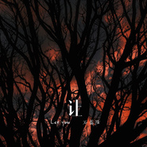

让
============================

|  |  |
| :--: | :-- |
| [ 让](https://emumo.xiami.com/album/2104363720) | **艺人**: [石恩隆](../index.md) **语种**: 国语 **唱片公司**:  **发行时间**: 2018年12月09日 **专辑类别**: EP, 单曲 **专辑风格**: 流行 Pop **播放数**: 1901 **收藏数**: 3 **评论数**: 1  |

## 简介

温热的季节过去了。  
  
终究还是 不小心捱成了心事。  
  
原来那些盛开的 是她不想看到让你愧疚的样子。  
  
而最终成熟的 或许是  
碎了满地 我们再无法完整的故事。  
  
坐在曾经的木椅上   
像是度过了平淡、冷清的整个四季。  
  
最后只剩下了枯黄的落叶。  
  
“别忘了 这是个美丽的地方。”  
  
此刻 故事还温热，  
也写下了曾经感动的颜色。 

## 曲目

## 评论

|  |  |  |
| :-- | :-- | :-- |
|  [虾米用户](https://emumo.xiami.com/u/445771436)  2020-11-05 22:00 赞(0) 踩(0) | 
好听
 |
