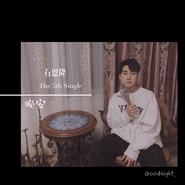

晚安
============================

|  |  |
| :--: | :-- |
| [ 晚安](https://emumo.xiami.com/album/2104613413) | **艺人**: [石恩隆](../index.md) **语种**: 国语 **唱片公司**: 独立发行 **发行时间**: 2019年02月21日 **专辑类别**: EP, 单曲 **专辑风格**: 流行 Pop, 国语流行 Mandarin Pop **播放数**: 984 **收藏数**: 2 **评论数**: 1  |

## 简介

 我没多少清晰的记忆，  
可恰好每个片段都有你。  
-  
虽然你已经不在了，  
但是我想最后说一次，  
“晚安。” 

## 曲目

## 评论

|  |  |  |
| :-- | :-- | :-- |
|  [虾米用户](https://emumo.xiami.com/u/355155778)  2019-02-24 09:41 赞(0) 踩(0) | 
好听
 |
