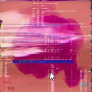

张笑达
============================

|  |  |
| :--: | :-- |
| [ 张笑达](https://i.xiami.com/bingoboer) | **播放数**: 4326447 **粉丝数**: 179 **评论数**: 8 **地区**: China 中国大陆 **风格**: 流行说唱 Pop Rap, 嘻哈 Hip-Hop  |

## 档案

独立地球人 
微博：笑达没有狗

## 专辑

| 名称 | 语种 | 唱片公司 | 发行时间 | 专辑类别 | 专辑风格 |
| :--: | :-- | :-- | :-- | :-- | :-- |
| [ 所以，爱是会消失的，对不对](./albums/5021336443.md) | 国语 | Ark Brothers | 2020年08月25日 | EP, 单曲 | 嘻哈 Hip-Hop |
| [ 为你](./albums/5021115079.md) | 国语 | Ark Brothers | 2020年07月18日 | EP, 单曲 | 嘻哈 Hip-Hop |
| [ So Alone](./albums/5021069298.md) | 国语 | Ark Brothers | 2020年07月11日 | EP, 单曲 | 嘻哈 Hip-Hop |
| [ 求求你](./albums/5021011558.md) | 国语 | Ark Brothers | 2020年06月30日 | EP, 单曲 | 嘻哈 Hip-Hop |
| [ 开口开口](./albums/2105697935.md) | 国语 | 独立发行 | 2020年01月06日 | 录音室专辑 | 嘻哈 Hip-Hop |
| [ 姑娘，别走姑娘，别走](./albums/2105697934.md) | 国语 | 独立发行 | 2019年12月23日 | 录音室专辑 | 嘻哈 Hip-Hop, 雷鬼流行 Reggae Pop |
| [ 妈，我知道了妈，我知道了](./albums/2105538509.md) | 国语 |  | 2019年12月04日 | 录音室专辑 | 迪斯科 Disco, 浩室舞曲 House |
| [ ❥大 概 叫 幸 福❥大 概 叫 幸 福](./albums/2105460558.md) | 国语 |  | 2019年11月20日 | 录音室专辑 | 嘻哈 Hip-Hop |
| [ 戈登路之们戈登路之们](./albums/2105452445.md) | 国语 |  | 2019年10月16日 | 录音室专辑 | 嘻哈 Hip-Hop |
| [ 戈登路之门](./albums/5020646576.md) | 国语 |  | 2019年10月16日 | EP, 单曲 |  |
| [ 永不挂科的情话永不挂科的情话](./albums/2105452447.md) | 国语 |  | 2018年03月29日 | 录音室专辑 | 嘻哈 Hip-Hop |
| [ 翻唱合辑](./albums/2103579557.md) | 国语 | 独立发行 | 2018年03月03日 | 合集, 杂锦 | 流行 Pop, 国语流行 Mandarin Pop |
| [ 宾果不冰](./albums/2103579575.md) | 国语 | 独立发行 | 2018年03月03日 | 播客 | 有声书 Audio Book |
| [ 你大概叫幸福原创作品集](./albums/2103579548.md) | 国语 | 独立发行 | 2016年04月01日 | 录音室专辑 | 嘻哈 Hip-Hop, 流行说唱 Pop Rap |

## 评论

|  |  |  |  |
| :-- | :-- | :-- | :-- |
|  [虾米用户](https://emumo.xiami.com/u/441130039)  2020-03-04 21:14 赞(0) 踩(0) | 
打卡康康以前的哥哥 
 |
|  [虾米用户](https://emumo.xiami.com/u/326023852)  2018-09-19 01:04 赞(0) 踩(0) | 
点赞
 |
|  [虾米用户](https://emumo.xiami.com/u/293997625)  2018-08-16 13:51 赞(0) 踩(0) | 
喜欢的声音
 |
|  [虾米用户](https://emumo.xiami.com/u/309708344) 止于嘴甜，不喜欢你 2018-04-13 20:38 赞(0) 踩(0) | 
为什么不火？
 |
|  [虾米用户](https://emumo.xiami.com/u/309708344) 止于嘴甜，不喜欢你 2018-04-13 20:37 赞(2) 踩(0) | 
蛮喜欢的
 |
|  [虾米用户](https://emumo.xiami.com/u/38057813) 我还没想好要写什么... 2018-04-04 17:51 赞(3) 踩(0) | 
耳朵会怀孕
 |
|  [虾米用户](https://emumo.xiami.com/u/290389662) 已换号.Q:212396... 2018-03-31 07:30 赞(3) 踩(0) | 
声线特别好呢。
 |
|  [虾米用户](https://emumo.xiami.com/u/290389662) 已换号.Q:212396... 2018-03-31 07:29 赞(2) 踩(0) | 
呦吼，声音好好听。
 |
