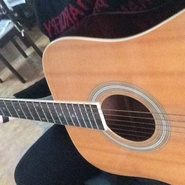
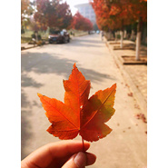

王灏纶
============================

|  |  |
| :--: | :-- |
| [ 王灏纶](https://i.xiami.com/allenwang) | **播放数**: 3084730 **粉丝数**: 79 **评论数**: 14 **地区**: Canada 加拿大 **风格**: 流行 Pop  |

## 档案

## 专辑

| 名称 | 语种 | 唱片公司 | 发行时间 | 专辑类别 | 专辑风格 |
| :--: | :-- | :-- | :-- | :-- | :-- |
| [ 看月亮爬上来](./albums/2105297598.md) | 国语 |  | 2019年09月30日 | EP, 单曲 | 国语流行 Mandarin Pop |
| [ 爱转角](./albums/2104947371.md) | 国语 |  | 2019年06月16日 | EP, 单曲 | 国语流行 Mandarin Pop |
| [ 时间的线EP](./albums/2103590869.md) | 国语 | 独立发行 | 2018年03月06日 | EP, 单曲 | 流行 Pop, 嘻哈 Hip-Hop, 古风 GuFeng Music |
| [ 遥远的你](./albums/2104521181.md) | 国语 |  | 不详 | EP, 单曲 | 民谣 Folk, 国语流行 Mandarin Pop |

## 评论

|  |  |  |  |
| :-- | :-- | :-- | :-- |
|  [虾米用户](https://emumo.xiami.com/u/74515870) 我还没想好要写什么... 2019-12-04 07:57 赞(1) 踩(0) | 
好喜欢这种类型的歌，温柔的嗓音娓娓道来爱情的模样
 |
|  [虾米用户](https://emumo.xiami.com/u/404748839) 噓。。靜靜聽音樂就好 2019-08-20 00:42 赞(1) 踩(0) | 
谢谢你，让卑微的我，此刻，少了些许的遗憾
 |
|  [虾米用户](https://emumo.xiami.com/u/272970385) 无我 2019-08-15 13:56 赞(3) 踩(0) | 
我觉得作者唱的很好呀，波澜不惊的将对恋人的思念娓娓道来。而且就算你在学习中放这首歌，你也不会被打扰。我很喜欢这首歌的旋律。
 |
|  [虾米用户](https://emumo.xiami.com/u/272970385) 无我 2019-08-10 06:18 赞(2) 踩(0) | 
这是一首能让我听很久都不会觉得腻的歌。
 |
|  [虾米用户](https://emumo.xiami.com/u/353406727) 音乐.无疆界 2019-07-27 03:42 赞(1) 踩(0) | 
歌，本身好听，必然喜欢听 
 |
| ⇒ |  [虾米用户](https://emumo.xiami.com/u/353406727) 音乐.无疆界 2019-08-09 01:37 赞(0) 踩(0) | 
谢谢你 
 |
|  [虾米用户](https://emumo.xiami.com/u/427294774)  2019-07-15 00:32 赞(0) 踩(0) | 
没有我朋友唱得有感情，为深情而深情，听不到歌声最深处的情感，可能我朋友唱得三不着五调的，但能听的处她的情欲，或者欢快，或者痴迷，或者藏在心底的小雀跃，听歌是一种很主观的事，萝卜青菜各有所爱，你唱的很准，每个音调每个旋律都把握的很好，基本上就是教科书般的精确，但不是我喜欢的好
 |
| ⇒ |  [虾米用户](https://emumo.xiami.com/u/84164674) 欢迎收听 2019-07-18 01:39 赞(0) 踩(0) | 
谢谢我好好努力
 |
|  [虾米用户](https://emumo.xiami.com/u/124129772) 没有一天不纠结的单身狗 2019-06-19 21:18 赞(0) 踩(0) | 
好听诶
 |
| ⇒ |  [虾米用户](https://emumo.xiami.com/u/84164674) 欢迎收听 2019-06-20 03:43 赞(0) 踩(0) | 
谢谢啦
 |
|  [虾米用户](https://emumo.xiami.com/u/321018554) 不要着急,总有一天你会发... 2019-06-09 15:47 赞(1) 踩(0) | 
小哥哥的声音好温柔！！！
 |
| ⇒ |  [虾米用户](https://emumo.xiami.com/u/84164674) 欢迎收听 2019-06-16 12:29 赞(0) 踩(0) | 
谢谢谢谢
 |
|  [虾米用户](https://emumo.xiami.com/u/344613335) 啦啦啦啦啦啦 2019-04-25 17:08 赞(1) 踩(0) | 
第一个?emmmm 
 |
| ⇒ |  [虾米用户](https://emumo.xiami.com/u/84164674) 欢迎收听 2019-04-28 03:50 赞(0) 踩(0) | 
感谢感谢，本来一开始是在网易云的，因为人在国外，所以只能用虾米了虾米也挺好
 |
