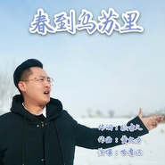

春到乌苏里黑龙江赫哲族（献给伟大的祖国）哈鲁滨
============================

|  |  |
| :--: | :-- |
| [ 春到乌苏里黑龙江赫哲族（献给伟大的祖国）哈鲁滨](https://emumo.xiami.com/album/5020710108) | **艺人**: [哈鲁滨](../index.md) **语种**: 国语 **唱片公司**: 独立发行 **发行时间**: 2020年05月21日 **专辑类别**: EP, 单曲 **专辑风格**: 中国传统民歌 Chinese Traditional Folk, 红歌 Red Song, 中国风 China-Wave **播放数**: 209 **收藏数**: 0 **评论数**: 0  |

## 简介

哈鲁滨，满族，盟员，中国音乐家协会新兴音乐群体委员，黑龙江侨联青年委员，黑龙江省音乐家协会会员，现任黑龙江省歌舞剧院独唱演员。 青年男高音，声音悦耳，高音透亮，在演唱民族性歌曲如蒙古族和藏族类型的歌曲演唱风格，拿捏准确到位，并有自己独到的演唱技巧。毕业后考入黑龙江省歌舞剧院工作，由于工作积极，思想进步，业务能力较强，经常随，电视台，文联下乡，慰问献出，走遍了黑龙江的山山水水。多年来多次参加省级各类大型文艺晚会并担任独唱、领唱；先后出访，毛里求斯、蒙古国、丹麦、瑞士、台湾等国家和地区交流访问演出，被单位评为“先进工作者”荣誉称号。多次荣获省级以上专业声乐比赛民族唱法、流行唱法一等奖。 代表歌曲：《九儿》《乌兰巴托之夜》《乌苏里船歌》《鸿雁》《来香巴拉看太阳》《草原上升起不落的太阳》《父亲的草原，母亲的河》《一对对鸳鸯水上漂》等。 原创歌曲：《好姑娘查森娜》《雄鹰翱翔》《敖包再相会》《他们是谁》《为你而来》《天地母爱》《春风化雨》《鄂伦春酒歌》等。

## 曲目

## 评论

|  |  |  |  |
| :-- | :-- | :-- | :-- |
