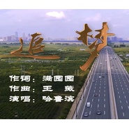

《追 梦》哈鲁滨-黑龙江建筑安装集团原创歌曲哈鲁滨
============================

|  |  |
| :--: | :-- |
| [ 《追 梦》哈鲁滨-黑龙江建筑安装集团原创歌曲哈鲁滨](https://emumo.xiami.com/album/5020877607) | **艺人**: [哈鲁滨](../index.md) **语种**: 国语 **唱片公司**: 独立发行 **发行时间**: 2020年06月11日 **专辑类别**: EP, 单曲 **专辑风格**: 流行 Pop, 时代曲 Shidaiqu **播放数**: 223 **收藏数**: 1 **评论数**: 0  |

## 简介

《追梦》是黑龙江建筑安装集团员工的原创歌曲，因为祖国母亲庆生而制作。歌曲中唱出龙江安装人六十余年砥砺前行。

## 曲目

## 评论

