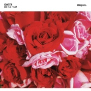

Be As I Am不失本心
============================

|  |  |
| :--: | :-- |
| [ Be As I Am不失本心](https://emumo.xiami.com/album/2104594776) | **艺人**: [iDiot8](../index.md) **语种**: 英语 **唱片公司**: Kingside Recordings **发行时间**: 2019年03月29日 **专辑类别**: EP, 单曲 **专辑风格**: 未来浩室 Future House **播放数**: 442 **收藏数**: 0 **评论数**: 0  |

## 简介

Be As I Am (不失本心) 第一次正式尝试制作House风格，人声采样源自于我购买的素材 (百分之百版权)，意外的被意大利House厂牌Kingside Music签下，希望你们能够喜欢。

## 曲目

## 评论

|  |  |  |  |
| :-- | :-- | :-- | :-- |
