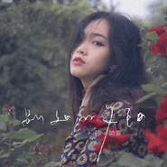

别处的夕阳
============================

|  |  |
| :--: | :-- |
| [ 别处的夕阳](https://emumo.xiami.com/album/2103727745) | **艺人**: [陈婧霏](../index.md) **语种**: 国语 **唱片公司**: 独立发行 **发行时间**: 2017年12月02日 **专辑类别**: 录音室专辑 **专辑风格**: 独立流行 Indie Pop **播放数**: 302042 **收藏数**: 15 **评论数**: 2  |

## 简介

题记： 我看过秋日的夕阳，穿透薄雾的光芒，照在你脸上的模样。 那之后很久某一天，我无意中瞥见 : 夕阳的光，彷佛黄昏的手，正悄悄拨开窗帘的缝隙，伸进我的房间里。 那一刻。回忆几乎触手可及。
 

 

封面credit:  
拍摄：田思聪  
服装／化妆：陈婧霏  
平面设计：韩嵩 陈婧霏  
手写字体：陈婧霏  
  

## 曲目

## 评论

|  |  |  |
| :-- | :-- | :-- |
|  [虾米用户](https://emumo.xiami.com/u/49940820) 无法告别 2020-08-11 14:21 赞(1) 踩(0) | 
余落温柔，秋月无边。
 |
|  [虾米用户](https://emumo.xiami.com/u/948452)  2018-08-06 16:40 赞(0) 踩(0) | 
好美哇
 |
