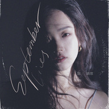

September Lies
============================

|  |  |
| :--: | :-- |
| [ September Lies](https://emumo.xiami.com/album/2103727760) | **艺人**: [陈婧霏](../index.md) **语种**: 英语 **唱片公司**: 独立发行 **发行时间**: 2017年12月27日 **专辑类别**: 录音室专辑 **专辑风格**: 独立流行 Indie Pop, 根源唱作人 Singer-Songwriter, 迷幻流行 Psychedelic Pop **播放数**: 29992 **收藏数**: 9 **评论数**: 1  |

## 简介

September Lies. 九月谎言。 
 

灵感来自于想象的画面和我一直深爱的季节。 
 

生长在北京， 九月当然是最爱的季节。即使身在国外， 关于九月记忆也都是美好的。  
九月里的某个夜晚，什么事都可能发生。情绪的、抽象的、 微妙的、 浓郁的。 
 

海浪与沙滩摩擦的暧昧，花香与荷尔蒙混合的兴奋。  
无论发生什么， 都值得回味。  
然后又像什么都没有发生过。  
因为当九月的夜风吹过发梢， 那些耳语，就算是谎言，也是情话。  
Yes, those September nights telling late summer lies.  

 

 
 

封面credit to：  
拍摄：胡准  
妆发：陈婧霏  
设计：韩嵩、陈婧霏、高宇豪  

## 曲目

## 评论

|  |  |  |  |
| :-- | :-- | :-- | :-- |
|  [虾米用户](https://emumo.xiami.com/u/349585038) Elsewhere. 2018-06-06 11:51 赞(4) 踩(0) | 
封面credit to：拍摄：胡准妆发：陈婧霏设计：韩嵩、陈婧霏、高宇豪
 |
