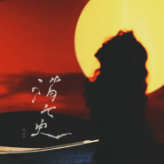
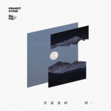

陈婧霏
============================

|  |  |
| :--: | :-- |
| [ 陈婧霏](https://i.xiami.com/chenjingfei) | **地区**: China 中国大陆 **风格**: 梦幻流行 Dream Pop, 迷幻流行 Psychedelic Pop, 氛围流行 Ambient Pop, 艺术流行 Art Pop **播放数**: 3568220 **粉丝数**: 3128 **评论数**: 88  |

## 档案

独立音乐人，唱作人，词曲作者。  毕业于清华大学&伯克利音乐学院。  射手座。 北京人。 自由懒散的浪漫主义左。 A realistic dreamer.

## 专辑

| 名称 | 语种 | 唱片公司 | 发行时间 | 专辑类别 | 专辑风格 |
| :--: | :-- | :-- | :-- | :-- | :-- |
| [ Lonely (ft. 陈婧霏)](./albums/5022463736.md) | 英语 | 有此山文化 | 2021年01月15日 | EP, 单曲 | 民谣流行 Folk Pop |
| [ 漫漫人生路](./albums/5022319037.md) | 国语 | 有此山文化 | 2021年01月01日 | EP, 单曲 | 国语流行 Mandarin Pop |
| [ 陈婧霏](./albums/5022300924.md) | 国语 | 有此山文化 | 2020年12月22日 | 录音室专辑 | 室内流行 Chamber Pop, 国语流行 Mandarin Pop, 华语唱作人 Chinese Singer-Songwriter |
| [ 消亡史](./albums/5022193567.md) | 国语 | 有此山文化 | 2020年12月15日 | EP, 单曲 | 国语流行 Mandarin Pop, 艺术流行 Art Pop |
| [ 夏宫](./albums/5022114952.md) | 国语 | 有此山文化 | 2020年12月08日 | EP, 单曲 | 国语流行 Mandarin Pop |
| [ 今晚](./albums/5022076525.md) | 国语 | 有此山文化 | 2020年12月01日 | EP, 单曲 | 国语流行 Mandarin Pop |
| [ 积极向下](./albums/2105188859.md) | 国语 | 有此山文化 | 2019年08月29日 | EP, 单曲 | 独立流行 Indie Pop |
| [ I Found Out Too Late](./albums/2105186190.md) | 国语 | 有此山文化 | 2019年08月28日 | EP, 单曲 |  |
| [ 16mm](./albums/2105186192.md) | 国语 | 有此山文化 | 2019年08月28日 | EP, 单曲 |  |
| [ 晚风](./albums/2105161914.md) | 国语 | 有此山文化 | 2019年08月22日 | EP, 单曲 | 国语流行 Mandarin Pop |
| [ 手](./albums/2103733434.md) | 国语 | 独立发行 | 2018年04月30日 | 录音室专辑 | 梦幻流行 Dream Pop, 艺术流行 Art Pop, 氛围流行 Ambient Pop |
| [ 翻唱集](./albums/2103733881.md) | 英语 | 独立发行 | 2018年02月14日 | 录音室专辑 | 流行 Pop |
| [ September Lies](./albums/2103727760.md) | 英语 | 独立发行 | 2017年12月27日 | 录音室专辑 | 独立流行 Indie Pop, 根源唱作人 Singer-Songwriter, 迷幻流行 Psychedelic Pop |
| [ 别处的夕阳](./albums/2103727745.md) | 国语 | 独立发行 | 2017年12月02日 | 录音室专辑 | 独立流行 Indie Pop |

## 评论

|  |  |  |
| :-- | :-- | :-- |
|  [虾米用户](https://emumo.xiami.com/u/46170322)  2021-01-16 23:51 赞(4) 踩(0) | 
虾小米！下次见面什么时候！没有你就像一颗星球消失了！ 
 |
|  [虾米用户](https://emumo.xiami.com/u/246398937) 云村： Virginia... 2021-01-14 21:24 赞(1) 踩(0) | 
爱霏霏爱生活！
 |
|  [虾米用户](https://emumo.xiami.com/u/54377168)  2021-01-14 14:49 赞(2) 踩(0) | 
爱你
 |
|  [虾米用户](https://emumo.xiami.com/u/50085030) 愿你孤独地活着 2021-01-07 21:03 赞(3) 踩(0) | 
爱你
 |
|  [虾米用户](https://emumo.xiami.com/u/6749530) 我变化万千，任何定格的印... 2021-01-06 15:12 赞(2) 踩(0) | 
love you
 |
|  [虾米用户](https://emumo.xiami.com/u/46787921) 看什么 2021-01-02 17:31 赞(4) 踩(0) | 
我，该不该讲&amp;hellip;和12真的好像
 |
|  [虾米用户](https://emumo.xiami.com/u/3553665) We can be He... 2021-01-01 01:12 赞(2) 踩(0) | 
新年快樂親愛的霏霏。
 |
|  [虾米用户](https://emumo.xiami.com/u/42810132) Aprés l'amou... 2021-01-01 01:03 赞(1) 踩(0) | 

 |
|  [虾米用户](https://emumo.xiami.com/u/372358968) 人要是能活在歌里就好了。 2020-12-31 20:31 赞(1) 踩(0) | 
好喜欢你的音乐❤️
 |
|  [虾米用户](https://emumo.xiami.com/u/347786240)  2020-12-30 23:34 赞(1) 踩(0) | 
、
 |
|  [虾米用户](https://emumo.xiami.com/u/10471420)  2020-12-30 07:45 赞(1) 踩(0) | 
最新专辑好好听好喜欢
 |
|  [虾米用户](https://emumo.xiami.com/u/44970264) 红拂夜奔 2020-12-29 17:35 赞(2) 踩(0) | 
不错不错好久没有不错的国语流行女歌手了
 |
|  [虾米用户](https://emumo.xiami.com/u/49905125)  2020-12-25 00:27 赞(4) 踩(0) | 
一看介绍竟然是校友。。回会清华演出吗
 |
|  [虾米用户](https://emumo.xiami.com/u/9062060) 此生没拿一个亿来爱虾米是... 2020-12-21 20:06 赞(2) 踩(0) | 
颜真的是我喜欢的
 |
|  [虾米用户](https://emumo.xiami.com/u/312536347) 力挺虾米!!! 2020-12-18 12:58 赞(2) 踩(0) | 
太棒了姐姐
 |
|  [虾米用户](https://emumo.xiami.com/u/3583995) 一個人的戰爭 2020-12-17 17:24 赞(2) 踩(0) | 
.
 |
|  [虾米用户](https://emumo.xiami.com/u/344018512) 我还没想好要写什么... 2020-12-17 01:47 赞(4) 踩(0) | 
D
 |
|  [虾米用户](https://emumo.xiami.com/u/409720950)  2020-12-16 19:33 赞(1) 踩(0) | 
真的好好听！！！
 |
|  [虾米用户](https://emumo.xiami.com/u/316474774) 音乐与我 2020-12-16 14:36 赞(2) 踩(0) | 
好听 好听
 |
|  [虾米用户](https://emumo.xiami.com/u/379162683) 我想要记住你们，我想要你... 2020-12-15 23:41 赞(1) 踩(0) | 

 |
|  [虾米用户](https://emumo.xiami.com/u/337192403)  2020-12-13 07:36 赞(2) 踩(0) | 
姐姐快些出单曲吧，我好喜欢你，每一首都听
 |
|  [虾米用户](https://emumo.xiami.com/u/12255271) Goodbye, Xia... 2020-12-12 16:47 赞(1) 踩(0) | 
喜欢
 |
|  [虾米用户](https://emumo.xiami.com/u/340245228) 谢谢你的一路陪伴 2020-12-11 12:12 赞(1) 踩(0) | 
学霸唉
 |
|  [虾米用户](https://emumo.xiami.com/u/52985271)  2020-12-09 22:56 赞(1) 踩(0) | 
i了
 |
|  [虾米用户](https://emumo.xiami.com/u/298081285)  2020-12-09 17:39 赞(1) 踩(0) | 
爱了爱了
 |
|  [虾米用户](https://emumo.xiami.com/u/333417383) 想要不可得的执着 2020-12-08 11:38 赞(1) 踩(0) | 
姐姐好美，歌好好听
 |
|  [虾米用户](https://emumo.xiami.com/u/54377168)  2020-12-06 14:44 赞(2) 踩(0) | 
希望喜欢你的都能欣赏到真正的她。 
 |
|  [虾米用户](https://emumo.xiami.com/u/54377168)  2020-12-06 14:44 赞(1) 踩(0) | 
陈婧霏12月新专辑 期待！支持！
 |
|  [虾米用户](https://emumo.xiami.com/u/54519843) 孤者自赏，芳飞艳。 2020-11-17 08:04 赞(1) 踩(0) | 

 |
|  [虾米用户](https://emumo.xiami.com/u/290256884) 网易云同名 2020-11-09 12:28 赞(2) 踩(0) | 
好棒啊姐姐! ! !真是内外兼修了!才貌双全 
 |
|  [虾米用户](https://emumo.xiami.com/u/37039681) 你若有心，知我如蚌，蚌里... 2020-10-18 14:16 赞(1) 踩(0) | 
不出新歌了吗？
 |
|  [虾米用户](https://emumo.xiami.com/u/280893989)  2020-10-10 22:56 赞(1) 踩(0) | 
她在网抑云上可不小众啊盆友们！
 |
|  [虾米用户](https://emumo.xiami.com/u/13844675)  2020-10-07 16:08 赞(1) 踩(0) | 
想听现场....在哪可以跟踪活动消息啊
 |
|  [虾米用户](https://emumo.xiami.com/u/427504407)  2020-10-02 16:45 赞(1) 踩(0) | 
浪漫
 |
|  [虾米用户](https://emumo.xiami.com/u/8147252) 我还没想好要写什么... 2020-09-30 18:54 赞(1) 踩(0) | 
音色性感
 |
|  [虾米用户](https://emumo.xiami.com/u/347584360) 何因不归去，淮上有秋山。 2020-07-13 16:59 赞(1) 踩(0) | 
喜欢
 |
|  [虾米用户](https://emumo.xiami.com/u/9285112)   2020-07-11 16:20 赞(3) 踩(0) | 
宝藏女孩
 |
|  [虾米用户](https://emumo.xiami.com/u/40055729)  2020-07-09 11:13 赞(1) 踩(0) | 
太棒了，简直，好pick 你呀。
 |
|  [虾米用户](https://emumo.xiami.com/u/233381371) 我还没想好要写什么... 2020-07-02 14:14 赞(1) 踩(0) | 
노래로 이야기 하듯 감정이 풍부함에 놀랐습니다.더 놀라운거 이렇게 어린 소녀 인줄 몰랐네요.멋있습니다.
 |
|  [虾米用户](https://emumo.xiami.com/u/304674085)  2020-06-12 23:23 赞(2) 踩(0) | 
宝藏
 |
|  [虾米用户](https://emumo.xiami.com/u/988634)  2020-05-21 21:47 赞(6) 踩(0) | 
嗷～这是什么宝藏歌手
 |
|  [虾米用户](https://emumo.xiami.com/u/442840738)  2020-05-14 06:27 赞(3) 踩(0) | 
太好听了
 |
|  [虾米用户](https://emumo.xiami.com/u/427504407)  2020-05-11 21:52 赞(4) 踩(0) | 
学霸姐姐
 |
|  [虾米用户](https://emumo.xiami.com/u/6183938)  2020-05-03 22:56 赞(1) 踩(0) | 
期待出新作品
 |
|  [虾米用户](https://emumo.xiami.com/u/49686802) 暂无签名~ 2020-04-23 22:29 赞(2) 踩(0) | 
妒忌我以外每一个喜欢陈婧霏的男人
 |
|  [虾米用户](https://emumo.xiami.com/u/12177664)   2020-04-16 22:31 赞(2) 踩(0) | 
小姐姐的声音也太温柔了吧！
 |
|  [虾米用户](https://emumo.xiami.com/u/430475043) 超凶  2020-04-11 09:53 赞(3) 踩(0) | 
从晚风开始 默默喜欢你的歌很久 然后既希望更多人听到 又希望永远是属于我的冷门小众
 |
|  [虾米用户](https://emumo.xiami.com/u/327594701) 爱与风之歌。 2020-04-02 00:03 赞(1) 踩(0) | 
我永远爱你
 |
|  [虾米用户](https://emumo.xiami.com/u/9062060) 此生没拿一个亿来爱虾米是... 2020-04-01 22:01 赞(1) 踩(0) | 

 |
|  [虾米用户](https://emumo.xiami.com/u/333417383) 想要不可得的执着 2020-03-18 14:29 赞(2) 踩(0) | 
好喜欢你的歌!看到列表里有一首你翻唱的打雷的old money，可惜不能听了，我超级喜欢打雷，感觉你们的歌都很复古，自由，浪漫，有诗意。感觉你的歌在华语里很有自己的特点，太优秀啦!希望以后越来越好呀!
 |
|  [虾米用户](https://emumo.xiami.com/u/40331080) 我还没想好要写什么... 2020-03-17 15:29 赞(1) 踩(0) | 
这才是华语音乐该有的样子 太棒了 
 |
|  [虾米用户](https://emumo.xiami.com/u/192548428)  2020-03-13 10:14 赞(6) 踩(0) | 
清华？？？？这么牛
 |
| ⇒ |  [虾米用户](https://emumo.xiami.com/u/195710169) remembermmlo... 2021-01-27 12:43 赞(0) 踩(0) | 
而且是清华经管&amp;hellip;&amp;hellip;
 |
|  [虾米用户](https://emumo.xiami.com/u/440707765)  2020-03-06 22:46 赞(3) 踩(0) | 
挺特别的歌声，醉人，让人安静，让人沉浸，爱了   
 |
|  [虾米用户](https://emumo.xiami.com/u/356763773) 我还没想好要写什么... 2020-03-05 22:21 赞(1) 踩(0) | 

 |
|  [虾米用户](https://emumo.xiami.com/u/14265718) wx:osakarock... 2020-03-03 17:29 赞(2) 踩(0) | 
好听
 |
|  [虾米用户](https://emumo.xiami.com/u/348139898) keep fit 2020-02-06 09:38 赞(4) 踩(0) | 
迷人且醉人 
 |
|  [虾米用户](https://emumo.xiami.com/u/49608367) 风再大都绕过我的灵魂 2019-12-19 17:29 赞(1) 踩(0) | 
很迷人的声音 而且她好厉害啊！！～
 |
|  [虾米用户](https://emumo.xiami.com/u/68729574) 我还没想好要写什么... 2019-12-05 19:54 赞(1) 踩(0) | 
有微博吗，为什么搜不到
 |
| ⇒ |  [虾米用户](https://emumo.xiami.com/u/428939339)  2019-12-12 19:00 赞(0) 踩(0) | 
陈婧霏19
 |
|  [虾米用户](https://emumo.xiami.com/u/11489663) 只有歌，才能不胫而飞 2019-12-02 11:43 赞(1) 踩(0) | 
打雷
 |
|  [虾米用户](https://emumo.xiami.com/u/52219841) 我还没想好要写什么... 2019-11-24 23:13 赞(1) 踩(0) | 
前来报道。
 |
|  [虾米用户](https://emumo.xiami.com/u/401651241)  2019-11-10 13:29 赞(1) 踩(0) | 
好漂亮
 |
|  [虾米用户](https://emumo.xiami.com/u/20425956) 天若微雨，我心浅笑。 2019-10-24 00:29 赞(1) 踩(0) | 
越听越耐听，大爱ヽ(*´з｀*)ﾉ记得要回虾米发作品鸭    
 |
|  [虾米用户](https://emumo.xiami.com/u/408441113) 人生海海 2019-10-20 14:16 赞(1) 踩(0) | 
可好听啦 
 |
|  [虾米用户](https://emumo.xiami.com/u/316240521) 7852251 2019-10-10 22:54 赞(2) 踩(0) | 
突然我发现了宝藏女孩
 |
|  [虾米用户](https://emumo.xiami.com/u/423505241)  2019-10-08 12:10 赞(1) 踩(0) | 
表白小姐姐，我喜欢你！    
 |
|  [虾米用户](https://emumo.xiami.com/u/259849053)  2019-07-11 23:35 赞(1) 踩(0) | 
好听～
 |
|  [虾米用户](https://emumo.xiami.com/u/333722887)  2019-07-09 12:49 赞(1) 踩(0) | 
好A呀
 |
|  [虾米用户](https://emumo.xiami.com/u/219593765)  2019-06-16 01:07 赞(1) 踩(0) | 
:)
 |
|  [虾米用户](https://emumo.xiami.com/u/80691018) 侨中的爱饼人士 2019-06-02 10:55 赞(1) 踩(0) | 
现在做音乐是不是都要高学历 
 |
|  [虾米用户](https://emumo.xiami.com/u/424442192)  2019-05-13 16:01 赞(3) 踩(0) | 
请上晚风哈哈哈
 |
|  [虾米用户](https://emumo.xiami.com/u/332498160)  You'll Love... 2019-05-12 22:11 赞(1) 踩(0) | 
太喜欢了，关注起来
 |
|  [虾米用户](https://emumo.xiami.com/u/54669675) 为别人鼓掌，就是给自己加... 2019-04-18 23:21 赞(3) 踩(0) | 
晚风怎么不在虾米上线
 |
|  [虾米用户](https://emumo.xiami.com/u/372358968) 人要是能活在歌里就好了。 2019-03-04 20:55 赞(2) 踩(0) | 
哇塞
 |
|  [虾米用户](https://emumo.xiami.com/u/300332556)  2019-02-22 20:42 赞(1) 踩(0) | 
每首都很好听
 |
|  [虾米用户](https://emumo.xiami.com/u/341311640)  2019-02-06 22:26 赞(1) 踩(0) | 
坐等新歌
 |
|  [虾米用户](https://emumo.xiami.com/u/4142885) 我还没想好要写什么... 2019-01-16 10:46 赞(1) 踩(0) | 

 |
|  [虾米用户](https://emumo.xiami.com/u/351181472) 生活单一 长得不行 2018-10-22 21:37 赞(1) 踩(0) | 
爱你
 |
|  [虾米用户](https://emumo.xiami.com/u/72147052) 嘿 2018-09-01 16:24 赞(1) 踩(0) | 
好听耶(ง &amp;bull;̀_&amp;bull;́)ง
 |
|  [虾米用户](https://emumo.xiami.com/u/193828806) 我还没想好要写什么... 2018-08-31 22:21 赞(1) 踩(0) | 
陈婧霏
 |
|  [虾米用户](https://emumo.xiami.com/u/400811052) 我还没想好要写什么... 2018-08-24 16:39 赞(1) 踩(0) | 
love you 
 |
|  [虾米用户](https://emumo.xiami.com/u/2712528) 我还没想好要写什么... 2018-07-05 18:05 赞(1) 踩(0) | 
佩服陈婧霏
 |
|  [虾米用户](https://emumo.xiami.com/u/352535021)  2018-06-06 22:03 赞(1) 踩(0) | 
永远支持你
 |
|  [虾米用户](https://emumo.xiami.com/u/2017712) 暂无签名~ 2018-04-22 00:33 赞(1) 踩(0) | 
多年不用虾米，刚从网易听完新歌过来一搜果然在～加油
 |
|  [虾米用户](https://emumo.xiami.com/u/352611297) 快要聋了 2018-04-01 09:20 赞(2) 踩(0) | 

 |
