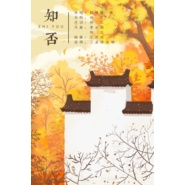

小宇哥
============================

|  |  |
| :--: | :-- |
| [ 小宇哥](https://i.xiami.com/dwlm) | **地区**: China 中国大陆 **风格**: 流行 Pop, 原声 Soundtrack, 民谣 Folk **播放数**: 1261839 **粉丝数**: 35 **评论数**: 3  |

## 档案

做个酷酷的人  一生温暖纯良 不舍爱与自由

## 专辑

| 名称 | 语种 | 唱片公司 | 发行时间 | 专辑类别 | 专辑风格 |
| :--: | :-- | :-- | :-- | :-- | :-- |
| [ 知否](./albums/2104996913.md) | 国语 | 独立发行 | 2019年07月06日 | 录音室专辑 | 流行 Pop |
| [ 多情岸](./albums/2103828021.md) | 国语 | 独立发行 | 2018年06月30日 | 录音室专辑 | 流行 Pop |
| [ 写给我第一个喜欢的男孩的歌](./albums/2103674393.md) | 国语 | 独立发行 | 2018年04月19日 | EP, 单曲 | 独立流行 Indie Pop, 流行 Pop |
| [ 我多喜欢你，你会知道](./albums/2103674420.md) | 国语 | 独立发行 | 2017年12月09日 | EP, 单曲 | 民谣 Folk, 流行 Pop |
| [ 夜半离人](./albums/2103828025.md) | 国语 | 独立发行 | 2017年10月05日 | EP, 单曲 | 流行 Pop |
| [ 新九九八十一](./albums/2104851248.md) | 国语 | 独立发行 | 2017年08月21日 | 录音室专辑 | 古风 GuFeng Music |
| [ 彼方](./albums/2104996914.md) | 国语 |  | 2017年05月04日 | 录音室专辑 | 流行 Pop |

## 评论

|  |  |  |
| :-- | :-- | :-- |
|  [虾米用户](https://emumo.xiami.com/u/358104299) 悲观的唯心存在现实解构虚... 2020-12-25 09:45 赞(0) 踩(0) | 
44091
 |
|  [虾米用户](https://emumo.xiami.com/u/441640493) 山穷水尽，自然柳暗花明 2020-03-25 12:46 赞(1) 踩(0) | 
韩浩宇，你唱歌好好听，喜欢你，支持你。
 |
|  [虾米用户](https://emumo.xiami.com/u/430928943) 一杯就好 2020-01-09 18:07 赞(1) 踩(0) | 
你超棒的
 |
