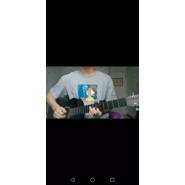
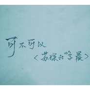
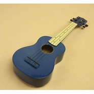

Zic子晨
============================

|  |  |
| :--: | :-- |
| [ Zic子晨](https://i.xiami.com/zichen) | **播放数**: 12210522 **粉丝数**: 635 **评论数**: 41 **地区**: China 中国大陆 **风格**: 流行 Pop  |

## 档案

## 专辑

| 名称 | 语种 | 唱片公司 | 发行时间 | 专辑类别 | 专辑风格 |
| :--: | :-- | :-- | :-- | :-- | :-- |
| [ 我要找到你](./albums/2106059608.md) | 国语 |  | 2019年12月09日 |  | 流行 Pop |
| [ 有人](./albums/2108353033.md) | 国语 | 禾信科技 | 2019年11月07日 | EP, 单曲 | 国语流行 Mandarin Pop |
| [ Di-wer-ba-wer](./albums/2105327834.md) | 国语 |  | 2019年10月08日 | EP, 单曲 | 流行 Pop |
| [ 太阳【吉他弹唱】](./albums/2105241129.md) | 国语 |  | 2019年09月13日 | 录音室专辑 | 民谣 Folk, 流行 Pop, 国语流行 Mandarin Pop |
| [ 山楂树之恋【男声吉他弹唱】](./albums/2105174318.md) | 国语 |  | 2019年08月24日 | 现场专辑 | 民谣 Folk |
| [ 小女子](./albums/2104964846.md) | 国语 |  | 2019年06月26日 | 录音室专辑 | 民谣 Folk, 流行 Pop |
| [ 绿色+假装+你的酒馆对我打了烊](./albums/2104777968.md) | 国语 |  | 2019年04月14日 | 录音室专辑 | 民谣 Folk |
| [ 把我的思念悄悄磨成伤口](./albums/2104762007.md) | 国语 |  | 2019年04月10日 | 录音室专辑 | 民谣 Folk, 流行 Pop |
| [ 那女孩对我说](./albums/2104675862.md) | 国语 |  | 2019年03月17日 | 录音室专辑 | 流行 Pop |
| [ 隔壁班的猪](./albums/5021179675.md) | 国语 | 禾信科技 | 2019年01月08日 | EP, 单曲 | 国语流行 Mandarin Pop |
| [ 吻得太逼真](./albums/2104451867.md) | 国语 |  | 2019年01月07日 | EP, 单曲 | 流行 Pop |
| [ 隔壁班的猪隔壁班的猪](./albums/2104451865.md) | 国语 |  | 2019年01月02日 | EP, 单曲 | 流行 Pop |
| [ 执子之手](./albums/2104069492.md) | 国语 | 独立发行 | 2018年09月30日 | 录音室专辑 | 民谣 Folk, 流行 Pop, 当代民谣 Contemporary Folk |
| [ 可不可以【吉他弹唱】可不可以](./albums/2104058524.md) | 国语 | 独立发行 | 2018年09月28日 | 录音室专辑 | 流行 Pop |
| [ 彩虹糖的梦子晨也有彩虹糖呢](./albums/2103947600.md) | 国语 | 独立发行 | 2018年08月26日 | 现场专辑 | 儿歌 Nursery Rhyme, 儿童音乐 Children's Music, 流行 Pop |
| [ 越来越不懂【吉他弹唱】](./albums/2103922329.md) | 国语 | 独立发行 | 2018年08月13日 | 现场专辑 | 流行 Pop |
| [ 掉入王北车的陷阱](./albums/2103829624.md) | 国语 | 独立发行 | 2018年07月20日 | 现场专辑 | 流行 Pop |
| [ 3 2 1 天空很蓝](./albums/2103790999.md) | 国语 | 独立发行 | 2018年07月10日 | 现场专辑 | 流行 Pop |
| [ 过期不候Zic](./albums/2103756985.md) | 国语 | 独立发行 | 2018年06月26日 | 现场专辑 | 流行 Pop |
| [ 【答案】吉他弹唱](./albums/2103733010.md) | 国语 | 独立发行 | 2018年06月06日 | 现场专辑 | 流行 Pop |
| [ 纸短情长](./albums/2103711692.md) | 国语 | 独立发行 | 2018年05月17日 | 现场专辑 | 流行 Pop, 民谣 Folk |
| [ 化身孤岛的鲸](./albums/2103708071.md) | 国语 | 独立发行 | 2018年05月14日 | 现场专辑 | 流行 Pop, 民谣 Folk |
| [ 子晨的烤面筋温情养耳烤面筋](./albums/2103698933.md) | 国语 | 独立发行 | 2018年04月29日 | 录音室专辑 | 民谣 Folk, 流行 Pop |

## 评论

|  |  |  |  |
| :-- | :-- | :-- | :-- |
|  [虾米用户](https://emumo.xiami.com/u/402919689)  2020-09-07 17:20 赞(0) 踩(0) | 
很好听，喜欢你的音乐。。。加油
 |
|  [虾米用户](https://emumo.xiami.com/u/420790507)  2020-02-27 06:50 赞(0) 踩(0) | 
❤️❤️❤️
 |
|  [虾米用户](https://emumo.xiami.com/u/7588232) 蝦～ 2020-02-16 03:16 赞(0) 踩(0) | 
加油
 |
|  [虾米用户](https://emumo.xiami.com/u/22441963)  2020-01-04 23:10 赞(1) 踩(0) | 
声音是不错，为啥归类在胎教，哄睡里啊 
 |
|  [虾米用户](https://emumo.xiami.com/u/283725793)  2019-11-01 20:09 赞(0) 踩(0) | 
爱你哟，么么哒！
 |
|  [虾米用户](https://emumo.xiami.com/u/293352355) 我爱的样子你都有  你的... 2019-09-15 18:19 赞(0) 踩(0) | 
加油希望多出歌曲
 |
|  [虾米用户](https://emumo.xiami.com/u/424409589)  2019-05-11 16:54 赞(0) 踩(0) | 
加油
 |
|  [虾米用户](https://emumo.xiami.com/u/327290698)  2019-05-09 17:53 赞(0) 踩(0) | 
确认过声线，是我喜欢的声线，一发不可收拾的天天听了
 |
|  [虾米用户](https://emumo.xiami.com/u/411581642)  2019-04-04 22:21 赞(0) 踩(0) | 
好听，加油
 |
|  [虾米用户](https://emumo.xiami.com/u/403983935)  2019-03-29 12:20 赞(0) 踩(0) | 
声音很好听，特别有特点，希望你以后发更多歌
 |
|  [虾米用户](https://emumo.xiami.com/u/420790507)  2019-03-10 00:21 赞(0) 踩(0) | 
喜欢你的歌声加油哟
 |
|  [虾米用户](https://emumo.xiami.com/u/287557278) 唯EXO 2019-01-25 21:51 赞(0) 踩(0) | 
跨年夜渭南听过  
 |
|  [虾米用户](https://emumo.xiami.com/u/287557278) 唯EXO 2019-01-25 21:44 赞(0) 踩(0) | 
听过现场 校友唉 加油额
 |
|  [虾米用户](https://emumo.xiami.com/u/204796074) 再见。 2019-01-19 23:38 赞(0) 踩(0) | 
沃德玛雅，真的好好听，还是西安的小哥❤支持您
 |
|  [虾米用户](https://emumo.xiami.com/u/408217476)  2018-12-07 21:26 赞(0) 踩(0) | 
愿……
 |
|  [虾米用户](https://emumo.xiami.com/u/343484671)  2018-11-01 22:05 赞(4) 踩(0) | 
喜欢你
 |
|  [虾米用户](https://emumo.xiami.com/u/379428719)  2018-10-03 14:39 赞(3) 踩(0) | 
加油你唱的歌很好听
 |
|  [虾米用户](https://emumo.xiami.com/u/359334952)  2018-09-25 11:51 赞(6) 踩(0) | 
加油   你的歌不错
 |
|  [虾米用户](https://emumo.xiami.com/u/378445729)  2018-09-23 08:49 赞(1) 踩(0) | 
加油，你很棒！
 |
|  [虾米用户](https://emumo.xiami.com/u/247062400) 微信：sweetzll1... 2018-09-08 02:38 赞(1) 踩(0) | 
已经唱的很好了。
 |
|  [虾米用户](https://emumo.xiami.com/u/317631715)  2018-07-26 22:43 赞(4) 踩(0) | 
听了你唱的的答案，真的好好听，又听了其它的歌，都很好听呀
 |
|  [虾米用户](https://emumo.xiami.com/u/305496502)   2018-07-23 23:13 赞(1) 踩(0) | 
如果副歌不那么间断的唱可能会更好听，其实唱的还可以
 |
|  [虾米用户](https://emumo.xiami.com/u/297157636)   2018-07-23 03:22 赞(1) 踩(0) | 
加油加油
 |
|  [虾米用户](https://emumo.xiami.com/u/17245303)  2018-07-18 15:05 赞(3) 踩(0) | 
好好听，想认识小哥哥
 |
| ⇒ |  [虾米用户](https://emumo.xiami.com/u/357243487) 微博 Zic子晨 2018-07-19 16:41 赞(0) 踩(0) | 
你好
 |
| ⇒ |  [虾米用户](https://emumo.xiami.com/u/17245303)  2018-07-19 21:08 赞(0) 踩(0) | 
<q><b>Zic子晨说：</b></q>
 |
| ⇒ |  [虾米用户](https://emumo.xiami.com/u/17245303)  2018-07-19 21:11 赞(0) 踩(0) | 
你声音好清澈，很悦耳
 |
|  [虾米用户](https://emumo.xiami.com/u/378862964)  2018-07-17 14:14 赞(1) 踩(0) | 
好吧，承认答案我听上瘾了
 |
|  [虾米用户](https://emumo.xiami.com/u/260590390)  2018-07-16 00:51 赞(1) 踩(0) | 
答案的伴奏大神可不可以分享一下
 |
|  [虾米用户](https://emumo.xiami.com/u/52056952) 人生即是到來、相遇、陪伴... 2018-07-13 16:57 赞(1) 踩(0) | 

 |
|  [虾米用户](https://emumo.xiami.com/u/76879076) xixi 2018-07-11 22:27 赞(1) 踩(0) | 
好好听，可不可以加好友！
 |
| ⇒ |  [虾米用户](https://emumo.xiami.com/u/357243487) 微博 Zic子晨 2018-07-12 03:10 赞(0) 踩(0) | 
微博私信考虑一下
 |
| ⇒ |  [虾米用户](https://emumo.xiami.com/u/265612675) 女孩子嘛！要坚强！ 2018-07-12 07:38 赞(0) 踩(0) | 
<q><b>Zic子晨说：</b></q>
 |
| ⇒ |  [虾米用户](https://emumo.xiami.com/u/355050816)  2018-08-30 18:25 赞(0) 踩(0) | 
<q><b>xdsolovely说：</b></q>
 |
|  [虾米用户](https://emumo.xiami.com/u/316509853) 音乐使人陶醉，使我感到生... 2018-07-06 17:17 赞(0) 踩(0) | 
100
 |
|  [虾米用户](https://emumo.xiami.com/u/44602694)  2018-06-13 11:06 赞(0) 踩(0) | 
好听的男声~支持~
 |
|  [虾米用户](https://emumo.xiami.com/u/322082495)  2018-06-11 01:19 赞(0) 踩(0) | 
好棒啊
 |
|  [虾米用户](https://emumo.xiami.com/u/374039485)  2018-06-10 09:30 赞(0) 踩(0) | 
好听
 |
|  [虾米用户](https://emumo.xiami.com/u/187447736) EXO 2018-06-03 02:32 赞(0) 踩(0) | 
好听
 |
|  [虾米用户](https://emumo.xiami.com/u/301614121)  2018-05-18 13:38 赞(1) 踩(0) | 
嗯啊
 |
|  [虾米用户](https://emumo.xiami.com/u/215163512)  2018-05-01 01:03 赞(0) 踩(0) | 
烤面筋求谱
 |
