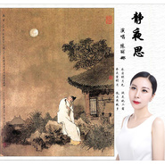

陈丽娜
============================

|  |  |
| :--: | :-- |
| [ 陈丽娜](https://i.xiami.com/cln) | **地区**: China 中国大陆 **风格**: 中国传统民歌 Chinese Traditional Folk, 古风 GuFeng Music **播放数**: 2656289 **粉丝数**: 111 **评论数**: 6  |

## 档案

歌唱演员，央视《星光大道》评委，2019华夏之星春晚音乐总监，原北京总政歌舞团签约独唱演员，榆林市慈善协会幸运加爱心公益爱心大使，上海随手公益志愿者，师从于中国音乐学院董华教授。热心公益事业，2006年至今无偿参与各类公益惠民演出共计300多场。 
2002、2003年两届清涧县民歌大赛第一名。 
2002年榆林市第一届陕北民歌大赛优秀奖。 
2003年签约北京秦乐官歌舞团任独唱演员。 
2006年签约北京总政歌舞团任独唱演员。 
2009年荣获陕西省庆祝中华人民共和国成立六十周年“祖国颂”歌咏比赛领唱第一名。 
2016年参加陕西省文化厅、陕西省音乐家协会主办“大音曦声”音乐会演唱原创歌曲《清涧之恋》。 
2017年参加陕西省第八届艺术节央视群星汇演唱《大展宏图》。 
2017年参加纪念“清涧起義”90周年暨首届中国·清涧红枣文化艺术节群星演唱会演唱《美丽中国》。 
2018年参加2018全球华夏之星春晚演唱原创歌曲《乡盼》。 
2018年担任中央电视台《星光大道》评委。 
2018年参加第98届全国糖酒商品交易会演唱原创“道情”歌曲《沁园春·雪》。 
2018年参加CCTV五一群星文艺汇演演唱《静夜思》获得金奖。 
2018年参加民建榆林市委员会成立十周年文艺庆典，演唱《祖国万岁》。 
微博账号：歌手陈丽娜

## 专辑

| 名称 | 语种 | 唱片公司 | 发行时间 | 专辑类别 | 专辑风格 |
| :--: | :-- | :-- | :-- | :-- | :-- |
| [ 刚好遇见你Just meet you](./albums/2104588426.md) | 国语 |  | 2019年02月10日 | EP, 单曲 | 国语流行 Mandarin Pop |
| [ 我的中国梦](./albums/2104603640.md) | 国语 | 独立发行 | 2019年02月02日 | EP, 单曲 | 国语流行 Mandarin Pop |
| [ 绒花电影《小花》主题曲，电影《芳华》片尾曲](./albums/2104073045.md) | 国语 | 独立发行 | 2018年10月01日 | EP, 单曲 | 中国传统民歌 Chinese Traditional Folk, 国语流行 Mandarin Pop |
| [ 孝敬父母](./albums/2104050939.md) | 国语 | 独立发行 | 2018年09月24日 | EP, 单曲 | 华语唱作人 Chinese Singer-Songwriter, 中国民乐 Chinese Folk Music |
| [ 让我们荡起双桨少儿电影《祖国的花朵》主题曲](./albums/2103725720.md) | 国语 | 独立发行 | 2018年06月01日 | EP, 单曲 | 儿歌 Nursery Rhyme, 中国传统民歌 Chinese Traditional Folk |
| [ 祖国万岁](./albums/2103718207.md) | 国语 | 独立发行 | 2018年05月24日 | EP, 单曲 | 国语流行 Mandarin Pop, 中国传统民歌 Chinese Traditional Folk, 红歌 Red Song |
| [ 乡盼母亲节版](./albums/2103707233.md) | 国语 | 独立发行 | 2018年05月13日 | EP, 单曲 | 中国传统民歌 Chinese Traditional Folk |
| [ 家乡的你](./albums/2103704532.md) | 国语 | 独立发行 | 2018年05月09日 | EP, 单曲 | 中国传统民歌 Chinese Traditional Folk |
| [ 九儿电视剧《红高粱》片尾曲](./albums/2103703753.md) | 国语 | 独立发行 | 2018年05月07日 | EP, 单曲 | 中国传统民歌 Chinese Traditional Folk |
| [ 静夜思CCTV五一群星文艺汇演金奖歌曲](./albums/2103702479.md) | 国语 | 独立发行 | 2018年05月05日 | EP, 单曲 | 中国传统民歌 Chinese Traditional Folk |
| [ 美丽中国](./albums/2103692037.md) | 国语 | 独立发行 | 2018年04月20日 | EP, 单曲 | 国语流行 Mandarin Pop, 中国传统民歌 Chinese Traditional Folk |
| [ 茉莉花中国第二国歌](./albums/2103685527.md) | 国语 | 独立发行 | 2018年04月14日 | EP, 单曲 | 中国传统民歌 Chinese Traditional Folk |
| [ 最真的梦](./albums/2104613246.md) | 国语 | 独立发行 | 2012年07月04日 | EP, 单曲 | 国语流行 Mandarin Pop |

## 评论

|  |  |  |
| :-- | :-- | :-- |
|  [虾米用户](https://emumo.xiami.com/u/4993602) 我还没想好要写什么... 2020-12-07 19:12 赞(0) 踩(0) | 
声音有磁性，好听。
 |
|  [虾米用户](https://emumo.xiami.com/u/352220781)  2020-11-26 12:29 赞(0) 踩(0) | 
  
 |
|  [虾米用户](https://emumo.xiami.com/u/443902879)  2020-07-02 20:29 赞(1) 踩(0) | 
丽娜得声音很温柔
 |
|  [虾米用户](https://emumo.xiami.com/u/441585422)  2020-03-20 20:57 赞(1) 踩(0) | 
好听！
 |
|  [虾米用户](https://emumo.xiami.com/u/358104299) 悲观的唯心存在现实解构虚... 2019-12-22 20:25 赞(2) 踩(0) | 
Sbmggccptjb
 |
|  [虾米用户](https://emumo.xiami.com/u/304474625)  2019-08-02 18:33 赞(2) 踩(0) | 
“祖国万岁"唱出了对祖国的情感，太好听了。
 |
