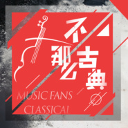

不那么古典经典音乐作品，室内乐改编版专辑
============================

|  |  |
| :--: | :-- |
| [ 不那么古典经典音乐作品，室内乐改编版专辑](https://emumo.xiami.com/album/2103921705) | **艺人**: [爱乐汇轻音乐团](../index.md) **语种**: 纯音乐 **唱片公司**: 爱乐汇 **发行时间**: 2018年08月13日 **专辑类别**: 录音室专辑 **专辑风格**: 室内乐 / 重奏 Chamber Music, 轻音乐 Easy Listening, 古典音乐 Classical **播放数**: 1603977 **收藏数**: 1594 **评论数**: 77  |

## 简介

 专辑《不那么古典》

 是以室内乐形式加入当代流行节奏乐器 改编的西方古典音乐小品和欧美上个世纪的一些流行音乐作品。这些作品经久耐听，是人们平时都爱听的音乐，爱乐汇轻音乐团 将这些作品重新编配，使得该作品有了耳目一新的感觉，并采用乐器的纯原音录制摒弃了当代的电子音乐元素，希望听众能够在这个充满电子音色的时代听到一些纯乐器原声的作品。

 

专辑《不那么古典》，是以室内乐形式加入当代流行节奏乐器 改编的西方古典音乐小品和欧美上个世纪的一些流行音乐作品。这些作品经久耐听，是人们平时都爱听的音乐，爱乐汇轻音乐团 将这些作品重新编配，使得该作品有了耳目一新的感觉，并采用乐器的纯原音录制摒弃了当代的电子音乐元素，希望听众能够在这个充满电子音色的时代听到一些纯乐器原声的作品。

出品：爱乐汇

演奏：爱乐汇轻音乐团

制作人：王登辉、宋建平

 

录制：钢琴 梁瑶；首席 谷丽莎；第二小提琴 胡悦、王硕；中提琴 陶晓祥；单簧管 岳翰；大提琴 张舒；低音提琴 许景盈、翟航；打击乐 张露瑶

 

 

1. 斯卡布罗集市 Scarborough Fair 

——改编：雅安.沃尔塔Jan Valta， 英格兰民谣

 

2. 我们的时光A time for us

——改编：雅安.沃尔塔Jan Valta，电影《罗密欧与朱丽叶》插曲 尼诺.罗塔（Nino Rota）作品

 

3. 此情可待 Right Here Waiting 

——改编：雅安.沃尔塔Jan Valta， 理查德.马克斯(Richard Marx) 作品

 

4. 昨日重现 Yesterday Once More 

——改编：雅安.沃尔塔Jan Valta，卡朋特乐队（Carpenters）作品

 

5. 绿袖子 Greensleeves 

——改编：雅安.沃尔塔Jan Valta，英格兰民谣

 

6.卡萨布兰卡 CASABLANCA

——改编：高陆湾， 贝蒂·希金斯(Bertie Higgins）作品

 

7. D大调卡农 Canon In D 

——改编：饶鹏程， 约翰·帕赫贝尔（Johann Pachelbel）作品

 

8.土耳其进行曲 Turkey March 

——改编：雅安.沃尔塔Jan Valta，莫扎特（Mozart） 作品

 

9.匈牙利舞曲 第五号 Hungarian Dance No. 5 

——改编：雅安.沃尔塔Jan Valta，约翰内斯·勃拉姆斯（Johannes Brahms）作品

 

10.致爱丽丝 For Elise

——改编：雅安.沃尔塔Jan Valta，贝多芬（ Beethoven） 作品

 

 

 

## 曲目

## 评论

|  |  |  |  |
| :-- | :-- | :-- | :-- |
|  [虾米用户](https://emumo.xiami.com/u/444881354) 当潮流 与最低俗 boo... 2020-09-17 22:39 赞(0) 踩(0) | 
旅行的音乐变为室内享用了
 |
|  [虾米用户](https://emumo.xiami.com/u/36951567)  2020-08-10 00:04 赞(0) 踩(0) | 
有趣，好听。把古典乐改编得轻快，愉悦。
 |
|  [虾米用户](https://emumo.xiami.com/u/409587468)  2020-04-26 16:26 赞(0) 踩(0) | 
很好听
 |
|  [虾米用户](https://emumo.xiami.com/u/409587468)  2020-04-26 16:26 赞(0) 踩(0) | 
超赞
 |
|  [虾米用户](https://emumo.xiami.com/u/424872682)  2020-04-24 15:42 赞(0) 踩(0) | 
每一首选曲都是经典 百听不厌 新的编曲更是让每首经典锦上添花 感觉就像是让每朵已经很美丽的花更加盛放 请继续创作经典 很期待有《不那么古典》系列专辑
 |
|  [虾米用户](https://emumo.xiami.com/u/343224777) 唔... 2020-04-24 07:58 赞(0) 踩(0) | 
每天听一次~
 |
|  [虾米用户](https://emumo.xiami.com/u/378413057)  2020-04-23 15:35 赞(0) 踩(0) | 
每首曲子都很经典，每首经典的曲目又又不一样的元素和节奏能惊艳到我！真心不错，爱了，爱了(⑉°з°)-♡
 |
|  [虾米用户](https://emumo.xiami.com/u/343224777) 唔... 2020-04-22 09:05 赞(0) 踩(0) | 
很不错，听听其它的
 |
|  [虾米用户](https://emumo.xiami.com/u/355872924)  2020-04-21 14:14 赞(0) 踩(0) | 
流行易逝，经典永存古典音乐虽然流传百年依旧有着历久弥新的魅力只要你肯沉静下来一定会从中发现炙热而绚烂的美
 |
|  [虾米用户](https://emumo.xiami.com/u/421336987)  2019-12-13 08:52 赞(1) 踩(0) | 
⭐️✨⛄️☘
 |
|  [虾米用户](https://emumo.xiami.com/u/427304271)  2019-11-06 12:17 赞(0) 踩(0) | 
是我最爱的乐团~所有的音乐都改编的很好~既不失传统~又充满活力的现代音乐~大爱~为此还去现场听了好多次音乐会
 |
|  [虾米用户](https://emumo.xiami.com/u/429691042) 我还没想好要写什么... 2019-10-09 03:11 赞(1) 踩(0) | 
大胆的改编，诚意满满
 |
| ⇒ |  [虾米用户](https://emumo.xiami.com/u/378413057)  2020-04-23 15:36 赞(0) 踩(0) | 
曲歌姐唱歌好好听 
 |
|  [虾米用户](https://emumo.xiami.com/u/194817022)  2019-09-13 23:34 赞(2) 踩(0) | 
因为卡农的演出，非常棒！几首古典曲子经过改变反而更加有画面感～还有不少原创作品也很惊艳
 |
|  [虾米用户](https://emumo.xiami.com/u/424263387)  2019-05-16 23:12 赞(2) 踩(0) | 
改编的很有水平，若开头就改那吸引听众会更多。因为我一开始听时旧曲子就换了不了解，过后听了一首曲子觉得很好听，接着又听了改编的每一首都很好听，谢谢！
 |
|  [虾米用户](https://emumo.xiami.com/u/30707485)  2019-05-05 20:29 赞(1) 踩(0) | 
很不错，听听其它的
 |
|  [虾米用户](https://emumo.xiami.com/u/296619193)   2019-05-01 12:06 赞(1) 踩(0) | 
谢谢
 |
|  [虾米用户](https://emumo.xiami.com/u/281473878)  2019-04-27 14:49 赞(6) 踩(0) | 
因为卡农去的音乐会。。演奏的此情可待我真的快听哭。。。
 |
|  [虾米用户](https://emumo.xiami.com/u/419622306)  2019-04-09 17:11 赞(1) 踩(0) | 
都是经典呀
 |
|  [虾米用户](https://emumo.xiami.com/u/407908014)  2019-04-09 17:04 赞(0) 踩(0) | 
爱卡农
 |
|  [虾米用户](https://emumo.xiami.com/u/408540162)  2019-04-09 16:07 赞(1) 踩(0) | 
满分
 |
|  [虾米用户](https://emumo.xiami.com/u/412838889)  2019-04-09 16:00 赞(0) 踩(0) | 
希望多一些这样的音乐
 |
|  [虾米用户](https://emumo.xiami.com/u/328912226) 我还没想好要写什么... 2019-03-04 18:40 赞(2) 踩(0) | 
整体还不错，部分曲子感觉修改的不是很和谐
 |
|  [虾米用户](https://emumo.xiami.com/u/414873505)  2019-02-23 12:34 赞(0) 踩(0) | 
非常好听
 |
|  [虾米用户](https://emumo.xiami.com/u/18809404) 你好啊 :) 2019-02-18 10:22 赞(0) 踩(0) | 
每一首选曲都是经典，百听不厌。新的编曲更是让每首经典锦上添花。感觉就像是让每朵已经很美丽的花更加盛放。我很喜欢，也推荐给了周围的朋友家人。谢谢你们。请继续创作经典。很期待有《不那么古典》系列专辑噢。
 |
|  [虾米用户](https://emumo.xiami.com/u/216735213) 受命于天，既寿永昌。 2019-02-14 20:25 赞(0) 踩(0) | 
轻音乐和古典绝配
 |
|  [虾米用户](https://emumo.xiami.com/u/413332566)  2019-01-27 02:08 赞(1) 踩(0) | 
杭州音乐会耳朵有幸
 |
|  [虾米用户](https://emumo.xiami.com/u/9338142) 纵使时光飞逝而过，在人的... 2018-12-25 19:44 赞(2) 踩(0) | 
成都演出左边第二位妹子好看，钢琴也不错 
 |
|  [虾米用户](https://emumo.xiami.com/u/256532306) 我还没想好要写什么... 2018-09-17 10:13 赞(0) 踩(0) | 
棒
 |
|  [虾米用户](https://emumo.xiami.com/u/40486425)  2018-09-14 11:24 赞(0) 踩(0) | 
每日一听，眼看着热度上了20万，我要独享，看来阻挡不住了。
 |
|  [虾米用户](https://emumo.xiami.com/u/400882769)  2018-08-29 21:52 赞(2) 踩(0) | 
还行 收藏了
 |
|  [虾米用户](https://emumo.xiami.com/u/355872924)  2018-08-24 23:24 赞(2) 踩(0) | 
颜值高，很喜欢的一个乐团，期待更多的作品
 |
|  [虾米用户](https://emumo.xiami.com/u/358938319) 我还没想好要写什么... 2018-08-24 18:25 赞(1) 踩(0) | 
古典也流行，点赞
 |
|  [虾米用户](https://emumo.xiami.com/u/256532306) 我还没想好要写什么... 2018-08-24 18:11 赞(2) 踩(0) | 
确实优美！
 |
|  [虾米用户](https://emumo.xiami.com/u/402542945)  2018-08-24 18:08 赞(1) 踩(0) | 
很棒很棒，期待更多的新作品
 |
|  [虾米用户](https://emumo.xiami.com/u/376485117) Life is like... 2018-08-24 18:04 赞(1) 踩(0) | 
好听
 |
|  [虾米用户](https://emumo.xiami.com/u/377027384)  2018-08-24 18:00 赞(1) 踩(0) | 
不错
 |
|  [虾米用户](https://emumo.xiami.com/u/377026409) 我还没想好要写什么... 2018-08-24 17:58 赞(0) 踩(0) | 
累的不行了，舒缓一下心情，听着正合适&amp;hellip;&amp;hellip;
 |
|  [虾米用户](https://emumo.xiami.com/u/377042032)  2018-08-24 17:52 赞(0) 踩(0) | 

 |
|  [虾米用户](https://emumo.xiami.com/u/106205630) 不知，不懂，不了解。 2018-08-24 17:48 赞(0) 踩(0) | 
曲目经典，编排非常有新意，很好听！
 |
|  [虾米用户](https://emumo.xiami.com/u/371406374)  2018-08-24 17:46 赞(0) 踩(0) | 
好听
 |
|  [虾米用户](https://emumo.xiami.com/u/342824760)  2018-08-24 17:46 赞(0) 踩(0) | 
喜欢，希望可以听到现场
 |
|  [虾米用户](https://emumo.xiami.com/u/40486425)  2018-08-24 17:44 赞(0) 踩(0) | 
太棒啦，难得好音乐。
 |
|  [虾米用户](https://emumo.xiami.com/u/377027153)  2018-08-24 17:44 赞(0) 踩(0) | 
非常喜欢
 |
|  [虾米用户](https://emumo.xiami.com/u/39972259)  2018-08-24 17:43 赞(0) 踩(0) | 
真的很棒！以后会关注！
 |
|  [虾米用户](https://emumo.xiami.com/u/367582020)  2018-08-24 17:43 赞(0) 踩(0) | 
不那么古典，但曲曲都那么精彩666
 |
|  [虾米用户](https://emumo.xiami.com/u/4867500) 云楼半开壁斜白 2018-08-20 11:29 赞(1) 踩(0) | 
听了你们在成都的演出，非常喜欢，加油！
 |
|  [虾米用户](https://emumo.xiami.com/u/297434076)   2018-08-19 21:31 赞(1) 踩(0) | 
优秀如你们 感谢你们带来的视听盛宴 
 |
|  [虾米用户](https://emumo.xiami.com/u/401717876)  2018-08-16 11:39 赞(1) 踩(0) | 
非常棒的组合和音乐，支持你们
 |
|  [虾米用户](https://emumo.xiami.com/u/97516182)  2018-08-16 07:25 赞(1) 踩(0) | 
好棒啊，最喜欢钢琴小姐姐 ，希望出越来越多的作品
 |
|  [虾米用户](https://emumo.xiami.com/u/101477272) 新浪微博：严伟BLACK 2018-08-15 22:16 赞(0) 踩(0) | 

 |
|  [虾米用户](https://emumo.xiami.com/u/401672222)  2018-08-15 14:08 赞(0) 踩(0) | 
真的特别棒，期待更多的作品
 |
|  [虾米用户](https://emumo.xiami.com/u/401670219)  2018-08-15 13:57 赞(0) 踩(0) | 
非常棒！
 |
|  [虾米用户](https://emumo.xiami.com/u/376479430)  2018-08-15 13:56 赞(0) 踩(0) | 
期待cd
 |
|  [虾米用户](https://emumo.xiami.com/u/298974332)  2018-08-15 13:44 赞(0) 踩(0) | 
终于等到啦
 |
|  [虾米用户](https://emumo.xiami.com/u/377457083)  2018-08-15 12:53 赞(0) 踩(0) | 
帅气
 |
|  [虾米用户](https://emumo.xiami.com/u/401640817)  2018-08-15 11:44 赞(0) 踩(0) | 
跬步千里，音乐遍布
 |
|  [虾米用户](https://emumo.xiami.com/u/359040456) 我还没想好要写什么... 2018-08-15 11:42 赞(0) 踩(0) | 
遍布音乐是一件开心的事～
 |
|  [虾米用户](https://emumo.xiami.com/u/326051630) 我还没想好要写什么... 2018-08-15 11:40 赞(0) 踩(0) | 
让古典成为流行
 |
| ⇒ |  [虾米用户](https://emumo.xiami.com/u/401616543)  2018-08-15 12:24 赞(0) 踩(0) | 
你好啊这位亲爱的盆友
 |
| ⇒ |  [虾米用户](https://emumo.xiami.com/u/326051630) 我还没想好要写什么... 2018-10-18 16:38 赞(0) 踩(0) | 
<q><b>未知生物说：</b></q>
 |
|  [虾米用户](https://emumo.xiami.com/u/359133658)  2018-08-15 09:30 赞(0) 踩(0) | 
牛逼
 |
|  [虾米用户](https://emumo.xiami.com/u/401616543)  2018-08-15 09:02 赞(0) 踩(0) | 

 |
|  [虾米用户](https://emumo.xiami.com/u/401632436)  2018-08-15 08:53 赞(0) 踩(0) | 
棒棒哒 喜欢
 |
|  [虾米用户](https://emumo.xiami.com/u/354736590) 快乐的文艺生活！ 2018-08-15 01:53 赞(0) 踩(0) | 
谢谢大家
 |
| ⇒ |  [虾米用户](https://emumo.xiami.com/u/335159473)  2018-08-18 14:35 赞(0) 踩(0) | 
您好！昨天去听了你们在CD的演出，很喜欢。您不是说所有的曲目网上都有吗？但是没找到呢，那首Still waters哪里可以听啊？
 |
|  [虾米用户](https://emumo.xiami.com/u/362080623)  2018-08-14 17:26 赞(1) 踩(0) | 
我发现，不管面对的世界和人际多么复杂，听到喜欢的音乐那一刻还是会微笑 
 |
|  [虾米用户](https://emumo.xiami.com/u/106205630) 不知，不懂，不了解。 2018-08-14 10:53 赞(0) 踩(0) | 

 |
|  [虾米用户](https://emumo.xiami.com/u/79731850)  2018-08-13 22:56 赞(0) 踩(0) | 
期待CD
 |
|  [虾米用户](https://emumo.xiami.com/u/358799206) 光，是万物的希望，感性，... 2018-08-13 22:56 赞(1) 踩(0) | 
看了介绍  觉得很贴心！用原声实数少见了，当我们听了太多太多的电子音乐过后，再次回味原声音乐，仔细品味依然很美！为你们点赞赞赞赞赞赞赞
 |
|  [虾米用户](https://emumo.xiami.com/u/43499107) 我还没想好要写什么... 2018-08-13 20:47 赞(0) 踩(0) | 
宁静的夜晚，听着熟悉的旋律，往事就像是电影，一幕幕。爱乐汇轻音乐团的改编儒雅，富有内涵，听觉胜过太多版本！就像介绍里所述，在当今充满电子音色的时代，偶尔听听纯乐器原声，总有点清洗耳朵的感觉！
 |
|  [虾米用户](https://emumo.xiami.com/u/371406374)  2018-08-13 18:56 赞(0) 踩(0) | 
最爱卡农和土耳其进行曲，曾用作手机铃声三年多哈哈
 |
|  [虾米用户](https://emumo.xiami.com/u/371406374)  2018-08-13 18:54 赞(0) 踩(0) | 
现在听到卡农，就能想起延禧攻略
 |
|  [虾米用户](https://emumo.xiami.com/u/401467656) 我还没想好要写什么... 2018-08-13 18:50 赞(2) 踩(0) | 
(｡･㉨･｡)ﾉ♡ 爱你么么哒
 |
|  [虾米用户](https://emumo.xiami.com/u/36316280) 我还没想好要写什么... 2018-08-13 18:39 赞(1) 踩(0) | 
超好听的10首音乐，百听不厌的旋律， 重新编配后给人耳目一新的感觉！！！
 |
|  [虾米用户](https://emumo.xiami.com/u/362080623)  2018-08-13 18:17 赞(1) 踩(0) | 
太惊喜了，是因为我家前一阵来了蝙蝠吗？   
 |
|  [虾米用户](https://emumo.xiami.com/u/40486425)  2018-08-13 15:51 赞(2) 踩(0) | 
被专辑封面所吸引！
 |
