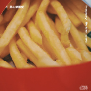

不开心乐园餐
============================

|  |  |
| :--: | :-- |
| [ 不开心乐园餐](https://emumo.xiami.com/album/2105007765) | **艺人**: [happy little cat](../index.md) **语种**: 国语 **唱片公司**: 生煎唱片 **发行时间**: 2019年07月22日 **专辑类别**: 录音室专辑 **专辑风格**: 独立流行 Indie Pop **播放数**: 290483 **收藏数**: 273 **评论数**: 40  |

## 简介

如果你说你很快乐。某种程度上，一定有经历过悲伤，才能体会真正难得的快乐——“需要在一张混乱的网里才能看到。”  
  
不开心的情绪就好像是某种内源性激素，是身体的一部分，我们与之共存，习以为伴。我们并不逃避，也不抗拒描绘它的模样。它来源于自我，也只有自己能够消化。于是我们把它转化成了这一份未经精煮的快餐，然后，或是大口地或是缓慢地，笑着吞食下这些“不开心”。 

## 曲目

## 评论

|  |  |  |  |
| :-- | :-- | :-- | :-- |
|  [虾米用户](https://emumo.xiami.com/u/47762018) 虾米我永远爱你 2021-01-07 19:54 赞(0) 踩(0) | 
拜拜
 |
|  [虾米用户](https://emumo.xiami.com/u/42035302) * MEEK * 2020-11-30 22:51 赞(0) 踩(0) | 
♫
 |
|  [虾米用户](https://emumo.xiami.com/u/47681284) ダメ人間 2020-01-18 16:59 赞(1) 踩(0) | 
饿了
 |
|  [虾米用户](https://emumo.xiami.com/u/92686490) 蝦米 我愛你 2019-12-25 16:01 赞(0) 踩(0) | 

 |
|  [虾米用户](https://emumo.xiami.com/u/266990533) ………… 2019-09-08 18:28 赞(0) 踩(0) | 
看着封面都饿了……
 |
|  [虾米用户](https://emumo.xiami.com/u/16153524) 我还没想好要写什么... 2019-08-18 09:52 赞(0) 踩(0) | 
/
 |
|  [虾米用户](https://emumo.xiami.com/u/1967227) 虾米可以不走吗。 2019-08-06 11:36 赞(1) 踩(0) | 
封面不是一般的可爱
 |
|  [虾米用户](https://emumo.xiami.com/u/425009175) 音乐让人快乐 2019-07-27 09:00 赞(1) 踩(0) | 
Soda是我听到的第一首景儿对外发布的作品。音乐渲染着忧郁，弥漫着寂寞 ，像一个潮湿的下雨天，在街角等待不会来的人，从心慌慌到慢慢沉静。
 |
|  [虾米用户](https://emumo.xiami.com/u/322081403)   2019-07-24 23:00 赞(1) 踩(0) | 
最喜欢的还是soda 和852 ，尤其是soda懒散中的寂寞 ，像个潮湿的下雨天 在等待不会来的人。
 |
|  [虾米用户](https://emumo.xiami.com/u/378752603)  2019-07-24 15:53 赞(2) 踩(0) | 
柔和的音乐中赋予了激情直白的歌词中给予了真理这就是音乐，令人感慨。人生中遇到的真实，由音乐来表达。
 |
|  [虾米用户](https://emumo.xiami.com/u/275544454) 一堆垃圾 2019-07-24 00:07 赞(2) 踩(0) | 

 |
|  [虾米用户](https://emumo.xiami.com/u/427646270)  2019-07-23 23:36 赞(0) 踩(0) | 
再接再励。加油！ 
 |
|  [虾米用户](https://emumo.xiami.com/u/427595071) 酷爱音乐 2019-07-23 22:35 赞(0) 踩(0) | 
      越来越好
 |
|  [虾米用户](https://emumo.xiami.com/u/46583488)  2019-07-23 22:12 赞(0) 踩(0) | 
哈哈哈
 |
|  [虾米用户](https://emumo.xiami.com/u/46583488)  2019-07-23 22:12 赞(0) 踩(0) | 
哈哈哈
 |
|  [虾米用户](https://emumo.xiami.com/u/427646270)  2019-07-23 16:44 赞(0) 踩(0) | 
好有才华。
 |
|  [虾米用户](https://emumo.xiami.com/u/41265111) 土法炼钢 2019-07-23 11:25 赞(0) 踩(0) | 
歌词好会写喔 全都打到我心里
 |
|  [虾米用户](https://emumo.xiami.com/u/49765922)  2019-07-23 01:36 赞(0) 踩(0) | 
喜欢了～
 |
|  [虾米用户](https://emumo.xiami.com/u/5437507) 爱将我们分离 2019-07-22 17:05 赞(0) 踩(0) | 
实体专辑在哪买，我要买
 |
| ⇒ |  [虾米用户](https://emumo.xiami.com/u/3709259) 我还没想好要写什么... 2019-07-22 23:40 赞(0) 踩(0) | 
哈嘍 很感謝你的支持！實體cd可以去微店搜索「生煎唱片SJ-records」就可以找到你想要的樂園餐啦：）
 |
|  [虾米用户](https://emumo.xiami.com/u/405882083) 我还没想好要写什么... 2019-07-22 16:46 赞(0) 踩(0) | 
我不是前二十
 |
|  [虾米用户](https://emumo.xiami.com/u/427580627) 我还没想好要写什么... 2019-07-22 10:31 赞(0) 踩(0) | 
想吃双层吉士汉堡了
 |
|  [虾米用户](https://emumo.xiami.com/u/5402779) 我还没想好要写什么... 2019-07-22 10:26 赞(0) 踩(0) | 
19
 |
|  [虾米用户](https://emumo.xiami.com/u/427595071) 酷爱音乐 2019-07-22 09:22 赞(0) 踩(0) | 
喜欢听
 |
|  [虾米用户](https://emumo.xiami.com/u/49656461)   2019-07-22 08:48 赞(0) 踩(0) | 
！
 |
|  [虾米用户](https://emumo.xiami.com/u/356086) 中部地区软骨病多发型幼猫 2019-07-22 08:01 赞(0) 踩(0) | 
why you treat me this way
 |
|  [虾米用户](https://emumo.xiami.com/u/9523997) 容止 2019-07-22 07:34 赞(0) 踩(0) | 
早呀
 |
|  [虾米用户](https://emumo.xiami.com/u/118150102) 20岁出头的苦日子 2019-07-22 07:06 赞(0) 踩(0) | 
14
 |
|  [虾米用户](https://emumo.xiami.com/u/292484097)   2019-07-22 01:02 赞(1) 踩(0) | 
明天就要去吃开心乐园餐 吃很多很多份 全部都要选择热可可！
 |
|  [虾米用户](https://emumo.xiami.com/u/2594695) 色胺。 2019-07-22 00:38 赞(1) 踩(0) | 
"I wanna go to the island with u."
 |
|  [虾米用户](https://emumo.xiami.com/u/30923006) Be bold. 2019-07-22 00:32 赞(0) 踩(0) | 
10
 |
|  [虾米用户](https://emumo.xiami.com/u/427589261)  2019-07-22 00:30 赞(0) 踩(0) | 
9
 |
|  [虾米用户](https://emumo.xiami.com/u/325763180) 我还没想好要写什么... 2019-07-22 00:28 赞(0) 踩(0) | 
8
 |
|  [虾米用户](https://emumo.xiami.com/u/314233631)  2019-07-22 00:26 赞(0) 踩(0) | 
7
 |
|  [虾米用户](https://emumo.xiami.com/u/275544454) 一堆垃圾 2019-07-22 00:18 赞(0) 踩(0) | 
6
 |
|  [虾米用户](https://emumo.xiami.com/u/113812680) 普通聽眾 2019-07-22 00:16 赞(0) 踩(0) | 
5
 |
|  [虾米用户](https://emumo.xiami.com/u/376917233) 凸凸 2019-07-22 00:15 赞(0) 踩(0) | 
4
 |
|  [虾米用户](https://emumo.xiami.com/u/315172600)  2019-07-22 00:15 赞(0) 踩(0) | 
3
 |
|  [虾米用户](https://emumo.xiami.com/u/377545693)  2019-07-22 00:05 赞(0) 踩(0) | 
2
 |
|  [虾米用户](https://emumo.xiami.com/u/342052)   2019-07-22 00:00 赞(0) 踩(0) | 
1
 |
