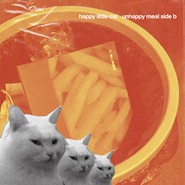

不开心乐园餐 Side-B
============================

|  |  |
| :--: | :-- |
| [ 不开心乐园餐 Side-B](https://emumo.xiami.com/album/5022208694) | **艺人**: [happy little cat](../index.md) **语种**: 国语 **唱片公司**: 独立发行 **发行时间**: 2020年12月21日 **专辑类别**: EP, 单曲 **专辑风格**: 独立流行 Indie Pop, 卧室流行 Bedroom Pop **播放数**: 16180 **收藏数**: 29 **评论数**: 4  |

## 简介

某种程度上，要用非黑即白的方法来划分这个世界的音乐。那应该只有垃圾音乐和不垃圾音乐。很不巧，被豆瓣网友亲切册封为「低仿MLA」（但他们本人很喜欢这个称号）的happy&nbsp;little&nbsp;cat简直就是垃圾音乐中的C位。  
  
在筹备完将于2021发行的全新大型垃圾力作后，他们翻找垃圾桶，发现居然有各种不可回收的，湿的，干的，可燃的等等等等…&nbsp;天哪感觉都开始分裂了呢～&nbsp;但听着好像还可以的样子。连垃圾都如此多元这个世界不能回到简单的快乐了吗？！然而2020就像宇宙的Karma&nbsp;Police一样，被狠狠揍了无数顿后的他们，似乎开始接受了从一开始，这个世界便是多元的。好的那我们在2020的最后把这些可回收垃圾发一发吧！时隔一年的开心猫仔隆重推出垃圾再升级，垃圾中的垃圾！圣诞特别呈现《不开心乐园餐&nbsp;Side&nbsp;B》（弃曲打包滥发合集）诞生了！#TrashPopMatter&nbsp;#MakeTrashPopGreatAgain&nbsp;#MTGA  
  
Track&nbsp;List简介  
  
01&nbsp;hyper&nbsp;little&nbsp;cat（Prod.nanase19）  
  
所有的器乐演奏均来自曾经和我们一起玩过后朋克乐队的吉他手nanase19。以及我们的无意识喃喃自语，一切就这样自然的诞生了。  
  
02&nbsp;lil&nbsp;punk&nbsp;girl&nbsp;forever  
  
献给在《不开心乐园餐》多次献声以及担任封面女郎的猫咪迷笛。她是一个非常有性格和朋克的小猫，虽然她已经回到她的星球，但我们都知道她一直都在的。就像我们身上的刺青一样。  
  
03&nbsp;don't&nbsp;be&nbsp;a&nbsp;b!tch&nbsp;treat&nbsp;yourself&nbsp;so&nbsp;hard  
  
Just&nbsp;don't&nbsp;be&nbsp;a&nbsp;b!tch&nbsp;treat&nbsp;yourself&nbsp;so&nbsp;hard!!Okay?Plzzzz  
  
04&nbsp;What&nbsp;A&nbsp;Pussy&nbsp;(GA¥&nbsp;LITTLE&nbsp;PU$$¥&nbsp;Remix)  
  
整个Remix无论是采样还是编曲都致敬了Our&nbsp;Girl&nbsp;Cardi&nbsp;B和Megan&nbsp;thee&nbsp;Stallion的大热女力单曲《湿湿猫咪》。We‘re&nbsp;that&nbsp;hoes&nbsp;in&nbsp;this&nbsp;house&nbsp;#PussyPower&nbsp;#GirlsRunTheWorld  
  
05&nbsp;852（a&nbsp;Call&nbsp;from&nbsp;Space&nbsp;Remix）  
  
一个充满太空未来感的Remix，它…（编不下去了就是凑数的）。  
  
06&nbsp;Nan&nbsp;Jing（Voice&nbsp;Memo）  
  
阿景语音备忘录里的录音，那些她的口琴和木吉他所产生的共鸣。 

## 曲目

## 评论

|  |  |  |
| :-- | :-- | :-- |
|  [虾米用户](https://emumo.xiami.com/u/439919566)  2021-01-25 16:13 赞(0) 踩(0) | 
舒服
 |
|  [虾米用户](https://emumo.xiami.com/u/3553665) We can be He... 2020-12-21 23:22 赞(0) 踩(0) | 
♡
 |
|  [虾米用户](https://emumo.xiami.com/u/3708501)  2020-12-21 20:54 赞(0) 踩(0) | 

 |
|  [虾米用户](https://emumo.xiami.com/u/92686490) 蝦米 我愛你 2020-12-21 20:22 赞(0) 踩(0) | 
编不下去了kkk
 |
