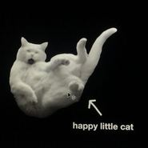
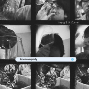
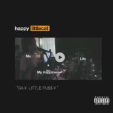
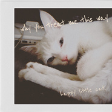

happy little cat
============================

|  |  |
| :--: | :-- |
| [ happy little cat](https://i.xiami.com/yuanzifu) | **播放数**: 506345 **粉丝数**: 748 **评论数**: 39 **地区**: China 中国大陆 **风格**: 独立流行 Indie Pop, 童声合唱团 Children's Chorus  |

## 档案

we do junks.

## 专辑

| 名称 | 语种 | 唱片公司 | 发行时间 | 专辑类别 | 专辑风格 |
| :--: | :-- | :-- | :-- | :-- | :-- |
| [ 不开心乐园餐 Side-B](./albums/5022208694.md) | 国语 | 独立发行 | 2020年12月21日 | EP, 单曲 | 独立流行 Indie Pop, 卧室流行 Bedroom Pop |
| [ Never Mind Still Love u](./albums/2108382021.md) | 英语 | 独立发行 | 2020年04月20日 | EP, 单曲 | 合成器流行 Synthpop, 合成器朋克 Synth Punk |
| [ #meisoverparty#今次仆街派對](./albums/2108160912.md) | 英语 | 独立发行 | 2020年03月21日 | EP, 单曲 | 合成器流行 Synthpop, 迪斯科 Disco |
| [ happy little christmas](./albums/2105618949.md) | 英语 | 独立发行 | 2019年12月24日 | EP, 单曲 | 节日音乐 Holiday, 儿童音乐 Children's Music |
| [ GA¥ LITTLE PU$$¥（開心貓仔）](./albums/2105408900.md) | 英语 |  | 2019年11月05日 | EP, 单曲 |  |
| [ 不开心乐园餐](./albums/2105007765.md) | 国语 | 生煎唱片 | 2019年07月22日 | 录音室专辑 | 独立流行 Indie Pop |
| [ 852](./albums/2104967789.md) | 国语 | 生煎唱片 | 2019年07月01日 | EP, 单曲 |  |
| [ why you treat me this way](./albums/2104835374.md) | 英语 |  | 2019年05月03日 | EP, 单曲 | 独立流行 Indie Pop |

## 评论

|  |  |  |  |
| :-- | :-- | :-- | :-- |
|  [虾米用户](https://emumo.xiami.com/u/110088060) 作为报答、我吔给泥放点、... 2020-12-30 15:23 赞(0) 踩(0) | 
回
 |
|  [虾米用户](https://emumo.xiami.com/u/31213633) I DON'T UNDE... 2020-11-19 02:02 赞(0) 踩(0) | 
sad large dog
 |
|  [虾米用户](https://emumo.xiami.com/u/405992543)  2020-09-04 20:59 赞(0) 踩(0) | 
开心猫仔天天开心
 |
|  [虾米用户](https://emumo.xiami.com/u/271535826) 每个夏天都是独一无二的夏... 2020-08-23 23:31 赞(0) 踩(0) | 

 |
|  [虾米用户](https://emumo.xiami.com/u/427840279) 购买诗集《落日飞奔术》电... 2020-08-17 18:19 赞(0) 踩(0) | 

 |
|  [虾米用户](https://emumo.xiami.com/u/13807161)  2020-07-31 18:57 赞(0) 踩(0) | 

 |
|  [虾米用户](https://emumo.xiami.com/u/427384237) 我还没想好要写什么... 2020-07-19 05:27 赞(0) 踩(0) | 
➕
 |
|  [虾米用户](https://emumo.xiami.com/u/316261284) 到最后…… 2020-05-29 12:32 赞(0) 踩(0) | 

 |
|  [虾米用户](https://emumo.xiami.com/u/117758) 嘴被吞到未来 仅售宇宙 2020-05-16 18:49 赞(0) 踩(0) | 
夏夜里的晚风
 |
|  [虾米用户](https://emumo.xiami.com/u/16153524) 我还没想好要写什么... 2020-05-16 00:04 赞(0) 踩(0) | 
/
 |
|  [虾米用户](https://emumo.xiami.com/u/421578063) fox god 2020-04-20 09:39 赞(0) 踩(0) | 
晚安(&amp;acute;-&amp;omega;ก`)
 |
|  [虾米用户](https://emumo.xiami.com/u/261639006)  2020-03-22 08:39 赞(0) 踩(0) | 
  
 |
|  [虾米用户](https://emumo.xiami.com/u/4926807) 你会变成这样都是我害的 2020-03-21 10:12 赞(0) 踩(0) | 
持续关注，愿开心做音乐
 |
|  [虾米用户](https://emumo.xiami.com/u/52415194) ♬♩♫♪♡ 2020-03-04 00:05 赞(0) 踩(0) | 
happy little cat
 |
|  [虾米用户](https://emumo.xiami.com/u/47681284) ダメ人間 2020-01-18 16:59 赞(0) 踩(0) | 
快乐小猫好听
 |
|  [虾米用户](https://emumo.xiami.com/u/42810132) Aprés l'amou... 2019-09-01 02:30 赞(0) 踩(0) | 

 |
|  [虾米用户](https://emumo.xiami.com/u/29119620) 夜幕海岸線/藍色大門後/... 2019-08-29 08:38 赞(0) 踩(0) | 
浮
 |
|  [虾米用户](https://emumo.xiami.com/u/327952880) Waldeinsamke... 2019-08-25 23:49 赞(0) 踩(0) | 
☁️
 |
|  [虾米用户](https://emumo.xiami.com/u/336023751) 凡音之起，由人心生也。声... 2019-08-21 20:30 赞(0) 踩(0) | 
喜欢
 |
|  [虾米用户](https://emumo.xiami.com/u/27061286) 云ID:韩沐熙 2019-08-18 19:59 赞(0) 踩(0) | 
喜欢
 |
|  [虾米用户](https://emumo.xiami.com/u/48621783) 微信联系 Sacred-... 2019-08-06 08:37 赞(0) 踩(0) | 
√
 |
|  [虾米用户](https://emumo.xiami.com/u/324879742)   2019-07-23 12:51 赞(0) 踩(0) | 
.
 |
|  [虾米用户](https://emumo.xiami.com/u/403382545) 在伸手抓住星星的时候也想... 2019-07-22 21:36 赞(0) 踩(0) | 
棒棒！
 |
|  [虾米用户](https://emumo.xiami.com/u/44970264) 红拂夜奔 2019-06-26 00:32 赞(0) 踩(0) | 
gkd
 |
|  [虾米用户](https://emumo.xiami.com/u/32037636) 我还没想好要写什么... 2019-06-21 22:37 赞(0) 踩(0) | 
来了来了
 |
| ⇒ |  [虾米用户](https://emumo.xiami.com/u/3709259) 我还没想好要写什么... 2019-06-22 10:32 赞(0) 踩(0) | 

 |
|  [虾米用户](https://emumo.xiami.com/u/411058641) 取之不尽 用之不竭 2019-06-11 23:12 赞(2) 踩(0) | 
快乐小猫咪
 |
|  [虾米用户](https://emumo.xiami.com/u/411058641) 取之不尽 用之不竭 2019-06-11 23:11 赞(0) 踩(0) | 
来了
 |
|  [虾米用户](https://emumo.xiami.com/u/51699003) 也是从上个世纪来的呢！ 2019-06-01 22:50 赞(0) 踩(0) | 

 |
| ⇒ |  [虾米用户](https://emumo.xiami.com/u/3709259) 我还没想好要写什么... 2019-06-02 23:20 赞(0) 踩(0) | 
謝謝喜歡：）
 |
| ⇒ |  [虾米用户](https://emumo.xiami.com/u/51699003) 也是从上个世纪来的呢！ 2019-06-02 23:25 赞(0) 踩(0) | 
<q><b>開心貓仔说：</b></q>
 |
|  [虾米用户](https://emumo.xiami.com/u/51699003) 也是从上个世纪来的呢！ 2019-06-01 22:50 赞(0) 踩(0) | 

 |
|  [虾米用户](https://emumo.xiami.com/u/275544454) 一堆垃圾 2019-05-10 00:16 赞(0) 踩(0) | 
hlc专门催工程文件的甲方担当来踩踩了
 |
|  [虾米用户](https://emumo.xiami.com/u/3708501)  2019-04-22 15:59 赞(0) 踩(0) | 
封面hhhhhh
 |
|  [虾米用户](https://emumo.xiami.com/u/292484097)   2019-03-27 19:02 赞(0) 踩(0) | 
love it！
 |
|  [虾米用户](https://emumo.xiami.com/u/346165752)  2019-03-19 22:52 赞(0) 踩(0) | 

 |
|  [虾米用户](https://emumo.xiami.com/u/51642514) 因虾米即将停止服务，且本... 2018-12-14 16:37 赞(0) 踩(0) | 
好听，想和女主唱一起睡觉
 |
| ⇒ |  [虾米用户](https://emumo.xiami.com/u/21845793) 没什么是永恒的 2018-12-14 17:30 赞(0) 踩(0) | 
？
 |
|  [虾米用户](https://emumo.xiami.com/u/10746732)   2018-04-25 12:09 赞(0) 踩(0) | 
好听，想和女主唱一起睡觉
 |
