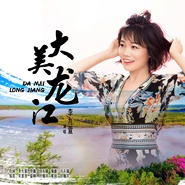

大美龙江
============================

|  |  |
| :--: | :-- |
| [ 大美龙江](https://emumo.xiami.com/album/2106099262) | **艺人**: [李九萱](../index.md) **语种**: 国语 **唱片公司**: 缔美文化 **发行时间**: 2020年02月24日 **专辑类别**: EP, 单曲 **专辑风格**: 国语流行 Mandarin Pop **播放数**: 151 **收藏数**: 1 **评论数**: 0  |

## 简介

“你是童话的世界，冰雪海洋 ，你是那避暑的醉天堂，你是白鹤的故乡，在水一方，你是生我养我的黑龙江”，这首由哈尔滨农耕食品有限公司出品，“大美龙江”品牌创始人、全国满族企家家联盟副主席、北京哈尔滨商会副会长、黑河市工商联副主席付珈洋先生担纲策划和监制的《大美龙江》品牌推广曲于日前重磅首发上线，特邀华语新锐唱将歌手李九萱、音乐人马天瑞等联合打造。  
《大美龙江》主题立意鲜明，歌词有机的融合了龙江自然生态特色，音乐旋律明丽优雅、舒展流畅，契合“大美龙江”品牌文化和企业宗旨。主歌部分通过“冰雪海洋”、“白鹤的故乡”等具象元素，生动描绘了位于祖国“雄鸡”之冠的黑龙江得天独厚的自然生态环境，字字珠玑，是“北国好风光，尽在黑龙江”最好的诠释。   
“龙江大美，大美龙江，绿水青山积聚无限力量；龙江大美，大美龙江，金山银山是你笑傲未来的模样”，探索构建“文化+旅游+扶贫”的新格局，让绿水青山变金山银山，在推进脱贫攻坚过程中，哈尔滨农耕食品有限公司以“用中国最优质的非转基因有机大豆，让你在舌尖上品味这不可多得的美味与健康”作为企业文化和发展动力，成功打造出“大美龙江”特色品牌，一度蝉联黑龙江省农业、林业产业化龙头企业。  
公司立足当前消费升级需求，利用黑龙江丰富的有机非转基因大豆资源，以大豆精深加工作为主导产业，整合黑龙江优质农产品，树立“大美龙江品牌”，使黑龙江的有机农产品走进全国、走向世界，产品已得到了中国、美国、欧盟有机认证，产品现已远销欧洲、美国、日本等国家。公司已经获得国家认证委发的品牌、售后服务双五星认证，中国有机、美国有机、欧盟有机等认证。

## 曲目

## 评论

|  |  |  |  |
| :-- | :-- | :-- | :-- |
