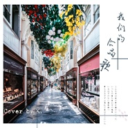
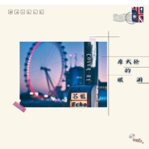
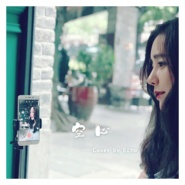
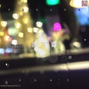
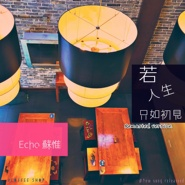
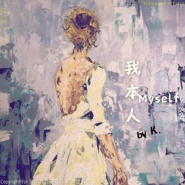
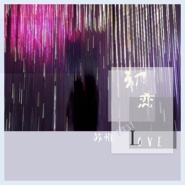

良皓
============================

|  |  |
| :--: | :-- |
| [ 良皓](https://i.xiami.com/floyid) | **播放数**: 2826231 **粉丝数**: 82 **评论数**: 0 **地区**: China 中国大陆 **风格**: 国语流行 Mandarin Pop, 粤语流行 Cantopop, 前卫流行 Progressive Pop  |

## 档案

## 专辑

| 名称 | 语种 | 唱片公司 | 发行时间 | 专辑类别 | 专辑风格 |
| :--: | :-- | :-- | :-- | :-- | :-- |
| [ 屋顶上的猫（demo）#优质demo展示 #词曲](./albums/5022187383.md) | 国语 | 独立发行 | 2020年12月15日 | 录音室专辑 | 流行 Pop |
| [ 楚门的世界（Demo）#优质demo展示 #词曲](./albums/5022178815.md) | 国语 | 独立发行 | 2020年12月13日 | 录音室专辑 | 流行 Pop |
| [ 宽限期（demo）#优质小样展示 #词曲作品](./albums/5022193570.md) | 国语 | 独立发行 | 2020年10月26日 | 录音室专辑 | 流行 Pop |
| [ 陪你#作曲#混音作品展示#](./albums/2104881826.md) | 国语 |  | 2019年05月20日 | 录音室专辑 | 流行 Pop, 国语流行 Mandarin Pop |
| [ 一心#Cover#mixing#](./albums/2104798838.md) | 国语 |  | 2019年04月23日 | 录音室专辑 | 国语流行 Mandarin Pop |
| [ 浪漫来袭（Cover：Elva Hsiao萧亚轩）#翻唱#混音作品展示](./albums/2104427519.md) | 国语 | 独立发行 | 2018年12月29日 | 录音室专辑 | 流行 Pop, 国语流行 Mandarin Pop |
| [ 我们的合唱歌（Remaster|Cover by K.）#翻唱#混音与母带作品展示](./albums/2104281350.md) | 粤语 | 独立发行 | 2018年11月26日 | 录音室专辑 | 流行 Pop, 粤语流行 Cantopop |
| [ 都是你的错（Remaster|粤语版）#翻唱#混音作品展示](./albums/2104273240.md) | 粤语 | 独立发行 | 2018年11月25日 | 录音室专辑 | 流行 Pop, 粤语流行 Cantopop |
| [ 明明（Remaster|正式版）#翻唱#混音与母带工程展示](./albums/2104280205.md) | 粤语 | 独立发行 | 2018年11月25日 | 录音室专辑 | 流行 Pop, 粤语流行 Cantopop |
| [ Echo.Tsu(苏惟) Cover Collection#翻唱#混音#母带工程展示](./albums/2104195935.md) | 国语 | 独立发行 | 2018年11月09日 | 录音室专辑 | 流行 Pop, 国语流行 Mandarin Pop, 粤语流行 Cantopop |
| [ 摩天轮的眼泪#翻唱#混音工程展示](./albums/2104195752.md) | 国语 | 独立发行 | 2018年11月09日 | 录音室专辑 | 流行 Pop, 国语流行 Mandarin Pop |
| [ 你是我最爱的人#Cover#混音作品展示](./albums/2104144564.md) | 国语 | 独立发行 | 2018年10月25日 | 录音室专辑 | 流行 Pop, 国语流行 Mandarin Pop |
| [ 光年之外#Cover#混音作品展示](./albums/2104085042.md) | 国语 | 独立发行 | 2018年10月08日 | 录音室专辑 | 流行 Pop, 国语流行 Mandarin Pop |
| [ 再见#混音#母带作品展示](./albums/2104082029.md) | 国语 | 独立发行 | 2018年10月05日 | 录音室专辑 | 流行 Pop, 国语流行 Mandarin Pop |
| [ 扶摇#翻唱#混音#母带作品展示](./albums/2104052074.md) | 国语 | 独立发行 | 2018年09月25日 | 录音室专辑 | 流行 Pop, 国语流行 Mandarin Pop |
| [ 宿世恋#作曲#Remasterd母带作品展示](./albums/2104036122.md) | 国语 | 独立发行 | 2018年09月18日 | 录音室专辑 | 流行 Pop, 国语流行 Mandarin Pop |
| [ 请不要#作曲#Remasterd母带作品展示](./albums/2104034667.md) | 国语 | 独立发行 | 2018年09月17日 | 录音室专辑 | 流行 Pop, 国语流行 Mandarin Pop |
| [ First Love#作曲#Remasterd母带作品展示](./albums/2104035853.md) | 国语 | 独立发行 | 2018年09月17日 | 录音室专辑 | 流行 Pop, 国语流行 Mandarin Pop |
| [ 吴哥窟#翻唱#混音作品展示(Cover by 苏惟)](./albums/2104034043.md) | 粤语 | 独立发行 | 2018年09月16日 | 录音室专辑 | 流行 Pop, 粤语流行 Cantopop |
| [ 我是你的#Remasterd作曲作品展示](./albums/2104034207.md) | 国语 | 独立发行 | 2018年09月16日 | 录音室专辑 | 流行 Pop, 国语流行 Mandarin Pop |
| [ 小城大事（Cover by 苏惟）#翻唱#混音作品展示](./albums/2104013023.md) | 粤语 | 独立发行 | 2018年09月11日 | 录音室专辑 | 流行 Pop, 粤语流行 Cantopop |
| [ 我喜欢上你时的内心活动（Cover by Echo苏惟）#翻唱#混音作品展示](./albums/2103954510.md) | 国语 | 独立发行 | 2018年09月01日 | 录音室专辑 | 流行 Pop, 国语流行 Mandarin Pop |
| [ 你无法叫醒一个装睡的人#翻唱#混音作品展示（Cover by Echo苏惟）](./albums/2103960427.md) | 国语 | 独立发行 | 2018年09月01日 | 录音室专辑 | 流行 Pop, 国语流行 Mandarin Pop |
| [ 空心#混音，翻唱作品展示（Cover by 苏惟）](./albums/2103948658.md) | 国语 | 独立发行 | 2018年08月28日 | 录音室专辑 | 流行 Pop, 国语流行 Mandarin Pop |
| [ 致闺蜜#Remasterd](./albums/2103792682.md) | 国语 | 北京热度音乐 | 2018年07月06日 | 录音室专辑 | 国语流行 Mandarin Pop, 流行 Pop |
| [ 你还爱不爱我 (remasterd)remasterd作品展示](./albums/2103833428.md) | 国语 | 北京热度音乐 | 2018年03月21日 | 录音室专辑 | 国语流行 Mandarin Pop, 流行 Pop |
| [ 请不要作品展示](./albums/2103771182.md) | 国语 | 独立发行 | 2017年09月09日 | 录音室专辑 | 国语流行 Mandarin Pop, 流行 Pop |
| [ 若人生只如初见#Remasted母带作品展示](./albums/2103796300.md) | 国语 | 独立发行 | 2017年08月05日 | 录音室专辑 | 国语流行 Mandarin Pop, 流行 Pop |
| [ 等半天（cover by K.）混音作品展示](./albums/2103788985.md) | 粤语 | 独立发行 | 2016年10月02日 | 录音室专辑 | 粤语流行 Cantopop, 流行 Pop |
| [ 我本人（cover）混音作品展示](./albums/2103788988.md) | 粤语 | 独立发行 | 2016年09月02日 | 录音室专辑 | 粤语流行 Cantopop, 流行 Pop |
| [ 吴哥窟Cover混音作品展示](./albums/2103788704.md) | 粤语 | 独立发行 | 2015年09月09日 | 录音室专辑 | 粤语流行 Cantopop, 流行 Pop |
| [ 初恋 (Original demo version)作品展示](./albums/2103753606.md) | 国语 | 独立发行 | 2013年06月28日 | 录音室专辑 | 国语流行 Mandarin Pop, 流行 Pop |
| [ 宿世恋作品展示](./albums/2103753627.md) | 国语 | 独立发行 | 2013年05月01日 | 录音室专辑 | 国语流行 Mandarin Pop, 流行 Pop |
| [ 重生的蔷薇作曲、编曲作品展示](./albums/2103753633.md) | 国语 | 独立发行 | 2013年04月17日 | 录音室专辑 | 国语流行 Mandarin Pop, 流行 Pop |
| [ 我都想知道作品展示](./albums/2103717350.md) | 国语 | 独立发行 | 2013年03月03日 | 录音室专辑 | 国语流行 Mandarin Pop |
| [ 月亮代表我的心(Guitar version)翻弹展示](./albums/2103753632.md) | 纯音乐 | 独立发行 | 2009年05月03日 | 录音室专辑 | 轻音乐 Easy Listening, 器乐独奏 Solo Instrumental |

## 评论

|  |  |  |  |
| :-- | :-- | :-- | :-- |
