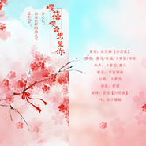

さくら ~あなたに出会えてよかった~
============================

|  |  |
| :--: | :-- |
| [ さくら ~あなたに出会えてよかった~](https://emumo.xiami.com/album/2103713634) | **艺人**: [鹿马Lmua](../index.md) **语种**: 日语 **唱片公司**: 独立发行 **发行时间**: 2018年05月10日 **专辑类别**: EP, 单曲 **专辑风格**: 流行 Pop, 日本流行 J-Pop **播放数**: 181546 **收藏数**: 12 **评论数**: 0  |

## 简介

さくら ~あなたに出会えてよかった~  
策划：杜笑酥【归思敛】  
演唱：鹿马/牧城/卡萝因/碎花  
和声：鹿马  
修音：宇宙师妹  
后期：卡萝因  
海报：箜篌  
画师：吾名【归思敛】  
PV：负子蟾蜍  
  
这是一年前录的歌了好嫌弃当时的自己啊....你们听不出我听不出我听不出我！！！最后要感谢努力又优秀的大家！！！嘤嘤嘤！！！  

## 曲目

## 评论

