鹿马Lmua
============================

|  |  |
| :--: | :-- |
| [ 鹿马Lmua](https://i.xiami.com/yukidaruma) | **地区**: China 中国大陆 **风格**: 国语流行 Mandarin Pop, 日本流行 J-Pop, 韩国流行 K-Pop, 欧美流行 Western Pop, 古风 GuFeng Music **播放数**: 13333034 **粉丝数**: 1139 **评论数**: 62  |

## 档案

開心一點！

## 专辑

| 名称 | 语种 | 唱片公司 | 发行时间 | 专辑类别 | 专辑风格 |
| :--: | :-- | :-- | :-- | :-- | :-- |
| [ 风と丘のバラード《交响情人梦》14周年纪念](./albums/5021712004.md) | 日语 | 独立发行 | 2020年10月19日 | EP, 单曲 | 流行 Pop, 日本流行 J-Pop |
| [ 杨花落尽子规啼](./albums/5021550129.md) | 国语 | 独立发行 | 2020年09月27日 | EP, 单曲 | 古风 GuFeng Music |
| [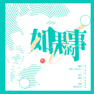 如果的事我只要你一件如果的事](./albums/5021176901.md) | 国语 | 独立发行 | 2020年07月29日 | EP, 单曲 | 流行 Pop, 国语流行 Mandarin Pop |
| [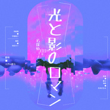 【名偵探喬鹿】喬と鹿のロマン「名探偵コナン」ED3](./albums/5021073277.md) | 日语 | 独立发行 | 2020年07月12日 | EP, 单曲 | 流行 Pop, 日本流行 J-Pop |
| [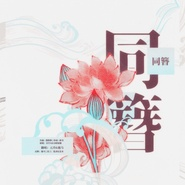 【乔鹿发糖】同簪](./albums/2108388027.md) | 国语 | 独立发行 | 2020年04月18日 | EP, 单曲 | 古风 GuFeng Music |
| [ 乘云归雙倍溫柔的「まるルマ」給寧唱首歌](./albums/2108383015.md) | 国语 | 独立发行 | 2020年04月18日 | EP, 单曲 | 古风 GuFeng Music |
| [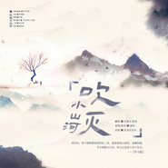 吹灭小山河](./albums/2420324140.md) | 国语 | 独立发行 | 2020年02月27日 | EP, 单曲 | 古风 GuFeng Music |
| [ 抖音片段合集](./albums/2105905698.md) | 国语 | 独立发行 | 2020年02月12日 | 合集, 杂锦 | 流行 Pop, 日本流行 J-Pop, 古风 GuFeng Music |
| [ あったかいんだからぁ正因为温暖](./albums/2105797121.md) | 日语 | 独立发行 | 2020年01月30日 | EP, 单曲 | 流行 Pop, 日本流行 J-Pop |
| [ 寓言](./albums/2105791880.md) | 国语 | 独立发行 | 2020年01月29日 | EP, 单曲 | 流行 Pop, 国语流行 Mandarin Pop |
| [ 「S*ONE」如果女团唱《FLASH》](./albums/2105253681.md) | 韩语 |  | 2019年09月17日 | EP, 单曲 | 韩国流行 K-Pop, 女子团体 Girl Group, 男孩团体 Boy Band |
| [ 「S*ONE」现在是《蜕变》的时候](./albums/2105202825.md) | 国语 |  | 2019年08月31日 | EP, 单曲 | 流行 Pop, 国语流行 Mandarin Pop |
| [ 「S*ONE」谁都别吝啬天竺壶妹激情翻唱](./albums/2105160326.md) | 国语 |  | 2019年08月18日 | EP, 单曲 | 流行 Pop, 国语流行 Mandarin Pop, 男孩团体 Boy Band |
| [ 「S*ONE」ご機嫌サヨナラ（日韩双语ver.）涉谷街头的IZ*ONE「好心情再见」日韩双语翻唱，唱完这首就分手（不！](./albums/2105050408.md) | 日语 |  | 2019年07月27日 | EP, 单曲 | 流行 Pop, 韩国流行 K-Pop, 女子团体 Girl Group |
| [ 入你情涡](./albums/2105050414.md) | 国语 |  | 2019年07月26日 | EP, 单曲 | 流行 Pop, 国语流行 Mandarin Pop |
| [ 「S*ONE」Violeta/비올레타全网第一清爽「Violeta」翻唱，绝美和声极度舒适，点击收获五朵夏季紫罗兰](./albums/2105050331.md) | 韩语 |  | 2019年05月30日 | EP, 单曲 | 流行 Pop, 韩国流行 K-Pop, 女子团体 Girl Group |
| [ 「S*ONE」Rumor全网最还原「Rumor」性感翻唱，权姐高音附体＆野猫集体出巡！](./albums/2105050263.md) | 韩语 |  | 2019年04月20日 | EP, 单曲 | 流行 Pop, 韩国流行 K-Pop, 女子团体 Girl Group |
| [ 人间一场——朱一龙应援曲](./albums/2104841160.md) | 国语 |  | 2019年04月16日 | EP, 单曲 | 流行 Pop, 国语流行 Mandarin Pop |
| [ 「S*ONE」好きと言わせたい快说你喜欢我！！IZ*ONE「好きと言わせたい」强势翻唱！直击大型真香现场！](./albums/2105050252.md) | 日语 |  | 2019年03月24日 | EP, 单曲 | 流行 Pop, 女子团体 Girl Group, 日本流行 J-Pop |
| [ 「S*ONE」Peek-A-Boo/ 피카부全网第一灵异「Peek-A-Boo」翻唱！五个美少女（六个？）邀请你一起来爱的躲猫猫~](./albums/2105050150.md) | 韩语 |  | 2019年03月02日 | EP, 单曲 | 流行 Pop, 韩国流行 K-Pop |
| [ 每一天都很甜情人节快乐！](./albums/2104595773.md) | 国语 |  | 2019年02月14日 | EP, 单曲 | 国语流行 Mandarin Pop |
| [ 「S*ONE」La Vie en Rose/라비앙로즈Cover IZ*ONE](./albums/2105050076.md) | 韩语 |  | 2018年12月30日 | EP, 单曲 | 流行 Pop, 韩国流行 K-Pop |
| [ 来不及勇敢——电影《昨日青空》青春告白曲](./albums/2104396974.md) | 国语 |  | 2018年12月20日 | EP, 单曲 | 国语流行 Mandarin Pop |
| [ 【猪窝三人组】卡路里](./albums/2104037105.md) | 国语 | 独立发行 | 2018年09月17日 | EP, 单曲 | 流行 Pop, 国语流行 Mandarin Pop |
| [ 【七夕快乐】粉红色的回忆](./albums/2104038539.md) | 国语 | 独立发行 | 2018年08月17日 | EP, 单曲 | 流行 Pop, 国语流行 Mandarin Pop |
| [ 发首歌祝自己生日快乐素敵なことがあなたを待っている](./albums/2103859855.md) | 日语 | 独立发行 | 2018年07月28日 | EP, 单曲 | 流行 Pop, 日本流行 J-Pop, 日本动漫游戏 Japanese ACG |
| [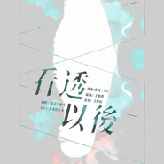 看透以后](./albums/2103833417.md) | 国语 | 独立发行 | 2018年07月23日 | EP, 单曲 | 流行 Pop, 国语流行 Mandarin Pop, 网络流行 Cyber Hit |
| [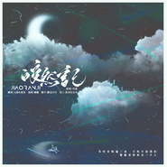 皎然记](./albums/2103799929.md) | 国语 | 独立发行 | 2018年07月12日 | EP, 单曲 | 古风 GuFeng Music |
| [ 抓一位小澜海陪我掉进爱情海里](./albums/2103762528.md) | 国语 | 独立发行 | 2018年06月26日 | EP, 单曲 | 流行 Pop, 国语流行 Mandarin Pop, 电视原声 Television Music |
| [ 一拜天地](./albums/2103745861.md) | 国语 | 独立发行 | 2018年06月11日 | EP, 单曲 | 古风 GuFeng Music |
| [ 【光怪鹿离】化作樱花树——向即将告别的青春致敬](./albums/2103724731.md) | 国语 | 独立发行 | 2018年05月31日 | EP, 单曲 | 国语流行 Mandarin Pop, 流行 Pop |
| [ さくら ~あなたに出会えてよかった~](./albums/2103713634.md) | 日语 | 独立发行 | 2018年05月10日 | EP, 单曲 | 流行 Pop, 日本流行 J-Pop |
| [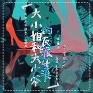 大小姐和大少爷的反派生涯](./albums/2103713585.md) | 国语 | 独立发行 | 2018年05月03日 | EP, 单曲 | 流行 Pop, 国语流行 Mandarin Pop, 网络流行 Cyber Hit |
| [ 嫣然记](./albums/2103712797.md) | 国语 | 独立发行 | 2018年04月20日 | EP, 单曲 | 古风 GuFeng Music |
| [ 晚霞和夕阳（Cover 歳月-云流れ-）晚安，哄你睡](./albums/2103713583.md) | 国语 | 独立发行 | 2018年03月02日 | EP, 单曲 | 网络流行 Cyber Hit, 轻音乐 Easy Listening |
| [ 霄雪——宫主生贺](./albums/2103713620.md) | 国语 | 独立发行 | 2018年03月01日 | EP, 单曲 | 古风 GuFeng Music |
| [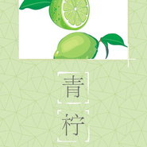 青柠](./albums/2103713579.md) | 国语 | 独立发行 | 2018年02月14日 | EP, 单曲 | 流行 Pop, 国语流行 Mandarin Pop, 网络流行 Cyber Hit |
| [ 犹欢——《西涯侠》秦欢个人向角色歌](./albums/2103713616.md) | 国语 | 独立发行 | 2018年01月31日 | EP, 单曲 | 古风 GuFeng Music |
| [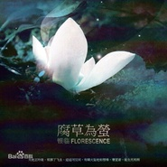 腐草为萤](./albums/2103713614.md) | 国语 | 独立发行 | 2018年01月27日 | EP, 单曲 | 古风 GuFeng Music |
| [ 千梦](./albums/2103713611.md) | 国语 | 独立发行 | 2018年01月03日 | EP, 单曲 | 古风 GuFeng Music |
| [ 红白种](./albums/2103713578.md) | 国语 | 独立发行 | 2017年12月01日 | EP, 单曲 | 流行 Pop, 国语流行 Mandarin Pop, 网络流行 Cyber Hit |
| [ Hold Your Hand](./albums/2103713628.md) | 日语 | 独立发行 | 2017年11月07日 | EP, 单曲 | 流行 Pop, 日本流行 J-Pop, 电音流行 Electropop |
| [ 九张机](./albums/2103713598.md) | 国语 | 独立发行 | 2017年09月10日 | EP, 单曲 | 古风 GuFeng Music |
| [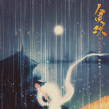 贪欢](./albums/2103713594.md) | 国语 | 独立发行 | 2017年08月28日 | EP, 单曲 | 古风 GuFeng Music |
| [ 夜蝶](./albums/2103713577.md) | 国语 | 独立发行 | 2017年08月09日 | EP, 单曲 | 流行 Pop, 国语流行 Mandarin Pop, 女子团体 Girl Group |
| [ 归途才降临的星城市爬行地图——公交站牌](./albums/2103713574.md) | 国语 | 独立发行 | 2017年08月07日 | EP, 单曲 | 流行 Pop, 国语流行 Mandarin Pop, 网络流行 Cyber Hit |
| [ 追光者](./albums/2103713571.md) | 国语 | 独立发行 | 2017年07月23日 | EP, 单曲 | 国语流行 Mandarin Pop |
| [ 刚好遇见你](./albums/2103713392.md) | 国语 | 独立发行 | 2017年06月14日 | 精选集 | 国语流行 Mandarin Pop, 流行 Pop |
| [ 夜游园](./albums/2103713587.md) | 国语 | 独立发行 | 2017年05月08日 | EP, 单曲 | 古风 GuFeng Music |
| [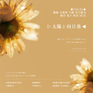 太陽と向日葵](./albums/2103713632.md) | 日语 | 独立发行 | 2017年05月01日 | EP, 单曲 | 流行 Pop, 日本流行 J-Pop |
| [ 还不是因为我长得太好看](./albums/2103713569.md) | 国语 | 独立发行 | 2017年04月10日 | EP, 单曲 | 网络流行 Cyber Hit |
| [ 蛍](./albums/2103713626.md) | 日语 | 独立发行 | 2017年03月29日 | EP, 单曲 | 日本流行 J-Pop, 流行 Pop |
| [ 东风志](./albums/2103713394.md) | 国语 | 独立发行 | 2017年02月06日 | EP, 单曲 | 古风 GuFeng Music |
| [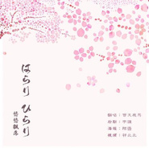 はらり、ひらり《遥远时空中~舞一夜》ED](./albums/2103713384.md) | 日语 | 独立发行 | 2016年07月04日 | EP, 单曲 | 日本流行 J-Pop, 日本动漫游戏 Japanese ACG |
| [ 【深海】想活在深海，多么安靜又自在](./albums/2108384021.md) | 国语 | 独立发行 | 不详 | EP, 单曲 | 流行 Pop, 国语流行 Mandarin Pop |

## 评论

|  |  |  |
| :-- | :-- | :-- |
|  [虾米用户](https://emumo.xiami.com/u/9514447)  2021-01-07 07:55 赞(0) 踩(0) | 
声音还行 被歌毁了
 |
|  [虾米用户](https://emumo.xiami.com/u/358104299) 悲观的唯心存在现实解构虚... 2020-12-31 08:46 赞(0) 踩(0) | 
44724
 |
|  [虾米用户](https://emumo.xiami.com/u/50251807) 心随乐乐 2020-12-20 20:25 赞(0) 踩(0) | 
光和影的浪漫，谢谢！
 |
|  [虾米用户](https://emumo.xiami.com/u/215157639) Odyssey 2020-10-08 21:54 赞(0) 踩(0) | 
好想看鹿马小姐姐真人
 |
|  [虾米用户](https://emumo.xiami.com/u/412635451)  2020-08-28 07:36 赞(0) 踩(0) | 
马鹿小姐姐的声音意外的好听呐
 |
|  [虾米用户](https://emumo.xiami.com/u/254545024)  2020-04-23 00:05 赞(1) 踩(0) | 
好听
 |
|  [虾米用户](https://emumo.xiami.com/u/422986414) 未曾谋面的也终将会相遇. 2020-04-22 11:28 赞(1) 踩(0) | 
我的天，声音好仙哦！
 |
|  [虾米用户](https://emumo.xiami.com/u/91365200)  2020-04-20 04:17 赞(0) 踩(0) | 
声音真的好听 加油
 |
|  [虾米用户](https://emumo.xiami.com/u/27794699)   2020-03-21 21:38 赞(0) 踩(0) | 
因为吹灭萧山河的翻唱而来，太好听啦~
 |
| ⇒ |  [虾米用户](https://emumo.xiami.com/u/316941037) 彈彈琴唱唱歌，開心就好。 2020-04-18 20:35 赞(0) 踩(0) | 
hhhh谢谢！
 |
|  [虾米用户](https://emumo.xiami.com/u/400315396) 孤独又何惧 2019-11-24 20:04 赞(0) 踩(0) | 
非常好听
 |
|  [虾米用户](https://emumo.xiami.com/u/52056952) 人生即是到來、相遇、陪伴... 2019-08-02 16:29 赞(2) 踩(0) | 
( *￣▽￣)((≧︶≦*)
 |
|  [虾米用户](https://emumo.xiami.com/u/405994841)  2019-07-13 20:29 赞(0) 踩(0) | 
因为这首歌我从小听到大
 |
|  [虾米用户](https://emumo.xiami.com/u/405994841)  2019-07-13 20:28 赞(0) 踩(0) | 
只喜欢你的樱花樱花想见你
 |
|  [虾米用户](https://emumo.xiami.com/u/2358955) 我很丑 而且我也不温柔 2019-06-12 00:06 赞(0) 踩(0) | 
这是不是传说中的女神音。
 |
|  [虾米用户](https://emumo.xiami.com/u/353121375) 听他人的悲欢离合，悲自己... 2019-06-07 16:17 赞(0) 踩(0) | 
小姐姐声音巨好听啊啊啊啊啊啊啊啊啊啊啊！！！！ 每首歌都忍不住想载呀
 |
| ⇒ |  [虾米用户](https://emumo.xiami.com/u/316941037) 彈彈琴唱唱歌，開心就好。 2019-08-22 13:07 赞(0) 踩(0) | 
555555谢谢喜欢！！
 |
|  [虾米用户](https://emumo.xiami.com/u/283529614) 嘘我是一只小白呀 2019-05-22 12:50 赞(1) 踩(0) | 
小姐姐嗓子被天使吻过吗超喜欢!!（*/∇＼*）超喜欢化作樱花树!
 |
|  [虾米用户](https://emumo.xiami.com/u/306065331) 幸福开始有人选 2019-05-05 22:58 赞(0) 踩(0) | 
Dakota
 |
|  [虾米用户](https://emumo.xiami.com/u/377212068)  2019-05-03 22:57 赞(0) 踩(0) | 
鹿马小姐姐，你是Ay君吗
 |
| ⇒ |  [虾米用户](https://emumo.xiami.com/u/316941037) 彈彈琴唱唱歌，開心就好。 2019-05-05 22:25 赞(0) 踩(0) | 
hhhh不是啊，ay君是男孩子吧
 |
|  [虾米用户](https://emumo.xiami.com/u/6205474) 我只是个酱油~ 2019-04-26 21:31 赞(0) 踩(0) | 
~~~~~~~~~~~~~~~~~~~~~~~~~~~~~~ ~~~
 |
|  [虾米用户](https://emumo.xiami.com/u/293692544) 你敢给我说话吗？我咬你 2019-04-18 05:16 赞(1) 踩(0) | 
好听
 |
|  [虾米用户](https://emumo.xiami.com/u/283131299) 我还没想好要写什么... 2019-04-17 10:50 赞(1) 踩(0) | 
sakura 翻唱的阔以 
 |
|  [虾米用户](https://emumo.xiami.com/u/14311491) 反正她都不能瘦 2019-03-10 10:24 赞(3) 踩(0) | 
为啥你们的嗓子都是天使吻过的？
 |
|  [虾米用户](https://emumo.xiami.com/u/2422080) 来瓶83年的矿泉水~ 2019-03-05 18:49 赞(2) 踩(0) | 
第一眼，马鹿......罪过...... 然后，爱上小姐姐的声音了
 |
| ⇒ |  [虾米用户](https://emumo.xiami.com/u/316941037) 彈彈琴唱唱歌，開心就好。 2019-05-05 22:26 赞(0) 踩(0) | 
哈哈哈哈哈哈看起来是很像马鹿
 |
| ⇒ |  [虾米用户](https://emumo.xiami.com/u/2422080) 来瓶83年的矿泉水~ 2019-05-06 09:41 赞(0) 踩(0) | 
<q><b>鹿马Lmua说：</b></q>
 |
| ⇒ |  [虾米用户](https://emumo.xiami.com/u/380228965) 我还沒想好要写什幺… 2019-11-20 22:46 赞(0) 踩(0) | 
看了你的评论才知道自己也看错顺序了 
 |
| ⇒ |  [虾米用户](https://emumo.xiami.com/u/2422080) 来瓶83年的矿泉水~ 2019-11-22 08:47 赞(0) 踩(0) | 
<q><b>宫徵羽说：</b></q>
 |
|  [虾米用户](https://emumo.xiami.com/u/411056368)  2019-02-12 13:22 赞(1) 踩(0) | 

 |
|  [虾米用户](https://emumo.xiami.com/u/328657369) 风格随心而变、 2019-01-05 16:10 赞(1) 踩(0) | 

 |
|  [虾米用户](https://emumo.xiami.com/u/301945982) 看似有情 2019-01-03 12:57 赞(2) 踩(0) | 
苏苏的女声，喜欢
 |
|  [虾米用户](https://emumo.xiami.com/u/201652283)  2018-12-26 21:55 赞(2) 踩(0) | 
啊啊啊一拜天地太好听了趴
 |
|  [虾米用户](https://emumo.xiami.com/u/192574113)  2018-10-28 11:05 赞(1) 踩(0) | 
       
 |
|  [虾米用户](https://emumo.xiami.com/u/405300116)  2018-10-10 18:26 赞(1) 踩(0) | 
       
 |
|  [虾米用户](https://emumo.xiami.com/u/405300116)  2018-10-10 18:24 赞(1) 踩(0) | 
 
 |
|  [虾米用户](https://emumo.xiami.com/u/400288768) ……资深腐女一枚…… 2018-09-23 10:20 赞(1) 踩(0) | 
一拜天地也太好听了！被雷到了！
 |
| ⇒ |  [虾米用户](https://emumo.xiami.com/u/316941037) 彈彈琴唱唱歌，開心就好。 2018-09-24 11:40 赞(0) 踩(0) | 
 
 |
|  [虾米用户](https://emumo.xiami.com/u/187502143) ☾ 2018-08-03 19:45 赞(3) 踩(0) | 
我的天！！！！因为虾米没有好像掉进爱情海里原版，就想着说听听自歌手的！！然后第一句就被震惊了！！！！！声音太好听了！！！！！！！！！！！！！！！！！！有毒一样！！！！！！！我听到停不下来！！！！！
 |
|  [虾米用户](https://emumo.xiami.com/u/342424763) 劝君惜取少年时。 2018-08-03 13:43 赞(11) 踩(0) | 
超喜欢您唱的一拜天地啊！贼好听了 
 |
| ⇒ |  [虾米用户](https://emumo.xiami.com/u/316941037) 彈彈琴唱唱歌，開心就好。 2018-08-04 20:05 赞(0) 踩(0) | 
呜呜呜呜谢谢!!
 |
| ⇒ |  [虾米用户](https://emumo.xiami.com/u/342424763) 劝君惜取少年时。 2018-08-04 20:27 赞(0) 踩(0) | 
<q><b>鹿马Lmua说：</b></q>
 |
|  [虾米用户](https://emumo.xiami.com/u/361460042) 喜欢银魂 2018-08-01 11:02 赞(4) 踩(0) | 
我还是接受不了周存太太和洛天依的那首歌变成你唱的。更喜欢洛天依的电子歌姬的声音
 |
| ⇒ |  [虾米用户](https://emumo.xiami.com/u/316941037) 彈彈琴唱唱歌，開心就好。 2018-08-01 11:07 赞(0) 踩(0) | 
？？？你喜欢洛天依的版本去找来听就可以了，不必在我这里评论。 【高亮】另外请你注意用词，什么叫&amp;ldquo;变&amp;rdquo;成我唱的？？？这首歌是可以翻唱的，我也写明了是翻唱，你不愿意听就别在这废话了吧，闲的难受吗？想挑事啊？ 出门右转不送。
 |
| ⇒ |  [虾米用户](https://emumo.xiami.com/u/361460042) 喜欢银魂 2018-08-02 02:16 赞(0) 踩(0) | 
<q><b>鹿马Lmua说：</b></q>
 |
| ⇒ |  [虾米用户](https://emumo.xiami.com/u/303774307)  2019-06-29 13:01 赞(0) 踩(0) | 
<q><b>鹿马Lmua说：</b></q>
 |
| ⇒ |  [虾米用户](https://emumo.xiami.com/u/379392597) dying 2019-12-30 23:15 赞(0) 踩(0) | 
<q><b>鹿马Lmua说：</b></q>
 |
| ⇒ |  [虾米用户](https://emumo.xiami.com/u/316941037) 彈彈琴唱唱歌，開心就好。 2020-04-18 20:35 赞(0) 踩(0) | 
<q><b>烺烺是咸鱼画手求约稿‼️说：</b></q>
 |
|  [虾米用户](https://emumo.xiami.com/u/302414709)  2018-07-29 15:00 赞(2) 踩(0) | 
内容已删除
 |
| ⇒ |  [虾米用户](https://emumo.xiami.com/u/316941037) 彈彈琴唱唱歌，開心就好。 2018-07-30 10:01 赞(0) 踩(0) | 
嘻嘻嘻谢谢！
 |
|  [虾米用户](https://emumo.xiami.com/u/289100543)  2018-07-22 17:48 赞(1) 踩(0) | 
忍不住，还是写了。翻歌的时候，看到姐姐的介绍，太激动了⊙&amp;forall;⊙！
 |
| ⇒ |  [虾米用户](https://emumo.xiami.com/u/316941037) 彈彈琴唱唱歌，開心就好。 2018-07-22 18:22 赞(0) 踩(0) | 
嘻嘻嘻嘻嘻嘻嘻嘻
 |
| ⇒ |  [虾米用户](https://emumo.xiami.com/u/289100543)  2018-07-22 18:25 赞(0) 踩(0) | 
<q><b>鹿马Lmua说：</b></q>
 |
| ⇒ |  [虾米用户](https://emumo.xiami.com/u/316941037) 彈彈琴唱唱歌，開心就好。 2018-07-22 18:28 赞(0) 踩(0) | 
<q><b>西一星说：</b></q>
 |
|  [虾米用户](https://emumo.xiami.com/u/376003908) 点缀一丝画框里的宁静，保... 2018-06-18 20:56 赞(2) 踩(0) | 
666
 |
|  [虾米用户](https://emumo.xiami.com/u/351526183)  2018-05-25 21:33 赞(3) 踩(0) | 
小姐姐声音太好听了嘛 
 |
| ⇒ |  [虾米用户](https://emumo.xiami.com/u/316941037) 彈彈琴唱唱歌，開心就好。 2018-05-26 10:24 赞(0) 踩(0) | 
哇蟹蟹！
 |
| ⇒ |  [虾米用户](https://emumo.xiami.com/u/351526183)  2018-05-26 13:33 赞(0) 踩(0) | 
<q><b>鹿马Lmua说：</b></q>
 |
| ⇒ |  [虾米用户](https://emumo.xiami.com/u/316941037) 彈彈琴唱唱歌，開心就好。 2018-05-26 22:06 赞(0) 踩(0) | 
<q><b>彩虹蛇皮说：</b></q>
 |
|  [虾米用户](https://emumo.xiami.com/u/299381870) 宁教我负天下人，不叫天下... 2018-05-22 11:34 赞(2) 踩(0) | 
第1，求小姐姐翻牌
 |
| ⇒ |  [虾米用户](https://emumo.xiami.com/u/316941037) 彈彈琴唱唱歌，開心就好。 2018-05-24 12:01 赞(0) 踩(0) | 
哇！中午好！
 |
| ⇒ |  [虾米用户](https://emumo.xiami.com/u/405300116)  2018-10-10 18:26 赞(0) 踩(0) | 

 |
