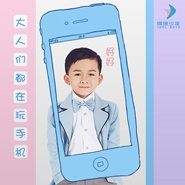

大人们都在玩手机
============================

|  |  |
| :--: | :-- |
| [ 大人们都在玩手机](https://emumo.xiami.com/album/2103704225) | **艺人**: [优秀少年好好](../index.md) **语种**: 国语 **唱片公司**: 北京人见人爱文化传媒有限公司 **发行时间**: 2018年05月08日 **专辑类别**: 录音室专辑 **专辑风格**: 儿童音乐 Children's Music **播放数**: 2877 **收藏数**: 4 **评论数**: 0  |

## 简介

 

偶像少年，5—13岁少年练习生组合，打造阳光积极正能量少年榜样。好好，偶像少年最小成员。2018年5月，发行首张个人单曲《大人们都在玩手机》，歌词言简意赅，意义深刻，稚嫩的童声混合活泼的曲风，更加生动的表达了小朋友们心中的烦恼。
 

《大人们都在玩手机》是一首传达孩子们心声的歌曲，轻快活泼的曲风、简单纯净的旋律、还有孩子们对大人们忙于玩手机而忽略自己的无奈，都透露出孩子们对于父母陪伴的渴望。父母虽然在身边，却不能陪我一起玩耍，“我知道你们难得休息，只陪我一会就可以”，“这么可爱的小BABY，难道还比不上一台机器？”童年这么美好，我希望有你们的陪伴，请听听我们的心声，不要只顾着玩手机，我们也需要你们的关爱。
 

## 曲目

## 评论

|  |  |  |  |
| :-- | :-- | :-- | :-- |
