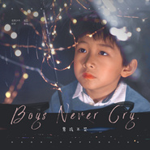

男孩不哭
============================

|  |  |
| :--: | :-- |
| [ 男孩不哭](https://emumo.xiami.com/album/2104795470) | **艺人**: [优秀少年好好](../index.md) **语种**: 国语 **唱片公司**: 百态文化 **发行时间**: 2019年04月22日 **专辑类别**: EP, 单曲 **专辑风格**: 国语流行 Mandarin Pop **播放数**: 2599 **收藏数**: 3 **评论数**: 0  |

## 简介

《男孩不哭》整首歌曲以青春热血的曲风，诠释了少年激情满怀的坚毅和勇敢。好好童真的嗓音和彭钧浑厚而富有磁性的嗓音相辅相成，用青春热血的曲风，诠释了少年激情满怀的坚毅和勇敢。整首歌曲洋溢着少年热血的正能量，用青春励志的旋律，句句歌词向听者传达着少年口中的“坚强”二字。正如“从哪里跌倒从哪里起步”表现了应坚强面对困难，永不放弃的品质和精神。这首青春热血的《男孩不哭》，向大众展现了优秀少年好好不同一面，不仅是阳光可爱的萌娃，更是心中充满热血，坚强面对困难的青春少年。  
  
  
 

## 曲目

## 评论

