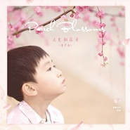

又见桃花开 (童声版)
============================

|  |  |
| :--: | :-- |
| [ 又见桃花开 (童声版)](https://emumo.xiami.com/album/2104827726) | **艺人**: [优秀少年好好](../index.md) **语种**: 国语 **唱片公司**: 偶像少年 **发行时间**: 2019年04月26日 **专辑类别**: EP, 单曲 **专辑风格**: 国语流行 Mandarin Pop **播放数**: 1855 **收藏数**: 0 **评论数**: 0  |

## 简介

整首歌曲以“桃花”为主线，从桃花的开放，到花瓣漫天飘扬，将对故乡的思念寄托在一瓣瓣桃花上。“摘一朵桃花香，戴到妈妈头发上；伴着桃花芳香，月下安躺入梦乡。”表现了伴随着桃花的香气，渴望回到故乡，回到妈妈的身旁的美好愿景。优秀少年好好用质朴的童声，将歌曲的主题“思乡”，单纯又不加掩饰的传递给听众。整首歌曲展现出对家乡的怀念和情感流露，是记忆深处最美的凝望。

## 曲目

## 评论

