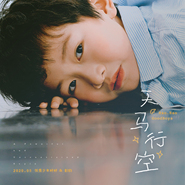
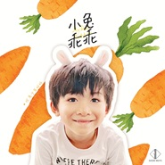
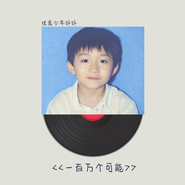
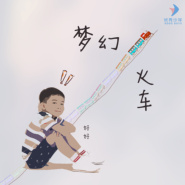
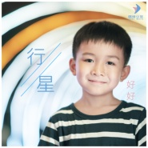

优秀少年好好
============================

|  |  |
| :--: | :-- |
| [ 优秀少年好好](https://i.xiami.com/idolboyshaohao) | **播放数**: 857846 **粉丝数**: 189 **评论数**: 6 **地区**: China 中国大陆 **风格**: 儿童音乐 Children's Music  |

## 档案

姓名：优秀少年好好 
生日：  2012.06.18 
爱好：钢琴、舞蹈、唱歌、轮滑、表演 
表演经验： 
2017  ：       网易云音乐原创盛典  -  《全部都是你》 
成长大家谈年度盛典  -  《黄种人》 
2018  ：       5  月受邀参加湖南卫视《天天向上》节目录制

## 专辑

| 名称 | 语种 | 唱片公司 | 发行时间 | 专辑类别 | 专辑风格 |
| :--: | :-- | :-- | :-- | :-- | :-- |
| [ 你是我的好朋友](./albums/5020894619.md) | 国语 | 偶像少年 | 2020年06月15日 | EP, 单曲 | 国语流行 Mandarin Pop |
| [ 小鸡吃米](./albums/5020860609.md) | 国语 | 偶像少年 | 2020年06月08日 | EP, 单曲 | 国语流行 Mandarin Pop |
| [ 天马行空](./albums/5022258549.md) | 国语 | 偶像少年 | 2020年05月25日 | EP, 单曲 | 国语流行 Mandarin Pop |
| [ 大声的笑](./albums/5020646397.md) | 国语 | 偶像少年 | 2020年05月18日 | EP, 单曲 | 国语流行 Mandarin Pop |
| [ 皮皮虾](./albums/2108406068.md) | 国语 | 偶像少年 | 2020年05月06日 | EP, 单曲 | 国语流行 Mandarin Pop |
| [ 童话王国](./albums/2108380046.md) | 国语 | 百态文化 | 2020年04月20日 | EP, 单曲 | 国语流行 Mandarin Pop |
| [ 无敌幸运星](./albums/2108289051.md) | 国语 | 偶像少年 | 2020年03月30日 | EP, 单曲 | 国语流行 Mandarin Pop |
| [ 小奶猫](./albums/2105692103.md) | 国语 | 偶像少年 | 2020年01月06日 | EP, 单曲 | 国语流行 Mandarin Pop |
| [ 天上的星星](./albums/2105591983.md) | 国语 | 偶像少年 | 2019年12月16日 | EP, 单曲 | 国语流行 Mandarin Pop |
| [ 小奶狗](./albums/2105537129.md) | 国语 | 百态文化 | 2019年12月02日 | EP, 单曲 |  |
| [ 这条街最靓的仔](./albums/2105449442.md) | 国语 | 偶像少年 | 2019年11月18日 | EP, 单曲 | 国语流行 Mandarin Pop |
| [ 你是我的好朋友](./albums/2105409556.md) | 国语 | 人见人爱 | 2019年11月04日 | EP, 单曲 |  |
| [ 我是小妖怪](./albums/2105363839.md) | 国语 | 偶像少年 | 2019年10月21日 | EP, 单曲 |  |
| [ 小兔乖乖](./albums/5022240983.md) | 国语 | 偶像少年 | 2019年09月23日 | EP, 单曲 | 国语流行 Mandarin Pop |
| [ 加油鸭](./albums/5022254653.md) | 国语 | 偶像少年 | 2019年07月22日 | EP, 单曲 | 国语流行 Mandarin Pop |
| [ 神奇宝宝](./albums/5022257096.md) | 国语 | 偶像少年 | 2019年07月09日 | EP, 单曲 | 国语流行 Mandarin Pop |
| [ 可爱小孩](./albums/2104859019.md) | 国语 | 百态文化 | 2019年05月13日 | EP, 单曲 | 国语流行 Mandarin Pop |
| [ 又见桃花开 (童声版)](./albums/2104827726.md) | 国语 | 偶像少年 | 2019年04月26日 | EP, 单曲 | 国语流行 Mandarin Pop |
| [ 男孩不哭](./albums/2104795470.md) | 国语 | 百态文化 | 2019年04月22日 | EP, 单曲 | 国语流行 Mandarin Pop |
| [ 别人家孩子](./albums/2104548434.md) | 国语 | 百态文化 | 2019年01月28日 | EP, 单曲 | 国语流行 Mandarin Pop |
| [ 咏春](./albums/2104481366.md) | 国语 | 百态文化 | 2019年01月11日 | EP, 单曲 | 国语流行 Mandarin Pop, 古风 GuFeng Music |
| [ 少年郎](./albums/2104409827.md) | 国语 | 百态文化 | 2018年12月21日 | EP, 单曲 | 中国风 China-Wave |
| [ 去年夏天（童声版）Cover：王大毛](./albums/2104173504.md) | 国语 | 偶像少年 | 2018年11月02日 | 录音室专辑 | 流行 Pop |
| [ 一百万个可能（童声版）Cover: Christine Welch](./albums/2104143544.md) | 国语 | 偶像少年 | 2018年10月24日 | 录音室专辑 | 流行 Pop |
| [ 小兔乖乖](./albums/2104090589.md) | 国语 | 偶像少年 | 2018年10月10日 | 录音室专辑 | 流行 Pop |
| [ 不要喂我了电影《吃货宇宙》推广曲](./albums/2103741423.md) | 国语 | 北京人见人爱文化传媒有限公司 | 2018年06月08日 | 录音室专辑 | 流行 Pop, 儿童音乐 Children's Music |
| [ 梦幻火车](./albums/2103723451.md) | 国语 | 北京人见人爱文化传媒有限公司 | 2018年06月01日 | 录音室专辑 | 流行 Pop, 儿童音乐 Children's Music |
| [ 大人们都在玩手机](./albums/2103723518.md) | 国语 | 自在天浩 | 2018年05月31日 | EP, 单曲 | 青少年流行 Teen Pop |
| [ 行星（PLANET）（童声版）](./albums/2103722443.md) | 国语 | 北京人见人爱文化传媒有限公司 | 2018年05月25日 | 录音室专辑 | 流行 Pop, 儿童音乐 Children's Music |
| [ 大人们都在玩手机](./albums/2103704225.md) | 国语 | 北京人见人爱文化传媒有限公司 | 2018年05月08日 | 录音室专辑 | 儿童音乐 Children's Music |

## 评论

|  |  |  |  |
| :-- | :-- | :-- | :-- |
|  [虾米用户](https://emumo.xiami.com/u/358104299) 悲观的唯心存在现实解构虚... 2021-01-08 07:24 赞(0) 踩(0) | 
45892
 |
|  [虾米用户](https://emumo.xiami.com/u/444435062) 我还没想好要写什么... 2020-10-14 20:41 赞(0) 踩(0) | 
你不是和宋小睿合一首新歌吗
 |
|  [虾米用户](https://emumo.xiami.com/u/371023377)  2020-05-07 22:24 赞(1) 踩(0) | 
用孩子赚钱，不错，真可以
 |
|  [虾米用户](https://emumo.xiami.com/u/440626995)  2020-03-28 17:14 赞(0) 踩(0) | 
666
 |
|  [虾米用户](https://emumo.xiami.com/u/440657544)  2020-02-19 23:49 赞(1) 踩(0) | 
66666
 |
|  [虾米用户](https://emumo.xiami.com/u/6873363)  2018-12-05 20:59 赞(0) 踩(0) | 
m
 |
