KendricKnight
============================

|  |  |
| :--: | :-- |
| [ KendricKnight](https://i.xiami.com/urmyson) | **播放数**: 10363434 **粉丝数**: 2654 **评论数**: 171 **地区**:  **风格**: 陷阱舞曲 Trap, 氛围音乐 Ambient, 爵士嘻哈 Jazz Hip Hop, 器乐嘻哈 Instrumental Hip Hop, 电子 Electronic  |

## 档案

## 专辑

| 名称 | 语种 | 唱片公司 | 发行时间 | 专辑类别 | 专辑风格 |
| :--: | :-- | :-- | :-- | :-- | :-- |
| [ Liverpool Bass](./albums/5021677797.md) | 英语 | 独立发行 | 2020年10月16日 | 录音室专辑 | 嘻哈 Hip-Hop, 器乐嘻哈 Instrumental Hip Hop, 爵士说唱 Jazz Rap |
| [ Can't B Good (Remix)](./albums/5021271114.md) | 英语 | 独立发行 | 2020年08月11日 | EP, 单曲 | 欧美流行 Western Pop, 合成器流行 Synthpop, 节奏布鲁斯 R&B |
| [ Attention (80s Remix)](./albums/5020862588.md) | 英语 | 独立发行 | 2020年06月08日 | EP, 单曲 | 欧美流行 Western Pop, 爵士布鲁斯 Jazz Blues, 流行摇滚 Pop Rock |
| [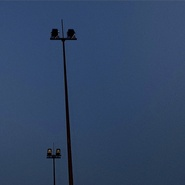 ☽](./albums/2108349038.md) | 英语 | 独立发行 | 2020年04月16日 | EP, 单曲 | 节奏布鲁斯 R&B, 爵士 Jazz, 欧美流行 Western Pop |
| [ Passionfruit (Remix)](./albums/2108197461.md) | 英语 | 独立发行 | 2020年03月18日 | EP, 单曲 | 欧美流行 Western Pop, 低保真 Lo-Fi, 合成器放克 Synth Funk |
| [ Sorry Not Sorry (Remix)](./albums/2106039687.md) | 英语 | 独立发行 | 2020年02月14日 | EP, 单曲 | 欧美流行 Western Pop, 合成器流行 Synthpop |
| [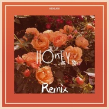 Honey (Remix)](./albums/2105675666.md) | 英语 | 独立发行 | 2020年01月04日 | EP, 单曲 | 欧美流行 Western Pop, 爵士流行 Jazz Pop |
| [ The Story Never Ends (Remix)](./albums/2105610369.md) | 英语 | 独立发行 | 2019年12月21日 | EP, 单曲 | 欧美流行 Western Pop |
| [ Everyday (Remix)](./albums/2105569573.md) | 英语 |  | 2019年12月10日 | EP, 单曲 | 欧美流行 Western Pop, 嘻哈 Hip-Hop, 低保真 Lo-Fi |
| [ FOOLS (Remix)](./albums/2105322405.md) | 英语 |  | 2019年10月11日 | EP, 单曲 | 浩室舞曲 House, 欧美流行 Western Pop, 热带浩室 Tropical House |
| [ that's all](./albums/2105267181.md) | 英语 |  | 2019年09月22日 | EP, 单曲 | 爵士嘻哈 Jazz Hip Hop, 器乐嘻哈 Instrumental Hip Hop, 爵士 Jazz |
| [ Old Town Road (Remix)](./albums/2105210528.md) | 英语 |  | 2019年09月04日 | EP, 单曲 | 嘻哈 Hip-Hop, 欧美流行 Western Pop, 电子 Electronic |
| [ Baby I don't feel so good.](./albums/2105155395.md) | 英语 |  | 2019年08月14日 | EP, 单曲 | 爵士嘻哈 Jazz Hip Hop, 器乐嘻哈 Instrumental Hip Hop, 欧美流行 Western Pop |
| [ River & FRIENDS](./albums/2105020043.md) | 英语 |  | 2019年07月25日 | EP, 单曲 | 流行 Pop, 嘻哈 Hip-Hop, 欧美流行 Western Pop |
| [ ᯤ](./albums/2104974867.md) | 其他 |  | 2019年07月07日 | EP, 单曲 | 器乐嘻哈 Instrumental Hip Hop, 嘻哈 Hip-Hop, 电子 Electronic |
| [ Beautiful (Remix)](./albums/2104941365.md) | 英语 |  | 2019年06月13日 | EP, 单曲 | 欧美流行 Western Pop, 电子 Electronic |
| [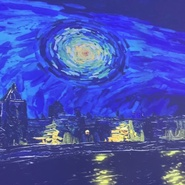 peep shit](./albums/2104932261.md) | 英语 |  | 2019年06月07日 | EP, 单曲 | 器乐嘻哈 Instrumental Hip Hop, 电子 Electronic, 节奏布鲁斯 R&B |
| [ Be Alright](./albums/2104904457.md) | 英语 |  | 2019年05月28日 | EP, 单曲 | 欧美流行 Western Pop, 电子 Electronic, 氛围音乐 Ambient |
| [ bloodline (Remix)](./albums/2104887265.md) | 英语 |  | 2019年05月22日 | EP, 单曲 | 欧美流行 Western Pop, 氛围音乐 Ambient, 电子 Electronic |
| [ How Long & Done For Me](./albums/2104794411.md) | 英语 |  | 2019年04月21日 | EP, 单曲 | 合成器流行 Synthpop, 欧美流行 Western Pop, 电子 Electronic |
| [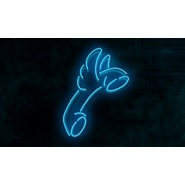 Hotline Bling (Remix)](./albums/2104758928.md) | 英语 |  | 2019年04月09日 | EP, 单曲 | 欧美流行 Western Pop, 电子 Electronic, 未来贝斯 Future Bass |
| [ F a l l](./albums/2104724740.md) | 其他 |  | 2019年03月28日 | EP, 单曲 | 器乐嘻哈 Instrumental Hip Hop, 嘻哈 Hip-Hop |
| [ 7 rings (Remix)](./albums/2104641340.md) | 英语 |  | 2019年03月01日 | 录音室专辑 | 嘻哈 Hip-Hop, 欧美流行 Western Pop, 电子 Electronic |
| [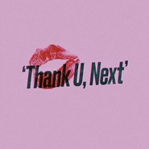 thank u, next (Remix)](./albums/2104641337.md) | 英语 |  | 2019年02月20日 | 录音室专辑 | 电子 Electronic, 欧美流行 Western Pop |
| [ PURPLE](./albums/2104591059.md) | 纯音乐 |  | 2019年02月12日 | EP, 单曲 | 迷幻氛围 Psybient, 电子乐 Electronica |
| [ r o c k s t a r (Lo-fi Remix)](./albums/2104522679.md) | 英语 |  | 2019年01月22日 | EP, 单曲 | 爵士嘻哈 Jazz Hip Hop |
| [ All That Matters](./albums/2104445955.md) | 英语 |  | 2019年01月05日 | EP, 单曲 | 嘻哈 Hip-Hop, 电子 Electronic, 氛围音乐 Ambient |
| [ smog](./albums/2104422301.md) | 其他 |  | 2018年12月28日 | EP, 单曲 | 嘻哈 Hip-Hop, 电子 Electronic |
| [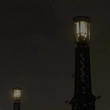 lighthouse](./albums/2104385403.md) | 其他 |  | 2018年12月17日 | EP, 单曲 | 器乐嘻哈 Instrumental Hip Hop, 嘻哈 Hip-Hop |
| [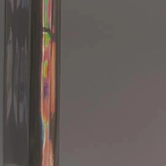 One Dance](./albums/2104331613.md) | 英语 |  | 2018年12月06日 | EP, 单曲 | 电子 Electronic, 氛围音乐 Ambient |
| [ Consideration (Remix)](./albums/2104270975.md) | 英语 |  | 2018年11月24日 | EP, 单曲 | 合成器流行 Synthpop, 陷阱舞曲 Trap, 电子 Electronic |
| [ Fuck Love (Remix)](./albums/2104261387.md) | 英语 |  | 2018年11月22日 | EP, 单曲 | 陷阱说唱 Trap Rap, 嘻哈 Hip-Hop |
| [ [FREE] Pure Imagination](./albums/2104216636.md) | 其他 |  | 2018年11月16日 | EP, 单曲 | 器乐嘻哈 Instrumental Hip Hop, 电子 Electronic |
| [ p h a n t o m](./albums/2104184063.md) | 其他 |  | 2018年11月06日 | EP, 单曲 | 黑暗氛围 Dark Ambient, 电子舞曲 EDM / Electronic Dance Music, 氛围回响 Ambient Dub |
| [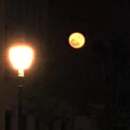 Loosing Interest](./albums/2104173695.md) | 英语 |  | 2018年10月26日 | EP, 单曲 | 器乐嘻哈 Instrumental Hip Hop, 电子 Electronic, 氛围音乐 Ambient |
| [ all my stress](./albums/2104202385.md) | 英语 |  | 2018年10月22日 | EP, 单曲 | 嘻哈 Hip-Hop, 电子 Electronic, 氛围音乐 Ambient |
| [ GARY type beat.](./albums/2104173694.md) | 其他 |  | 2018年10月10日 | EP, 单曲 | 器乐嘻哈 Instrumental Hip Hop, 嘻哈 Hip-Hop, 电子 Electronic |
| [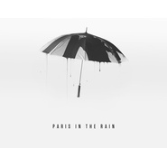 Paris in the Rain (Remix)](./albums/2104173692.md) | 英语 |  | 2018年10月01日 | EP, 单曲 | 嘻哈 Hip-Hop, 电子 Electronic, 欧美流行 Western Pop |
| [ [FREE] ☁](./albums/2104216635.md) | 其他 |  | 2018年09月26日 | EP, 单曲 | 器乐嘻哈 Instrumental Hip Hop, 电子 Electronic |
| [ Bad idea](./albums/2104038605.md) | 其他 | 独立发行 | 2018年09月19日 | EP, 单曲 | 嘻哈 Hip-Hop, 电子 Electronic |
| [ WEED](./albums/2104021079.md) | 其他 | 独立发行 | 2018年09月13日 | EP, 单曲 | 出神舞曲 Trance, 嘻哈 Hip-Hop, 电子 Electronic |
| [ Deja Vu (Remix)](./albums/2103979821.md) | 英语 | 独立发行 | 2018年09月05日 | EP, 单曲 | 陷阱说唱 Trap Rap, 嘻哈 Hip-Hop, 电子 Electronic |
| [ Bite Your Soul](./albums/2103950238.md) | 英语 | 独立发行 | 2018年08月30日 | EP, 单曲 | 器乐嘻哈 Instrumental Hip Hop, 电子 Electronic |
| [ Ω](./albums/2103947259.md) | 其他 | 独立发行 | 2018年08月25日 | EP, 单曲 | 器乐嘻哈 Instrumental Hip Hop, 嘻哈 Hip-Hop, 电子 Electronic |
| [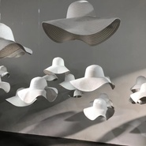 星球坠落 (Instrumental)](./albums/2103935734.md) | 其他 | 独立发行 | 2018年08月20日 | EP, 单曲 | 器乐嘻哈 Instrumental Hip Hop, 嘻哈 Hip-Hop, 电子 Electronic |
| [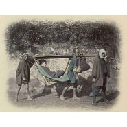 ๑shinobi๑](./albums/2103935584.md) | 其他 | 独立发行 | 2018年08月20日 | EP, 单曲 | 陷阱说唱 Trap Rap, 器乐嘻哈 Instrumental Hip Hop, 嘻哈 Hip-Hop |
| [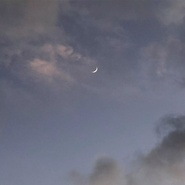 This is for my girl.](./albums/2103902057.md) | 英语 | 独立发行 | 2018年08月08日 | EP, 单曲 | 电子 Electronic, 氛围回响 Ambient Dub |
| [ [FREE] Sad! (XXXTENTACION Type Beat)](./albums/2103899141.md) | 其他 | 独立发行 | 2018年08月05日 | EP, 单曲 | 电子 Electronic, 嘻哈 Hip-Hop, 器乐嘻哈 Instrumental Hip Hop |
| [ [FREE] beat???](./albums/2103893261.md) | 其他 | 独立发行 | 2018年08月03日 | EP, 单曲 | 电子 Electronic, 器乐嘻哈 Instrumental Hip Hop |
| [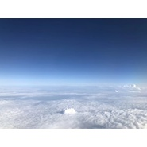 Hands off me](./albums/2103878005.md) | 英语 | 独立发行 | 2018年07月31日 | EP, 单曲 | 电子 Electronic, 器乐嘻哈 Instrumental Hip Hop |
| [ ☹it never rains anymore](./albums/2103834909.md) | 英语 | 独立发行 | 2018年07月24日 | EP, 单曲 | 陷阱舞曲 Trap, 器乐嘻哈 Instrumental Hip Hop, 电子 Electronic |
| [ L.A mood](./albums/2103831471.md) | 其他 | 独立发行 | 2018年07月22日 | EP, 单曲 | 爵士 Jazz, 器乐嘻哈 Instrumental Hip Hop |
| [ All alone](./albums/2103810532.md) | 其他 | 独立发行 | 2018年07月17日 | EP, 单曲 | 爵士嘻哈 Jazz Hip Hop, 器乐嘻哈 Instrumental Hip Hop |
| [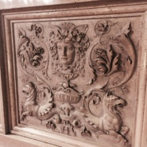 胎 教 音 樂](./albums/2103800795.md) | 其他 | 独立发行 | 2018年07月12日 | EP, 单曲 | 陷阱舞曲 Trap, 嘻哈 Hip-Hop, 器乐嘻哈 Instrumental Hip Hop |
| [ Novacane](./albums/2103786655.md) | 英语 | 独立发行 | 2018年07月09日 | EP, 单曲 | 陷阱舞曲 Trap, 器乐嘻哈 Instrumental Hip Hop |
| [ Come thru](./albums/2103770818.md) | 英语 | 独立发行 | 2018年07月01日 | EP, 单曲 | 爵士嘻哈 Jazz Hip Hop |
| [ ๑Ninja๑](./albums/2103770819.md) | 其他 | 独立发行 | 2018年06月30日 | EP, 单曲 | 陷阱舞曲 Trap, 嘻哈 Hip-Hop, 器乐嘻哈 Instrumental Hip Hop |
| [ Betrayed (Remix)](./albums/2103752962.md) | 英语 | 独立发行 | 2018年06月20日 | EP, 单曲 | 陷阱舞曲 Trap, 陷阱说唱 Trap Rap, 嘻哈 Hip-Hop |
| [ Changes (Remix)](./albums/2103751623.md) | 英语 | 独立发行 | 2018年06月17日 | EP, 单曲 | 嘻哈 Hip-Hop |
| [ : (](./albums/2103747828.md) | 英语 | 独立发行 | 2018年06月13日 | EP, 单曲 | 电子 Electronic, 氛围音乐 Ambient |
| [ A g a i n](./albums/2103751622.md) | 英语 | 独立发行 | 2018年06月11日 | EP, 单曲 | 爵士嘻哈 Jazz Hip Hop |
| [ Bank Account (Instrumental)](./albums/2103741534.md) | 其他 | 独立发行 | 2018年06月11日 | EP, 单曲 | 电子 Electronic, 陷阱舞曲 Trap, 嘻哈 Hip-Hop |
| [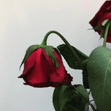 ¿Tell me why I'm waiting?](./albums/2103741533.md) | 其他 | 独立发行 | 2018年06月06日 | EP, 单曲 | 电子 Electronic, 氛围音乐 Ambient, 黑暗氛围 Dark Ambient |
| [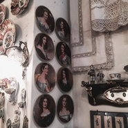 I Know You So Well](./albums/2103730184.md) | 英语 | 独立发行 | 2018年06月05日 | EP, 单曲 | 氛围音乐 Ambient, 电子 Electronic |
| [ 1-800-273-8255 (Instrumental)](./albums/2103731431.md) | 其他 | 独立发行 | 2018年06月05日 | EP, 单曲 | 电子 Electronic, 嘻哈 Hip-Hop, 器乐嘻哈 Instrumental Hip Hop |
| [ ☔️Singin' in the Rain☔️](./albums/2103716300.md) | 英语 | 独立发行 | 2018年05月22日 | EP, 单曲 | 爵士嘻哈 Jazz Hip Hop, 氛围音乐 Ambient |
| [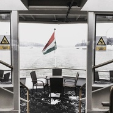 ◎m i s t y◎](./albums/2103711503.md) | 英语 | 独立发行 | 2018年05月17日 | EP, 单曲 | 蒸汽波 Vaporwave, 爵士嘻哈 Jazz Hip Hop, 氛围音乐 Ambient |
| [ Vibe](./albums/2103710525.md) | 其他 | 独立发行 | 2018年05月16日 | EP, 单曲 | 电子 Electronic, 嘻哈 Hip-Hop, 陷阱说唱 Trap Rap |
| [ I'll keep you safe](./albums/2103707754.md) | 英语 | 独立发行 | 2018年05月06日 | EP, 单曲 | 氛围音乐 Ambient |
| [ ☁P!nksky☁](./albums/2103707802.md) | 其他 | 独立发行 | 2018年05月02日 | EP, 单曲 | 爵士嘻哈 Jazz Hip Hop, 器乐嘻哈 Instrumental Hip Hop, 电子 Electronic |
| [ ㅤㅤ](./albums/2103707805.md) | 其他 | 独立发行 | 2018年04月26日 | EP, 单曲 | 蒸汽波 Vaporwave, 氛围音乐 Ambient, 爵士嘻哈 Jazz Hip Hop |
| [ ʙ ᴀ ᴇ](./albums/2103707808.md) | 英语 | 独立发行 | 2018年04月21日 | EP, 单曲 | 嘻哈 Hip-Hop, 爵士嘻哈 Jazz Hip Hop, 器乐嘻哈 Instrumental Hip Hop |
| [ Cut It](./albums/2103707826.md) | 其他 | 独立发行 | 2018年02月17日 | EP, 单曲 | 陷阱舞曲 Trap, 器乐嘻哈 Instrumental Hip Hop, 陷阱说唱 Trap Rap |
| [ ♡](./albums/2103707811.md) | 其他 | 独立发行 | 2017年12月24日 | EP, 单曲 | 氛围音乐 Ambient, 轻音乐 Easy Listening, 器乐嘻哈 Instrumental Hip Hop |

## 评论

|  |  |  |  |
| :-- | :-- | :-- | :-- |
|  [虾米用户](https://emumo.xiami.com/u/296456214)   2021-01-22 00:39 赞(0) 踩(0) | 
竟然是香港人！不得了
 |
|  [虾米用户](https://emumo.xiami.com/u/127178534) 남친: 이가기♡ 2021-01-17 12:35 赞(0) 踩(0) | 
좋아해. 너무너무
 |
|  [虾米用户](https://emumo.xiami.com/u/292423439) better me 2021-01-17 09:24 赞(0) 踩(0) | 
兄弟虾米要停服了
 |
|  [虾米用户](https://emumo.xiami.com/u/295542159) Ciao 2021-01-08 11:17 赞(0) 踩(0) | 
谢谢陪伴，下个地方见面。So long
 |
|  [虾米用户](https://emumo.xiami.com/u/4309651) 我还没想好要写什么... 2021-01-07 22:26 赞(1) 踩(0) | 
虾米要关了 你有网易云吗
 |
|  [虾米用户](https://emumo.xiami.com/u/29053254)         よるつき... 2020-12-11 00:05 赞(1) 踩(0) | 
damn I really luv u
 |
|  [虾米用户](https://emumo.xiami.com/u/124889762) 不配 2020-11-12 17:38 赞(0) 踩(0) | 
90后双子座吗、 爱了
 |
|  [虾米用户](https://emumo.xiami.com/u/4372646) 可爱又迷人的正派角色IG... 2020-11-04 18:14 赞(1) 踩(0) | 
#
 |
|  [虾米用户](https://emumo.xiami.com/u/342038768) pucikaka don... 2020-10-16 23:21 赞(1) 踩(0) | 
温暖
 |
|  [虾米用户](https://emumo.xiami.com/u/2719500) Bon Appetit. 2020-08-24 12:12 赞(2) 踩(0) | 
我终于终于稳到你soundcloud acc哈哈哈哈哈哈哈开心～
 |
|  [虾米用户](https://emumo.xiami.com/u/307328795) 怪 异 无 趣 . ♡ 2020-08-04 16:08 赞(0) 踩(0) | 

 |
|  [虾米用户](https://emumo.xiami.com/u/307328795) 怪 异 无 趣 . ♡ 2020-08-03 21:40 赞(0) 踩(0) | 
我可太喜欢你了.
 |
|  [虾米用户](https://emumo.xiami.com/u/3947543) love life ba... 2020-08-01 22:23 赞(0) 踩(0) | 
有人告诉我他是中国人还是外国人。啊？
 |
|  [虾米用户](https://emumo.xiami.com/u/346492287) 虾米不要离开我！ 2020-07-29 08:17 赞(0) 踩(0) | 

 |
|  [虾米用户](https://emumo.xiami.com/u/406047403) 啤酒喜欢冰块 2020-07-12 11:47 赞(0) 踩(0) | 
我找到宝藏了✨
 |
|  [虾米用户](https://emumo.xiami.com/u/362347734)  2020-07-10 13:18 赞(0) 踩(0) | 
神仙啊！我喜欢
 |
|  [虾米用户](https://emumo.xiami.com/u/334709324) 〠₍⁽˚⑅̆˚⁾₎ 2020-07-05 12:08 赞(0) 踩(0) | 
哇塞宝藏啊
 |
|  [虾米用户](https://emumo.xiami.com/u/320107119) 这里藏着唯一能够治愈我的... 2020-06-22 22:51 赞(1) 踩(0) | 
太nice了吧
 |
| ⇒ |  [虾米用户](https://emumo.xiami.com/u/442835651)  2020-06-25 23:25 赞(0) 踩(0) | 
今天我遇到重口味怕黑了，也遇到了今天你遇到重口味怕黑了吗哈哈哈哈哈哈
 |
|  [虾米用户](https://emumo.xiami.com/u/441976710) 虾米我爱你！！！！！！ 2020-05-26 20:53 赞(3) 踩(0) | 
快把神仙藏起来，好绝！。
 |
|  [虾米用户](https://emumo.xiami.com/u/96960270) 天，将降大任于斯人。 2020-05-25 13:45 赞(0) 踩(0) | 
兄弟改名了哈哈哈哈
 |
|  [虾米用户](https://emumo.xiami.com/u/187729577) 虾米，谢谢你啦。我永远爱... 2020-05-23 21:35 赞(1) 踩(0) | 
我老公 
 |
|  [虾米用户](https://emumo.xiami.com/u/421578063) fox god 2020-05-14 11:15 赞(3) 踩(0) | 
(๑＞ڡ＜)☆
 |
|  [虾米用户](https://emumo.xiami.com/u/52415194) ♬♩♫♪♡ 2020-05-10 22:40 赞(0) 踩(0) | 

 |
|  [虾米用户](https://emumo.xiami.com/u/349339882) 后荣迷。努力学习中。 2020-05-08 22:47 赞(0) 踩(0) | 
(*&amp;acute;&amp;forall;｀)
 |
|  [虾米用户](https://emumo.xiami.com/u/2719500) Bon Appetit. 2020-05-04 22:01 赞(3) 踩(0) | 
想关注你微博igAnything i can follow?
 |
|  [虾米用户](https://emumo.xiami.com/u/2897156) 幻听捕食者 2020-04-30 22:16 赞(1) 踩(0) | 
♾
 |
|  [虾米用户](https://emumo.xiami.com/u/50625743) SO ROSÉ SO C... 2020-04-29 23:59 赞(1) 踩(0) | 
很棒！
 |
|  [虾米用户](https://emumo.xiami.com/u/421578063) fox god 2020-04-25 18:57 赞(1) 踩(0) | 
哇！真的是出版级的独立音乐人！
 |
|  [虾米用户](https://emumo.xiami.com/u/50188885) Leave one's ... 2020-04-24 16:37 赞(0) 踩(0) | 
为什么没有个人介绍呢。。。
 |
|  [虾米用户](https://emumo.xiami.com/u/52294099) 喵喵喵？ 2020-04-15 08:54 赞(2) 踩(0) | 
虾米里深埋着的宝藏之一。
 |
|  [虾米用户](https://emumo.xiami.com/u/187729577) 虾米，谢谢你啦。我永远爱... 2020-04-05 00:29 赞(1) 踩(0) | 
你好帅
 |
|  [虾米用户](https://emumo.xiami.com/u/307328795) 怪 异 无 趣 . ♡ 2020-04-04 17:01 赞(1) 踩(0) | 
这个人怎么这么酷！我爱死他了！
 |
|  [虾米用户](https://emumo.xiami.com/u/403811145) 希望你是为我而来 2020-04-01 00:58 赞(0) 踩(0) | 
我好喜欢你
 |
|  [虾米用户](https://emumo.xiami.com/u/339257303) ? 2020-03-30 11:04 赞(3) 踩(0) | 
从You are my son变成肯德里克骑士了是吧
 |
|  [虾米用户](https://emumo.xiami.com/u/299931782) 遇见谁都没有那么重要，重... 2020-03-26 15:57 赞(0) 踩(0) | 
太优秀了！！！一直都很钟意你的作品！
 |
|  [虾米用户](https://emumo.xiami.com/u/257812637) 想要避世的时候可以躲进歌... 2020-03-21 20:40 赞(2) 踩(0) | 
这兄弟remix的歌原版都超棒，歌品好remix的也好 可以可以
 |
|  [虾米用户](https://emumo.xiami.com/u/253100822) 要做哥哥们的御用舞者 E... 2020-03-19 08:11 赞(0) 踩(0) | 
怎么都在问之前叫什么U are my son辣
 |
|  [虾米用户](https://emumo.xiami.com/u/253100822) 要做哥哥们的御用舞者 E... 2020-03-19 08:09 赞(1) 踩(0) | 
好喜欢你跟六公主的合作  所有
 |
|  [虾米用户](https://emumo.xiami.com/u/426355003) Music Buffs 2020-03-16 17:08 赞(0) 踩(0) | 
宝藏歌单呀
 |
|  [虾米用户](https://emumo.xiami.com/u/1125942) 给您拜早年了。₍₍ (ง... 2020-03-15 14:03 赞(0) 踩(0) | 
今天发现的宝藏。
 |
|  [虾米用户](https://emumo.xiami.com/u/93081992) so what 2020-03-14 19:28 赞(0) 踩(0) | 
可爱儿子我来看你了
 |
|  [虾米用户](https://emumo.xiami.com/u/50001224)   2020-03-10 01:05 赞(0) 踩(0) | 
肥肠好
 |
|  [虾米用户](https://emumo.xiami.com/u/376633276) 虾米  拜拜喽  我永远... 2020-02-29 21:50 赞(0) 踩(0) | 

 |
|  [虾米用户](https://emumo.xiami.com/u/266097518) 愿你一切安好 2020-02-21 11:09 赞(0) 踩(0) | 
我天我天神仙！
 |
|  [虾米用户](https://emumo.xiami.com/u/342038768) pucikaka don... 2020-02-17 12:13 赞(1) 踩(0) | 

 |
|  [虾米用户](https://emumo.xiami.com/u/43443614) 微信M7-Bonnie，... 2020-02-15 10:13 赞(1) 踩(0) | 
新名字没认出来
 |
|  [虾米用户](https://emumo.xiami.com/u/285049473) 剛拿起酒杯想和你碰杯 才... 2020-02-14 11:22 赞(0) 踩(0) | 
兒子
 |
|  [虾米用户](https://emumo.xiami.com/u/323061222) CashmereCat的... 2020-02-13 12:47 赞(0) 踩(0) | 

 |
|  [虾米用户](https://emumo.xiami.com/u/10471420)  2020-02-10 22:51 赞(0) 踩(0) | 
坐等新歌
 |
|  [虾米用户](https://emumo.xiami.com/u/50213160) 简单 喜静  2020-02-08 14:29 赞(0) 踩(0) | 
桑桑 你最近没发歌 
 |
|  [虾米用户](https://emumo.xiami.com/u/274668434) 回校了，下次来就见不到你... 2020-02-07 14:36 赞(0) 踩(0) | 
你是神仙吗？为什么每首都这么好听
 |
|  [虾米用户](https://emumo.xiami.com/u/14074126) 收集灵魂的藏品 2020-02-07 13:12 赞(1) 踩(0) | 
一首old town road 粉了。。
 |
|  [虾米用户](https://emumo.xiami.com/u/267471859) 你的眼睛好大好亮！我好想... 2020-02-06 16:40 赞(0) 踩(0) | 

 |
|  [虾米用户](https://emumo.xiami.com/u/124548896) 我还没想好要写什么... 2020-01-30 00:06 赞(2) 踩(0) | 
你真的好会混音哦！！！！！     
 |
|  [虾米用户](https://emumo.xiami.com/u/419008458)  2020-01-18 12:16 赞(0) 踩(0) | 
可太nb了
 |
|  [虾米用户](https://emumo.xiami.com/u/224616037) 好好写作业 2020-01-14 18:57 赞(0) 踩(0) | 
之前叫什么
 |
| ⇒ |  [虾米用户](https://emumo.xiami.com/u/74472832) 无个性无签名 2020-01-20 15:21 赞(0) 踩(0) | 
你是我儿
 |
| ⇒ |  [虾米用户](https://emumo.xiami.com/u/318104586)  再见再见了再见 2020-01-31 14:33 赞(0) 踩(0) | 
Uaremyson  细品
 |
| ⇒ |  [虾米用户](https://emumo.xiami.com/u/224616037) 好好写作业 2020-01-31 19:07 赞(0) 踩(0) | 
<q><b>木濯☁︎说：</b></q>
 |
|  [虾米用户](https://emumo.xiami.com/u/325376176) '  2020-01-14 09:38 赞(1) 踩(0) | 
啊啊啊我的宝藏
 |
|  [虾米用户](https://emumo.xiami.com/u/241543003) 他举止彬彬有礼但显冷淡 2020-01-13 13:29 赞(0) 踩(0) | 
原来叫啥来着
 |
|  [虾米用户](https://emumo.xiami.com/u/9062060) 此生没拿一个亿来爱虾米是... 2020-01-12 22:19 赞(1) 踩(0) | 
改名了
 |
|  [虾米用户](https://emumo.xiami.com/u/288291722) 我还没想好要写什么... 2020-01-05 05:22 赞(35) 踩(0) | 
内容已删除
 |
| ⇒ |  [虾米用户](https://emumo.xiami.com/u/133998246)  2020-02-13 00:05 赞(0) 踩(0) | 
这名字啥意思啊？？
 |
| ⇒ |  [虾米用户](https://emumo.xiami.com/u/243612528)  2020-03-08 19:52 赞(0) 踩(0) | 
莫不是以前名字是son
 |
| ⇒ |  [虾米用户](https://emumo.xiami.com/u/318104586)  再见再见了再见 2020-11-22 11:26 赞(0) 踩(0) | 
<q><b>游云说：</b></q>
 |
|  [虾米用户](https://emumo.xiami.com/u/201391232) 最快的方法是先抱抱 2019-12-26 17:21 赞(0) 踩(0) | 
彡
 |
|  [虾米用户](https://emumo.xiami.com/u/46228718) 想到你家里坐坐.. 2019-12-25 23:09 赞(0) 踩(0) | 
太好听啦
 |
|  [虾米用户](https://emumo.xiami.com/u/341078030) nothing will... 2019-12-22 09:49 赞(11) 踩(0) | 
艹這人絕了我愛死。
 |
|  [虾米用户](https://emumo.xiami.com/u/418960007)  2019-12-20 22:36 赞(2) 踩(0) | 
当我好好看了这名字后才明白
 |
|  [虾米用户](https://emumo.xiami.com/u/89166050) 我还没想好要写什么... 2019-12-08 06:54 赞(2) 踩(0) | 
如果你连听这么牛逼音乐人的歌的我都不喜欢的话那我他妈也帮不了你
 |
|  [虾米用户](https://emumo.xiami.com/u/12177420) 网易云: FIUFIU_... 2019-12-06 17:26 赞(2) 踩(0) | 
听了那么久才看清楚名字到底是啥意思 
 |
|  [虾米用户](https://emumo.xiami.com/u/307596981)  2019-11-29 18:02 赞(0) 踩(0) | 
神仙了
 |
|  [虾米用户](https://emumo.xiami.com/u/29053254)         よるつき... 2019-11-24 10:56 赞(2) 踩(0) | 
I luv u so
 |
|  [虾米用户](https://emumo.xiami.com/u/185880244) 小桂圆 2019-11-18 20:39 赞(0) 踩(0) | 
关注了！做的remix很好听！
 |
|  [虾米用户](https://emumo.xiami.com/u/9915215) 到了说再见的时候了，别让... 2019-11-18 01:19 赞(1) 踩(0) | 
好久没发歌了呀
 |
|  [虾米用户](https://emumo.xiami.com/u/144182742) 我还没想好要写什么... 2019-11-17 19:33 赞(0) 踩(0) | 
爱了
 |
|  [虾米用户](https://emumo.xiami.com/u/9062060) 此生没拿一个亿来爱虾米是... 2019-10-24 14:53 赞(0) 踩(0) | 
人气8错
 |
|  [虾米用户](https://emumo.xiami.com/u/52399377) 其他歌不再有耐心听 2019-10-14 10:40 赞(1) 踩(0) | 
头像可真可爱
 |
|  [虾米用户](https://emumo.xiami.com/u/406046757) 品味很差 2019-09-22 10:33 赞(0) 踩(0) | 
总是能抓住我的心
 |
|  [虾米用户](https://emumo.xiami.com/u/31377901) ♪ ∞  ☾   ོ  2019-09-20 18:47 赞(0) 踩(0) | 
人才.
 |
|  [虾米用户](https://emumo.xiami.com/u/9491974) 永远对自己保持真实 2019-09-15 22:02 赞(0) 踩(0) | 
这名字…秀[带墨镜笑]
 |
|  [虾米用户](https://emumo.xiami.com/u/11749606) E l’alba ver... 2019-09-03 23:38 赞(1) 踩(0) | 
寶藏解鎖
 |
|  [虾米用户](https://emumo.xiami.com/u/356763773) 我还没想好要写什么... 2019-09-02 14:02 赞(0) 踩(0) | 
。
 |
|  [虾米用户](https://emumo.xiami.com/u/321752218)  2019-08-31 10:26 赞(0) 踩(0) | 
超棒哒(｢･ω･)｢嘿
 |
|  [虾米用户](https://emumo.xiami.com/u/309287338) 自我救赎 2019-08-09 00:32 赞(1) 踩(0) | 
啊啊啊宝藏啊（会的）
 |
|  [虾米用户](https://emumo.xiami.com/u/412973511) 带上我的小蛋糕 2019-08-08 18:32 赞(0) 踩(0) | 
哥哥有微博咩
 |
|  [虾米用户](https://emumo.xiami.com/u/658158) 我还没想好要写什么... 2019-07-20 23:49 赞(1) 踩(0) | 
宝藏啊……改编都太赞了
 |
|  [虾米用户](https://emumo.xiami.com/u/4208300) 微博/网易云：小田切尼  2019-07-17 10:16 赞(0) 踩(0) | 

 |
|  [虾米用户](https://emumo.xiami.com/u/299931782) 遇见谁都没有那么重要，重... 2019-07-11 00:20 赞(14) 踩(0) | 
你就是传说中的节奏大师 期待你更多的音乐。
 |
| ⇒ |  [虾米用户](https://emumo.xiami.com/u/424511763)  2020-03-30 19:08 赞(0) 踩(0) | 
哦
 |
|  [虾米用户](https://emumo.xiami.com/u/13234136) 这家伙很聪明什么也不留下... 2019-07-07 20:15 赞(0) 踩(0) | 
都很好听！！
 |
|  [虾米用户](https://emumo.xiami.com/u/297748235) 我还没想好要写什么... 2019-06-27 18:23 赞(0) 踩(0) | 
优秀
 |
|  [虾米用户](https://emumo.xiami.com/u/515489) 我还没想好要写什么... 2019-06-27 08:29 赞(0) 踩(0) | 
）
 |
|  [虾米用户](https://emumo.xiami.com/u/49365982) 当断则断 2019-06-25 20:31 赞(0) 踩(0) | 
哈哈哈哈哈哈哈哈哈热门太优秀了 
 |
|  [虾米用户](https://emumo.xiami.com/u/71178106) 塵世や 酒、風呂を抜け ... 2019-06-20 20:00 赞(1) 踩(0) | 
♡
 |
|  [虾米用户](https://emumo.xiami.com/u/215379991) 簽名不重要重要的是你聽什... 2019-06-11 02:15 赞(1) 踩(0) | 
ﻌﻌﻌ❤︎
 |
|  [虾米用户](https://emumo.xiami.com/u/214534952) meaningless  2019-06-08 13:40 赞(0) 踩(0) | 
您真**棒，我真#%爱您！
 |
|  [虾米用户](https://emumo.xiami.com/u/9915215) 到了说再见的时候了，别让... 2019-06-05 13:45 赞(0) 踩(0) | 
♡
 |
|  [虾米用户](https://emumo.xiami.com/u/5490437) 女士优先 2019-06-04 00:15 赞(2) 踩(0) | 
❤️
 |
|  [虾米用户](https://emumo.xiami.com/u/358104299) 悲观的唯心存在现实解构虚... 2019-05-29 09:48 赞(0) 踩(0) | 
11163
 |
|  [虾米用户](https://emumo.xiami.com/u/287815898) 高考去了88 2019-05-18 21:22 赞(0) 踩(0) | 
宝藏
 |
|  [虾米用户](https://emumo.xiami.com/u/1418202)  江山共老 2019-05-17 18:07 赞(1) 踩(0) | 
好
 |
|  [虾米用户](https://emumo.xiami.com/u/378071788) '' 2019-05-12 11:14 赞(0) 踩(0) | 
"
 |
|  [虾米用户](https://emumo.xiami.com/u/3583995) 一個人的戰爭 2019-05-01 15:51 赞(0) 踩(0) | 
.
 |
|  [虾米用户](https://emumo.xiami.com/u/91033230) 我还没想好要写什么... 2019-04-30 09:51 赞(0) 踩(0) | 
爱了！！
 |
|  [虾米用户](https://emumo.xiami.com/u/41068413)   2019-04-24 22:51 赞(2) 踩(0) | 
良心制作人啊，那么多免费
 |
|  [虾米用户](https://emumo.xiami.com/u/30524227) colour me bl... 2019-04-21 18:59 赞(0) 踩(0) | 
love it
 |
|  [虾米用户](https://emumo.xiami.com/u/43222169) 用歌曲进度条将人生无限延... 2019-04-19 16:40 赞(0) 踩(0) | 
很棒，期待你们更多的作品 
 |
|  [虾米用户](https://emumo.xiami.com/u/5848307) - 2019-04-18 13:39 赞(0) 踩(0) | 
wow！
 |
|  [虾米用户](https://emumo.xiami.com/u/297061438) 热泪盈眶 长生不老 2019-04-17 23:25 赞(3) 踩(0) | 
这是什么宝藏
 |
|  [虾米用户](https://emumo.xiami.com/u/52056952) 人生即是到來、相遇、陪伴... 2019-04-13 02:07 赞(0) 踩(0) | 
(๑・ω-)～♥”
 |
|  [虾米用户](https://emumo.xiami.com/u/27344342)   2019-04-12 00:18 赞(53) 踩(0) | 
兄弟你名气起的是真优秀，但每次名字都是别人用来叫你的呀&amp;middot;&amp;middot;&amp;middot;
 |
| ⇒ |  [虾米用户](https://emumo.xiami.com/u/343815770) 转网易云：默默潜水的虾米 2019-05-28 12:35 赞(0) 踩(0) | 
你不说我还真没发现23333
 |
| ⇒ |  [虾米用户](https://emumo.xiami.com/u/332539433)  2019-06-09 16:40 赞(0) 踩(0) | 
真的
 |
| ⇒ |  [虾米用户](https://emumo.xiami.com/u/40571800)  2019-12-01 11:50 赞(0) 踩(0) | 
 
 |
| ⇒ |  [虾米用户](https://emumo.xiami.com/u/133998246)  2020-02-13 00:07 赞(0) 踩(0) | 
这名字啥意思啊？
 |
|  [虾米用户](https://emumo.xiami.com/u/329721855) excellentmea... 2019-04-11 22:31 赞(0) 踩(0) | 
.
 |
|  [虾米用户](https://emumo.xiami.com/u/276173136)   2019-04-06 19:41 赞(1) 踩(0) | 
您remix做的真好
 |
|  [虾米用户](https://emumo.xiami.com/u/9062060) 此生没拿一个亿来爱虾米是... 2019-03-15 22:50 赞(0) 踩(0) | 
头像真的好玩
 |
|  [虾米用户](https://emumo.xiami.com/u/228843687) 懒惰统治人间 2019-03-12 22:14 赞(0) 踩(0) | 

 |
|  [虾米用户](https://emumo.xiami.com/u/34593165) 我还没想好要写什么... 2019-03-08 23:37 赞(1) 踩(0) | 
头像好看 我也要整一个
 |
|  [虾米用户](https://emumo.xiami.com/u/324879742)   2019-03-06 13:10 赞(1) 踩(0) | 
.
 |
|  [虾米用户](https://emumo.xiami.com/u/45686435) 一壺飛鳧 尋山夢鶴   ... 2019-03-01 14:54 赞(1) 踩(0) | 
Tom
 |
|  [虾米用户](https://emumo.xiami.com/u/21926598) peace ☮ 2019-02-25 13:17 赞(0) 踩(0) | 
這頭貼~
 |
|  [虾米用户](https://emumo.xiami.com/u/47741061) 我还没想好要写什么... 2019-02-22 22:39 赞(1) 踩(0) | 
优秀丫
 |
|  [虾米用户](https://emumo.xiami.com/u/5541880) ⌇ 2019-02-20 09:26 赞(0) 踩(0) | 
-
 |
|  [虾米用户](https://emumo.xiami.com/u/397279) 孤单躁狂听金属，寂寞哑言... 2019-02-18 00:44 赞(0) 踩(0) | 
im ur father
 |
|  [虾米用户](https://emumo.xiami.com/u/187729577) 虾米，谢谢你啦。我永远爱... 2019-02-10 18:07 赞(0) 踩(0) | 
为什么这么帅
 |
|  [虾米用户](https://emumo.xiami.com/u/286935669) 我还没想好要写什么... 2019-02-04 07:53 赞(0) 踩(0) | 

 |
|  [虾米用户](https://emumo.xiami.com/u/196887115) I shouldn't ... 2019-01-28 21:55 赞(0) 踩(0) | 
into u
 |
|  [虾米用户](https://emumo.xiami.com/u/410944984) 像个小女孩努力踮起脚尖想... 2019-01-28 17:32 赞(0) 踩(0) | 
❤︎
 |
|  [虾米用户](https://emumo.xiami.com/u/11860986) 愿美梦让你忘却一切烦恼 2019-01-27 11:38 赞(0) 踩(0) | 
好可爱 好可爱的男人
 |
|  [虾米用户](https://emumo.xiami.com/u/305228391)  2019-01-05 17:04 赞(0) 踩(0) | 
⛄
 |
|  [虾米用户](https://emumo.xiami.com/u/309688450) 所有的美，都的确需要终结 2019-01-03 15:15 赞(1) 踩(0) | 
好喜欢 每首都好听
 |
|  [虾米用户](https://emumo.xiami.com/u/343310200) 我不是个好人 2018-12-29 19:55 赞(1) 踩(0) | 
you are my son
 |
|  [虾米用户](https://emumo.xiami.com/u/12719802) lame 2018-12-29 02:46 赞(0) 踩(0) | 
⌖
 |
|  [虾米用户](https://emumo.xiami.com/u/295542159) Ciao 2018-12-24 17:42 赞(2) 踩(0) | 
你的Jazzy不好聽。聽到天亮心裏就會極度不舒服。
 |
|  [虾米用户](https://emumo.xiami.com/u/49265597) 我还没想好要写什么... 2018-12-20 19:09 赞(0) 踩(0) | 
。
 |
|  [虾米用户](https://emumo.xiami.com/u/8502640) I'm half cra... 2018-12-14 12:18 赞(1) 踩(0) | 
每首都很好
 |
|  [虾米用户](https://emumo.xiami.com/u/6698987) ｓａｖａｇｅ 2018-12-06 12:27 赞(0) 踩(0) | 

 |
|  [虾米用户](https://emumo.xiami.com/u/357266358)  2018-11-30 23:55 赞(0) 踩(0) | 
优秀
 |
|  [虾米用户](https://emumo.xiami.com/u/10471420)  2018-11-25 23:35 赞(1) 踩(0) | 
BAE好好听
 |
|  [虾米用户](https://emumo.xiami.com/u/114631718) Long way to ... 2018-11-20 02:07 赞(0) 踩(0) | 

 |
|  [虾米用户](https://emumo.xiami.com/u/342448123) 。 2018-11-18 13:00 赞(0) 踩(0) | 
喜欢
 |
|  [虾米用户](https://emumo.xiami.com/u/52737072) . 2018-11-18 09:18 赞(0) 踩(0) | 
无关
 |
|  [虾米用户](https://emumo.xiami.com/u/9028760) 豆瓣见 spotify ... 2018-10-27 22:22 赞(0) 踩(0) | 
（´-`）.｡oO
 |
|  [虾米用户](https://emumo.xiami.com/u/3948551) 爷还没想好要写什么.. 2018-10-17 17:19 赞(0) 踩(0) | 
顶呱呱
 |
|  [虾米用户](https://emumo.xiami.com/u/55094882) ｉｄ９１ｏｍｏ＞Ｉ  2018-10-17 15:34 赞(0) 踩(0) | 
✨
 |
|  [虾米用户](https://emumo.xiami.com/u/47074231) “这个世界显然不是满足愿... 2018-10-10 23:11 赞(0) 踩(0) | 
大哥牛皮
 |
|  [虾米用户](https://emumo.xiami.com/u/85148548)  2018-10-08 11:50 赞(1) 踩(0) | 
哇
 |
|  [虾米用户](https://emumo.xiami.com/u/49778097) SINA：嗎啡緩釋片 2018-09-28 01:59 赞(0) 踩(0) | 
牛皮
 |
|  [虾米用户](https://emumo.xiami.com/u/293903638) 2pac4ever  2018-09-22 03:43 赞(1) 踩(0) | 
真的优秀
 |
|  [虾米用户](https://emumo.xiami.com/u/357507804)  2018-09-16 00:08 赞(1) 踩(0) | 
不太喜欢这个
 |
|  [虾米用户](https://emumo.xiami.com/u/93081992) so what 2018-08-30 15:41 赞(1) 踩(0) | 
幕后黑手
 |
|  [虾米用户](https://emumo.xiami.com/u/17146554) weibo：@L1RRO... 2018-08-23 20:34 赞(1) 踩(0) | 
▫️
 |
|  [虾米用户](https://emumo.xiami.com/u/36359052) 52Hz 2018-08-20 07:28 赞(0) 踩(0) | 
&amp;Dagger;
 |
|  [虾米用户](https://emumo.xiami.com/u/9915215) 到了说再见的时候了，别让... 2018-08-14 13:01 赞(0) 踩(0) | 
[文字up]
 |
|  [虾米用户](https://emumo.xiami.com/u/36359052) 52Hz 2018-07-25 00:35 赞(1) 踩(0) | 
ぁぃ
 |
|  [虾米用户](https://emumo.xiami.com/u/13111079) 有缘再见 2018-07-18 07:03 赞(0) 踩(0) | 
ෆ
 |
|  [虾米用户](https://emumo.xiami.com/u/9732607) Studio is da... 2018-07-17 07:48 赞(0) 踩(0) | 
奶丝！！
 |
|  [虾米用户](https://emumo.xiami.com/u/17077682) 滚去spotify了。C... 2018-07-13 09:35 赞(1) 踩(0) | 
-
 |
|  [虾米用户](https://emumo.xiami.com/u/284934007) WEIBO:Hakuna... 2018-07-12 22:01 赞(2) 踩(0) | 
♡̆̈
 |
|  [虾米用户](https://emumo.xiami.com/u/51662398) 虾米爱我 2018-07-09 13:19 赞(1) 踩(0) | 
爱
 |
|  [虾米用户](https://emumo.xiami.com/u/121910914) 我想好好睡个觉 2018-07-08 09:44 赞(1) 踩(0) | 
❤️
 |
|  [虾米用户](https://emumo.xiami.com/u/2418238) weibo: @尤米口 2018-07-07 20:55 赞(1) 踩(0) | 
♡⃛
 |
|  [虾米用户](https://emumo.xiami.com/u/41254793) ⠀     ⠀     ... 2018-07-06 23:56 赞(2) 踩(0) | 
喜欢
 |
|  [虾米用户](https://emumo.xiami.com/u/284626116)  2018-06-30 07:41 赞(0) 踩(0) | 
加油
 |
|  [虾米用户](https://emumo.xiami.com/u/18236235) 我还没想好要写什么... 2018-06-16 00:34 赞(2) 踩(0) | 
∿
 |
|  [虾米用户](https://emumo.xiami.com/u/224460693) 我还没想好要写什么... 2018-06-15 14:31 赞(1) 踩(0) | 
beat采样的真不错，樱花草 
 |
|  [虾米用户](https://emumo.xiami.com/u/51753409) 这是蕉皮，来自0917 2018-06-11 09:43 赞(1) 踩(0) | 
nice
 |
