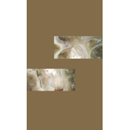

邱爽
============================

|  |  |
| :--: | :-- |
| [ 邱爽](https://i.xiami.com/qq77) | **播放数**: 4318142 **粉丝数**: 283 **评论数**: 3 **地区**: China 中国大陆 **风格**: 流行 Pop  |

## 档案

## 专辑

| 名称 | 语种 | 唱片公司 | 发行时间 | 专辑类别 | 专辑风格 |
| :--: | :-- | :-- | :-- | :-- | :-- |
| [ 知否知否应是绿肥红瘦](./albums/5021448804.md) | 国语 | 独立发行 | 2020年09月12日 | EP, 单曲 | 流行 Pop |
| [ 囚鸟](./albums/2104082048.md) | 国语 | 独立发行 | 2018年10月05日 | EP, 单曲 | 国语流行 Mandarin Pop, 流行 Pop |
| [ 你就不要想起我](./albums/2103949948.md) | 国语 | 独立发行 | 2018年08月28日 | EP, 单曲 | 流行 Pop, 国语流行 Mandarin Pop |
| [ 哭砂](./albums/2103937303.md) | 国语 | 独立发行 | 2018年08月20日 | EP, 单曲 | 流行 Pop, 国语流行 Mandarin Pop |
| [ I'm in here](./albums/2103937386.md) | 英语 | 独立发行 | 2018年08月08日 | EP, 单曲 | 流行 Pop, 欧美流行 Western Pop |
| [ 大鱼（翻唱版）](./albums/2103738316.md) | 国语 | 独立发行 | 2018年06月07日 | EP, 单曲 | 流行 Pop, 国语流行 Mandarin Pop |
| [ 桃花源（伴奏）](./albums/2103738367.md) | 国语 | 独立发行 | 2018年06月07日 | EP, 单曲 | 流行 Pop, 国语流行 Mandarin Pop |
| [ 你一定要幸福](./albums/2103716760.md) | 国语 | 独立发行 | 2018年05月23日 | EP, 单曲 | 流行 Pop, 国语流行 Mandarin Pop |
| [ 桃花源](./albums/2103716761.md) | 国语 | 独立发行 | 2018年05月22日 | EP, 单曲 | 艺术流行 Art Pop, 流行 Pop |
| [ 天亮了（翻唱版）](./albums/2103716762.md) | 国语 | 独立发行 | 2018年05月21日 | EP, 单曲 | 国语流行 Mandarin Pop, 流行 Pop |
| [ 谁](./albums/2105231196.md) | 国语 |  | 不详 | 录音室专辑 | 国语流行 Mandarin Pop |
| [ 左手指月](./albums/5022322023.md) | 国语 | 独立发行 | 不详 | 录音室专辑 | 流行 Pop, 国语流行 Mandarin Pop, 艺术流行 Art Pop |

## 评论

|  |  |  |  |
| :-- | :-- | :-- | :-- |
|  [虾米用户](https://emumo.xiami.com/u/284942810)  2020-07-15 06:01 赞(1) 踩(0) | 
我听歌风格是九十年代，和零几年的黄金歌曲，是有内涵的那些，但是在大鱼这首歌里面，我偏偏选择了她的，感觉只有她唱的合适
 |
|  [虾米用户](https://emumo.xiami.com/u/284942810)  2020-07-15 05:58 赞(1) 踩(0) | 
真的不错，可惜哦，现在歌手太多啦，九三年的大龄单身青年到此一留。
 |
|  [虾米用户](https://emumo.xiami.com/u/15856807) 我还没想好要写什么... 2020-04-24 23:03 赞(0) 踩(0) | 
好听！
 |
