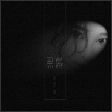

乐思言
============================

|  |  |
| :--: | :-- |
| [ 乐思言](https://i.xiami.com/lesiyan) | **地区**: China 中国大陆 **风格**: 流行 Pop, 国语流行 Mandarin Pop **播放数**: 6425954 **粉丝数**: 397 **评论数**: 15  |

## 档案

中文名：乐思言 
外文名：sisi 
别名：思思 小思 
国籍：中国 
民族：汉族 
星座：双鱼座 
身高：165CM 
体重：50kg 
出生地：重庆 
出生日期：2月26日 
经纪公司：海南步步为音文化 
演艺经历：在映客直播平台直播一年至今，被誉为“第一唱将”

## 专辑

| 名称 | 语种 | 唱片公司 | 发行时间 | 专辑类别 | 专辑风格 |
| :--: | :-- | :-- | :-- | :-- | :-- |
| [ 我想的事](./albums/2104052519.md) | 国语 | 天牧瑞佳 | 2018年09月23日 | EP, 单曲 | 国语流行 Mandarin Pop |
| [ 黑幕](./albums/2103905445.md) | 国语 | 独立发行 | 2018年08月08日 | EP, 单曲 | 流行摇滚 Pop Rock, 国语流行 Mandarin Pop |
| [ 明白了](./albums/2103881345.md) | 国语 | 独立发行 | 2018年07月16日 | EP, 单曲 | 摇滚 Rock & Roll, 流行摇滚 Pop Rock |
| [ 竹马归](./albums/2103881203.md) | 国语 | 独立发行 | 2018年06月25日 | EP, 单曲 | 国语流行 Mandarin Pop, 古典音乐 Classical |
| [ 不作不爱](./albums/2103731331.md) | 国语 | 大玩咖 | 2018年06月05日 | EP, 单曲 |  |
| [ 友情多余暧昧未够](./albums/2103717118.md) | 国语 | 寿光坚诚 | 2018年05月21日 | EP, 单曲 | 国语流行 Mandarin Pop |
| [ 自我](./albums/2104439285.md) | 国语 |  | 不详 | 录音室专辑 | 流行 Pop |
| [ 丧失好感](./albums/2104439283.md) | 国语 |  | 不详 | 录音室专辑 | 流行 Pop |

## 评论

|  |  |  |
| :-- | :-- | :-- |
|  [虾米用户](https://emumo.xiami.com/u/304274412) Kevin Jiang 2020-11-05 21:17 赞(0) 踩(0) | 
希望有新歌吧！
 |
|  [虾米用户](https://emumo.xiami.com/u/295251898)  2020-11-05 08:12 赞(0) 踩(0) | 
重庆的？
 |
|  [虾米用户](https://emumo.xiami.com/u/311412493) 我还没想好要写什么... 2020-07-11 06:57 赞(0) 踩(0) | 
太优秀了吧，开始听时无心，听着听着已入心.恍然发现自己以是曲中人。加油喔！
 |
|  [虾米用户](https://emumo.xiami.com/u/355398311)  2020-06-01 16:38 赞(0) 踩(0) | 
我爱你
 |
|  [虾米用户](https://emumo.xiami.com/u/15425054) 这世界我来过！ 2020-05-18 18:57 赞(0) 踩(0) | 
小姐姐好！ 
 |
|  [虾米用户](https://emumo.xiami.com/u/265337447) 我在等一个爱音乐爱运动的... 2020-03-25 04:54 赞(0) 踩(0) | 
好听哦
 |
|  [虾米用户](https://emumo.xiami.com/u/431336809)  2020-03-11 13:42 赞(1) 踩(0) | 
旋律好，歌词有意思，声音甜美。。
 |
|  [虾米用户](https://emumo.xiami.com/u/177898910)  2019-11-11 22:58 赞(0) 踩(0) | 
好巧，姓乐？我也姓乐，也是重庆的
 |
|  [虾米用户](https://emumo.xiami.com/u/352614795) 人各有命，上天注定。 2019-10-23 19:27 赞(0) 踩(0) | 
同年同月同日生，加油＾０＾~同日的朋友
 |
|  [虾米用户](https://emumo.xiami.com/u/425465675) 想自己所想∴愛自己所愛！ 2019-06-13 17:43 赞(0) 踩(0) | 
换种方式听听，听着养心赞
 |
|  [虾米用户](https://emumo.xiami.com/u/344119954)  2019-05-31 16:45 赞(0) 踩(0) | 
加油 beautiful lady
 |
|  [虾米用户](https://emumo.xiami.com/u/377338521)  2019-05-11 16:27 赞(0) 踩(0) | 
呵呵  ️
 |
|  [虾米用户](https://emumo.xiami.com/u/417434449)  2019-02-17 22:06 赞(0) 踩(0) | 
很好听，期待下一首歌曲 
 |
|  [虾米用户](https://emumo.xiami.com/u/248514362)  2018-12-24 21:23 赞(0) 踩(0) | 
正在重庆观音桥旅行，对了，在哪里直播，有空送点礼物 
 |
|  [虾米用户](https://emumo.xiami.com/u/45568945)  2018-07-14 23:40 赞(1) 踩(0) | 
加油出新歌
 |
