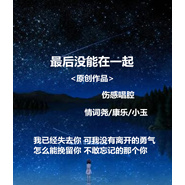
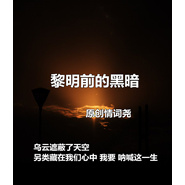
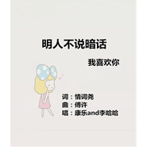

情词尧
============================

|  |  |
| :--: | :-- |
| [ 情词尧](https://i.xiami.com/qcy) | **地区**: China 中国大陆 **风格**: 流行 Pop **播放数**: 16530793 **粉丝数**: 532 **评论数**: 40  |

## 档案

## 专辑

| 名称 | 语种 | 唱片公司 | 发行时间 | 专辑类别 | 专辑风格 |
| :--: | :-- | :-- | :-- | :-- | :-- |
| [ Eco Bici](./albums/5021319282.md) | 其他 |  | 2020年08月20日 | EP, 单曲 | 嘻哈 Hip-Hop |
| [ 天佑中国加油武汉武汉的冬别寒冷](./albums/2105781695.md) | 国语 | 独立发行 | 2020年01月26日 | 录音室专辑 | 流行 Pop |
| [ 想死却又不敢你身上有多少标签](./albums/2104880925.md) | 国语 |  | 2019年05月20日 | EP, 单曲 | 流行 Pop |
| [ 夜未央](./albums/2104858245.md) | 国语 |  | 2019年05月13日 | EP, 单曲 | 流行 Pop |
| [ 江海不渡你你能渡世间亡魂](./albums/2104447619.md) | 国语 |  | 2019年01月05日 | EP, 单曲 | 流行 Pop |
| [ 你还会爱我吗](./albums/2104424973.md) | 国语 | 独立发行 | 2018年12月29日 | EP, 单曲 | 流行 Pop |
| [ 风飘过云海了吗](./albums/2104307807.md) | 国语 |  | 2018年12月01日 | EP, 单曲 | 流行 Pop |
| [ 做个俗人](./albums/2104272075.md) | 国语 |  | 2018年11月25日 | EP, 单曲 | 流行 Pop |
| [ 甜甜的女孩荒野cp](./albums/2104272101.md) | 国语 |  | 2018年11月25日 | EP, 单曲 | 流行 Pop |
| [ 悲伤逆流成河再见易遥](./albums/2104263368.md) | 国语 |  | 2018年11月23日 | EP, 单曲 | 流行 Pop |
| [ 伤口一次次的挽留](./albums/2104168558.md) | 国语 |  | 2018年11月01日 | EP, 单曲 | 流行 Pop |
| [ 去年夏天唱给最爱的你](./albums/2104075425.md) | 国语 | 独立发行 | 2018年10月02日 | EP, 单曲 | 流行 Pop |
| [ 最后没能在一起我已经失去你](./albums/2103926225.md) | 国语 | 独立发行 | 2018年08月16日 | EP, 单曲 | 流行 Pop |
| [ 我已经爱上你一秒钟而已](./albums/2103833153.md) | 国语 | 独立发行 | 2018年07月22日 | EP, 单曲 | 流行 Pop |
| [ 终是将军负了姬姬走将军方归](./albums/2103833140.md) | 国语 | 独立发行 | 2018年07月22日 | EP, 单曲 | 流行 Pop |
| [ That Girl那个女孩](./albums/2103827801.md) | 国语 | 独立发行 | 2018年07月19日 | EP, 单曲 | 流行 Pop |
| [ 梦的种子自由飞翔](./albums/2103788986.md) | 国语 | 独立发行 | 2018年07月09日 | EP, 单曲 | 流行 Pop |
| [ 佳人自是倾国之貌](./albums/2103753549.md) | 国语 | 独立发行 | 2018年06月21日 | EP, 单曲 | 流行 Pop |
| [ 黎明前的黑暗为另类而呐喊](./albums/2103749704.md) | 国语 | 独立发行 | 2018年06月14日 | EP, 单曲 | 流行 Pop |
| [ 明人不说暗话我喜欢你](./albums/2103749663.md) | 国语 | 独立发行 | 2018年06月14日 | EP, 单曲 | 流行 Pop |
| [ 樱花树下的重逢](./albums/2106072746.md) | 国语 |  | 2018年01月23日 |  | 流行 Pop |

## 评论

|  |  |  |
| :-- | :-- | :-- |
|  [虾米用户](https://emumo.xiami.com/u/437370044) 喜欢一个人就要勇敢的让她... 2020-02-25 12:37 赞(0) 踩(0) | 
很好听哦
 |
|  [虾米用户](https://emumo.xiami.com/u/434533091)  2019-12-22 19:31 赞(0) 踩(0) | 
好听好听，加油加油
 |
|  [虾米用户](https://emumo.xiami.com/u/428235557)  2019-10-24 23:07 赞(0) 踩(0) | 
，
 |
|  [虾米用户](https://emumo.xiami.com/u/428279892)  2019-08-18 18:24 赞(3) 踩(0) | 
我算是发现了长的帅的人都没有照片
 |
|  [虾米用户](https://emumo.xiami.com/u/317799900)  2019-08-03 13:25 赞(1) 踩(0) | 
好听
 |
|  [虾米用户](https://emumo.xiami.com/u/322575602)  2019-07-28 06:02 赞(0) 踩(0) | 
你唱的太好听了
 |
|  [虾米用户](https://emumo.xiami.com/u/304490759)  2019-07-24 09:58 赞(2) 踩(0) | 
              
 |
|  [虾米用户](https://emumo.xiami.com/u/356026288) 我还没想好要写什么... 2019-06-16 10:56 赞(1) 踩(0) | 
加油
 |
|  [虾米用户](https://emumo.xiami.com/u/358104299) 悲观的唯心存在现实解构虚... 2019-05-29 09:57 赞(2) 踩(0) | 
11176
 |
|  [虾米用户](https://emumo.xiami.com/u/423138323)  2019-05-27 16:35 赞(0) 踩(0) | 
好听极了
 |
|  [虾米用户](https://emumo.xiami.com/u/423138323)  2019-05-27 16:35 赞(0) 踩(0) | 
好
 |
|  [虾米用户](https://emumo.xiami.com/u/403692353)  2019-05-12 15:20 赞(0) 踩(0) | 
嗨
 |
| ⇒ |  [虾米用户](https://emumo.xiami.com/u/424708335)  2019-05-18 09:22 赞(0) 踩(0) | 
58655
 |
|  [虾米用户](https://emumo.xiami.com/u/325374787)  2019-05-07 14:23 赞(0) 踩(0) | 
好
 |
|  [虾米用户](https://emumo.xiami.com/u/350034776) :D 2019-05-01 21:04 赞(1) 踩(0) | 
音色好像我后桌噫
 |
|  [虾米用户](https://emumo.xiami.com/u/351260848) 往后余生希望你等我 2019-04-29 17:27 赞(1) 踩(0) | 
好听
 |
|  [虾米用户](https://emumo.xiami.com/u/423431631)  2019-04-23 20:57 赞(2) 踩(0) | 
这首歌真好听。
 |
|  [虾米用户](https://emumo.xiami.com/u/423263862)  2019-04-13 21:45 赞(3) 踩(0) | 
max好听
 |
| ⇒ |  [虾米用户](https://emumo.xiami.com/u/185039833)   2019-04-20 20:42 赞(0) 踩(0) | 
好听
 |
| ⇒ |  [虾米用户](https://emumo.xiami.com/u/185039833)   2019-04-20 20:42 赞(0) 踩(0) | 
好听
 |
| ⇒ |  [虾米用户](https://emumo.xiami.com/u/420552847) 强、 2019-04-27 14:14 赞(0) 踩(0) | 
你一个太好听的不是来的，太早听。
 |
|  [虾米用户](https://emumo.xiami.com/u/419148813)  2019-03-30 21:09 赞(3) 踩(0) | 
好听
 |
|  [虾米用户](https://emumo.xiami.com/u/419148813)  2019-03-30 21:09 赞(1) 踩(0) | 
好听
 |
|  [虾米用户](https://emumo.xiami.com/u/401549065)  2019-03-24 14:13 赞(3) 踩(0) | 
你的声音真的好好听，听了后就好像爱上你的声音了。
 |
| ⇒ |  [虾米用户](https://emumo.xiami.com/u/420552847) 强、 2019-04-27 14:14 赞(0) 踩(0) | 
别太好听的行不行。
 |
|  [虾米用户](https://emumo.xiami.com/u/418562823)  2019-03-23 20:33 赞(1) 踩(0) | 
感觉真是个奇怪的东西，就是突然听着听着就喜欢上了某样东西
 |
|  [虾米用户](https://emumo.xiami.com/u/421237947)  2019-03-18 16:02 赞(1) 踩(0) | 
真好听
 |
|  [虾米用户](https://emumo.xiami.com/u/412565175)  2019-01-18 17:20 赞(0) 踩(0) | 
还行
 |
| ⇒ |  [虾米用户](https://emumo.xiami.com/u/424674600)  2019-05-18 20:31 赞(0) 踩(0) | 
哼
 |
|  [虾米用户](https://emumo.xiami.com/u/326810590) 觞 2018-12-19 06:00 赞(0) 踩(0) | 
。。
 |
| ⇒ |  [虾米用户](https://emumo.xiami.com/u/401549065)  2019-03-24 10:02 赞(0) 踩(0) | 
你唱你唱这首歌很好听。
 |
|  [虾米用户](https://emumo.xiami.com/u/326810590) 觞 2018-12-19 05:59 赞(0) 踩(0) | 
。。
 |
|  [虾米用户](https://emumo.xiami.com/u/408790154)  2018-11-16 17:38 赞(0) 踩(0) | 
好听
 |
|  [虾米用户](https://emumo.xiami.com/u/293692544) 你敢给我说话吗？我咬你 2018-09-18 17:21 赞(2) 踩(0) | 
好听
 |
|  [虾米用户](https://emumo.xiami.com/u/402966736)  2018-09-09 11:59 赞(3) 踩(0) | 
你好
 |
|  [虾米用户](https://emumo.xiami.com/u/355548019)  2018-08-18 15:23 赞(4) 踩(0) | 
喜欢你
 |
|  [虾米用户](https://emumo.xiami.com/u/180330270)  2018-08-08 19:30 赞(3) 踩(0) | 
回家路上看到一个女主人都忘记了痛
 |
|  [虾米用户](https://emumo.xiami.com/u/296352982)   2018-07-31 16:48 赞(3) 踩(0) | 
不管是翻唱还是原唱 我都挺你 你唱的真的动听
 |
|  [虾米用户](https://emumo.xiami.com/u/374475779)  2018-07-30 02:23 赞(2) 踩(0) | 
抖音上你叫二郎吗？不然你的歌被未经允许被人翻唱称为原唱了。
 |
|  [虾米用户](https://emumo.xiami.com/u/376999592)  2018-07-24 12:26 赞(3) 踩(0) | 
不是二郎吗
 |
