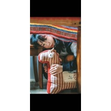

要写写画画的
============================

|  |  |
| :--: | :-- |
| [ 要写写画画的](https://emumo.xiami.com/album/2108416021) | **艺人**: [刘雪莹](../index.md) **语种**: 国语 **唱片公司**: 独立发行 **发行时间**: 2020年05月20日 **专辑类别**: 合集, 杂锦 **专辑风格**: 城市民谣 Urban Folk **播放数**: 1087 **收藏数**: 1 **评论数**: 5  |

## 简介

要好好看看这个世界，写写画画，记录日常，不以为常。 

## 曲目

## 评论

|  |  |  |
| :-- | :-- | :-- |
|  [虾米用户](https://emumo.xiami.com/u/54184808) 任意飘流的树叶 2020-10-29 23:53 赞(0) 踩(0) | 
当夜色落下，用心回味写写画画；趁晨曦初现，着力画画写写
 |
|  [虾米用户](https://emumo.xiami.com/u/374718848) 三种单纯然而极其强烈的激... 2020-08-05 22:24 赞(0) 踩(0) | 
居然网上有人唱 哈哈哈 你的话也鼓励了我
 |
| ⇒ |  [虾米用户](https://emumo.xiami.com/u/282513049)  2020-08-22 21:58 赞(0) 踩(0) | 
独特的音色音质...虾米音乐无意间听到了一下子就走进了心里，在日本的时候淋雨骑着单车会听你的歌，孤独想家时坐在公园会无限循环你的歌，铿锵有力的音色真正地鼓舞到我，支持我圆满结束日本的生活... 现在归来，回头看一看，那时候的岁月，才是生活，才是生命的阅历，谢谢了，你曾经惊艳了我的生活 
 |
| ⇒ |  [虾米用户](https://emumo.xiami.com/u/374718848) 三种单纯然而极其强烈的激... 2020-08-23 23:03 赞(0) 踩(0) | 
<q><b>瑞鱼说：</b></q>
 |
|  [虾米用户](https://emumo.xiami.com/u/282513049)  2020-08-03 19:54 赞(1) 踩(0) | 
在日本最迷茫无助的时候，听到了你的那首&amp;ldquo;不负&amp;rdquo;，鼓舞我坚持走下去&amp;hellip;多少年后看网上有人唱&amp;ldquo;不负&amp;rdquo;让我想起了你，谢谢了
 |
