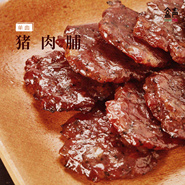

猪肉铺
============================

|  |  |
| :--: | :-- |
| [ 猪肉铺](https://emumo.xiami.com/album/2103938575) | **艺人**: [盒声智能音乐](../index.md) **语种**: 国语 **唱片公司**: 独立发行 **发行时间**: 2018年08月23日 **专辑类别**: EP, 单曲 **专辑风格**: 流行 Pop **播放数**: 943 **收藏数**: 0 **评论数**: 0  |

## 简介

继《黑糖麻花》、《酸酸酸！》后，“盒声智能音乐”与“艾格吃饱了”联合打造的，由AI盒子先生创作的第三弹零食单曲《猪肉脯》再次火热出炉！Grace的甜美嗓音轻松演绎了闽南蜜汁和传统竹板大料相结合的美味无限，极力彰显了天下美食的地方属性；而徐洁倩的戏剧唱腔配合民族乐器的弹奏无疑给整首歌曲增添了一丝戏剧色彩，不失为点睛之笔。希望这首具有地方经典风味的《猪肉脯》在给大家带去不一样的味道时，也能让你拥有不一样的腔调！

## 曲目

## 评论

|  |  |  |  |
| :-- | :-- | :-- | :-- |
