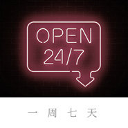

一周七天
============================

|  |  |
| :--: | :-- |
| [ 一周七天](https://emumo.xiami.com/album/2104116616) | **艺人**: [盒声智能音乐](../index.md) **语种**: 国语 **唱片公司**: 独立发行 **发行时间**: 2018年10月18日 **专辑类别**: EP, 单曲 **专辑风格**: 流行 Pop **播放数**: 1022 **收藏数**: 0 **评论数**: 0  |

## 简介

  
 

“人生不过如此，且行且珍惜，自己永远是自己的主角，不要总在别人的戏剧里充当着配角。”林语堂如是说。
 

以做自己为主题，盒声智能音乐第一支男女对唱智能单曲《一周七天》赤诚上线。这首智能单曲由AI盒子先生包揽词曲创作，特特Scott、夏璃夜参与演唱，轻声利落的歌声讲述着“不用在意别人言论，坚持做自己”的故事。有节奏的鼓点营造出的自由慵懒意境一一跨越整个周边人或事，抛去假笑、冷冰冰的礼貌，此刻做自己才是最重要的。
 

其实，很多时候不必太在意。我们，可以试着“放下”心中的包袱，轻松地去享受生活，去感受生活！
 

 

## 曲目

## 评论

|  |  |  |  |
| :-- | :-- | :-- | :-- |
