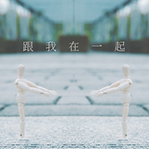

盒声智能音乐
============================

|  |  |
| :--: | :-- |
| [ 盒声智能音乐](https://i.xiami.com/soundcube) | **播放数**: 3790213 **粉丝数**: 28 **评论数**: 0 **地区**: China 中国大陆 **风格**: 流行 Pop, 电子 Electronic  |

## 档案

## 专辑

| 名称 | 语种 | 唱片公司 | 发行时间 | 专辑类别 | 专辑风格 |
| :--: | :-- | :-- | :-- | :-- | :-- |
| [ 一周七天](./albums/2104116616.md) | 国语 | 独立发行 | 2018年10月18日 | EP, 单曲 | 流行 Pop |
| [ 那么丑](./albums/2104113398.md) | 国语 | 独立发行 | 2018年10月16日 | EP, 单曲 | 流行 Pop |
| [ 跟我在一起](./albums/2104083390.md) | 国语 | 独立发行 | 2018年10月08日 | EP, 单曲 | 流行 Pop |
| [ 睡衣和厨艺](./albums/2104061560.md) | 国语 | 独立发行 | 2018年09月29日 | EP, 单曲 | 流行 Pop |
| [ 夜跑](./albums/2104039810.md) | 国语 | 独立发行 | 2018年09月20日 | EP, 单曲 | 流行 Pop |
| [ 我们的第一次](./albums/2103938568.md) | 国语 | 独立发行 | 2018年08月23日 | EP, 单曲 | 流行 Pop |
| [ 猪肉铺](./albums/2103938575.md) | 国语 | 独立发行 | 2018年08月23日 | EP, 单曲 | 流行 Pop |
| [ 一切关于你](./albums/2103905429.md) | 国语 | 独立发行 | 2018年08月10日 | EP, 单曲 | 流行 Pop |
| [ 你不是活在朋友圈里](./albums/2103888336.md) | 国语 | 独立发行 | 2018年08月02日 | EP, 单曲 | 流行说唱 Pop Rap |
| [ 酸酸酸！](./albums/2103826567.md) | 国语 | 独立发行 | 2018年07月20日 | EP, 单曲 | 流行 Pop |
| [ 黑糖麻花](./albums/2103775305.md) | 国语 | 独立发行 | 2018年07月07日 | EP, 单曲 | 流行 Pop |

## 评论

|  |  |  |  |
| :-- | :-- | :-- | :-- |
