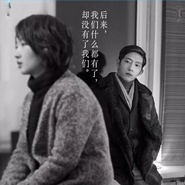

后来的我们Later
============================

|  |  |
| :--: | :-- |
| [ 后来的我们Later](https://emumo.xiami.com/album/2108137036) | **艺人**: [古典吉他刘和松](../index.md) **语种**: 国语 **唱片公司**: 独立发行 **发行时间**: 不详 **专辑类别**: 录音室专辑 **专辑风格**: 国语流行 Mandarin Pop, 沙发音乐 Lounge **播放数**: 1351 **收藏数**: 0 **评论数**: 2  |

## 简介

该说的 别说了  
  
你懂得 就够了  
  
真的有 某一种悲哀  
  
连泪也不能流  
  
只能目送  
  
我最大的遗憾  
  
是你的遗憾 与我有关  
  
没有句点 已经很完美了  
  
何必误会故事 没说完  
  
还能做什么呢  
  
我连伤感都是 奢侈的  
  
我一想念 你就那么近  
  
但终究 你都不能  
  
陪我到 回不去的远方  
  
原来我很快乐  
  
只是不愿承认  
  
在我怀疑世界时  
  
你给过我答案  
  
我最大的遗憾  
  
是你的遗憾 与我有关  
  
没有句点 已经很完美了  
  
何必误会故事 没说完  
  
还能做什么呢

## 曲目

## 评论

|  |  |  |
| :-- | :-- | :-- |
|  [虾米用户](https://emumo.xiami.com/u/244580142) 生活在於永不放棄 2020-04-21 18:08 赞(0) 踩(0) | 
好聽
 |
| ⇒ |  [虾米用户](https://emumo.xiami.com/u/376574124) 古典吉他成就你我音乐梦 2020-08-28 00:22 赞(0) 踩(0) | 
感谢聆听 
 |
