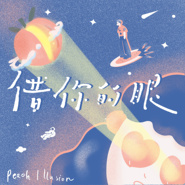
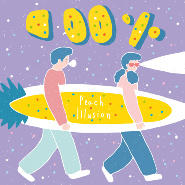

桃子假象
============================

|  |  |
| :--: | :-- |
| [ 桃子假象](https://i.xiami.com/peachillusion) | **地区**: China 中国大陆 **风格**: 都市流行 City Pop, 独立流行 Indie Pop **播放数**: 1321270 **粉丝数**: 2634 **评论数**: 90  |

## 档案

主唱 / 吉他：圈圈 吉他 / 合成器：C.c 贝斯：学家 鼓手：娜影  现居上海。     桃子假象Peach Illusion乐团最初由独立唱作元气少女圈圈和百分百少年C.c组成，两人相识于厦门，同为厦门大学校友的他们是可以聊七聊八一整天的好朋友，两人在2018年7月决定以双人乐队出道。桃子指代纯真与甜美，青春期时看世界的眼睛，天真而无畏。初出校园的两人开始尝试与大人的世界相处，脑海中的想象与现实碰撞。于是，他们决定寻找真相，寻找现实世界在甜美的假象背后究竟藏着什么。鼓手娜影和贝斯手学家在桃子转移到上海后陆续加入，带来了更多groove的敏锐度。  Vocal / Guitar: O.o Guitar / Synth: C.c Bass: Xuejia Drum: Nayoung  Live in Shanghai now.  The songwriter & singer O.o first met the bedroom music producer C.c in Xiamen University, after graduation they kept chatting online and exchanging ideas re songwriting and arrangement. During the summertime of 2018, the duo project Peach Illusion came out and the first eponymous EP was released. Another members Xuejia and Nayoung have joined the band since Apr. 2019, a new trip start from Shanghai…

## 专辑

| 名称 | 语种 | 唱片公司 | 发行时间 | 专辑类别 | 专辑风格 |
| :--: | :-- | :-- | :-- | :-- | :-- |
| [ 借你的眼Let Me Enter Your Eyes](./albums/5021283328.md) | 国语 | 独立发行 | 2020年08月14日 | EP, 单曲 | 独立流行 Indie Pop |
| [ 你很OK！迈出下一步吧！( 鹅厂wò谈会主题曲）](./albums/5020986714.md) | 国语 | 独立发行 | 2020年06月28日 | EP, 单曲 | 国语流行 Mandarin Pop |
| [ 百分百100%](./albums/2105375727.md) | 国语 | 生煎唱片 | 2019年11月01日 | 录音室专辑 | 国语流行 Mandarin Pop, 独立流行 Indie Pop |
| [ 花火Hana-bi](./albums/2105262185.md) | 国语 | 生煎唱片 | 2019年09月26日 | EP, 单曲 | 都市流行 City Pop, 独立流行 Indie Pop |
| [ 桃子假象Peach Illusion](./albums/2103773231.md) | 国语 | 独立发行 | 2018年07月11日 | EP, 单曲 | 独立流行 Indie Pop, 合成器流行 Synthpop |

## 评论

|  |  |  |
| :-- | :-- | :-- |
|  [虾米用户](https://emumo.xiami.com/u/1800831) Hi！ 2021-01-30 23:52 赞(1) 踩(0) | 

 |
|  [虾米用户](https://emumo.xiami.com/u/411408359) 爱你虾米  爱你编辑部 2021-01-17 17:53 赞(0) 踩(0) | 
看到南方人物周刊关于虾米的报道写到了桃子假象的故事  感觉很欣慰  感谢虾米所做的一切爱你呀小虾米
 |
|  [虾米用户](https://emumo.xiami.com/u/429640300)  2021-01-07 06:04 赞(0) 踩(0) | 
我讨厌被硬拉着说再见
 |
|  [虾米用户](https://emumo.xiami.com/u/2426133)  2020-12-13 23:01 赞(2) 踩(0) | 
上周在桃子星球登陆成功
 |
|  [虾米用户](https://emumo.xiami.com/u/9062060) 此生没拿一个亿来爱虾米是... 2020-12-04 15:32 赞(0) 踩(0) | 

 |
|  [虾米用户](https://emumo.xiami.com/u/51610072) f@ck 5 cents... 2020-09-14 22:31 赞(0) 踩(0) | 
❤️
 |
|  [虾米用户](https://emumo.xiami.com/u/191542168) 不要叫醒我 2020-09-04 01:04 赞(0) 踩(0) | 
太爱你们啦
 |
|  [虾米用户](https://emumo.xiami.com/u/276944698) 不要自我设限..... 2020-08-17 15:48 赞(0) 踩(0) | 
❇️❇️❇️
 |
|  [虾米用户](https://emumo.xiami.com/u/7610981) 虾米不会走 2020-08-14 07:22 赞(0) 踩(0) | 
该巡演了
 |
|  [虾米用户](https://emumo.xiami.com/u/2796166) 最爱莫文蔚..... 2020-08-08 00:42 赞(0) 踩(0) | 
加油~~~~不错哦~~
 |
|  [虾米用户](https://emumo.xiami.com/u/421578063) fox god 2020-06-29 16:40 赞(1) 踩(0) | 
(≧&amp;nabla;≦)/
 |
|  [虾米用户](https://emumo.xiami.com/u/423947424) Wnt to be ma... 2020-04-02 21:15 赞(1) 踩(0) | 
宝藏
 |
|  [虾米用户](https://emumo.xiami.com/u/43418234) ^_−☆ 2020-04-02 16:04 赞(1) 踩(0) | 
好
 |
|  [虾米用户](https://emumo.xiami.com/u/6925948) 我还没想好要写什么... 2020-03-22 02:37 赞(0) 踩(0) | 
.
 |
|  [虾米用户](https://emumo.xiami.com/u/9062060) 此生没拿一个亿来爱虾米是... 2020-02-15 10:09 赞(0) 踩(0) | 
可爱吉娜
 |
|  [虾米用户](https://emumo.xiami.com/u/61011234) 别装 2020-01-22 13:23 赞(0) 踩(0) | 
hhh 仿佛前两天听还是罗媛媛来着 今天就藏在桃子假象背后了
 |
|  [虾米用户](https://emumo.xiami.com/u/13819891) 暂无签名~ 2020-01-14 14:54 赞(0) 踩(0) | 
田震不错
 |
|  [虾米用户](https://emumo.xiami.com/u/167951020) 小莲。コナコナコナ♥ 2020-01-09 16:11 赞(1) 踩(0) | 
原来中国现在也有人搞citypop！！！
 |
|  [虾米用户](https://emumo.xiami.com/u/328657369) 风格随心而变、 2020-01-05 22:34 赞(0) 踩(0) | 
人气飙升，加油，期待
 |
|  [虾米用户](https://emumo.xiami.com/u/344018512) 我还没想好要写什么... 2020-01-05 21:19 赞(0) 踩(0) | 
D
 |
|  [虾米用户](https://emumo.xiami.com/u/45323236) 必有所获 2020-01-01 22:36 赞(0) 踩(0) | 
Peach Illusion不是illusion!
 |
|  [虾米用户](https://emumo.xiami.com/u/4706723) Time to die. 2019-12-19 06:19 赞(1) 踩(0) | 
peach illusion 一定很喜欢 北野武
 |
|  [虾米用户](https://emumo.xiami.com/u/356763773) 我还没想好要写什么... 2019-11-16 01:22 赞(0) 踩(0) | 
。
 |
|  [虾米用户](https://emumo.xiami.com/u/42963872) 我还没想好要写什么... 2019-11-01 15:35 赞(1) 踩(0) | 

 |
|  [虾米用户](https://emumo.xiami.com/u/99465068) Spotify : Yo... 2019-11-01 12:28 赞(0) 踩(0) | 
喜欢
 |
|  [虾米用户](https://emumo.xiami.com/u/215379991) 簽名不重要重要的是你聽什... 2019-11-01 11:40 赞(0) 踩(0) | 
ﻌﻌﻌ❤︎
 |
|  [虾米用户](https://emumo.xiami.com/u/260992790) I'll Be Your... 2019-11-01 03:23 赞(0) 踩(0) | 
sweet~
 |
|  [虾米用户](https://emumo.xiami.com/u/354745)  2019-10-27 18:03 赞(3) 踩(0) | 
我一直在想，为什么罗媛媛不出歌了，，原来是在这里，，，，编曲好评！
 |
|  [虾米用户](https://emumo.xiami.com/u/249858567)  2019-10-20 18:28 赞(0) 踩(0) | 
广州了解一下 嘻嘻
 |
|  [虾米用户](https://emumo.xiami.com/u/346492287) 虾米不要离开我！ 2019-10-10 13:42 赞(0) 踩(0) | 
粤闽请安排一下！
 |
|  [虾米用户](https://emumo.xiami.com/u/10584955) ا 2019-08-26 13:18 赞(0) 踩(0) | 
hazy sunmer night 2019
 |
|  [虾米用户](https://emumo.xiami.com/u/17691156) あなたに出会えて よかっ... 2019-08-19 19:41 赞(0) 踩(0) | 
啊～我觉得一般般
 |
|  [虾米用户](https://emumo.xiami.com/u/50820485) 最好的事情，我们来做吧。 2019-07-10 23:48 赞(2) 踩(0) | 
拜托你们和动物园钉子户一起来武汉拼个场吧，呜呜呜，分开来也可以，
 |
|  [虾米用户](https://emumo.xiami.com/u/50820485) 最好的事情，我们来做吧。 2019-07-10 23:40 赞(0) 踩(0) | 
啥时候来武汉啊
 |
|  [虾米用户](https://emumo.xiami.com/u/258316582) 舍我其谁 2019-05-29 17:09 赞(0) 踩(0) | 
可以
 |
|  [虾米用户](https://emumo.xiami.com/u/258316582) 舍我其谁 2019-05-29 17:09 赞(0) 踩(0) | 
ohhhhhh
 |
|  [虾米用户](https://emumo.xiami.com/u/124341790) 我还没想好要写什么... 2019-05-13 23:56 赞(0) 踩(0) | 

 |
|  [虾米用户](https://emumo.xiami.com/u/204829310) 安静听歌(*¯︶¯*) 2019-05-11 12:23 赞(1) 踩(0) | 
很优秀的乐队啊！！加油！！
 |
|  [虾米用户](https://emumo.xiami.com/u/49083604) 来了就别想走 2019-05-05 17:04 赞(1) 踩(0) | 
听完现场我觉得你能上更大更大更更大的舞台的宝藏女孩！！！
 |
|  [虾米用户](https://emumo.xiami.com/u/264922022) 波斯貓在冬日落雪的樹上偷... 2019-05-03 16:35 赞(0) 踩(0) | 
啊啊啊啊啊小姐姐笑起来太甜了叭 
 |
|  [虾米用户](https://emumo.xiami.com/u/264922022) 波斯貓在冬日落雪的樹上偷... 2019-05-03 16:28 赞(1) 踩(0) | 
还有两分钟啊啊啊啊啊啊
 |
|  [虾米用户](https://emumo.xiami.com/u/356740228)  2019-04-29 09:57 赞(0) 踩(0) | 
强推！
 |
|  [虾米用户](https://emumo.xiami.com/u/187223463) 嗯 2019-04-26 13:26 赞(0) 踩(0) | 
你们同款衬衫下架了！！辣么好看的说 嘎嘎嘎嘎_(:з」∠)_
 |
| ⇒ |  [虾米用户](https://emumo.xiami.com/u/376892621) ~2020概念EP「借你... 2019-04-30 10:07 赞(0) 踩(0) | 
现场还有少量蓝色桃桃在卖哦~
 |
|  [虾米用户](https://emumo.xiami.com/u/264922022) 波斯貓在冬日落雪的樹上偷... 2019-04-20 06:35 赞(1) 踩(0) | 
啊啊啊啊啊啊是不是要来武汉了啊啊啊啊啊啊啊想见你们啊！
 |
| ⇒ |  [虾米用户](https://emumo.xiami.com/u/376892621) ~2020概念EP「借你... 2019-04-24 13:21 赞(0) 踩(0) | 
没错~五月见;)
 |
| ⇒ |  [虾米用户](https://emumo.xiami.com/u/264922022) 波斯貓在冬日落雪的樹上偷... 2019-04-26 11:00 赞(0) 踩(0) | 
<q><b>桃子假象说：</b></q>
 |
| ⇒ |  [虾米用户](https://emumo.xiami.com/u/50820485) 最好的事情，我们来做吧。 2019-07-10 23:40 赞(0) 踩(0) | 
<q><b>桃子假象说：</b></q>
 |
|  [虾米用户](https://emumo.xiami.com/u/218337522) 插画师:-D 2019-03-20 10:38 赞(0) 踩(0) | 
缺不缺画封面的呀 我风格超甜!
 |
| ⇒ |  [虾米用户](https://emumo.xiami.com/u/376892621) ~2020概念EP「借你... 2019-03-21 22:22 赞(0) 踩(0) | 
也不是说不可以
 |
|  [虾米用户](https://emumo.xiami.com/u/353570236) 别动我耳机 2019-01-04 15:49 赞(0) 踩(0) | 
好治愈！
 |
|  [虾米用户](https://emumo.xiami.com/u/773393) GALAXY 2019-01-04 13:40 赞(1) 踩(0) | 
本核桃前来报到
 |
|  [虾米用户](https://emumo.xiami.com/u/1171615) 我还没想好要写什么... 2018-12-30 15:26 赞(0) 踩(0) | 
厉害
 |
| ⇒ |  [虾米用户](https://emumo.xiami.com/u/376892621) ~2020概念EP「借你... 2019-01-04 23:03 赞(0) 踩(0) | 
大卫老师好~
 |
|  [虾米用户](https://emumo.xiami.com/u/25809624) 喜欢礼拜之前寂静的教堂胜... 2018-12-25 00:32 赞(0) 踩(0) | 
好喜欢呀
 |
|  [虾米用户](https://emumo.xiami.com/u/44970264) 红拂夜奔 2018-12-18 08:05 赞(0) 踩(0) | 
宝藏嘻嘻，别火好吗谢谢
 |
|  [虾米用户](https://emumo.xiami.com/u/39821398) 乘凉 2018-11-05 10:52 赞(0) 踩(0) | 
昨天在abc好可爱啊 
 |
| ⇒ |  [虾米用户](https://emumo.xiami.com/u/376892621) ~2020概念EP「借你... 2018-11-06 10:52 赞(0) 踩(0) | 
我也觉得
 |
|  [虾米用户](https://emumo.xiami.com/u/57632514) 我还没想好要写什么... 2018-11-02 22:54 赞(0) 踩(0) | 

 |
|  [虾米用户](https://emumo.xiami.com/u/9028760) 豆瓣见 spotify ... 2018-10-22 13:16 赞(0) 踩(0) | 
(^^)
 |
|  [虾米用户](https://emumo.xiami.com/u/341610718) 我还没想好要写什么... 2018-09-28 06:52 赞(0) 踩(0) | 
好可爱的band
 |
|  [虾米用户](https://emumo.xiami.com/u/17691156) あなたに出会えて よかっ... 2018-09-18 15:21 赞(0) 踩(0) | 
：）
 |
|  [虾米用户](https://emumo.xiami.com/u/257251654)  2018-09-06 18:21 赞(0) 踩(0) | 
Awesome! Keep it up!
 |
|  [虾米用户](https://emumo.xiami.com/u/42936819) 网易云搜索恶法lex i... 2018-09-02 19:26 赞(0) 踩(0) | 
太喜歡了！
 |
|  [虾米用户](https://emumo.xiami.com/u/327348267) 基本上就是这样 2018-08-18 14:20 赞(0) 踩(0) | 
可爱的
 |
|  [虾米用户](https://emumo.xiami.com/u/49748006) Fly me to th... 2018-08-09 08:49 赞(1) 踩(0) | 
www
 |
|  [虾米用户](https://emumo.xiami.com/u/49569171) 我还没想好要写什么... 2018-08-08 21:17 赞(1) 踩(0) | 
桃子
 |
|  [虾米用户](https://emumo.xiami.com/u/285049473) 剛拿起酒杯想和你碰杯 才... 2018-07-31 17:24 赞(1) 踩(0) | 
略略略
 |
|  [虾米用户](https://emumo.xiami.com/u/10213118)  2018-07-31 12:44 赞(0) 踩(0) | 
啊呀 喜欢(&amp;acute;,,&amp;bull;&amp;omega;&amp;bull;,,)♡
 |
|  [虾米用户](https://emumo.xiami.com/u/48748810) ‌一眼望去，精致的面容很... 2018-07-30 00:12 赞(0) 踩(0) | 
好听，加油＾０＾~
 |
|  [虾米用户](https://emumo.xiami.com/u/307958283)  2018-07-26 18:57 赞(0) 踩(0) | 
哎呀真的敲好听 
 |
|  [虾米用户](https://emumo.xiami.com/u/105175024)  2018-07-25 10:24 赞(0) 踩(0) | 

 |
|  [虾米用户](https://emumo.xiami.com/u/212520066)  2018-07-22 15:04 赞(0) 踩(0) | 
咔咔啦
 |
|  [虾米用户](https://emumo.xiami.com/u/379259565) 就挺无聊一女的 2018-07-21 13:00 赞(0) 踩(0) | 
超级超级少女了
 |
|  [虾米用户](https://emumo.xiami.com/u/43558685) 别找我聊天。我会吃人 2018-07-20 16:42 赞(1) 踩(0) | 
专辑磁带版的包装不能更好看了。老夫的少女心被唤醒了
 |
|  [虾米用户](https://emumo.xiami.com/u/350888329) 我还没想好要写什么... 2018-07-20 06:36 赞(0) 踩(0) | 
大大快出新歌吧不够听啊 
 |
|  [虾米用户](https://emumo.xiami.com/u/285049473) 剛拿起酒杯想和你碰杯 才... 2018-07-17 18:02 赞(1) 踩(0) | 
愛心
 |
|  [虾米用户](https://emumo.xiami.com/u/333520)  2018-07-15 11:02 赞(0) 踩(0) | 
美好新世界，每一秒都有画面感。
 |
|  [虾米用户](https://emumo.xiami.com/u/12906971) 贝斯手 2018-07-11 22:01 赞(0) 踩(0) | 
太好听了吧！
 |
|  [虾米用户](https://emumo.xiami.com/u/49209220) 阳光正好 2018-07-11 13:56 赞(0) 踩(0) | 
好棒哇
 |
|  [虾米用户](https://emumo.xiami.com/u/303919180) 我还没想好要写什么... 2018-07-11 08:16 赞(0) 踩(0) | 
啦啦啦
 |
|  [虾米用户](https://emumo.xiami.com/u/8939226) 我还没想好要写什么... 2018-07-11 07:34 赞(0) 踩(0) | 
发现新大陆
 |
|  [虾米用户](https://emumo.xiami.com/u/47026156) I am not a m... 2018-07-11 00:25 赞(0) 踩(0) | 
真好
 |
|  [虾米用户](https://emumo.xiami.com/u/9972139) -Welcome to ... 2018-07-07 23:37 赞(0) 踩(0) | 

 |
|  [虾米用户](https://emumo.xiami.com/u/2033645)   2018-07-07 18:16 赞(0) 踩(0) | 
好期待啊
 |
|  [虾米用户](https://emumo.xiami.com/u/48898343) 生命已经过期 2018-07-04 18:14 赞(1) 踩(0) | 

 |
|  [虾米用户](https://emumo.xiami.com/u/7835521)  2018-07-04 13:39 赞(0) 踩(0) | 
好棒~
 |
|  [虾米用户](https://emumo.xiami.com/u/36057872) 网易/BC: Breat... 2018-07-04 12:15 赞(18) 踩(0) | 
这是TwT的罗媛媛+郭启超么
 |
| ⇒ |  [虾米用户](https://emumo.xiami.com/u/376892621) ~2020概念EP「借你... 2018-07-08 23:53 赞(0) 踩(0) | 
被发现了（躲起来~
 |
| ⇒ |  [虾米用户](https://emumo.xiami.com/u/36057872) 网易/BC: Breat... 2018-07-09 00:40 赞(0) 踩(0) | 
<q><b>桃子假象说：</b></q>
 |
