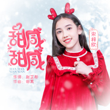
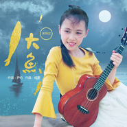
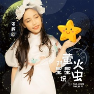
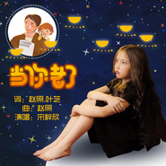

宋梓欣
============================

|  |  |
| :--: | :-- |
| [ 宋梓欣](https://i.xiami.com/songzixin2010) | **播放数**: 4962744 **粉丝数**: 358 **评论数**: 15 **地区**: China 中国大陆 **风格**: 儿童音乐 Children's Music  |

## 档案

宋梓欣，2010年1月26日出生于广东中山，中美混血的小姑娘。多次受邀参加央视《非常6+1》《黄金100秒》《回声嘹亮》《快乐大巴》《幸福账单》《音乐优等生》《一起音乐吧》《音乐快递》及金鹰卡通卫视《龙的传人》等综艺节目，代表作品《献给妈妈的歌》。 
基本资料： 
中文名：宋梓欣 
别名：小布布 
生日：2010年1月26日 
国籍：美国 
出生地：广东中山 
民族：汉族 
代表作品：《献给妈妈的歌》 
从艺经历： 
2016年5月11日，参加中央电视台少儿频道《音乐快递》。 
2016年5月6日，参加中央电视台少儿频道《快乐大巴》。 
2016年6月1日，参加澳亚卫视 《花开童年》2016六一晚会。 
2016年6月30日，参加中央电视台综艺频道《回声嘹亮》。 
2016年8月7日，参加参加中央电视 综艺频道《黄金100秒》栏目。 
2016年9月7日，中央电视台综艺频道《非常6+1》栏目，并获当期“非常小明星”。 
2016年9月16日，参加中央电视台音乐频道《一起音乐吧》中秋直播晚会。 
2017年1月28日，参加中央电视台音乐频道《音乐优等生》2017年第一季。 
2017年2月5日，参加中央电视台音乐频道《音乐优等生同学会》。 
2017年8月4日，参加湖南金鹰卡通卫视 《龙的传人》 
2017年7月，参加中央电视台少儿频道巜动物好伙伴》栏目原创歌曲录制及MV拍摄。 
2017年12月21日，参加中央电视台音乐频道《音乐公开课》。 
2018年1月1日，参加中央电视台少儿频道《银河之声—2018少儿频道新年特别节目》。 
2018年6月1日，参加广东电视台少儿频道《花开童年》广东省六一晚会。 
2018年6月27日，参加中央电视台少儿频道《音乐快递-梦想儿歌汇》。 
荣誉记录： 
1、声乐 
2015年11月，“第一届中国小金钟形象大使选拔赛”总决赛未来星奖 
2018年5月，中央电视台《音乐快递》2018“梦想儿歌汇—小歌手奖。 
2、书画 
2018年5月，国画作品第13届艺教之星全国师生书画大赛少儿组最高金奖。 
2018年5月，作品“母亲颂”第35届全国少年儿童书画大赛，金奖。 
社会活动： 
2015年3月，应邀参加并担任“梅赛德斯奔驰 北京国际时装周 - 孙海涛专场”走秀嘉宾 
2015年10月，应邀参加并担任“梅赛德斯奔驰北京国际时装周 孙海涛专场、Vicky Zhang专场、陈娟红专场、三场发布会走秀嘉宾，并获得“2015中国年度十佳少儿模特”称号。 
2016年4月，应邀参加并担任 2016秋冬上海时装周Joy&Joa风系列走秀嘉宾。 
2016年10月，接受广东电视台《娱乐周刊》专访，并成为封面人物。 
2016年10月，应邀参加 澳亚卫视 2016金牌小歌手深圳歌友会。 
2017年5月，应邀参加并担任“2017厦门国际少儿时尚周 孙海涛专场, Dorm专场，三三专场” 三场发布会走秀嘉宾。 
2017年5月，应邀参演由中国少年儿童文化艺术基金会主办的“牵手延川，共庆六一”大型公益活动。 
2017年9月，应邀参加 盖娅传说·熊英2018春夏巴黎时装发布会。 
2018年3月，应邀参加雅马哈音乐中心少年原创作品华南地区音乐会。

## 专辑

| 名称 | 语种 | 唱片公司 | 发行时间 | 专辑类别 | 专辑风格 |
| :--: | :-- | :-- | :-- | :-- | :-- |
| [ 甜甜咸咸](./albums/5022365795.md) | 国语 | 独立发行 | 2021年01月07日 | 录音室专辑 | 国语流行 Mandarin Pop |
| [ 谪仙](./albums/5021404347.md) | 国语 | 独立发行 | 2020年09月04日 | 录音室专辑 | 国语流行 Mandarin Pop |
| [ 声声慢](./albums/5021338593.md) | 国语 | 独立发行 | 2020年08月23日 | 录音室专辑 | 国语流行 Mandarin Pop |
| [ 奉献](./albums/2108418058.md) | 国语 | 独立发行 | 2020年05月08日 | 录音室专辑 | 国语流行 Mandarin Pop |
| [ 我的梦](./albums/2108363017.md) | 国语 | 独立发行 | 2020年04月15日 | 录音室专辑 | 国语流行 Mandarin Pop |
| [ 没有什么不同](./albums/2105905088.md) | 国语 | 独立发行 | 2020年02月14日 | 录音室专辑 | 国语流行 Mandarin Pop |
| [ 落叶归根（童声版）](./albums/2105905085.md) | 国语 | 独立发行 | 2020年02月13日 | 录音室专辑 | 国语流行 Mandarin Pop |
| [ 夜空中最亮的星](./albums/2105212000.md) | 国语 |  | 2019年09月04日 | 录音室专辑 | 国语流行 Mandarin Pop |
| [ 最亮的星星](./albums/2105187495.md) | 国语 |  | 2019年08月28日 | 录音室专辑 | 国语流行 Mandarin Pop |
| [ 飞云之下（师生版）](./albums/2105161963.md) | 国语 |  | 2019年08月21日 | 录音室专辑 | 国语流行 Mandarin Pop |
| [ 陪我长大](./albums/2105060559.md) | 国语 |  | 2019年08月07日 | 录音室专辑 | 国语流行 Mandarin Pop |
| [ 父亲写的散文诗](./albums/2105045496.md) | 国语 |  | 2019年07月31日 | 录音室专辑 | 国语流行 Mandarin Pop |
| [ 明天你好](./albums/2105018549.md) | 国语 |  | 2019年07月24日 | 录音室专辑 | 国语流行 Mandarin Pop |
| [ 亲爱的旅人啊（童声版）](./albums/2105006712.md) | 国语 |  | 2019年07月19日 | 录音室专辑 | 国语流行 Mandarin Pop |
| [ 我与古诗有个约定](./albums/2104968001.md) | 国语 | 星概念 | 2019年07月01日 | 录音室专辑 |  |
| [ 今天是你的生日妈妈（童声版）](./albums/2104888482.md) | 国语 |  | 2019年05月21日 | 录音室专辑 | 国语流行 Mandarin Pop |
| [ 酒干倘卖无](./albums/2104780895.md) | 国语 |  | 2019年04月16日 | 录音室专辑 | 国语流行 Mandarin Pop |
| [ 大鱼](./albums/2104780877.md) | 国语 |  | 2019年04月15日 | 录音室专辑 | 国语流行 Mandarin Pop |
| [ 知否知否](./albums/2104776307.md) | 国语 |  | 2019年04月13日 | 录音室专辑 | 国语流行 Mandarin Pop |
| [ 生僻字](./albums/2104756578.md) | 国语 |  | 2019年04月09日 | 录音室专辑 | 国语流行 Mandarin Pop |
| [ 真的爱你](./albums/2104678014.md) | 粤语 |  | 2019年02月20日 | 精选集 | 粤语流行 Cantopop |
| [ 春暖花开](./albums/2104678000.md) | 国语 |  | 2019年01月29日 | 录音室专辑 | 国语流行 Mandarin Pop |
| [ 最好的我，最亮的星](./albums/2104677985.md) | 国语 |  | 2019年01月24日 | 录音室专辑 | 儿歌 Nursery Rhyme |
| [ 小跳蛙](./albums/2104677966.md) | 国语 |  | 2019年01月23日 | 录音室专辑 | 儿歌 Nursery Rhyme |
| [ 萤火虫对星星说](./albums/2104677952.md) | 国语 |  | 2019年01月14日 | 录音室专辑 | 儿歌 Nursery Rhyme |
| [ 红色竹蜻蜓](./albums/2104677950.md) | 国语 |  | 2019年01月14日 | 录音室专辑 | 儿童音乐 Children's Music |
| [ 宝贝宝贝](./albums/2104677829.md) | 国语 |  | 2018年09月30日 | 录音室专辑 | 儿歌 Nursery Rhyme |
| [ 最美的光](./albums/2104677948.md) | 国语 |  | 2018年09月30日 | 录音室专辑 | 儿童音乐 Children's Music |
| [ 我爱你中国](./albums/2104677947.md) | 国语 |  | 2018年09月28日 | 录音室专辑 | 国语流行 Mandarin Pop |
| [ 新年真快乐](./albums/2104677944.md) | 国语 |  | 2018年07月18日 | 录音室专辑 | 儿歌 Nursery Rhyme |
| [ 宋梓欣5岁歌曲集](./albums/2104677946.md) | 国语 |  | 2018年07月17日 | 录音室专辑 | 儿歌 Nursery Rhyme |
| [ 宋梓欣6岁歌曲集](./albums/2104677913.md) | 国语 | 独立发行 | 2018年07月16日 | 录音室专辑 | 国语流行 Mandarin Pop |
| [ 宋梓欣7岁歌曲集](./albums/2104677833.md) | 国语 |  | 2018年07月16日 | 录音室专辑 | 国语流行 Mandarin Pop |
| [ 宋梓欣8岁歌曲集](./albums/2104677933.md) | 国语 |  | 2018年07月16日 | 录音室专辑 | 国语流行 Mandarin Pop |
| [ Over the rainbow](./albums/2104677823.md) | 英语 |  | 2018年07月15日 | 录音室专辑 | 国语流行 Mandarin Pop |
| [ Moon River](./albums/2104677826.md) | 英语 |  | 2018年07月15日 | 录音室专辑 | 欧美流行 Western Pop |
| [ 天空之城](./albums/2104677820.md) | 国语 |  | 2018年07月13日 | 录音室专辑 | 国语流行 Mandarin Pop |
| [ 好想你](./albums/2104677818.md) | 国语 |  | 2018年07月13日 | 录音室专辑 | 国语流行 Mandarin Pop |
| [ 风吹麦浪](./albums/2104677815.md) | 国语 |  | 2018年07月12日 | 录音室专辑 | 国语流行 Mandarin Pop |
| [ 当你老了](./albums/2104677816.md) | 国语 |  | 2018年07月12日 | 录音室专辑 | 国语流行 Mandarin Pop |
| [ 我的童年](./albums/2104677811.md) | 国语 |  | 2018年07月11日 | 录音室专辑 | 儿童音乐 Children's Music |
| [ 献给妈妈的歌](./albums/2103779646.md) | 国语 | 维音唱片 | 2018年07月02日 | EP, 单曲 |  |
| [ 微微](./albums/5021829113.md) | 国语 | 独立发行 | 不详 | 录音室专辑 | 国语流行 Mandarin Pop |
| [ Count On Me](./albums/5022186409.md) | 英语 | 独立发行 | 不详 | 录音室专辑 | 欧美流行 Western Pop |

## 评论

|  |  |  |  |
| :-- | :-- | :-- | :-- |
|  [虾米用户](https://emumo.xiami.com/u/420377516)  2020-10-26 21:37 赞(0) 踩(0) | 
&lt;好聽！[url=/u/421398125]@宋梓欣 [/url]&gt;&lt;421398125&gt;
 |
|  [虾米用户](https://emumo.xiami.com/u/306158687)  2020-07-27 07:52 赞(0) 踩(0) | 
c
 |
|  [虾米用户](https://emumo.xiami.com/u/256924309) 我还没想好要写什么... 2020-05-09 10:04 赞(0) 踩(0) | 
好聽~~~好聽~~一抱走了~~~謝謝。
 |
|  [虾米用户](https://emumo.xiami.com/u/25662494)  2020-02-20 12:37 赞(0) 踩(0) | 
好听
 |
|  [虾米用户](https://emumo.xiami.com/u/426330866) 做个真的我 2019-12-24 11:31 赞(0) 踩(0) | 
一亿个赞！！！……满招损，谦受益！！！戒骄戒躁！！！
 |
|  [虾米用户](https://emumo.xiami.com/u/400961241) 陌上人如玉，公主世无双。... 2019-12-15 19:12 赞(1) 踩(0) | 
哇塞！太好听了！我永远支持你哦！  
 |
|  [虾米用户](https://emumo.xiami.com/u/364765207) 此生无悔入mc，来世愿做... 2019-05-21 19:35 赞(1) 踩(0) | 
嗯，，额，，我要说什么来着？   
 |
|  [虾米用户](https://emumo.xiami.com/u/405059996)  2019-04-28 18:15 赞(0) 踩(0) | 
喜欢，喜欢，非常好听的歌
 |
|  [虾米用户](https://emumo.xiami.com/u/423482424)  2019-04-23 19:24 赞(0) 踩(0) | 
好听
 |
| ⇒ |  [虾米用户](https://emumo.xiami.com/u/339859679)  2020-05-05 14:59 赞(0) 踩(0) | 
嗯，对
 |
|  [虾米用户](https://emumo.xiami.com/u/305234770) 来自班长何葳蕤！！ 2019-04-21 12:02 赞(1) 踩(0) | 
快点收藏啦！
 |
|  [虾米用户](https://emumo.xiami.com/u/90958974)  2019-04-18 22:01 赞(0) 踩(0) | 
很喜欢你在抖音唱的《大号是中华》
 |
| ⇒ |  [虾米用户](https://emumo.xiami.com/u/421398125)  2019-04-28 23:12 赞(0) 踩(0) | 
谢谢支持！
 |
| ⇒ |  [虾米用户](https://emumo.xiami.com/u/90958974)  2019-05-02 17:11 赞(0) 踩(0) | 
<q><b>宋梓欣说：</b></q>
 |
| ⇒ |  [虾米用户](https://emumo.xiami.com/u/296315206) 你看起来充满了掘森（死） 2019-12-31 20:22 赞(0) 踩(0) | 
<q><b>不解江南语说：</b></q>
 |
