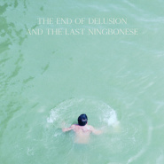

The End of Delusion and the Last Ningbonese
============================

|  |  |
| :--: | :-- |
| [ The End of Delusion and the Last Ningbonese](https://emumo.xiami.com/album/5020942133) | **艺人**: [还潮](../index.md) **语种**: 其他 **唱片公司**: 独立发行 **发行时间**: 2020年06月20日 **专辑类别**: 录音室专辑 **专辑风格**: 当代乡村 Contemporary Country, 致幻流行 Hypnagogic Pop **播放数**: 245016 **收藏数**: 169 **评论数**: 29  |

## 简介

The&nbsp;End&nbsp;of&nbsp;Delusion&nbsp;and&nbsp;the&nbsp;Last&nbsp;Ningbonese

## 曲目

## 评论

|  |  |  |  |
| :-- | :-- | :-- | :-- |
|  [虾米用户](https://emumo.xiami.com/u/434095390)  2021-02-02 18:40 赞(0) 踩(0) | 
好好听
 |
|  [虾米用户](https://emumo.xiami.com/u/379162683) 我想要记住你们，我想要你... 2021-01-17 23:35 赞(0) 踩(0) | 

 |
|  [虾米用户](https://emumo.xiami.com/u/184683808) 我还没想好要写什么... 2020-11-28 20:33 赞(1) 踩(0) | 
第一个把宁波话唱得如此诗意又情深的
 |
|  [虾米用户](https://emumo.xiami.com/u/346492287) 虾米不要离开我！ 2020-10-26 14:11 赞(0) 踩(0) | 
不错
 |
|  [虾米用户](https://emumo.xiami.com/u/405204229) 我还没想好要写什么... 2020-10-25 00:00 赞(1) 踩(0) | 
不沉迷小资可还是很小资哈哈哈
 |
|  [虾米用户](https://emumo.xiami.com/u/44970264) 红拂夜奔 2020-10-20 22:25 赞(1) 踩(0) | 
也是绝
 |
|  [虾米用户](https://emumo.xiami.com/u/39461567) E daí? 2020-10-19 10:25 赞(0) 踩(0) | 
真好
 |
|  [虾米用户](https://emumo.xiami.com/u/376442679)  2020-10-14 20:25 赞(2) 踩(0) | 
软
 |
|  [虾米用户](https://emumo.xiami.com/u/11065802)   2020-10-13 01:18 赞(1) 踩(0) | 
巨好听
 |
|  [虾米用户](https://emumo.xiami.com/u/98482)  2020-10-10 01:24 赞(1) 踩(0) | 
寻到宝也。。。
 |
|  [虾米用户](https://emumo.xiami.com/u/422241313)  2020-10-01 22:16 赞(0) 踩(0) | 
发行时间2021年
 |
|  [虾米用户](https://emumo.xiami.com/u/325763180) 我还没想好要写什么... 2020-08-31 16:06 赞(1) 踩(0) | 
漂浮着
 |
|  [虾米用户](https://emumo.xiami.com/u/9025629) 不敢触碰的手。 2020-08-30 17:39 赞(0) 踩(0) | 
脑贼噶挖急
 |
|  [虾米用户](https://emumo.xiami.com/u/405217487) 我还没想好要写什么... 2020-08-26 19:41 赞(1) 踩(0) | 
哇
 |
|  [虾米用户](https://emumo.xiami.com/u/10786093)  2020-08-18 19:22 赞(1) 踩(0) | 
依旧暖洋洋 仍旧 懒洋洋
 |
|  [虾米用户](https://emumo.xiami.com/u/121702052) 超脱 2020-08-03 13:24 赞(1) 踩(0) | 

 |
|  [虾米用户](https://emumo.xiami.com/u/7442817) 爵士迷幻复古梦泡少女 2020-08-02 18:33 赞(1) 踩(0) | 
是时候结束梦境
 |
|  [虾米用户](https://emumo.xiami.com/u/12876004) ` 2020-07-28 15:23 赞(2) 踩(0) | 
~
 |
|  [虾米用户](https://emumo.xiami.com/u/196580)  2020-07-07 00:30 赞(0) 踩(0) | 
明年发行吗？
 |
|  [虾米用户](https://emumo.xiami.com/u/419337013) 沒什麽 2020-07-05 16:09 赞(1) 踩(0) | 
词完美。
 |
|  [虾米用户](https://emumo.xiami.com/u/427840279)  2020-06-26 01:37 赞(2) 踩(0) | 
赞啦
 |
|  [虾米用户](https://emumo.xiami.com/u/1454034) 南无阿弥陀佛 2020-06-25 00:29 赞(2) 踩(0) | 

 |
|  [虾米用户](https://emumo.xiami.com/u/11948133) 爱已经来过这里 2020-06-21 21:27 赞(1) 踩(0) | 
终于有了
 |
|  [虾米用户](https://emumo.xiami.com/u/47681284) ダメ人間 2020-06-21 02:35 赞(3) 踩(0) | 
还是好听
 |
|  [虾米用户](https://emumo.xiami.com/u/292484097)   2020-06-21 00:21 赞(1) 踩(0) | 
好听！
 |
|  [虾米用户](https://emumo.xiami.com/u/5991296)  2020-06-20 23:23 赞(1) 踩(0) | 
c&amp;ograve;oooooooool
 |
|  [虾米用户](https://emumo.xiami.com/u/290900338) 吃了那花儿 2020-06-20 19:06 赞(1) 踩(0) | 
oh！
 |
|  [虾米用户](https://emumo.xiami.com/u/288664) hello小鱼 2020-06-20 18:21 赞(2) 踩(0) | 
好棒的专！也太美了吧
 |
|  [虾米用户](https://emumo.xiami.com/u/18985669) 悲观过界 2020-06-20 18:17 赞(1) 踩(0) | 
老虾终于有了
 |
